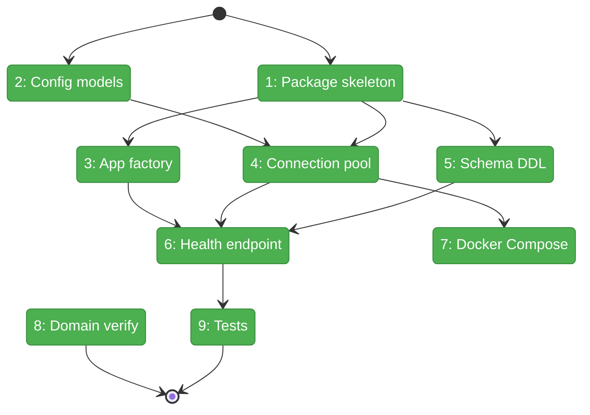
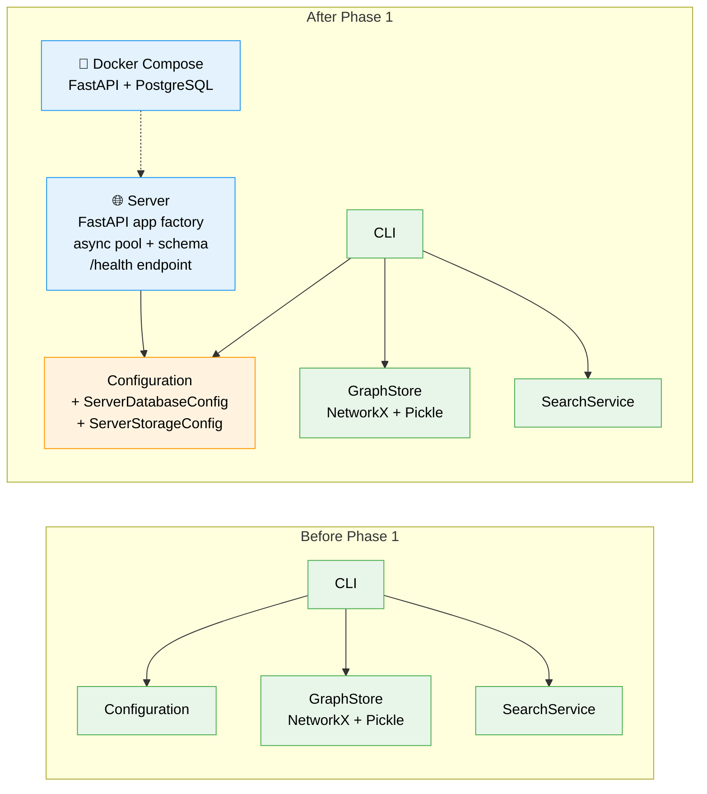

# Flight Plan: Phase 1 — Server Skeleton + Database

**Plan**: [../../server-mode-plan.md](../../server-mode-plan.md)
**Phase**: Phase 1: Server Skeleton + Database
**Generated**: 2026-03-05
**Status**: Landed ✅

---

## Departure → Destination

**Where we are**: fs2 is a local-only CLI tool with no server component. All code intelligence data lives in pickle files on disk. The PostgreSQL + pgvector schema has been designed (Workshop 001) and validated against real data (Workshop 002, 5,231 nodes, sub-5ms queries). The server domain is defined in docs but no source code exists yet.

**Where we're going**: A developer can run `docker compose up` to start a FastAPI + PostgreSQL stack, hit `GET /health` and see `{"status":"ok","db":"connected","graphs":0}`, confirming the full server skeleton is operational. The database has all 5 tables, 20+ indexes, pgvector + trigram extensions, and RLS policies ready for Phase 2's auth layer.

---

## Domain Context

### Domains We're Changing

| Domain | What Changes | Key Files |
|--------|-------------|-----------|
| server | NEW — entire package created from scratch | `src/fs2/server/app.py`, `database.py`, `schema.py`, `routes/health.py` |
| configuration | Add 2 config models to existing registry | `src/fs2/config/objects.py` |

### Domains We Depend On (no changes)

| Domain | What We Consume | Contract |
|--------|----------------|----------|
| configuration | `ConfigurationService.require(T)` | `ConfigurationService` ABC |
| configuration | `FakeConfigurationService(configs...)` | Test double |

---

## Flight Status

<!-- Updated by /plan-6-v2: pending → active → done. Use blocked for problems/input needed. -->

**Legend**: grey = pending | yellow = active | red = blocked/needs input | green = done

---

## Stages

<!-- Updated by /plan-6-v2 during implementation: [ ] → [~] → [x] -->

- [x] **Stage 1: Foundation** — Create server package skeleton + config models (`__init__.py`, `objects.py`)
- [x] **Stage 2: Core Infrastructure** — App factory + connection pool + schema DDL (`app.py`, `database.py`, `schema.py`)
- [x] **Stage 3: First Endpoint** — Health check route proving end-to-end stack (`routes/health.py`)
- [x] **Stage 4: Deployment** — Docker Compose for local dev (`docker-compose.yml`)
- [x] **Stage 5: Validation** — Tests + domain artifact verification (`tests/server/`)

---

## Architecture: Before & After

**Legend**: existing (green, unchanged) | changed (orange, modified) | new (blue, created)

---

## Acceptance Criteria

- [x] AC22: Docker Compose stack (`docker compose up`) starts FastAPI + PostgreSQL cleanly
- [x] AC23: Health endpoint (`GET /health`) returns server status, database connectivity, and graph count

## Goals & Non-Goals

**Goals**:
- FastAPI app factory starts with `uvicorn fs2.server.app:create_app --factory`
- PostgreSQL schema with all 5 tables + 20 indexes created on fresh database
- Async connection pool manages lifecycle (startup/shutdown)
- Health endpoint proves end-to-end connectivity
- Docker Compose provides one-command dev environment
- Config models integrate cleanly with existing registry

**Non-Goals**:
- No authentication or tenant isolation (Phase 2)
- No graph upload or ingestion (Phase 3)
- No query endpoints (Phase 4)
- No dashboard UI (Phase 6)

---

## Checklist

- [x] T001: Create `src/fs2/server/` package skeleton
- [x] T002: Add ServerDatabaseConfig + ServerStorageConfig to config registry
- [x] T003: Create FastAPI app factory with lifespan
- [x] T004: Implement async connection pool (psycopg3)
- [x] T005: Implement schema DDL from Workshop 001
- [x] T006: Create health endpoint
- [x] T007: Create Docker Compose (FastAPI + PostgreSQL)
- [x] T008: Verify domain artifacts (already created)
- [x] T009: Create test suite
