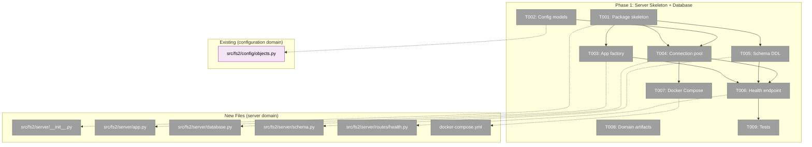
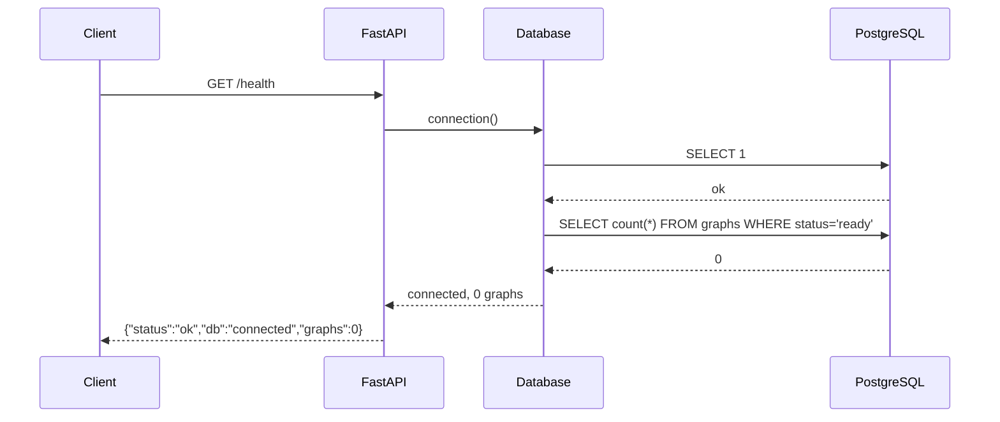

# Phase 1: Server Skeleton + Database — Tasks

**Plan**: [server-mode-plan.md](../../server-mode-plan.md)
**Phase**: Phase 1: Server Skeleton + Database
**Generated**: 2026-03-05
**CS**: CS-3 (medium)

---

## Executive Briefing

- **Purpose**: Establish the foundational server application with PostgreSQL schema, async connection pooling, and a health endpoint — every subsequent phase builds on this skeleton.
- **What We're Building**: A FastAPI application factory (`create_app()`) backed by PostgreSQL + pgvector, with the validated schema from Workshop 001 (5 tables, 20+ indexes, RLS-ready), an async connection pool via psycopg3, and a Docker Compose development stack. The health endpoint proves the stack works end-to-end.
- **Goals**:
  - ✅ `uvicorn fs2.server.app:create_app --factory` starts cleanly
  - ✅ PostgreSQL schema created with all 5 tables + indexes + extensions
  - ✅ Async connection pool manages DB connections with startup/shutdown lifecycle
  - ✅ `/health` returns `{"status": "ok", "db": "connected", "graphs": 0}`
  - ✅ `docker compose up` starts FastAPI + PostgreSQL stack
  - ✅ Server config models registered in configuration domain
- **Non-Goals**:
  - ❌ Authentication or tenant isolation (Phase 2)
  - ❌ Graph upload or ingestion (Phase 3)
  - ❌ Query endpoints (Phase 4)
  - ❌ Dashboard UI (Phase 6)
  - ❌ RLS policy enforcement at runtime (Phase 2 — schema creates policies but they're inactive until auth middleware sets tenant context)

---

## Prior Phase Context

*Phase 1 is the first phase — no prior phases to review.*

---

## Pre-Implementation Check

| File | Exists? | Domain Check | Notes |
|------|---------|-------------|-------|
| `src/fs2/server/__init__.py` | ❌ Create | server ✅ | New package |
| `src/fs2/server/app.py` | ❌ Create | server ✅ | FastAPI app factory |
| `src/fs2/server/database.py` | ❌ Create | server ✅ | Connection pool + session factory |
| `src/fs2/server/schema.py` | ❌ Create | server ✅ | DDL from Workshop 001 |
| `src/fs2/server/routes/__init__.py` | ❌ Create | server ✅ | Routes subpackage |
| `src/fs2/server/routes/health.py` | ❌ Create | server ✅ | Health check route |
| `src/fs2/config/objects.py` | ✅ Modify | configuration ✅ | Add 2 new config models + register |
| `docker-compose.yml` | ❌ Create | server ✅ | Dev deployment stack |
| `tests/server/__init__.py` | ❌ Create | server ✅ | Test package |
| `tests/server/test_health.py` | ❌ Create | server ✅ | Health endpoint tests |
| `tests/server/test_database.py` | ❌ Create | server ✅ | DB connection lifecycle tests |
| `tests/server/test_schema.py` | ❌ Create | server ✅ | Schema creation tests |
| `docs/domains/server/domain.md` | ✅ Exists | server ✅ | Already created during plan-4 |
| `docs/domains/registry.md` | ✅ Exists | — ✅ | Already has server entry |
| `docs/domains/domain-map.md` | ✅ Exists | — ✅ | Already has server node |

**Concept duplication check**: No existing "server", "FastAPI", "connection pool", or "health endpoint" code in the main source tree. Only test fixtures contain unrelated Go server samples. Clean to proceed.

---

## Architecture Map



---

## Tasks

| Status | ID | Task | Domain | Path(s) | Done When | Notes |
|--------|-----|------|--------|---------|-----------|-------|
| [x] | T000 | Add server dependencies to `pyproject.toml` via `uv add` | server | `/Users/jordanknight/substrate/fs2/028-server-mode/pyproject.toml` | `uv run python -c "import fastapi, uvicorn, psycopg_pool, httpx"` succeeds | ✅ Done. All 6 packages added. |
| [x] | T001 | Create `src/fs2/server/` package with `__init__.py` and `routes/__init__.py` sub-package | server | `/Users/jordanknight/substrate/fs2/028-server-mode/src/fs2/server/__init__.py`, `.../server/routes/__init__.py` | `from fs2.server import create_app` importable (after T003 wires it) | Minimal init — just package markers. Export `create_app` from `__init__.py` once app.py exists. |
| [x] | T002 | Add `ServerDatabaseConfig` and `ServerStorageConfig` Pydantic models to config registry | configuration | `/Users/jordanknight/substrate/fs2/028-server-mode/src/fs2/config/objects.py` | `config.require(ServerDatabaseConfig)` returns valid config from YAML; both types in `YAML_CONFIG_TYPES` | **Finding 06**: YAML_CONFIG_TYPES is flat list with unique `__config_path__`. Use paths `server.database` and `server.storage`. Pattern: see `GraphConfig` (L177-198) for simple model. Include `host`, `port`, `database`, `user`, `password`, `pool_min`, `pool_max`, `pool_timeout` for DB; `upload_dir` for storage. |
| [x] | T003 | Create FastAPI app factory `create_app()` in `app.py` with lifespan context manager | server | `/Users/jordanknight/substrate/fs2/028-server-mode/src/fs2/server/app.py` | `uvicorn fs2.server.app:create_app --factory` starts without errors; `/docs` shows OpenAPI spec | Use FastAPI lifespan for async startup (pool connect) / shutdown (pool close). Mount versioned router at `/api/v1/`. Include CORS middleware. Title: "fs2 Server". |
| [x] | T004 | Implement `database.py`: async connection pool, `get_db_connection()` context manager, startup/shutdown | server | `/Users/jordanknight/substrate/fs2/028-server-mode/src/fs2/server/database.py` | Pool opens on startup, `SELECT 1` succeeds via pool, pool closes on shutdown | **Finding 03**: Use `psycopg3.AsyncConnection` + `psycopg_pool.AsyncConnectionPool`. Pool config from `ServerDatabaseConfig`. Export: `Database` class with `connect()`, `disconnect()`, `connection()` async context manager. Register `pgvector` extension on connections. **Contract**: `Database` is a server-domain **contract** (not internal) — graph-storage and search domains receive it via DI in later phases. Design the API for external consumption. |
| [x] | T005 | Implement `schema.py`: `create_schema(conn)` that executes all DDL from Workshop 001 | server | `/Users/jordanknight/substrate/fs2/028-server-mode/src/fs2/server/schema.py` | All 5 tables + 20 indexes + 3 extensions created on fresh DB | SQL from Workshop 001 (adapted). Tables: `tenants`, `graphs`, `code_nodes`, `node_edges`, `embedding_chunks`. Extensions: `uuid-ossp`, `vector`, `pg_trgm`. Include `IF NOT EXISTS` for idempotency. **No RLS** — auth model is "valid key = full access". Remove `tenant_id` FK columns from data tables; keep `tenant_id` on `graphs` only for organizational grouping. |
| [x] | T006 | Create health endpoint: `GET /health` returning DB status + graph count | server | `/Users/jordanknight/substrate/fs2/028-server-mode/src/fs2/server/routes/health.py` | `curl localhost:8000/health` → `{"status":"ok","db":"connected","graphs":0}` | **AC23**. Query `SELECT count(*) FROM graphs WHERE status = 'ready'` for graph count. Handle DB down gracefully → `{"status":"degraded","db":"disconnected","graphs":null}`. |
| [x] | T007 | Create `docker-compose.yml` with FastAPI + PostgreSQL (pgvector) services | server | `/Users/jordanknight/substrate/fs2/028-server-mode/docker-compose.yml` | `docker compose up` starts both services; health endpoint responds | **AC22**. Use `pgvector/pgvector:pg17` image (proven in prototype). Expose pg on 5432, app on 8000. Volume for pg data. Env vars for config. Include `depends_on` with healthcheck. |
| [x] | T008 | Verify domain artifacts: server/domain.md, registry.md, domain-map.md | server | `/Users/jordanknight/substrate/fs2/028-server-mode/docs/domains/server/domain.md`, `.../registry.md`, `.../domain-map.md` | All 3 files exist and reference server domain correctly | **ALREADY DONE** — created during plan-4 HIGH fix. Verify only, no changes expected. Update `domain.md` status from "planned" → "active" when Phase 1 is complete. |
| [x] | T009 | Create test suite: health endpoint, DB connection lifecycle, schema creation | server | `/Users/jordanknight/substrate/fs2/028-server-mode/tests/server/test_health.py`, `.../test_database.py`, `.../test_schema.py` | `pytest tests/server/ -m "not slow"` passes | **Fakes over mocks** (spec). Tests: (1) health returns 200 + JSON shape, (2) pool starts and stops cleanly, (3) schema creates all tables idempotently. Mark integration tests requiring real PostgreSQL as `@pytest.mark.slow`. Fast tests use `FakeDatabase` or `httpx.AsyncClient` test transport. |

---

## Context Brief

### Key Findings from Plan

- **Finding 03** (High): Async driver must be `psycopg3.AsyncConnection` — asyncpg does NOT have pgvector adapter. Action: Use `psycopg_pool.AsyncConnectionPool` and validate under concurrent load.
- **Finding 04** (High): ~~RLS + connection pooling~~ **REMOVED** — User decided no RLS. Auth model is "valid API key = full access to all graphs". No `SET app.current_tenant_id` needed. Massively simplifies pooling — standard shared pool, no per-request transaction context. Phase 2 reduces to just API key validation.
- **Finding 06** (High): `YAML_CONFIG_TYPES` is a flat list with unique `__config_path__`. Action: Register `ServerDatabaseConfig` at path `server.database` and `ServerStorageConfig` at path `server.storage`. Zero collision risk.

### Domain Dependencies

- `configuration`: ConfigurationService (`config.require(T)`) — load ServerDatabaseConfig + ServerStorageConfig from YAML/env
  - Entry: `src/fs2/config/service.py:ConfigurationService`
  - Pattern: `config.require(ServerDatabaseConfig)` in database.py constructor
- `configuration`: FakeConfigurationService — pre-wire configs in tests
  - Entry: `src/fs2/config/service.py:FakeConfigurationService`
  - Pattern: `FakeConfigurationService(ServerDatabaseConfig(host="localhost", ...))` in test fixtures

### Domain Constraints

- **server** domain owns all new files under `src/fs2/server/`
- **configuration** domain is the only modified existing domain (objects.py)
- Server package must NOT import from `cli/` (dependency direction: cli → server, never reverse)
- Server package MAY import from `core/models/` (domain models are shared)
- All new config models must follow existing pattern: `BaseModel` + `__config_path__` ClassVar + YAML example docstring

### Embedding Query Strategy (DYK Decision)

- **Data upload**: BYO by design — embeddings come from client-side `fs2 scan` pickle. Server stores them as-is.
- **Search queries**: Support BOTH modes:
  - **Text mode**: Client sends `query: str`, server embeds using its own embedding adapter → cosine search
  - **BYO mode**: Client sends `query_vector: list[float]`, server does cosine search directly (no server-side embedding needed)
- **API implication**: Search endpoint accepts either `query` (text) or `query_vector` (pre-embedded). Phase 4 task.
- **Benefit**: Server can operate without embedding API credentials if all clients BYO embed. Flexible for different deployment scenarios.

### Gotchas

- **Schema evolution**: Phase 1 uses `IF NOT EXISTS` DDL on every startup (no migration tooling). **Known tech debt** — introduce Alembic before Phase 2 when `api_keys` table needs adding. Acceptable for now since schema is greenfield.
- **pgvector pool registration**: `AsyncConnectionPool` must use `configure=register_pgvector_on_connection` callback so every new connection gets `register_vector()` called. The prototype only registered on a single sync connection — under concurrent load, fresh pool connections won't have pgvector types registered, causing `can't adapt type` errors. See T004 notes.

### Reusable from Prior Work

- **Workshop 001** schema SQL (locked) — copy directly into schema.py
- **Prototype `scripts/scratch/pgvector_prototype.py`** — reference for psycopg3 connection patterns, pgvector registration, COPY syntax
- **Config model pattern** — `GraphConfig` (L177-198 in objects.py) is the minimal example; `ScanConfig` (L205-262) shows validators
- **FakeConfigurationService** — standard fake for injecting test configs

### Config Model Pattern Reference

```python
# Minimal config model (from GraphConfig):
class ServerDatabaseConfig(BaseModel):
    """Configuration for server PostgreSQL database.

    Path: server.database (e.g., FS2_SERVER__DATABASE__HOST)

    YAML example:
        ```yaml
        server:
          database:
            host: "localhost"
            port: 5432
            database: "fs2"
        ```
    """
    __config_path__: ClassVar[str] = "server.database"

    host: str = "localhost"
    port: int = 5432
    # ... etc
```

### External Dependencies (new packages needed)

| Package | Version | Purpose |
|---------|---------|---------|
| `fastapi` | ≥0.115 | HTTP framework |
| `uvicorn[standard]` | ≥0.34 | ASGI server |
| `psycopg[binary]` | ≥3.2 | PostgreSQL driver (already installed for prototype) |
| `psycopg-pool` | ≥3.2 | Async connection pool |
| `pgvector` | ≥0.4 | pgvector Python adapter (already installed) |
| `httpx` | ≥0.28 | Async HTTP client for testing (FastAPI test client) |

### Mermaid Flow Diagram (Server Startup)


### Mermaid Sequence Diagram (Health Check)



---

## Discoveries & Learnings

_Populated during implementation by plan-6._

| Date | Task | Type | Discovery | Resolution | References |
|------|------|------|-----------|------------|------------|

**Types**: `gotcha` | `research-needed` | `unexpected-behavior` | `workaround` | `decision` | `debt` | `insight`

---

## Directory Layout

```
docs/plans/028-server-mode/
  ├── server-mode-plan.md
  ├── server-mode-spec.md
  ├── workshops/
  │   ├── 001-database-schema.md
  │   └── 002-prototype-validation.md
  └── tasks/phase-1-server-skeleton-database/
      ├── tasks.md              ← you are here
      ├── tasks.fltplan.md      ← flight plan
      └── execution.log.md      # created by plan-6
```

---

## Critical Insights (2026-03-05)

| # | Insight | Decision |
|---|---------|----------|
| 1 | RLS on `graphs` table would silently break health endpoint (returns 0 always without tenant context) | **No RLS** — valid API key = full access. Removed tenant isolation, RLS policies, per-request SET context. Simplifies Phase 2 dramatically. |
| 2 | Database pool in server domain is consumed by graph-storage and search domains in later phases — cross-domain dependency | **Database is a server-domain contract** — designed for external consumption via DI, not internal-only. |
| 3 | No task covers adding FastAPI/uvicorn/psycopg-pool/httpx to pyproject.toml — blocking prerequisite | **Added T000** — `uv add` all deps as first task. Everything must work via `uv run` / `uvx`. |
| 4 | pgvector `register_vector()` only runs on initial connection — pool spins up fresh connections without it under load | **Pool configure callback** — use `AsyncConnectionPool(configure=...)` to register pgvector on every new connection. |
| 5 | Schema DDL runs on every startup; no migration path for Phase 2's new tables | **Known tech debt** — accept for Phase 1, add Alembic before Phase 2. |

Bonus decisions:
- **BYO embeddings**: Search API accepts `query` (text, server embeds) OR `query_vector` (pre-embedded vector). Server can run without embedding API creds.

Action items: Update spec AC15 (RLS) to reflect simplified auth model; update plan Phase 2 to remove RLS tasks.
