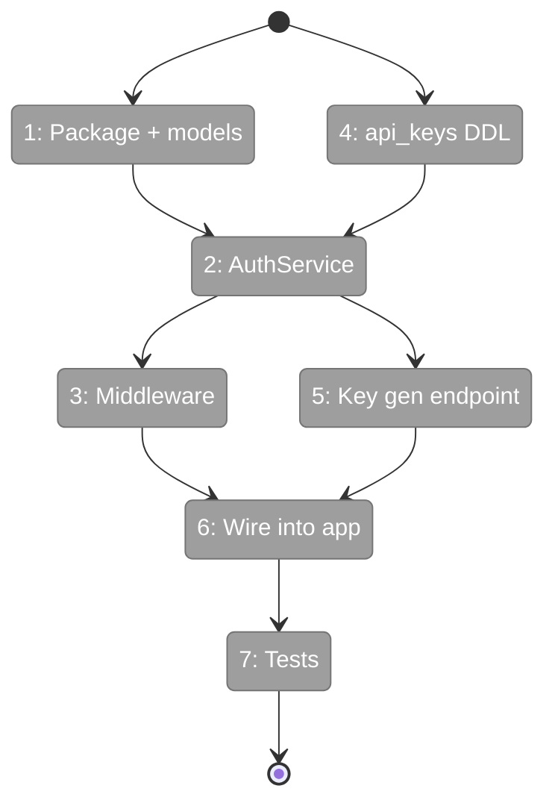

# Flight Plan: Phase 2 — Auth + API Keys

**Plan**: [../../server-mode-plan.md](../../server-mode-plan.md)
**Phase**: Phase 2: Auth + API Keys
**Generated**: 2026-03-05
**Status**: Skipped

> **Decision (2026-03-05)**: Phase 2 skipped entirely. Query API endpoints (tree, search, get-node, list-graphs) will be completely open — no API key auth. Auth will be added later only for dashboard upload/delete actions. This removes AC14, AC15, AC16, AC17 from v1 scope.

---

## Departure → Destination

**Where we are**: Phase 1 delivered a running FastAPI + PostgreSQL stack with health endpoint, async connection pool, and 5-table schema. The server is unprotected — anyone can hit any endpoint. The auth domain is defined in docs but has no source code.

**Where we're going**: Every API request (except `/health`) requires a valid `Authorization: Bearer fs2_<key>` header. An admin can generate scoped API keys (read-only or read-write) via `POST /api/v1/auth/keys`. Invalid keys return HTTP 401 with an actionable error message. Tests prove auth works using FakeAuthService (no real DB needed for fast tests).

---

## Domain Context

### Domains We're Changing

| Domain | What Changes | Key Files |
|--------|-------------|-----------|
| auth | NEW — entire package created from scratch | `src/fs2/auth/models.py`, `service.py`, `middleware.py`, `fake.py` |
| server | Add api_keys table + auth route + wire middleware | `schema.py`, `app.py`, `routes/auth.py` |

### Domains We Depend On (no changes)

| Domain | What We Consume | Contract |
|--------|----------------|----------|
| server | `Database.connection()` async ctx manager | `Database` class (contract) |
| server | `create_app()` DI params | App factory |
| configuration | `FakeConfigurationService` | Test double |

---

## Flight Status

<!-- Updated by /plan-6-v2: pending → active → done. Use blocked for problems/input needed. -->



**Legend**: grey = pending | yellow = active | red = blocked/needs input | green = done

---

## Stages

<!-- Updated by /plan-6-v2 during implementation: [ ] → [~] → [x] -->

- [ ] **Stage 1: Foundation** — Auth package skeleton + Pydantic models + api_keys DDL (`models.py`, `schema.py`)
- [ ] **Stage 2: Core Logic** — AuthService + FakeAuthService (`service.py`, `fake.py`)
- [ ] **Stage 3: Integration** — Middleware + key gen endpoint + wire into app (`middleware.py`, `routes/auth.py`, `app.py`)
- [ ] **Stage 4: Validation** — Tests + domain artifact update (`tests/auth/`)

---

## Architecture: Before & After

```mermaid
flowchart LR
    classDef existing fill:#E8F5E9,stroke:#4CAF50,color:#000
    classDef changed fill:#FFF3E0,stroke:#FF9800,color:#000
    classDef new fill:#E3F2FD,stroke:#2196F3,color:#000

    subgraph Before["Before Phase 2"]
        B_App[create_app]:::existing
        B_DB[Database]:::existing
        B_Health[/health]:::existing
        B_Schema[schema.py\n5 tables]:::existing

        B_App --> B_DB
        B_App --> B_Health
    end

    subgraph After["After Phase 2"]
        A_App[create_app\n+ auth_service param]:::changed
        A_DB[Database]:::existing
        A_Health[/health\npublic]:::existing
        A_Schema[schema.py\n6 tables\n+ api_keys]:::changed
        A_Auth["🔑 AuthService\ngenerate + validate"]:::new
        A_MW["🛡️ require_api_key\nDepends()"]:::new
        A_Fake["FakeAuthService"]:::new
        A_KeyGen[POST /auth/keys]:::new

        A_App --> A_DB
        A_App --> A_Health
        A_App --> A_MW
        A_MW --> A_Auth
        A_Auth --> A_DB
        A_App --> A_KeyGen
        A_KeyGen --> A_Auth
    end
```

**Legend**: existing (green, unchanged) | changed (orange, modified) | new (blue, created)

---

## Acceptance Criteria

- [ ] AC14: API requests require valid API key in `Authorization: Bearer fs2_<key>` header
- [ ] AC16: API keys scoped to read-only or read-write
- [ ] AC17: Invalid or expired API keys return HTTP 401 with actionable error message

---

## Goals & Non-Goals

**Goals**:
- API key authentication on all endpoints except `/health`
- Key generation via admin endpoint
- Read-only vs read-write scoping
- FakeAuthService for testing
- Actionable 401 error messages

**Non-Goals**:
- No RLS / tenant data isolation
- No OAuth2 / SSO
- No dashboard key management UI (Phase 6)
- No per-graph permissions

---

## Checklist

- [ ] T001: Create `src/fs2/auth/` package skeleton
- [ ] T002: Create Tenant + APIKey Pydantic models
- [ ] T003: Implement AuthService
- [ ] T004: Implement auth middleware (Depends)
- [ ] T005: Add api_keys table to schema
- [ ] T006: Create key generation endpoint
- [ ] T007: Create FakeAuthService
- [ ] T008: Wire auth into create_app()
- [ ] T009: Update auth domain artifacts
- [ ] T010: Create test suite
