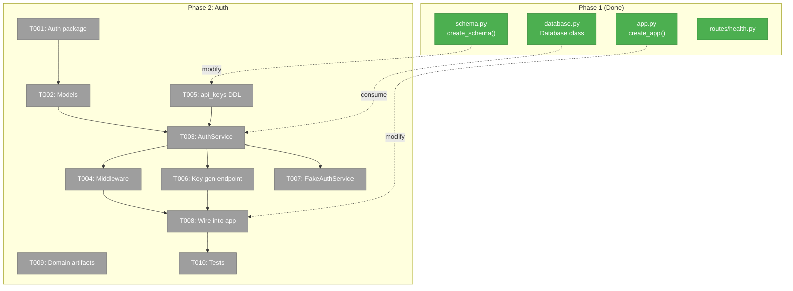
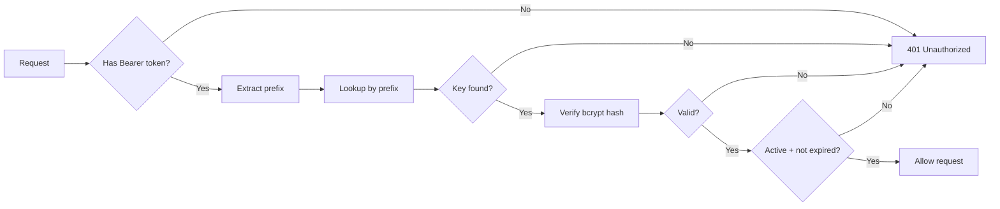
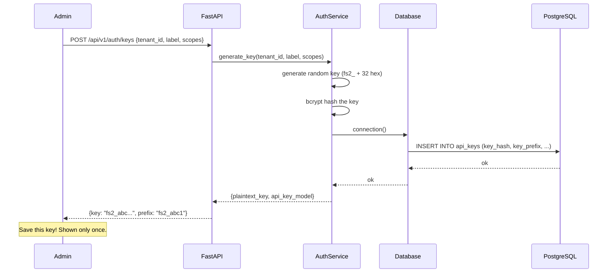

# Phase 2: Auth + API Keys — Tasks

**Plan**: [server-mode-plan.md](../../server-mode-plan.md)
**Phase**: Phase 2: Auth + API Keys
**Generated**: 2026-03-05
**CS**: CS-2 (small — simplified by no-RLS decision)

---

## Executive Briefing

- **Purpose**: Add API key authentication so the server is protected before any data endpoints go live. Every request must carry a valid `Authorization: Bearer fs2_<key>` header.
- **What We're Building**: An auth package (`src/fs2/auth/`) with Pydantic models (Tenant, APIKey), an AuthService for key generation/validation, FastAPI middleware that rejects unauthenticated requests, a key generation admin endpoint, and a FakeAuthService for testing. Plus the `api_keys` table in the schema.
- **Goals**:
  - ✅ API requests require a valid API key (`Authorization: Bearer fs2_<key>`)
  - ✅ Invalid/expired keys return HTTP 401 with actionable error message
  - ✅ API keys scoped to read-only or read-write
  - ✅ Admin can generate API keys via endpoint
  - ✅ FakeAuthService enables tests without real DB
  - ✅ Health endpoint remains unauthenticated (public)
- **Non-Goals**:
  - ❌ Row-Level Security or tenant data isolation (removed by DYK decision)
  - ❌ OAuth2 / SSO dashboard login (Phase 6)
  - ❌ Key rotation UI (Phase 6 dashboard)
  - ❌ Per-graph permissions (future scope)

---

## Prior Phase Context

### Phase 1: Server Skeleton + Database

**A. Deliverables**:
- `src/fs2/server/__init__.py` — package init, exports `create_app`
- `src/fs2/server/app.py` — FastAPI app factory with lifespan
- `src/fs2/server/database.py` — `Database` class (async pool, server-domain **contract**)
- `src/fs2/server/schema.py` — `create_schema()` with 5 tables, 15 indexes, 3 extensions
- `src/fs2/server/routes/health.py` — `GET /health` endpoint
- `src/fs2/server/routes/__init__.py` — routes package
- `src/fs2/config/objects.py` — `ServerDatabaseConfig`, `ServerStorageConfig` added
- `docker-compose.yml` — FastAPI + PostgreSQL + Redis
- `Dockerfile` — server container
- `tests/server/` — 16 tests (health, database, schema)

**B. Dependencies Exported**:
- `Database` class: `connect()`, `disconnect()`, `connection()` async context manager
- `create_app(db_config, database)` — accepts optional DI for testing
- `ServerDatabaseConfig.conninfo` property for connection strings
- `FakeDatabase` in test_health.py — fake with `connection()` override returning mock conn
- `create_schema(conn)` — idempotent DDL execution

**C. Gotchas & Debt**:
- Schema uses `IF NOT EXISTS` on every startup — Alembic migration debt (must add before Phase 2 schema changes, OR extend existing `SCHEMA_SQL`)
- pgvector pool `configure` callback required for every new connection
- `FakeDatabase` uses `unittest.mock.AsyncMock` for connection simulation
- No `api_keys` table in schema yet — must be added in Phase 2

**D. Incomplete Items**: None — all 10 tasks completed.

**E. Patterns to Follow**:
- FastAPI app factory with lifespan for startup/shutdown
- `Database` class as server-domain contract (consumed via DI)
- `FakeDatabase` pattern for health tests — override `connection()` with AsyncMock
- Config models: `BaseModel` + `__config_path__` ClassVar + YAML docstring
- Fakes over mocks (project convention)
- `@pytest.mark.slow` for tests requiring real PostgreSQL

---

## Pre-Implementation Check

| File | Exists? | Domain Check | Notes |
|------|---------|-------------|-------|
| `src/fs2/auth/__init__.py` | ❌ Create | auth ✅ | New package |
| `src/fs2/auth/models.py` | ❌ Create | auth ✅ | Tenant, APIKey Pydantic models |
| `src/fs2/auth/service.py` | ❌ Create | auth ✅ | AuthService: generate, validate, lookup |
| `src/fs2/auth/middleware.py` | ❌ Create | auth ✅ | FastAPI Depends() for auth |
| `src/fs2/auth/exceptions.py` | ❌ Create | auth ✅ | AuthError, InvalidKeyError |
| `src/fs2/auth/fake.py` | ❌ Create | auth ✅ | FakeAuthService test double |
| `src/fs2/server/app.py` | ✅ Modify | server ✅ | Wire auth middleware |
| `src/fs2/server/schema.py` | ✅ Modify | server ✅ | Add api_keys table DDL |
| `src/fs2/server/routes/auth.py` | ❌ Create | server ✅ | Key generation admin endpoint |
| `tests/auth/__init__.py` | ❌ Create | auth ✅ | Test package |
| `tests/auth/test_models.py` | ❌ Create | auth ✅ | Model validation tests |
| `tests/auth/test_service.py` | ❌ Create | auth ✅ | AuthService tests |
| `tests/auth/test_middleware.py` | ❌ Create | auth ✅ | Middleware integration tests |

**Concept duplication check**: No existing "auth", "APIKey", "middleware", or "Bearer" code in main source tree. Clean to proceed.

---

## Architecture Map



---

## Tasks

| Status | ID | Task | Domain | Path(s) | Done When | Notes |
|--------|-----|------|--------|---------|-----------|-------|
| [ ] | T001 | Create `src/fs2/auth/` package with `__init__.py` | auth | `/Users/jordanknight/substrate/fs2/028-server-mode/src/fs2/auth/__init__.py` | `from fs2.auth import AuthService` importable (after T003) | Minimal init. Export AuthService, FakeAuthService, require_api_key once they exist. |
| [ ] | T002 | Create Tenant + APIKey Pydantic models | auth | `/Users/jordanknight/substrate/fs2/028-server-mode/src/fs2/auth/models.py` | Models validate, `APIKey.verify(plaintext)` checks bcrypt hash | Tenant: id (UUID), name, slug, is_active, max_graphs. APIKey: id (UUID), tenant_id, key_hash, key_prefix, label, scopes (list[str]), is_active, last_used_at, expires_at. Key format: `fs2_` + 32 hex chars. Store bcrypt hash, prefix for lookup. |
| [ ] | T003 | Implement AuthService: generate key, validate key, lookup by prefix | auth | `/Users/jordanknight/substrate/fs2/028-server-mode/src/fs2/auth/service.py` | `generate_key()` returns plaintext+model; `validate_key("fs2_xxx")` returns APIKey or raises | Takes `Database` (Phase 1 contract) via constructor DI. `generate_key(tenant_id, label, scopes)` → plaintext key + DB insert. `validate_key(raw_key)` → lookup by prefix, verify bcrypt hash, check is_active + expiry. Raise `InvalidKeyError` with actionable message on failure. |
| [ ] | T004 | Implement auth middleware: FastAPI `Depends()` that validates Bearer token | auth | `/Users/jordanknight/substrate/fs2/028-server-mode/src/fs2/auth/middleware.py` | Request with valid key passes; request without key → 401; invalid key → 401 with message | Use FastAPI `Depends()` pattern (not raw middleware). Extract `Authorization: Bearer fs2_<key>` header. Call `AuthService.validate_key()`. On failure, raise `HTTPException(401, detail=actionable_message)`. AC14, AC17. |
| [ ] | T005 | Add `api_keys` table to schema DDL | server | `/Users/jordanknight/substrate/fs2/028-server-mode/src/fs2/server/schema.py` | `api_keys` table created with `CREATE TABLE IF NOT EXISTS`; index on `key_prefix` | From Workshop 001. Columns: id, tenant_id, key_hash, key_prefix, label, scopes (TEXT[]), is_active, last_used_at, expires_at, created_at. Index: `idx_api_keys_prefix ON api_keys(key_prefix) WHERE is_active = true`. |
| [ ] | T006 | Create key generation endpoint: `POST /api/v1/auth/keys` | server | `/Users/jordanknight/substrate/fs2/028-server-mode/src/fs2/server/routes/auth.py` | Admin can generate API key; response includes plaintext key (shown once) | Request body: tenant_id, label, scopes. Response: `{key: "fs2_abc...", prefix: "fs2_abc1", label: "..."}`. **Plaintext key shown only once** — not stored. This endpoint itself requires auth (write scope). Bootstrap: create first key via CLI/script. |
| [ ] | T007 | Create FakeAuthService test double | auth | `/Users/jordanknight/substrate/fs2/028-server-mode/src/fs2/auth/fake.py` | Fake accepts preconfigured keys; `validate_key()` works without DB | Follows project convention: inherit AuthService ABC or implement same interface. Pre-load keys in constructor. No DB needed. |
| [ ] | T008 | Wire auth into `create_app()`: add middleware, mount auth routes | server | `/Users/jordanknight/substrate/fs2/028-server-mode/src/fs2/server/app.py` | All routes except `/health` require valid API key | Modify `create_app()` to accept optional `AuthService` (DI for testing). Add `require_api_key` dependency to API router. Health endpoint stays public (no auth). |
| [ ] | T009 | Update auth domain artifacts: domain.md status → active, verify registry + map | auth | `/Users/jordanknight/substrate/fs2/028-server-mode/docs/domains/auth/domain.md` | domain.md status = "active", source location updated | Auth domain.md already exists and is aligned with no-RLS (updated during Phase 1 review fixes). Just update status and source location. |
| [ ] | T010 | Create test suite: models, service, middleware integration | auth | `/Users/jordanknight/substrate/fs2/028-server-mode/tests/auth/test_models.py`, `.../test_service.py`, `.../test_middleware.py` | `pytest tests/auth/ -m "not slow"` passes | Tests: (1) model validation + key hashing, (2) AuthService generate + validate via FakeAuthService, (3) middleware rejects missing/invalid keys, passes valid keys. Use `FakeAuthService` + `httpx.AsyncClient` for middleware tests. Mark DB integration tests as `@pytest.mark.slow`. |

---

## Context Brief

### Key Findings from Plan

- **Finding 04** (was High, now simplified): ~~RLS + connection pooling~~ **REMOVED**. Auth is simple API key validation. No `SET app.current_tenant_id`, no per-request transaction scope, no tenant context leaks. Standard shared connection pool.
- **Finding 06** (High): Config registry supports new types cleanly. If auth needs its own config, use `__config_path__` = `"auth"`.

### Domain Dependencies

- `server.Database`: Async connection pool (`Database.connection()` context manager) — AuthService queries `api_keys` table
- `server.create_app()`: App factory accepting DI params — will add optional `AuthService` param
- `server.SCHEMA_SQL`: Schema DDL — will append `api_keys` table
- `configuration.FakeConfigurationService`: Test double — if AuthService needs config

### Domain Constraints

- **auth** domain owns all new files under `src/fs2/auth/`
- **server** domain owns route endpoints (`routes/auth.py`) and schema changes (`schema.py`)
- Auth middleware MUST use FastAPI `Depends()` pattern (not raw ASGI middleware) for proper DI
- Auth package must NOT import from `server/` directly — receive `Database` via constructor injection
- `/health` endpoint MUST remain unauthenticated (operational monitoring)

### Reusable from Phase 1

- `Database` class: `async with db.connection() as conn` for SQL queries
- `FakeDatabase` pattern in `tests/server/test_health.py` — mock connection approach
- `create_app(database=fake_db)` — DI pattern for test apps
- `httpx.AsyncClient` + `ASGITransport` — test client pattern
- `SCHEMA_SQL` string — append new DDL (idempotent `IF NOT EXISTS`)

### API Key Design (from Workshop 001)

```
Key format:  fs2_ + 32 random hex chars = 36 chars total
Storage:     bcrypt hash only (plaintext never stored)
Lookup:      key_prefix (first 8 chars: "fs2_xxxx") → index scan → bcrypt verify
Scopes:      TEXT[] — ['read'], ['read', 'write'], ['admin']
Expiry:      Optional TIMESTAMPTZ — null = never expires
```

### Mermaid Flow Diagram (Auth Request Flow)



### Mermaid Sequence Diagram (Key Generation)



### External Dependencies (new packages needed)

| Package | Version | Purpose |
|---------|---------|---------|
| `bcrypt` | ≥4.0 | Password/key hashing |

---

## Discoveries & Learnings

_Populated during implementation by plan-6._

| Date | Task | Type | Discovery | Resolution | References |
|------|------|------|-----------|------------|------------|

**Types**: `gotcha` | `research-needed` | `unexpected-behavior` | `workaround` | `decision` | `debt` | `insight`

---

## Directory Layout

```
docs/plans/028-server-mode/
  ├── server-mode-plan.md
  ├── server-mode-spec.md
  ├── workshops/
  │   ├── 001-database-schema.md
  │   └── 002-prototype-validation.md
  ├── tasks/
  │   ├── phase-1-server-skeleton-database/
  │   │   ├── tasks.md
  │   │   ├── tasks.fltplan.md
  │   │   └── execution.log.md
  │   └── phase-2-auth/
  │       ├── tasks.md              ← you are here
  │       ├── tasks.fltplan.md      ← flight plan
  │       └── execution.log.md      # created by plan-6
  └── reviews/
```
