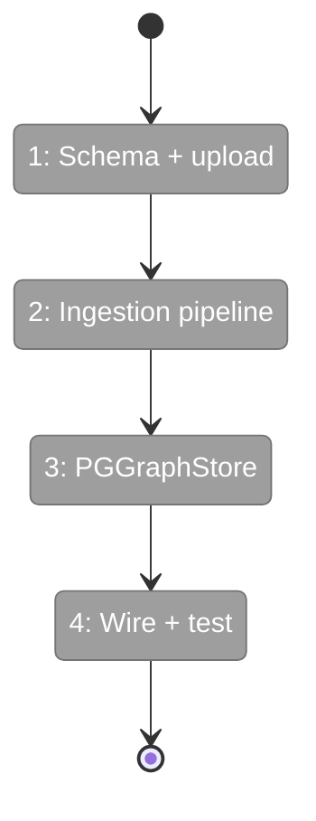

# Flight Plan: Phase 3 — Ingestion Pipeline + Graph Upload

**Plan**: [../../server-mode-plan.md](../../server-mode-plan.md)
**Phase**: Phase 3: Ingestion Pipeline + Graph Upload
**Generated**: 2026-03-05
**Status**: Landed ✅

---

## Departure → Destination

**Where we are**: Phase 1 delivered a running FastAPI + PostgreSQL stack with health endpoint, 5-table schema, and async connection pool. Phase 2 was skipped (no auth). The server has zero data — all tables are empty. The COPY ingestion pattern was validated in the prototype (5,231 nodes in 5.0s).

**Where we're going**: A client can `POST /api/v1/graphs` with a pickle file, the server streams it to disk, ingests it via COPY into PostgreSQL, and within 30 seconds the graph is queryable. `GET /api/v1/graphs` lists available graphs with status. Re-uploading the same graph replaces it completely.

---

## Domain Context

### Domains We're Changing

| Domain | What Changes | Key Files |
|--------|-------------|-----------|
| server | Upload endpoint, ingestion pipeline, status tracking, schema + jobs table | `routes/graphs.py`, `ingestion.py`, `schema.py`, `app.py` |
| graph-storage | New PostgreSQLGraphStore implementing GraphStore ABC | `core/repos/graph_store_pg.py` |

### Domains We Depend On (no changes)

| Domain | What We Consume | Contract |
|--------|----------------|----------|
| server | `Database.connection()` | `Database` class (contract) |
| server | `ServerStorageConfig.upload_dir` | Config model |
| graph-storage | `RestrictedUnpickler` | Secure deserialization |
| graph-storage | `GraphStore` ABC | Interface for PGGraphStore |
| graph-storage | `CodeNode` frozen dataclass | Node model |

---

## Flight Status



**Legend**: grey = pending | yellow = active | red = blocked/needs input | green = done

---

## Stages

- [ ] **Stage 1: Schema + Upload** — Add ingestion_jobs table, create upload endpoint + graphs list (`schema.py`, `routes/graphs.py`)
- [ ] **Stage 2: Ingestion Pipeline** — Background worker: RestrictedUnpickler → COPY → status update (`ingestion.py`)
- [ ] **Stage 3: PostgreSQLGraphStore** — GraphStore ABC implementation querying DB (`graph_store_pg.py`)
- [ ] **Stage 4: Wire + Test** — Mount routes, end-to-end tests, verify round-trip (`app.py`, `tests/`)

---

## Architecture: Before & After

```mermaid
flowchart LR
    classDef existing fill:#E8F5E9,stroke:#4CAF50,color:#000
    classDef changed fill:#FFF3E0,stroke:#FF9800,color:#000
    classDef new fill:#E3F2FD,stroke:#2196F3,color:#000

    subgraph Before["Before Phase 3"]
        B_App[create_app]:::existing
        B_DB[Database]:::existing
        B_Health[/health]:::existing
        B_Schema[schema.py\n5 tables]:::existing
    end

    subgraph After["After Phase 3"]
        A_App[create_app\n+ graph routes]:::changed
        A_DB[Database]:::existing
        A_Health[/health]:::existing
        A_Schema[schema.py\n6 tables\n+ ingestion_jobs]:::changed
        A_Upload["📤 POST /graphs\nstream to disk"]:::new
        A_Ingest["⚙️ Ingestion Worker\nUnpickle → COPY"]:::new
        A_PGStore["💾 PostgreSQLGraphStore\nget_node, get_children..."]:::new
        A_List["📋 GET /graphs\nlist + status"]:::new

        A_App --> A_DB
        A_App --> A_Health
        A_App --> A_Upload
        A_App --> A_List
        A_Upload --> A_Ingest
        A_Ingest --> A_DB
        A_PGStore --> A_DB
    end
```

---

## Acceptance Criteria

- [ ] AC1: Upload → queryable within 30s for 5K-node graph
- [ ] AC2: Re-upload replaces completely
- [ ] AC3: Metadata preserved (embedding_model, dimensions, format_version)
- [ ] AC4: RestrictedUnpickler rejects malicious pickles
- [ ] AC5: Ingestion status queryable via API

---

## Goals & Non-Goals

**Goals**:
- Upload pickle → stored in PostgreSQL via COPY
- Graph lifecycle: pending → ingesting → ready → error
- Re-upload fully replaces existing data
- PostgreSQLGraphStore for read queries
- Malicious pickle rejection

**Non-Goals**:
- No dashboard upload UI (Phase 6)
- No query API endpoints for tree/search (Phase 4)
- No authentication
- No incremental updates

---

## Checklist

- [ ] T001: Add ingestion_jobs table to schema
- [ ] T002: Create upload endpoint (POST /api/v1/graphs)
- [ ] T003: Implement ingestion worker (pickle → COPY)
- [ ] T004: Reuse RestrictedUnpickler for validation
- [ ] T005: Extract + store graph metadata
- [ ] T006: Implement re-upload (DELETE + re-ingest)
- [ ] T007: Graph status lifecycle + status endpoint
- [ ] T008: Implement PostgreSQLGraphStore
- [ ] T009: Wire routes into create_app() + list endpoint
- [ ] T010: Create test suite
