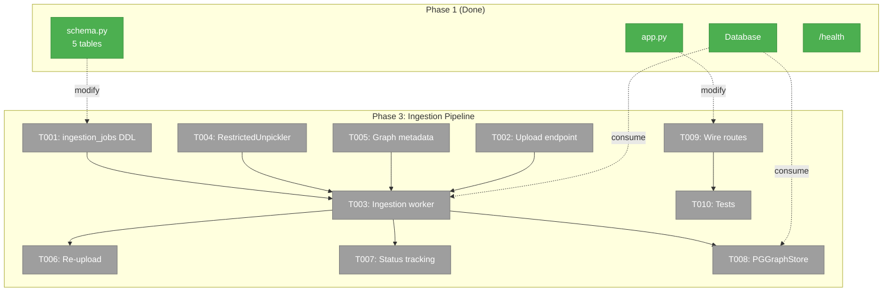
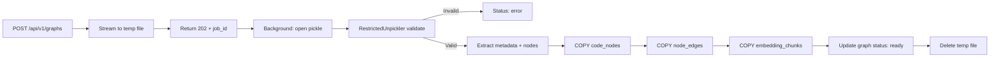
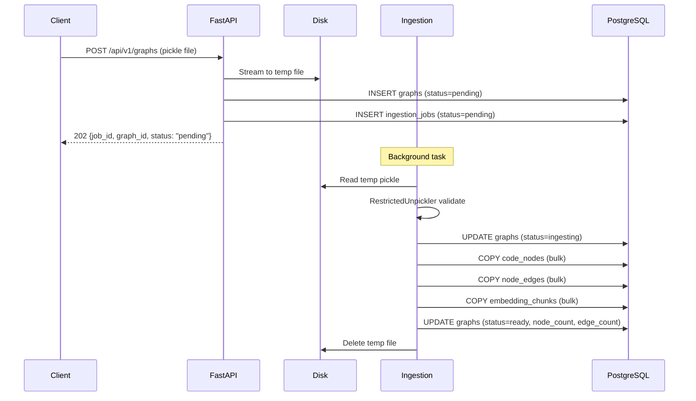

# Phase 3: Ingestion Pipeline + Graph Upload — Tasks

**Plan**: [server-mode-plan.md](../../server-mode-plan.md)
**Phase**: Phase 3: Ingestion Pipeline + Graph Upload
**Generated**: 2026-03-05
**CS**: CS-4 (large)

---

## Executive Briefing

- **Purpose**: Enable uploading graph pickle files to the server via REST API, with background ingestion into PostgreSQL using the validated COPY-based pipeline. This is what makes the server useful — without data, the query API (Phase 4) has nothing to search.
- **What We're Building**: An upload endpoint (`POST /api/v1/graphs`) that streams a pickle to a temp file, a background ingestion worker that uses RestrictedUnpickler + COPY bulk insert, graph status lifecycle tracking (pending → ingesting → ready → error), re-upload support (full replace), and a PostgreSQLGraphStore for read queries.
- **Goals**:
  - ✅ Upload a graph pickle via REST API → stored and queryable within 30s (5K nodes)
  - ✅ Re-upload replaces existing graph completely
  - ✅ All metadata preserved (embedding_model, dimensions, format_version)
  - ✅ RestrictedUnpickler rejects malicious pickles
  - ✅ Graph status lifecycle is queryable
  - ✅ PostgreSQLGraphStore implements GraphStore query methods against DB
- **Non-Goals**:
  - ❌ Dashboard upload UI (Phase 6 — this phase builds the API that dashboard will consume)
  - ❌ Query endpoints (Phase 4)
  - ❌ Authentication (deferred — endpoints are open)
  - ❌ Incremental/differential updates (full replace only, per D7)

---

## Prior Phase Context

### Phase 1: Server Skeleton + Database (Done ✅)

**A. Deliverables**:
- `src/fs2/server/app.py` — FastAPI app factory with lifespan (startup: pool + schema)
- `src/fs2/server/database.py` — `Database` class (async pool, server-domain **contract**)
- `src/fs2/server/schema.py` — `create_schema()` with 5 tables (tenants, graphs, code_nodes, node_edges, embedding_chunks), 15 indexes, 3 extensions
- `src/fs2/server/routes/health.py` — `GET /health`
- `src/fs2/config/objects.py` — `ServerDatabaseConfig`, `ServerStorageConfig`
- `docker-compose.yml` — FastAPI + PostgreSQL + Redis
- `tests/server/` — 16 tests passing

**B. Dependencies Exported**:
- `Database.connection()` — async context manager for DB access
- `create_app(db_config, database)` — DI for testing
- `ServerDatabaseConfig.conninfo` — connection string builder
- `ServerStorageConfig.upload_dir` — staging directory path
- `FakeDatabase` (in test_health.py) — mock connection pattern
- `SCHEMA_SQL` — append-friendly DDL string

**C. Gotchas & Debt**:
- Schema uses `IF NOT EXISTS` on every startup (no Alembic yet)
- pgvector pool `configure` callback required for every new connection
- No `tenant_id` on data tables (code_nodes, node_edges, embedding_chunks) — removed per no-RLS decision
- `tenant_id` on `graphs` table only for organizational grouping

**D. Incomplete Items**: None.

**E. Patterns to Follow**:
- FastAPI app factory with DI params for testing
- `Database` class as server-domain contract
- `FakeDatabase` with `connection()` override returning AsyncMock
- Append to `SCHEMA_SQL` for new tables (idempotent IF NOT EXISTS)

### Phase 2: Auth (Skipped ⏭️)

Skipped — no auth on query/upload endpoints. Auth deferred to dashboard phase.

---

## Pre-Implementation Check

| File | Exists? | Domain Check | Notes |
|------|---------|-------------|-------|
| `src/fs2/server/ingestion.py` | ❌ Create | server ✅ | Pickle → DB pipeline |
| `src/fs2/server/routes/graphs.py` | ❌ Create | server ✅ | Upload + status endpoints |
| `src/fs2/core/repos/graph_store_pg.py` | ❌ Create | graph-storage ✅ | PostgreSQLGraphStore |
| `src/fs2/server/app.py` | ✅ Modify | server ✅ | Mount graph routes |
| `src/fs2/server/schema.py` | ✅ Modify | server ✅ | Add ingestion_jobs table |
| `tests/server/test_ingestion.py` | ❌ Create | server ✅ | Ingestion pipeline tests |
| `tests/server/test_graph_upload.py` | ❌ Create | server ✅ | Upload endpoint tests |
| `tests/server/test_graph_store_pg.py` | ❌ Create | graph-storage ✅ | PG store query tests |

**Concept duplication check**: `RestrictedUnpickler` exists at `src/fs2/core/repos/graph_store_impl.py:55-93` — **REUSE IT**, do not recreate. COPY ingestion pattern exists in `scripts/scratch/pgvector_prototype.py:266-342` — adapt for async.

---

## Architecture Map



---

## Tasks

| Status | ID | Task | Domain | Path(s) | Done When | Notes |
|--------|-----|------|--------|---------|-----------|-------|
| [ ] | T000 | Add Phase 3 dependencies to `pyproject.toml` via `uv add` | server | `.../pyproject.toml` | `uv run python -c "import multipart"` succeeds | **BLOCKING PRE-STEP**. Run: `uv add python-multipart`. |
| [ ] | T001 | Add `ingestion_jobs` table to schema DDL | server | `.../src/fs2/server/schema.py` | `ingestion_jobs` table created with graph_id, status, error_message, timing columns | From Workshop 001. Status: pending/running/completed/failed. Append to SCHEMA_SQL. |
| [ ] | T002 | Create upload endpoint: `POST /api/v1/graphs` streaming pickle to temp file | server | `.../src/fs2/server/routes/graphs.py` | 128MB pickle uploads without OOM; returns 200 + `{graph_id, status: "ready"}` after ingestion completes | **Finding 05**: Stream to temp file via `ServerStorageConfig.upload_dir`, never buffer in RAM. **Synchronous ingestion** — endpoint blocks until ingestion completes (no background tasks for v1). Accept multipart form with `name`, `description`, `tenant_id` (optional) fields + `file` pickle. |
| [ ] | T003 | Implement ingestion pipeline: load pickle → validate → COPY to PostgreSQL | server | `.../src/fs2/server/ingestion.py` | 5K-node graph ingested in <30s including HNSW index update | **Workshop D4**: COPY-based bulk insert adapted for async psycopg3. **TDD**: `IngestionPipeline` is a standalone class with pure method boundaries — testable in isolation without FastAPI/HTTP. Accepts `Database` via DI. **Synchronous in-process** — called directly by upload endpoint, no background tasks for v1. Pipeline: open pickle → RestrictedUnpickler → extract (metadata, nx.DiGraph) → iterate nodes → COPY code_nodes, edges, embedding_chunks → update graph status → cleanup temp file. |
| [ ] | T004 | Extract RestrictedUnpickler to standalone module + reuse for pickle validation | graph-storage | `.../src/fs2/core/repos/pickle_security.py` | Malicious pickle rejected; valid fs2 pickle accepted; RestrictedUnpickler importable as public contract | **EXTRACT then REUSE**: Move `RestrictedUnpickler` from `graph_store_impl.py` to new `pickle_security.py`. Update `graph_store_impl.py` to import from new location. Then import in `ingestion.py`. Avoids coupling server domain to graph-storage internals. AC4. |
| [ ] | T005 | Extract and store graph metadata (embedding_model, dimensions, format_version) | server | `.../src/fs2/server/ingestion.py` | `graphs` row has embedding_model, embedding_dimensions, embedding_metadata JSONB populated | **Workshop D6**: Metadata stored in graph pickle's metadata dict. Extract and INSERT into `graphs` table columns. AC3. |
| [ ] | T006 | Implement re-upload: DELETE existing graph data + re-ingest | server | `.../src/fs2/server/ingestion.py` | Same graph name replaces old data completely; no orphan rows | **Workshop D7**: Full replace via `DELETE FROM code_nodes WHERE graph_id = X` (CASCADE handles edges + chunks). Then re-ingest. AC2. |
| [ ] | T007 | Graph status lifecycle + status query endpoint: `GET /api/v1/graphs/{id}/status` | server | `.../src/fs2/server/routes/graphs.py` | Status transitions: pending → ingesting → ready (or error). Queryable via API. | AC5. Update `graphs.status` at each transition. Include error_message on failure. |
| [ ] | T008 | Implement PostgreSQLGraphStore: get_node, get_children, get_parent, get_all_nodes | graph-storage | `.../src/fs2/core/repos/graph_store_pg.py` | Query methods return CodeNode objects matching NetworkXGraphStore output | **Finding 01**: Implements GraphStore ABC query methods against PostgreSQL. `save()/load()` are no-ops (DB is always-on). Takes `Database` via DI. Construct CodeNode from DB row. |
| [ ] | T009 | Wire graph routes into `create_app()` + list graphs endpoint | server | `.../src/fs2/server/app.py`, `.../routes/graphs.py` | `GET /api/v1/graphs` lists all graphs; upload + status routes mounted | AC9 (partial — list endpoint). Mount graphs_router in app factory. |
| [ ] | T010 | Create test suite: upload, ingestion, re-upload, validation, PG store | server, graph-storage | `.../tests/server/test_ingestion.py`, `test_graph_upload.py`, `test_graph_store_pg.py` | `pytest tests/server/ tests/ -m "not slow"` passes | Fakes for unit tests. Integration tests (`@pytest.mark.slow`) use real PostgreSQL + prototype pickle. Test: upload round-trip, malicious pickle rejection, re-upload replace, metadata preservation, PG store query methods. |

---

## Context Brief

### Key Findings from Plan

- **Finding 01** (Critical): GraphStore.save()/load() are file-oriented. PostgreSQLGraphStore: query methods (get_node, get_children, get_parent, get_all_nodes) work directly against DB. save/load become no-ops. No ABC change needed.
- **Finding 05** (High): 500MB pickle upload → OOM risk. Stream to temp file on disk. Ingest from disk as background job. Return 202 Accepted + job ID.
- **Workshop D4**: COPY-based bulk ingestion (10x faster than batch INSERT). Validated in prototype: 5,231 nodes in 5.0s.
- **Workshop D6**: JSONB embedding_metadata on graphs table preserves model info.
- **Workshop D7**: Full graph replace on re-upload (DELETE + COPY, not incremental).

### Domain Dependencies

- `server.Database`: Async connection pool — ingestion worker and PGGraphStore use `db.connection()` for all SQL
  - Entry: `src/fs2/server/database.py:Database`
- `server.ServerStorageConfig`: Upload staging directory (`upload_dir`)
  - Entry: `src/fs2/config/objects.py:ServerStorageConfig`
- `graph-storage.RestrictedUnpickler`: Secure pickle deserialization with class whitelist
  - Entry: `src/fs2/core/repos/graph_store_impl.py:RestrictedUnpickler`
- `graph-storage.GraphStore`: ABC for graph query methods — PGGraphStore implements this
  - Entry: `src/fs2/core/repos/graph_store.py:GraphStore`
- `graph-storage.CodeNode`: Frozen dataclass — the node model stored in DB and returned by queries
  - Entry: `src/fs2/core/models/code_node.py:CodeNode`
- `graph-storage.ContentType`: Enum for content_type field
  - Entry: `src/fs2/core/models/content_type.py:ContentType`

### Domain Constraints

- **server** domain owns: upload endpoint, ingestion pipeline, routes, schema changes
- **graph-storage** domain owns: PostgreSQLGraphStore (implements GraphStore ABC)
- Ingestion pipeline (`server`) imports `RestrictedUnpickler` from `graph-storage` — allowed direction (server → graph-storage)
- PostgreSQLGraphStore receives `Database` via constructor DI — does NOT import from server internals
- CodeNode must be reconstructed exactly from DB rows — all 27 columns must round-trip

### Gotchas

- **Prototype COPY has `tenant_id` but schema doesn't**: The prototype (`pgvector_prototype.py`) includes `tenant_id` in COPY statements for code_nodes, node_edges, and embedding_chunks. Phase 1 removed `tenant_id` from these tables (no-RLS). Strip `tenant_id` from all three COPY column lists when adapting the prototype pattern.
- **CodeNode embedding round-trip**: Embeddings are stored in separate `embedding_chunks` table. PostgreSQLGraphStore.get_node() must JOIN + re-group chunks back into `tuple[tuple[float, ...], ...]`. T008/T010 must include a field-by-field comparison test: ingest a real pickle → fetch via PGGraphStore → assert every CodeNode field matches the original.

### Reusable from Phase 1

- `Database.connection()` async context manager for all SQL
- `create_app(database=fake_db)` DI pattern for test apps
- `FakeDatabase` pattern from `tests/server/test_health.py`
- `SCHEMA_SQL` — append new DDL for `ingestion_jobs` table
- `httpx.AsyncClient` + `ASGITransport` for endpoint testing

### Reusable from Existing Codebase

- `RestrictedUnpickler` at `src/fs2/core/repos/graph_store_impl.py:55-93` — import and reuse
- COPY ingestion pattern at `scripts/scratch/pgvector_prototype.py:266-342` — adapt for async
- `CodeNode` frozen dataclass at `src/fs2/core/models/code_node.py` — reconstruct from DB rows
- `NetworkXGraphStore.load()` at `graph_store_impl.py:296-365` — reference for pickle unpacking

### COPY Ingestion Pattern (from prototype)

```python
# Async adaptation of prototype pattern:
async with db.connection() as conn:
    async with conn.cursor() as cur:
        async with cur.copy("""
            COPY code_nodes (graph_id, node_id, category, ts_kind, ...)
            FROM STDIN
        """) as copy:
            for node in nodes:
                await copy.write_row((graph_id, node.node_id, ...))
```

### External Dependencies (new packages needed)

| Package | Version | Purpose |
|---------|---------|---------|
| `python-multipart` | ≥0.0.9 | FastAPI file upload support |

### Mermaid Flow (Ingestion Pipeline)



### Mermaid Sequence (Upload + Ingest)



---

## Discoveries & Learnings

_Populated during implementation by plan-6._

| Date | Task | Type | Discovery | Resolution | References |
|------|------|------|-----------|------------|------------|

**Types**: `gotcha` | `research-needed` | `unexpected-behavior` | `workaround` | `decision` | `debt` | `insight`

---

## Directory Layout

```
docs/plans/028-server-mode/
  ├── server-mode-plan.md
  ├── server-mode-spec.md
  ├── workshops/
  │   ├── 001-database-schema.md
  │   └── 002-prototype-validation.md
  ├── tasks/
  │   ├── phase-1-server-skeleton-database/  (done)
  │   ├── phase-2-auth/  (skipped)
  │   └── phase-3-ingestion-pipeline/
  │       ├── tasks.md              ← you are here
  │       ├── tasks.fltplan.md      ← flight plan
  │       └── execution.log.md      # created by plan-6
  └── reviews/
```

---

## Critical Insights (2026-03-06)

| # | Insight | Decision |
|---|---------|----------|
| 1 | No background task infrastructure for ingestion | **Synchronous in-process** — endpoint blocks until ingestion completes. Background tasks deferred to later. |
| 2 | Prototype COPY pattern has `tenant_id` but schema doesn't | **Strip tenant_id** from all COPY column lists. Documented as gotcha. |
| 3 | CodeNode embedding round-trip is complex (separate table, tuple-of-tuples) | **Field-by-field comparison test** — ingest real pickle → fetch via PGGraphStore → assert every field matches original. |
| 4 | RestrictedUnpickler buried in impl file, not a public contract | **Extract to `pickle_security.py`** — standalone module, update both consumers. |
| 5 | `python-multipart` not in dependencies, needed for file uploads | **Added T000** — `uv add python-multipart` as blocking pre-step. |

Action items: None — all captured in task updates.
