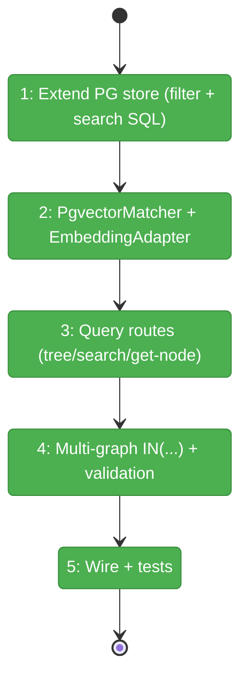
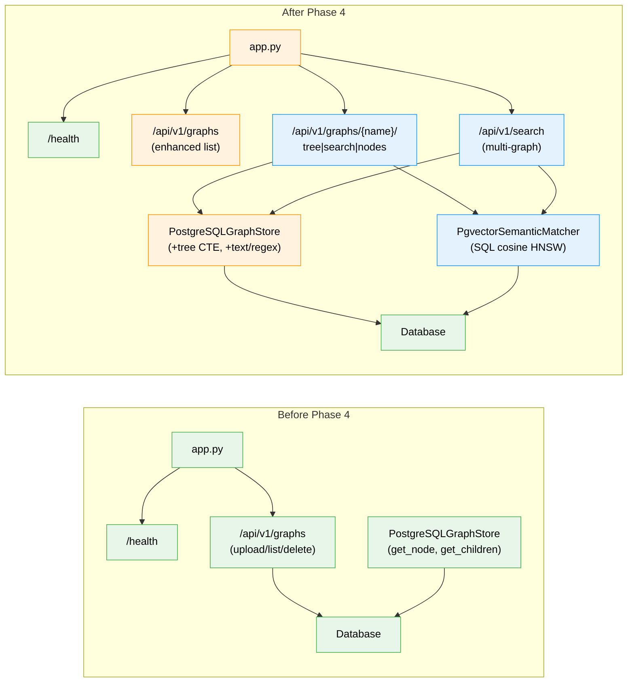

# Flight Plan: Phase 4 — Server Query API

**Plan**: [../../server-mode-plan.md](../../server-mode-plan.md)
**Phase**: Phase 4: Server Query API
**Generated**: 2026-03-06
**Status**: Landed

---

## Departure → Destination

**Where we are**: The server can receive graph pickle uploads, ingest them into PostgreSQL via COPY, and list/delete graphs. But uploaded data is write-only — there are no query endpoints. The `PostgreSQLGraphStore` has basic async methods (`get_node_async`, `get_children_async`, `get_parent_async`, `get_all_nodes_async`) but no tree CTE, no SQL search, and no vector similarity queries.

**Where we're going**: A developer can `GET /api/v1/graphs/{name}/tree`, `GET /api/v1/graphs/{name}/search`, and `GET /api/v1/graphs/{name}/nodes/{id}` and receive the same JSON output they'd get from the local `fs2` CLI. Multi-graph search across all available graphs works. Semantic search uses pgvector HNSW for sub-100ms response. Text/regex search uses trigram GIN indexes. Response format matches SearchResult/TreeNode serialization exactly.

---

## Domain Context

### Domains We're Changing

| Domain | What Changes | Key Files |
|--------|-------------|-----------|
| server | New query routes, wire into app, enhance list-graphs | `routes/query.py`, `app.py`, `routes/graphs.py` |
| search | New PgvectorSemanticMatcher (SQL-native cosine search) | `pgvector_matcher.py` |
| graph-storage | Extend PostgreSQLGraphStore with tree CTE + text/regex search | `graph_store_pg.py` |

### Domains We Depend On (no changes)

| Domain | What We Consume | Contract |
|--------|----------------|----------|
| configuration | `ServerDatabaseConfig` | Config model for DB connection |
| graph-storage (existing) | `CodeNode`, `ConnectionProvider` protocol | Data model + DB access |
| search (existing) | `SearchResult`, `SearchResultMeta`, `SearchMode`, `QuerySpec` | Output models + enum |

---

## Flight Status

<!-- Updated by /plan-6-v2: pending → active → done. Use blocked for problems/input needed. -->

**Legend**: grey = pending | yellow = active | red = blocked/needs input | green = done

---

## Stages

<!-- Updated by /plan-6-v2 during implementation: [ ] → [~] → [x] -->

- [x] **Stage 1: Extend PostgreSQLGraphStore** — Add filtered node queries and text/regex search SQL methods (`graph_store_pg.py`)
- [x] **Stage 2: Create PgvectorSemanticMatcher** — SQL cosine search using HNSW index + wire EmbeddingAdapter (`pgvector_matcher.py` — new file)
- [x] **Stage 3: Create query routes** — Tree (reuse TreeService folder algorithm), search, get-node endpoints with format parity (`routes/query.py` — new file)
- [x] **Stage 4: Multi-graph search + model validation** — Single SQL with `IN(...)`, embedding model check, per-graph embedding availability (`routes/query.py`)
- [x] **Stage 5: Wire router + test suite** — Mount in app factory, full test coverage (`app.py`, `test_query_api.py`, `test_pgvector_matcher.py`)

---

## Architecture: Before & After

**Legend**: existing (green, unchanged) | changed (orange, modified) | new (blue, created)

---

## Acceptance Criteria

- [x] AC6: Remote tree matches local tree (pattern filtering, depth limits)
- [x] AC7: Remote search (text/regex/semantic/auto) returns scored results, multi-graph works
- [x] AC8: Remote get-node returns all CodeNode fields
- [x] AC9: List-graphs shows all accessible graphs with metadata + status filter
- [x] AC10: Semantic search <100ms at 200K+ nodes via HNSW

## Goals & Non-Goals

**Goals**:
- ✅ All 4 search modes work via SQL (no in-memory get_all_nodes)
- ✅ Response JSON matches local CLI/MCP output exactly
- ✅ Multi-graph search with result attribution
- ✅ Embedding model mismatch detection

**Non-Goals**:
- ❌ CLI --remote flag (Phase 5)
- ❌ MCP remote mode (Phase 5)
- ❌ Dashboard UI (Phase 6)
- ❌ Auth on query endpoints

---

## Checklist

- [x] T001: Tree CTE + children queries in PostgreSQLGraphStore
- [x] T002: Text/regex search SQL in PostgreSQLGraphStore
- [x] T003: PgvectorSemanticMatcher (SQL cosine via HNSW)
- [x] T004: Query routes (tree, search, get-node)
- [x] T005: Multi-graph search endpoint
- [x] T006: Embedding model validation
- [x] T007: Response format parity
- [x] T008: Wire query router + enhance list-graphs
- [x] T009: Test suite
