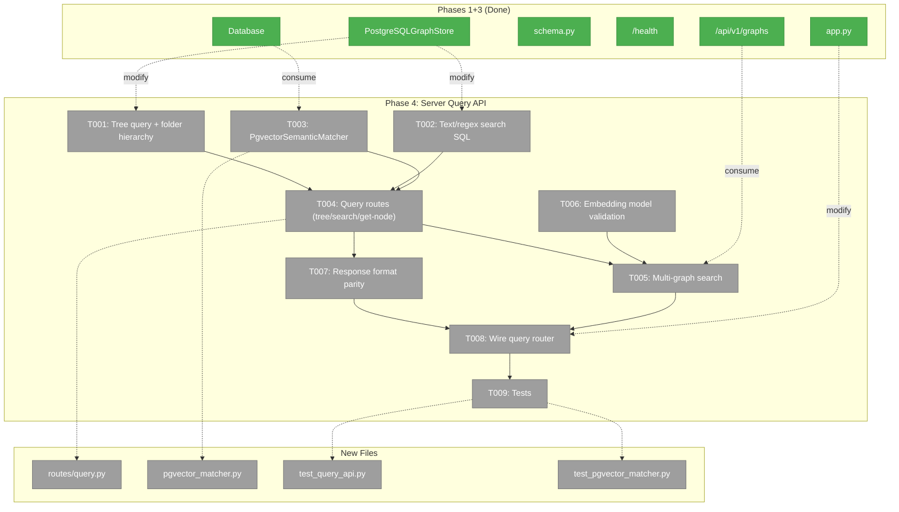
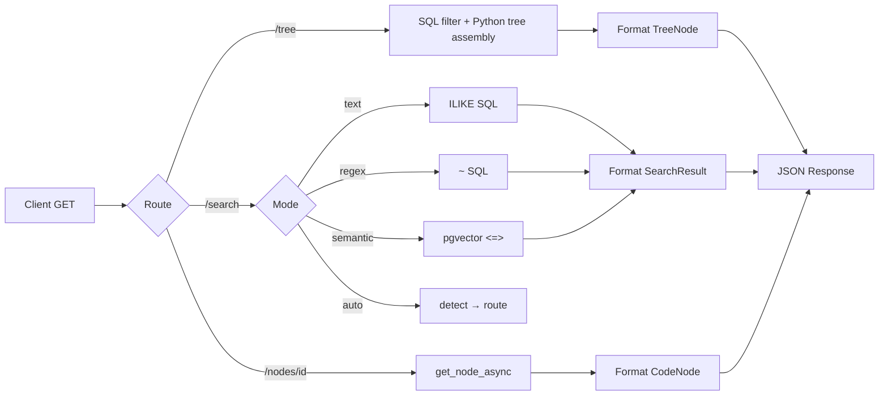
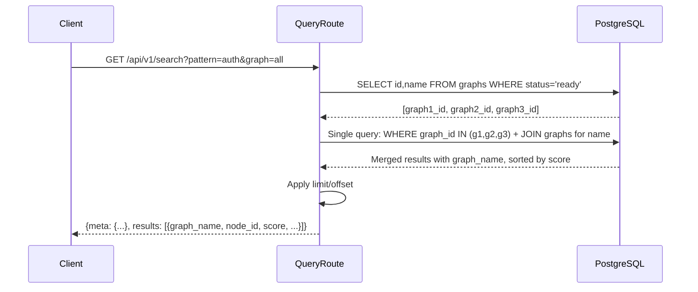

# Phase 4: Server Query API — Tasks

**Plan**: [server-mode-plan.md](../../server-mode-plan.md)
**Phase**: Phase 4: Server Query API
**Generated**: 2026-03-06
**CS**: CS-4 (large)

---

## Executive Briefing

- **Purpose**: Expose tree, search, get-node, and list-graphs as REST endpoints on the server, replacing the local in-memory approach with SQL-native queries. This is what makes the server *useful for clients* — without query endpoints, uploaded graphs are write-only.
- **What We're Building**: Four REST query endpoints (`/tree`, `/search`, `/nodes/{id}`, `/graphs`) that produce the same JSON output as local CLI commands, plus a `PgvectorSemanticMatcher` for SQL-based cosine search, SQL text/regex search via ILIKE/`~` operators, multi-graph search fanout, and embedding model validation.
- **Goals**:
  - ✅ `GET /api/v1/graphs/{name}/tree` returns same output as `fs2 tree`
  - ✅ `GET /api/v1/graphs/{name}/search` supports text/regex/semantic/auto modes
  - ✅ `GET /api/v1/graphs/{name}/nodes/{node_id}` returns same output as `fs2 get-node`
  - ✅ `GET /api/v1/graphs` lists all graphs with metadata (enhanced from Phase 3)
  - ✅ Multi-graph search across 1, N, or all graphs
  - ✅ Semantic search <100ms at 200K+ nodes (pgvector HNSW)
  - ✅ Embedding model mismatch validation before semantic search
  - ✅ Response format parity with existing CLI/MCP output
- **Non-Goals**:
  - ❌ Remote CLI integration (Phase 5 — this phase builds the API that CLI will consume)
  - ❌ MCP remote mode (Phase 5)
  - ❌ Dashboard UI (Phase 6)
  - ❌ Authentication (deferred)
  - ❌ Modifying the existing local SearchService — server uses SQL-native queries

---

## Prior Phase Context

### Phase 1: Server Skeleton + Database (Done ✅)

**A. Deliverables**:
- `src/fs2/server/app.py` — FastAPI app factory with lifespan (startup: pool + schema)
- `src/fs2/server/database.py` — `Database` class (async pool, server-domain **contract**)
- `src/fs2/server/schema.py` — `create_schema()` with 6 tables, 17 indexes, 3 extensions
- `src/fs2/server/routes/health.py` — `GET /health`
- `src/fs2/config/objects.py` — `ServerDatabaseConfig`, `ServerStorageConfig`
- `docker-compose.yml` + `Dockerfile` — FastAPI + PostgreSQL + Redis
- `tests/server/` — 16 tests passing

**B. Dependencies Exported**:
- `Database.connection()` — async context manager for DB access
- `create_app(db_config, database)` — DI for testing
- `ServerDatabaseConfig.conninfo` — connection string builder
- Schema DDL with 6 tables (tenants, graphs, code_nodes, node_edges, embedding_chunks, ingestion_jobs)
- `FakeDatabase` pattern from test_health.py

**C. Gotchas & Debt**:
- Schema uses `IF NOT EXISTS` on every startup (no Alembic yet)
- pgvector pool `configure` callback required for every new connection
- No `tenant_id` on data tables — only on `graphs` table for grouping

**D. Incomplete Items**: None.

**E. Patterns to Follow**:
- FastAPI app factory with DI params for testing
- `Database` class as server-domain contract
- `FakeDatabase` with `connection()` override
- Append to `SCHEMA_SQL` for new tables (idempotent IF NOT EXISTS)

### Phase 2: Auth (Skipped ⏭️)

Skipped — no auth on query/upload endpoints. Auth deferred to dashboard phase.

### Phase 3: Ingestion Pipeline + Graph Upload (Done ✅)

**A. Deliverables**:
- `src/fs2/server/ingestion.py` — `IngestionPipeline` class (COPY-based, TDD-testable, sync in-process)
- `src/fs2/server/routes/graphs.py` — Upload (`POST`), list (`GET`), status (`GET`), delete (`DELETE`)
- `src/fs2/core/repos/graph_store_pg.py` — `PostgreSQLGraphStore` + `ConnectionProvider` protocol
- `src/fs2/core/repos/pickle_security.py` — Extracted `RestrictedUnpickler`
- 28 server tests passing, 1566 total suite

**B. Dependencies Exported**:
- `PostgreSQLGraphStore(db, graph_id)` — async query methods (get_node_async, get_children_async, get_parent_async, get_all_nodes_async)
- `ConnectionProvider` protocol — decouples graph-storage from server.Database
- `_NODE_COLUMNS` constant — 25-column SELECT list for code_nodes
- `_row_to_code_node()` — reconstruct CodeNode from DB row
- `_group_embeddings()` — group embedding chunks by node_id/type
- `IngestionPipeline.ingest()` — upload→ingest flow
- `list_graphs` endpoint at `GET /api/v1/graphs`

**C. Gotchas & Debt**:
- PostgreSQLGraphStore sync methods raise `NotImplementedError` — must use `*_async()` methods
- `get_all_nodes_async()` loads ALL nodes for a graph — not suitable for search at 500K scale (Finding 02)
- Embedding round-trip: chunks in separate table → JOIN + re-group
- Upload endpoint uses `Form()`/`File()` annotations for multipart

**D. Incomplete Items**: None.

**E. Patterns to Follow**:
- `ConnectionProvider` protocol for DB access in graph-storage domain
- `_row_to_code_node()` for CodeNode reconstruction
- Streaming upload with size limit enforcement
- Sync in-process pipeline (no background tasks)

---

## Pre-Implementation Check

| File | Exists? | Domain Check | Notes |
|------|---------|-------------|-------|
| `src/fs2/server/routes/query.py` | ❌ Create | server ✅ | Tree, search, get-node query endpoints |
| `src/fs2/core/services/search/pgvector_matcher.py` | ❌ Create | search ✅ | PgvectorSemanticMatcher — SQL cosine search |
| `src/fs2/core/repos/graph_store_pg.py` | ✅ Modify | graph-storage ✅ | Add tree CTE query, text/regex search methods |
| `src/fs2/server/routes/graphs.py` | ✅ Modify | server ✅ | Enhance list_graphs with embedding_model filter |
| `src/fs2/server/app.py` | ✅ Modify | server ✅ | Mount query router |
| `tests/server/test_query_api.py` | ❌ Create | server ✅ | Query endpoint tests |
| `tests/server/test_pgvector_matcher.py` | ❌ Create | search ✅ | PgvectorSemanticMatcher unit tests |
| `tests/server/test_graph_store_pg.py` | ✅ Modify | graph-storage ✅ | Add tree/search method tests |

**Concept duplication check**: SearchService + TextMatcher + RegexMatcher exist locally for in-memory search. Server-side search uses SQL-native queries instead — no duplication, different approach. `PgvectorSemanticMatcher` is new — searches `embedding_chunks` table via SQL cosine similarity, not in-memory cosine. The local SemanticMatcher iterates Python lists; PgvectorSemanticMatcher queries pgvector HNSW index. Clean to proceed.

---

## Architecture Map



---

## Tasks

| Status | ID | Task | Domain | Path(s) | Done When | Notes |
|--------|-----|------|--------|---------|-----------|-------|
| [x] | T001 | Add tree query methods to PostgreSQLGraphStore: SQL-filtered node fetch + reuse TreeService folder hierarchy algorithm | graph-storage | `/Users/jordanknight/substrate/fs2/028-server-mode/src/fs2/core/repos/graph_store_pg.py` | `get_filtered_nodes_async(pattern)` returns nodes filtered by pattern; `get_file_nodes_async()` returns all file-category nodes. Tree assembly reuses TreeService algorithm in Python. | **DYK #3**: Do NOT use `WITH RECURSIVE` CTE for folder hierarchy — folders are *virtual*, derived from `node_id` path strings (not `node_edges`). TreeService already has `_compute_folder_hierarchy()` + `_build_folder_tree_nodes()` that split paths at `/`. Reuse same algorithm. SQL role: (1) fetch filtered nodes via `ILIKE`/`~`/exact, (2) fetch children via `node_edges` for AST expansion. Pattern modes: `.` → all file nodes for folder tree, `file:...` → exact node_id, `/` suffix → folder prefix filter, else → substring/glob. |
| [x] | T002 | Add text/regex search methods to PostgreSQLGraphStore: SQL ILIKE/`~` with trigram indexes | graph-storage | `/Users/jordanknight/substrate/fs2/028-server-mode/src/fs2/core/repos/graph_store_pg.py` | `search_text_async(pattern, limit, offset)` and `search_regex_async(pattern, limit, offset)` return list[SearchResult]-compatible dicts. Uses trigram GIN indexes. | **Workshop D5**: Text search → `ILIKE '%pattern%'` on content, node_id, smart_content. Regex → `~` operator with same columns. Score: text match priority (node_id match > smart_content > content). Uses `idx_nodes_content_trgm`, `idx_nodes_nodeid_trgm`, `idx_nodes_smart_trgm`. Return same fields as SearchResult.to_dict(). Include `include`/`exclude` as SQL WHERE node_id filter. |
| [x] | T003 | Create PgvectorSemanticMatcher: SQL cosine query against embedding_chunks HNSW index | search | `/Users/jordanknight/substrate/fs2/028-server-mode/src/fs2/core/services/search/pgvector_matcher.py` | `match_async(query_vector, graph_ids, limit, min_similarity)` returns list[SearchResult]-compatible dicts. Sub-100ms at 200K nodes using HNSW index. | **Finding 02, AC10**: Query: `SELECT ... FROM embedding_chunks ORDER BY embedding <=> %s LIMIT %s` with HNSW. Join `code_nodes` for node metadata. Filter `1 - (embedding <=> query_vector) >= min_similarity`. Takes `ConnectionProvider` via DI (not Database). Must handle both `content` and `smart_content` embedding types. Return best chunk match per node. Accepts `graph_ids: list[str]` for multi-graph via `WHERE graph_id IN (...)`. **DYK #1**: Wire existing `EmbeddingAdapter` (Azure/OpenAI) from fs2 config for text-mode `query` param. Instantiate in app factory via `ConfigurationService`. BYO `query_vector` bypasses embedding entirely. |
| [x] | T004 | Create query routes: GET tree, GET search, GET get-node | server | `/Users/jordanknight/substrate/fs2/028-server-mode/src/fs2/server/routes/query.py` | All 3 endpoints respond with JSON matching local CLI output format. Tree: `GET /api/v1/graphs/{name}/tree?pattern=.&max_depth=0`. Search: `GET /api/v1/graphs/{name}/search?pattern=...&mode=auto&limit=20&offset=0&detail=min`. Get-node: `GET /api/v1/graphs/{name}/nodes/{node_id:path}`. | **AC6, AC7, AC8**: Graph resolved by name (not UUID) — lookup `graphs` table by name. 404 if graph not found or not `status='ready'`. Search mode defaults to `auto` — route to text/regex/semantic SQL methods based on mode (or auto-detect). Get-node uses `PostgreSQLGraphStore.get_node_async()`. Node IDs contain `/` and `:` — use `{node_id:path}` FastAPI path param. **DYK #4**: Get-node response must include `children_count` (via subquery `SELECT COUNT(*) FROM node_edges`) for parity with local. **DYK #5**: Auto-mode must check per-graph embedding availability via `SELECT EXISTS(SELECT 1 FROM embedding_chunks WHERE graph_id = %s LIMIT 1)` before routing to semantic. No-embedding graphs fall back to TEXT. |
| [x] | T005 | Multi-graph search: single SQL query across 1, N, or all graphs via `graph` query param | server | `/Users/jordanknight/substrate/fs2/028-server-mode/src/fs2/server/routes/query.py` | `GET /api/v1/search?pattern=...&graph=all` searches all ready graphs. `graph=repo1,repo2` searches specific graphs. Results merged + re-sorted by score. Each result includes `graph_name` field. | **AC7, DYK #2**: Top-level search endpoint (not under `/graphs/{name}/`). `graph` param: single name, comma-separated list, or `all` (default). **Single SQL query with `WHERE graph_id IN (...)`** — all data is in same PostgreSQL instance, no fan-out needed. JOIN `graphs` table for `graph_name` in each result. Scores are inherently comparable (cosine is absolute, ILIKE heuristics are deterministic). Per-graph weighting deferred to future (add `graphs.search_weight` column later). |
| [x] | T006 | Embedding model validation: reject semantic search if query model ≠ stored graph model | server | `/Users/jordanknight/substrate/fs2/028-server-mode/src/fs2/server/routes/query.py` | Semantic search against graph with `embedding_model='text-embedding-3-small'` succeeds. Semantic search with mismatched model returns 422 with clear error. | **Finding R4**: Before semantic search, check `graphs.embedding_model` matches the query's model (sent via `model` query param or server default). If mismatch, return 422: "Graph '{name}' uses model '{stored}' but query uses '{requested}'. Embeddings are incompatible." BYO vector mode skips validation (client is responsible). |
| [x] | T007 | Response format parity: ensure JSON output matches local CLI/MCP format for tree, search, get-node | server | `/Users/jordanknight/substrate/fs2/028-server-mode/src/fs2/server/routes/query.py` | Tree response matches TreeNode-to-dict shape. Search response matches SearchResult.to_dict() + SearchResultMeta.to_dict() envelope. Get-node response matches CodeNode field set. | **Plan risk**: Comparison tests required. Tree: recursive `{node_id, name, category, start_line, end_line, children: [...], hidden_children_count}`. Search: `{meta: {total, showing, pagination, folders}, results: [{node_id, score, snippet, ...}]}`. Get-node: all 25+ CodeNode fields + embedding info. Use `detail` query param for min/max on search. |
| [x] | T008 | Wire query router into `create_app()` + enhance list-graphs | server | `/Users/jordanknight/substrate/fs2/028-server-mode/src/fs2/server/app.py`, `/Users/jordanknight/substrate/fs2/028-server-mode/src/fs2/server/routes/graphs.py` | Query routes accessible at `/api/v1/graphs/{name}/tree|search|nodes/*`. List-graphs enhanced with `embedding_model` filter param. | Mount `query_router` in app factory. Enhance `GET /api/v1/graphs` with optional `?status=ready` filter for query-eligible graphs (AC9). |
| [x] | T009 | Create test suite: query endpoints, PgvectorSemanticMatcher, format parity, multi-graph | server, search, graph-storage | `/Users/jordanknight/substrate/fs2/028-server-mode/tests/server/test_query_api.py`, `/Users/jordanknight/substrate/fs2/028-server-mode/tests/server/test_pgvector_matcher.py`, `/Users/jordanknight/substrate/fs2/028-server-mode/tests/server/test_graph_store_pg.py` | `pytest tests/server/ -m "not slow"` passes including new tests | **Fakes over mocks** (project convention). Tests: (1) tree endpoint returns valid shape + respects pattern/depth, (2) search routes correctly per mode, (3) get-node returns full CodeNode, (4) multi-graph merge + sort, (5) 404 for unknown graph, (6) embedding model mismatch 422, (7) PgvectorSemanticMatcher returns scored results, (8) format parity spot-checks vs SearchResult.to_dict() shape. Mark PostgreSQL integration tests `@pytest.mark.slow`. |

---

## Context Brief

### Key Findings from Plan

- **Finding 01** (Critical): GraphStore.save()/load() are file-oriented. PostgreSQLGraphStore query methods work directly against DB — `get_node_async()` already implemented in Phase 3. Action: Extend with `tree_async()`, `search_text_async()`, `search_regex_async()`.
- **Finding 02** (High): SearchService loads ALL nodes into memory via `get_all_nodes()` — not viable at 500K nodes (~2.5GB). Action: Server uses SQL-native search. `PgvectorSemanticMatcher` queries pgvector HNSW index directly. Text/regex search uses SQL `ILIKE`/`~` with trigram GIN indexes. **Never call `get_all_nodes_async()` for search.**
- **Workshop D5**: Trigram GIN indexes on `content`, `node_id`, `smart_content` columns enable fast ILIKE/regex queries. Already created in Phase 1 schema.
- **Finding R4**: Embedding model mismatch between query and stored graph produces garbage results. Must validate before semantic search.

### Domain Dependencies

- `server.Database` (`src/fs2/server/database.py:Database`): Async connection pool — query routes and PgvectorSemanticMatcher use `db.connection()` for all SQL
- `graph-storage.PostgreSQLGraphStore` (`src/fs2/core/repos/graph_store_pg.py`): Existing async query methods — extend with tree/search
- `graph-storage.ConnectionProvider` protocol: Decouples PgvectorSemanticMatcher from server.Database
- `graph-storage.CodeNode` (`src/fs2/core/models/code_node.py`): Data model for all node responses
- `search.SearchResult` (`src/fs2/core/models/search/search_result.py`): Output model for search responses — use `to_dict(detail)` shape
- `search.SearchResultMeta` (`src/fs2/core/models/search/search_result_meta.py`): Envelope metadata for search responses
- `search.SearchMode` (`src/fs2/core/models/search/search_mode.py`): TEXT/REGEX/SEMANTIC/AUTO enum — reuse for mode routing
- `search.QuerySpec` (`src/fs2/core/models/search/query_spec.py`): Validation rules for pattern/limit/offset — replicate server-side

### Domain Constraints

- **server** domain owns: query routes (`routes/query.py`), app wiring, response formatting
- **search** domain owns: PgvectorSemanticMatcher (new SQL-native matcher alongside existing in-memory matchers)
- **graph-storage** domain owns: PostgreSQLGraphStore extensions (tree CTE, text/regex search methods)
- PgvectorSemanticMatcher takes `ConnectionProvider` via DI — does NOT import from `server.Database` (same pattern as PostgreSQLGraphStore)
- Query routes create `PostgreSQLGraphStore` instances per request — inject `Database` from `request.app.state.db`
- **Import direction**: server → graph-storage ✅, server → search ✅. Never reverse.
- Search SQL must produce output that matches `SearchResult.to_dict()` field structure — no new models, reuse existing

### Auto-Mode Detection (Server-Side)

The local `SearchService._detect_mode()` uses regex metacharacter heuristics. Replicate server-side:
- Pattern contains `*`, `?`, `[`, `]`, `^`, `$`, `|`, `(`, `)` → REGEX mode
- Pattern is natural language (no metacharacters) → SEMANTIC (if graph has embeddings) or TEXT fallback
- This logic lives in the query route, not in PgvectorSemanticMatcher

### Gotchas

- **Node IDs contain `/` and `:`**: e.g., `file:src/fs2/cli/main.py`, `class:src/fs2/core/models/code_node.py:CodeNode`. FastAPI path params need `{node_id:path}` to capture the full ID including slashes.
- **Tree CTE depth**: `WITH RECURSIVE` must limit depth to avoid infinite loops (though the graph is a DAG). Use `depth` counter in CTE.
- **Search score calculation**: SQL has no built-in "search score" for ILIKE. Assign heuristic scores: node_id match → 0.9, smart_content match → 0.7, content match → 0.5. Combine if multiple fields match (max).
- **pgvector cosine distance**: pgvector uses `<=>` operator which returns *distance* (0 = identical). Convert to similarity: `1 - (embedding <=> query_vector)`.
- **Multi-graph result merging**: Results from different graphs may have different score distributions. Simple merge-sort by score is sufficient for v1.
- **BYO embeddings**: Search endpoint accepts either `query` (text, server embeds) or `query_vector` (pre-embedded list[float]). BYO mode skips model validation.

### Reusable from Prior Phases

- `PostgreSQLGraphStore._row_to_code_node()` — reconstruct CodeNode from DB row
- `PostgreSQLGraphStore._NODE_COLUMNS` — 25-column SELECT constant
- `PostgreSQLGraphStore._group_embeddings()` — embedding chunk grouping
- `Database.connection()` — async context manager for all SQL
- `create_app(database=fake_db)` DI pattern for test apps
- `FakeDatabase` pattern from test files
- `httpx.AsyncClient` + `ASGITransport` for endpoint testing
- `SearchResult.to_dict(detail)` — reference for response format
- `SearchResultMeta.to_dict()` — reference for envelope format

### Search SQL Patterns (from Workshop 001 + Prototype)

```sql
-- Text search (ILIKE with trigram index)
SELECT node_id, category, ... FROM code_nodes
WHERE graph_id = %s
AND (node_id ILIKE %s OR content ILIKE %s OR smart_content ILIKE %s)
ORDER BY ... LIMIT %s OFFSET %s;

-- Regex search (~ operator with trigram index)
SELECT node_id, category, ... FROM code_nodes
WHERE graph_id = %s
AND (node_id ~ %s OR content ~ %s OR smart_content ~ %s)
ORDER BY ... LIMIT %s OFFSET %s;

-- Semantic search (pgvector cosine) — single or multi-graph
SELECT ec.node_id, ec.embedding_type, ec.chunk_index,
       1 - (ec.embedding <=> %s::vector) AS similarity,
       g.name AS graph_name, cn.*
FROM embedding_chunks ec
JOIN code_nodes cn ON ec.graph_id = cn.graph_id AND ec.node_id = cn.node_id
JOIN graphs g ON ec.graph_id = g.id
WHERE ec.graph_id IN (%s, %s, ...)  -- single query for multi-graph
AND 1 - (ec.embedding <=> %s::vector) >= %s
ORDER BY ec.embedding <=> %s::vector
LIMIT %s;

-- Tree: fetch filtered nodes (SQL does filtering, Python assembles tree)
-- Folder tree (pattern='.', max_depth>0): fetch all file-level nodes
SELECT {NODE_COLUMNS} FROM code_nodes
WHERE graph_id = %s AND node_id LIKE 'file:%%';

-- Pattern tree: filter by pattern
SELECT {NODE_COLUMNS} FROM code_nodes
WHERE graph_id = %s AND node_id ILIKE %s;

-- Children expansion (for AST tree building)
SELECT {NODE_COLUMNS} FROM code_nodes cn
JOIN node_edges ne ON cn.graph_id = ne.graph_id AND cn.node_id = ne.child_node_id
WHERE ne.graph_id = %s AND ne.parent_node_id = %s;

-- Get-node with children_count
SELECT {NODE_COLUMNS},
    (SELECT COUNT(*) FROM node_edges ne WHERE ne.graph_id = cn.graph_id AND ne.parent_node_id = cn.node_id) AS children_count
FROM code_nodes cn
WHERE cn.graph_id = %s AND cn.node_id = %s;

-- Per-graph embedding availability check (for auto-mode)
SELECT EXISTS(SELECT 1 FROM embedding_chunks WHERE graph_id = %s LIMIT 1);
```

### Mermaid Flow (Query Request)



### Mermaid Sequence (Multi-Graph Search)



---

## Discoveries & Learnings

_Populated during implementation by plan-6._

| Date | Task | Type | Discovery | Resolution | References |
|------|------|------|-----------|------------|------------|

**Types**: `gotcha` | `research-needed` | `unexpected-behavior` | `workaround` | `decision` | `debt` | `insight`

---

## Directory Layout

```
docs/plans/028-server-mode/
  ├── server-mode-plan.md
  ├── server-mode-spec.md
  ├── workshops/
  │   ├── 001-database-schema.md
  │   ├── 002-prototype-validation.md
  │   └── 003-remotes-cli-mcp.md
  ├── tasks/
  │   ├── phase-1-server-skeleton-database/  (done)
  │   ├── phase-2-auth/  (skipped)
  │   ├── phase-3-ingestion-pipeline/  (done)
  │   └── phase-4-server-query-api/
  │       ├── tasks.md              ← you are here
  │       ├── tasks.fltplan.md      ← flight plan
  │       └── execution.log.md      # created by plan-6
  └── reviews/
```

---

## Critical Insights (2026-03-06)

| # | Insight | Decision |
|---|---------|----------|
| 1 | Server needs EmbeddingAdapter for text-mode semantic `query` param — but all infrastructure already exists (AzureEmbeddingAdapter, OpenAICompatibleEmbeddingAdapter, EmbeddingConfig) | **Wire existing EmbeddingAdapter** from fs2 ConfigurationService. Instantiate in app factory, pass to query route. BYO `query_vector` bypasses embedding entirely. Trivial wiring, no new deps. |
| 2 | Multi-graph search described as N fan-out queries — wasteful when all data is in same PostgreSQL | **Single SQL query with `WHERE graph_id IN (...)`** + JOIN `graphs` for `graph_name`. Scores are inherently comparable (cosine is absolute, ILIKE heuristics deterministic). Per-graph weighting deferred (future `graphs.search_weight` column). |
| 3 | Tree folder hierarchy is *virtual* — `_compute_folder_hierarchy()` splits `node_id` paths at `/`, creates synthetic folder CodeNodes. Not in `node_edges`. CTE won't work for folders. | **Reuse TreeService algorithm** in Python. SQL fetches filtered nodes, Python assembles folder tree using same path-splitting logic. CTE only useful for AST parent→child expansion (but `get_children_async()` already exists). |
| 4 | `get_node_async()` returns flat CodeNode but local `fs2 get-node` includes children context | **Add `children_count`** via subquery `SELECT COUNT(*) FROM node_edges WHERE parent_node_id = %s` in get-node endpoint for parity. |
| 5 | Auto-mode falls back TEXT→SEMANTIC based on whether nodes have embeddings — but different graphs may have different embedding status | **Per-graph embedding availability check**: `SELECT EXISTS(SELECT 1 FROM embedding_chunks WHERE graph_id = %s LIMIT 1)` before routing to semantic. No-embedding graphs fall back to TEXT. |

Action items: All captured in task updates above.
