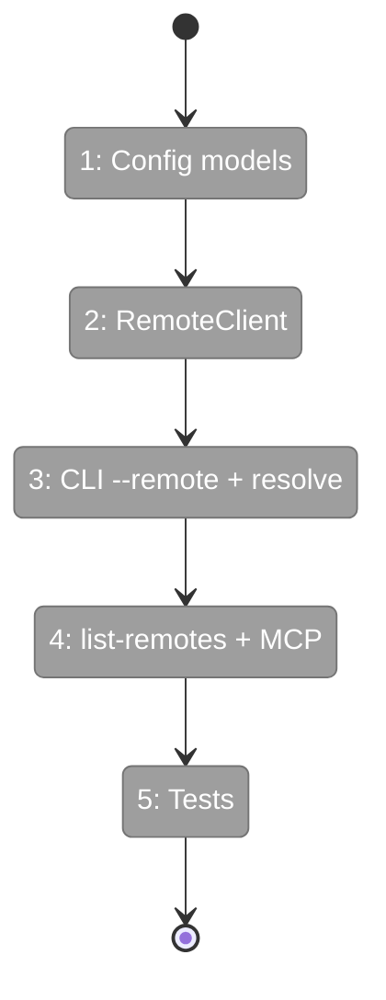
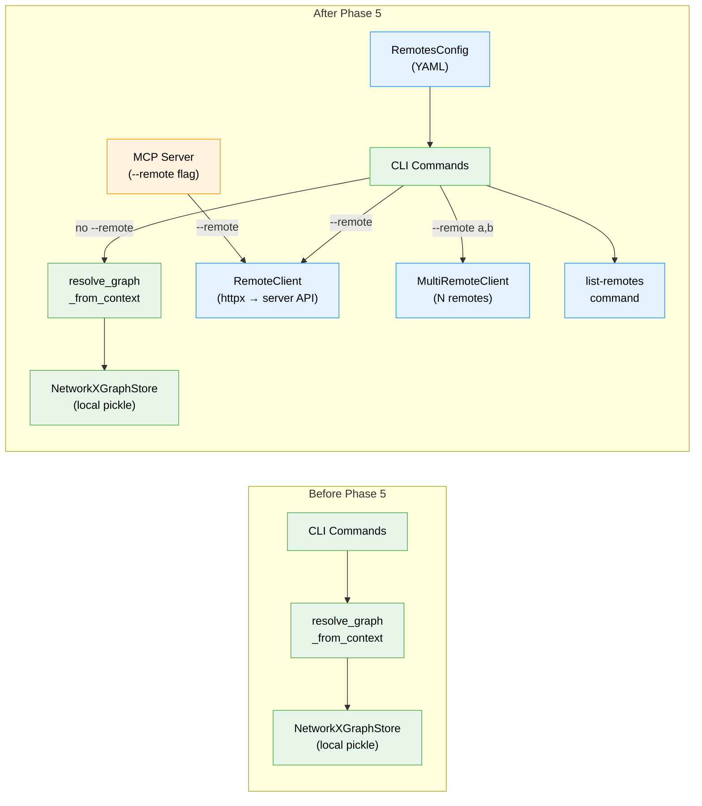

# Flight Plan: Phase 5 — Remote CLI + MCP Bridge

**Plan**: [../../server-mode-plan.md](../../server-mode-plan.md)
**Phase**: Phase 5: Remote CLI + MCP Bridge
**Generated**: 2026-03-06
**Status**: Landed

---

## Departure → Destination

**Where we are**: The server has full query API endpoints (tree, search, get-node, multi-graph search) built in Phases 1-4, but they're only accessible via raw HTTP. The `fs2` CLI and MCP tools only work with local graph files. There's no way for a developer to `fs2 tree --remote work` to query a remote server.

**Where we're going**: A developer can `fs2 tree --remote work --graph api-gateway "Calculator"` and get the exact same output as local `fs2 tree`. Multi-remote search (`--remote work,oss`) fans out across servers. MCP agents can `fs2 mcp --remote work` for AI-powered remote code intelligence. Named remotes are configured in YAML, inline URLs work for ad-hoc use.

---

## Domain Context

### Domains We're Changing

| Domain | What Changes | Key Files |
|--------|-------------|-----------|
| configuration | Add `RemoteServer` + `RemotesConfig` models | `config/objects.py` |
| cli-presentation | `--remote` flag, `CLIContext.remote`, `RemoteClient`/`MultiRemoteClient`, remote branches in all 4 commands, `list-remotes` command, MCP remote mode | `cli/main.py`, `cli/utils.py`, `cli/remote_client.py`, `cli/list_remotes.py`, `cli/tree.py`, `cli/search.py`, `cli/get_node.py`, `cli/list_graphs.py`, `mcp/server.py` |

### Domains We Depend On (no changes)

| Domain | What We Consume | Contract |
|--------|----------------|----------|
| server (Phase 4) | REST query API endpoints | `GET /api/v1/graphs/*/tree\|search\|nodes/*` |
| graph-storage | **NOT modified** — DYK #1 showed GraphStore swap doesn't work | CLI uses RemoteClient instead |

---

## Flight Status

**Legend**: grey = pending | yellow = active | red = blocked/needs input | green = done

---

## Stages

- [x] **Stage 1: Config + CLI flag** — Add `RemotesConfig` model and `--remote` flag to CLIContext (`config/objects.py`, `cli/main.py`)
- [x] **Stage 2: RemoteClient** — HTTP client returning raw server JSON with error handling (`cli/remote_client.py` — new file)
- [x] **Stage 3: Remote branches** — `resolve_remote_client()` helper + `if remote_client:` branches in tree/search/get-node/list-graphs (`cli/utils.py`, `cli/*.py`)
- [ ] **Stage 4: Commands + MCP** — `list-remotes` command, MCP `--remote` flag, multi-remote support (`cli/list_remotes.py`, `mcp/server.py`)
- [ ] **Stage 5: Tests** — RemoteClient, resolve_remotes, list-remotes, CLI branches, error handling (`tests/`)

---

## Architecture: Before & After

**Legend**: existing (green, unchanged) | changed (orange, modified) | new (blue, created)

---

## Acceptance Criteria

- [ ] AC11: `--remote` / `FS2_REMOTE` transparently routes all commands
- [ ] AC12: MCP remote mode works (`fs2 mcp --remote work`)
- [ ] AC13: MCP response format identical to local mode
- [ ] AC6 (revalidated): Remote tree matches local tree
- [ ] AC7 (revalidated): Remote search matches local search
- [ ] AC8 (revalidated): Remote get-node matches local
- [ ] AC9 (revalidated): Remote list-graphs works

## Goals & Non-Goals

**Goals**:
- ✅ Named remotes like git (`work`, `oss`) + inline URL support
- ✅ Multi-remote search with partial failure tolerance
- ✅ MCP remote mode for AI agent access
- ✅ Actionable error messages for all network failures

**Non-Goals**:
- ❌ `fs2 remote add/remove` commands
- ❌ Client-side caching
- ❌ Auth on server endpoints
- ❌ Graph upload from CLI

---

## Checklist

- [x] T001: RemoteServer + RemotesConfig models
- [x] T002: --remote flag + CLIContext
- [x] T003: RemoteClient (httpx → raw JSON)
- [x] T004: resolve_remote_client + CLI branches
- [ ] T005: list-remotes command
- [ ] T006: MultiRemoteClient + resolve_remotes
- [ ] T007: MCP --remote flag
- [ ] T008: Error handling
- [ ] T009: Test suite
