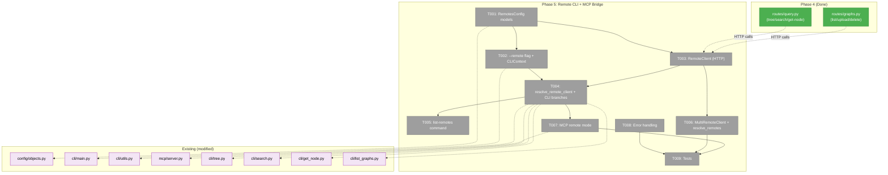
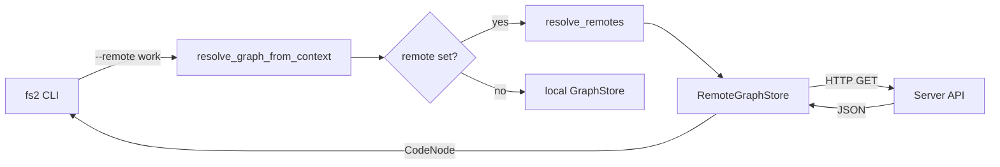
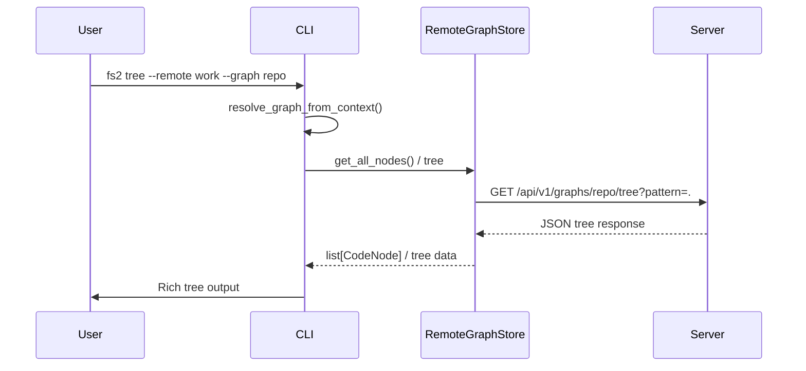

# Phase 5: Remote CLI + MCP Bridge — Tasks

**Plan**: [server-mode-plan.md](../../server-mode-plan.md)
**Phase**: Phase 5: Remote CLI + MCP Bridge
**Generated**: 2026-03-06
**CS**: CS-3 (medium)

---

## Executive Briefing

- **Purpose**: Enable the `fs2` CLI and MCP server to transparently query remote servers — the bridge between the server (Phases 1-4) and the user's local toolchain. Without this, uploaded graphs are only accessible via raw HTTP; with it, `fs2 tree --remote work` feels exactly like local usage.
- **What We're Building**: Named remotes config (`RemotesConfig` + `RemoteServer` Pydantic models), a `--remote` global CLI flag, `RemoteGraphStore` (sync httpx client implementing GraphStore), `MultiRemoteGraphStore` for multi-remote fan-out, modified `resolve_graph_from_context()` for remote switching, a `list-remotes` command, MCP remote mode (`fs2 mcp --remote work`), and error handling for network failures.
- **Goals**:
  - ✅ `fs2 tree --remote work --graph repo-name` returns same output as local tree
  - ✅ `fs2 search --remote work "pattern"` works across all graphs on remote
  - ✅ `fs2 search --remote work,oss "pattern"` searches multiple remotes
  - ✅ `fs2 search --remote http://localhost:8000 "pattern"` works with inline URLs
  - ✅ `fs2 list-remotes` shows configured remotes
  - ✅ `fs2 list-graphs --remote work` lists remote graphs
  - ✅ `fs2 mcp --remote work` starts MCP server backed by remote
  - ✅ Network errors produce actionable CLI messages
- **Non-Goals**:
  - ❌ Dashboard UI (Phase 6)
  - ❌ Authentication on server endpoints (deferred)
  - ❌ Graph upload from CLI (use REST API / dashboard)
  - ❌ Client-side response caching (future optimization)
  - ❌ `fs2 remote add/remove` commands (config file editing is fine for v1)

---

## Prior Phase Context

### Phase 1: Server Skeleton + Database (Done ✅)

**A. Deliverables**: FastAPI app factory, Database class, schema DDL (6 tables), health endpoint, Docker Compose, ServerDatabaseConfig/ServerStorageConfig.
**B. Dependencies Exported**: `Database.connection()`, `create_app()`, `ServerDatabaseConfig.conninfo`.
**C. Gotchas**: IF NOT EXISTS schema (no Alembic), pgvector pool configure callback.
**D. Incomplete Items**: None.
**E. Patterns**: App factory with DI, FakeDatabase test pattern.

### Phase 3: Ingestion Pipeline + Graph Upload (Done ✅)

**A. Deliverables**: IngestionPipeline, upload/list/status/delete endpoints, PostgreSQLGraphStore, pickle_security.py.
**B. Dependencies Exported**: `PostgreSQLGraphStore`, `ConnectionProvider` protocol, `IngestionPipeline.ingest()`, list-graphs endpoint.
**C. Gotchas**: Sync methods raise NotImplementedError, `get_all_nodes_async()` too heavy for search.
**D. Incomplete Items**: None.
**E. Patterns**: `ConnectionProvider` protocol for DB decoupling, Form()/File() for multipart.

### Phase 4: Server Query API (Done ✅)

**A. Deliverables**:
- `src/fs2/server/routes/query.py` — tree, search, get-node, multi-graph search endpoints
- `src/fs2/core/services/search/pgvector_matcher.py` — PgvectorSemanticMatcher (public contract)
- Extended `PostgreSQLGraphStore` — filtered nodes, text/regex SQL, children count, embeddings check
- Enhanced `list_graphs` with `?status=` filter

**B. Dependencies Exported (consumed by Phase 5)**:
- `GET /api/v1/graphs` — list all graphs (RemoteGraphStore calls this for `list-graphs --remote`)
- `GET /api/v1/graphs/{name}/tree?pattern=&max_depth=` — tree query (RemoteGraphStore calls this)
- `GET /api/v1/graphs/{name}/search?pattern=&mode=&limit=&offset=&detail=` — single-graph search
- `GET /api/v1/search?pattern=&graph=all&mode=&limit=` — multi-graph search
- `GET /api/v1/graphs/{name}/nodes/{node_id}` — get-node with children_count
- Response JSON shapes: SearchResult envelope (`meta` + `results`), TreeNode shape, CodeNode detail levels

**C. Gotchas**:
- Node IDs contain `/` and `:` — FastAPI uses `{node_id:path}` param. httpx client must URL-encode properly.
- Search auto-mode on server checks per-graph embedding availability — client can just send `mode=auto`.
- Semantic search returns 503 when no adapter, 422 on model mismatch — client must handle both.
- Multi-graph search is a separate endpoint (`/api/v1/search`) vs single-graph (`/api/v1/graphs/{name}/search`).

**D. Incomplete Items**: None.

**E. Patterns**: Single SQL `IN(...)` for multi-graph, embedding model validation, ConnectionProvider protocol.

---

## Pre-Implementation Check

| File | Exists? | Domain Check | Notes |
|------|---------|-------------|-------|
| `src/fs2/config/objects.py` | ✅ Modify | configuration ✅ | Add `RemoteServer`, `RemotesConfig` models |
| `src/fs2/cli/main.py` | ✅ Modify | cli-presentation ✅ | Add `--remote` global flag to CLIContext |
| `src/fs2/cli/utils.py` | ✅ Modify | cli-presentation ✅ | Add `resolve_remote_client()` helper + `resolve_remotes()` |
| `src/fs2/cli/tree.py` | ✅ Modify | cli-presentation ✅ | Add `if remote_client:` branch |
| `src/fs2/cli/search.py` | ✅ Modify | cli-presentation ✅ | Add `if remote_client:` branch |
| `src/fs2/cli/get_node.py` | ✅ Modify | cli-presentation ✅ | Add `if remote_client:` branch |
| `src/fs2/cli/list_graphs.py` | ✅ Modify | cli-presentation ✅ | Add `if remote_client:` branch |
| `src/fs2/cli/remote_client.py` | ❌ Create | cli-presentation ✅ | RemoteClient + MultiRemoteClient (HTTP, raw JSON) |
| `src/fs2/cli/list_remotes.py` | ❌ Create | cli-presentation ✅ | New `list-remotes` command |
| `src/fs2/mcp/server.py` | ✅ Modify | cli-presentation ✅ | Add `--remote` flag to MCP startup, RemoteClient path |
| `tests/unit/cli/test_remote_client.py` | ❌ Create | cli-presentation ✅ | RemoteClient tests |
| `tests/unit/cli/test_list_remotes.py` | ❌ Create | cli-presentation ✅ | list-remotes tests |
| `tests/unit/cli/test_remote_integration.py` | ❌ Create | cli-presentation ✅ | Remote CLI branch tests |

**Concept duplication check**: No existing "remote", "RemoteClient", or named remotes config. `OtherGraphsConfig` provides similar named-items-from-config pattern (reuse that convention). **No RemoteGraphStore** — DYK #1 showed GraphStore ABC swap doesn't work for tree/search (they call `get_all_nodes()`). Clean to proceed with `RemoteClient` approach.

---

## Architecture Map



---

## Tasks

| Status | ID | Task | Domain | Path(s) | Done When | Notes |
|--------|-----|------|--------|---------|-----------|-------|
| [ ] | T001 | Add `RemoteServer` and `RemotesConfig` Pydantic models to config registry | configuration | `/Users/jordanknight/substrate/fs2/028-server-mode/src/fs2/config/objects.py` | `config.get(RemotesConfig)` returns valid config from YAML; `RemotesConfig` in `YAML_CONFIG_TYPES`. | **Workshop R5**: Path `remotes` in YAML. `RemoteServer` has `name`, `url`, `api_key`, `description`. URL must start with `http://` or `https://`. Follow `OtherGraphsConfig` pattern (list of named items). User + project configs concatenated (R6). |
| [ ] | T002 | Add `--remote` global flag to CLI main.py + extend CLIContext | cli-presentation | `/Users/jordanknight/substrate/fs2/028-server-mode/src/fs2/cli/main.py` | `fs2 tree --remote work` propagates remote value via `CLIContext.remote` to all subcommands. | **Workshop R1-R3**: Flag is `--remote` / `-r`. Also reads `FS2_REMOTE` env var. Accepts name or URL (detection: starts with `http://` = URL). Comma-separated for multi-remote (R4). CLIContext gets new `remote: str | None = None` field. |
| [ ] | T003 | Create `RemoteClient`: sync httpx client calling server REST API directly | cli-presentation | `/Users/jordanknight/substrate/fs2/028-server-mode/src/fs2/cli/remote_client.py` | `RemoteClient(url).search("auth", mode="auto")` returns raw server JSON dict. | **DYK #1/#2**: Does NOT implement GraphStore ABC. Returns raw server JSON dicts, not CodeNode objects. Methods: `tree(graph, pattern, max_depth)` → dict, `search(pattern, mode, graph, limit, ...)` → dict, `get_node(graph, node_id, detail)` → dict, `list_graphs()` → dict. Sync `httpx.Client` (R9). Takes `base_url`, `api_key`. |
| [ ] | T004 | Add `resolve_remote_client()` helper + remote branches in CLI commands | cli-presentation | `/Users/jordanknight/substrate/fs2/028-server-mode/src/fs2/cli/utils.py`, `cli/tree.py`, `cli/search.py`, `cli/get_node.py`, `cli/list_graphs.py` | All 4 commands detect `CLIContext.remote` and branch to RemoteClient path. `resolve_graph_from_context()` is NOT modified. | **DYK #4**: Don't modify `resolve_graph_from_context()`. Add `resolve_remote_client(ctx) → RemoteClient | None` helper. Each CLI command adds `if remote_client: ... else: <existing local path>`. Remote path calls RemoteClient methods → gets raw JSON → prints (or passes to Rich formatter). |
| [ ] | T005 | Create `list-remotes` CLI command | cli-presentation | `/Users/jordanknight/substrate/fs2/028-server-mode/src/fs2/cli/list_remotes.py` | `fs2 list-remotes` shows all configured remotes with name, URL, description. Supports `--json` output. | Reads `RemotesConfig` from config. Rich table output (name, URL, description). Register in `cli/main.py`. Config-only — no HTTP. |
| [ ] | T006 | Implement `MultiRemoteClient` for multi-remote fan-out + `resolve_remotes()` helper | cli-presentation | `/Users/jordanknight/substrate/fs2/028-server-mode/src/fs2/cli/remote_client.py`, `/Users/jordanknight/substrate/fs2/028-server-mode/src/fs2/cli/utils.py` | `fs2 search --remote work,oss "pattern"` searches across both remotes, merges results. Partial failure: warn + continue (R8). | **DYK #1, Workshop R4/R8**: `MultiRemoteClient` wraps N `RemoteClient` instances, fans out `search()` calls, merges result dicts, re-sorts by score. `resolve_remotes(remote_str, config)` splits by comma, looks up names or creates inline URLs. Partial failure warns on stderr, continues with successful remotes. |
| [ ] | T007 | Add `--remote` flag to MCP server startup | cli-presentation | `/Users/jordanknight/substrate/fs2/028-server-mode/src/fs2/mcp/server.py` | `fs2 mcp --remote work` starts MCP backed by remote. MCP tools return same format. | **DYK #3**: MCP tools detect remote mode → use `RemoteClient` directly, bypassing TreeService/SearchService/GraphStore entirely. `RemoteClient` returns raw JSON which MCP tools return as-is. |
| [ ] | T008 | Network error handling: actionable CLI messages for all failure modes | cli-presentation | `/Users/jordanknight/substrate/fs2/028-server-mode/src/fs2/cli/remote_client.py` | Connection refused → "Remote 'work' unreachable at URL". 404 → "Graph not found". 401 → "Auth failed". Timeout → "Request timed out". | Workshop error table. `RemoteClientError` exception with actionable messages. Include remote name and URL in all errors. |
| [ ] | T009 | Create test suite: RemoteClient, resolve_remotes, list-remotes, remote CLI branches | cli-presentation | `/Users/jordanknight/substrate/fs2/028-server-mode/tests/unit/cli/test_remote_client.py`, `tests/unit/cli/test_list_remotes.py`, `tests/unit/cli/test_remote_integration.py` | `pytest tests/unit/ -m "not slow"` passes including new tests | **Fakes over mocks** (project convention). Tests: (1) RemoteClient constructs correct URLs + returns raw dicts, (2) resolve_remotes splits comma/URL/name, (3) list-remotes output, (4) CLIContext.remote propagates, (5) error handling for connection/404/timeout, (6) MultiRemoteClient merges + sorts results. Use `httpx.MockTransport` for HTTP faking. |
| [ ] | T008 | Network error handling: actionable CLI messages for all failure modes | graph-storage | `/Users/jordanknight/substrate/fs2/028-server-mode/src/fs2/core/repos/graph_store_remote.py` | Connection refused → "Remote 'work' unreachable at URL". 404 → "Graph not found". 401 → "Auth failed". Timeout → "Request timed out". | Workshop error table. Wrap httpx exceptions in `RemoteGraphStoreError` with actionable messages. Include remote name and URL in all errors. |
| [ ] | T009 | Create test suite: RemoteGraphStore, resolve_remotes, list-remotes, remote e2e | cli-presentation, graph-storage | `/Users/jordanknight/substrate/fs2/028-server-mode/tests/unit/repos/test_graph_store_remote.py`, `/Users/jordanknight/substrate/fs2/028-server-mode/tests/unit/cli/test_list_remotes.py`, `/Users/jordanknight/substrate/fs2/028-server-mode/tests/unit/cli/test_remote_integration.py` | `pytest tests/unit/ -m "not slow"` passes including new tests | **Fakes over mocks** (project convention). Tests: (1) RemoteGraphStore constructs correct URLs, (2) resolve_remotes splits comma/URL/name, (3) list-remotes output, (4) CLIContext.remote propagates, (5) error handling for connection/404/timeout, (6) MultiRemoteGraphStore aggregates. Use `httpx.MockTransport` or `respx` for HTTP faking. |

---

## Context Brief

### Key Findings from Plan

- **Finding 06** (High): `YAML_CONFIG_TYPES` is flat list with unique `__config_path__`. Action: Register `RemotesConfig` at path `remotes`. Follow `OtherGraphsConfig` pattern.
- **Finding 07** (High): CLI `resolve_graph_from_context()` is single injection point. Action: Add `--remote` check at top. If set, create `RemoteGraphStore`. Single point of polymorphism.

### Domain Dependencies

- `configuration`: ConfigurationService (`config.get(RemotesConfig)`) — load named remotes from YAML/env
  - Entry: `src/fs2/config/service.py:ConfigurationService`
  - Pattern: `config.get(RemotesConfig)` returns None if not configured (optional config)
- `graph-storage`: GraphStore ABC — RemoteGraphStore implements this
  - Entry: `src/fs2/core/repos/graph_store.py:GraphStore`
  - Pattern: Same 10 abstract methods as NetworkXGraphStore
- `graph-storage`: CodeNode frozen dataclass — reconstructed from server JSON responses
  - Entry: `src/fs2/core/models/code_node.py:CodeNode`
- `cli-presentation`: CLIContext + main callback — extend with `remote` field
  - Entry: `src/fs2/cli/main.py:CLIContext`, `main()`
- `cli-presentation`: resolve_graph_from_context — modify for remote switching
  - Entry: `src/fs2/cli/utils.py:resolve_graph_from_context()`

### Domain Constraints

- **configuration** domain: Add `RemoteServer`, `RemotesConfig` to objects.py + YAML_CONFIG_TYPES
- **cli-presentation** domain: New `remote_client.py` (RemoteClient/MultiRemoteClient), `list_remotes.py`, modify `main.py`, `utils.py`, `tree.py`, `search.py`, `get_node.py`, `list_graphs.py`, `mcp/server.py`
- **graph-storage** domain: **NO CHANGES** — DYK #1 showed GraphStore ABC swap doesn't work for tree/search
- **Import direction**: cli-presentation → configuration ✅. RemoteClient lives in cli-presentation, NOT graph-storage.
- RemoteClient must NOT import from `server/` domain — it calls server endpoints via HTTP only

### Reusable from Prior Phases

- `OtherGraphsConfig` pattern (list of named items in YAML) — same convention for `RemotesConfig`
- `resolve_graph_from_context()` — extend, don't replace
- `FakeConfigurationService` — test helper for config injection
- MCP `dependencies.set_graph_store()` — already supports DI
- Phase 4 query API response formats — RemoteGraphStore must parse these

### Mermaid Flow (Remote Request)



### Mermaid Sequence (Remote Tree)



---

## Discoveries & Learnings

_Populated during implementation by plan-6._

| Date | Task | Type | Discovery | Resolution | References |
|------|------|------|-----------|------------|------------|

**Types**: `gotcha` | `research-needed` | `unexpected-behavior` | `workaround` | `decision` | `debt` | `insight`

---

## Directory Layout

```
docs/plans/028-server-mode/
  ├── server-mode-plan.md
  ├── server-mode-spec.md
  ├── workshops/
  │   ├── 001-database-schema.md
  │   ├── 002-prototype-validation.md
  │   └── 003-remotes-cli-mcp.md
  ├── tasks/
  │   ├── phase-1-server-skeleton-database/  (done)
  │   ├── phase-2-auth/  (skipped)
  │   ├── phase-3-ingestion-pipeline/  (done)
  │   ├── phase-4-server-query-api/  (done)
  │   └── phase-5-remote-cli-mcp-bridge/
  │       ├── tasks.md              ← you are here
  │       ├── tasks.fltplan.md      ← flight plan
  │       └── execution.log.md      # created by plan-6
  └── reviews/
```

---

## Critical Insights (2026-03-06)

| # | Insight | Decision |
|---|---------|----------|
| 1 | GraphStore ABC swap won't work for tree/search — `TreeService` and `SearchService` call `get_all_nodes()` which would download entire graph over HTTP | **`RemoteClient` class** (NOT GraphStore) with `tree()`, `search()`, `get_node()`, `list_graphs()` that call server HTTP endpoints directly. No GraphStore ABC for remote. |
| 2 | Server already returns correct JSON envelope — no need to reconstruct CodeNode/TreeNode objects | **`RemoteClient` returns raw dicts** (server JSON). CLI prints directly or passes to Rich formatter. No object reconstruction. |
| 3 | MCP tools use TreeService/SearchService internally — same `get_all_nodes()` problem | **MCP remote mode uses `RemoteClient`** too, bypasses TreeService/SearchService/GraphStore entirely. Returns raw JSON which MCP tools return as-is. |
| 4 | `resolve_graph_from_context()` can't return a GraphStore for remote — it's a different paradigm | **Don't modify `resolve_graph_from_context()`**. Add `resolve_remote_client()` helper instead. CLI commands check remote early and branch: `if remote_client: ... else: <existing local path>`. |
| 5 | `list-graphs --remote` is just a GET request — no GraphService needed | **`RemoteClient.list_graphs()`** — pure HTTP. `list-remotes` is config-only (no HTTP). |

Action items: All captured in rewritten T003, T004, T006, T007 above. graph-storage domain no longer modified in this phase.
