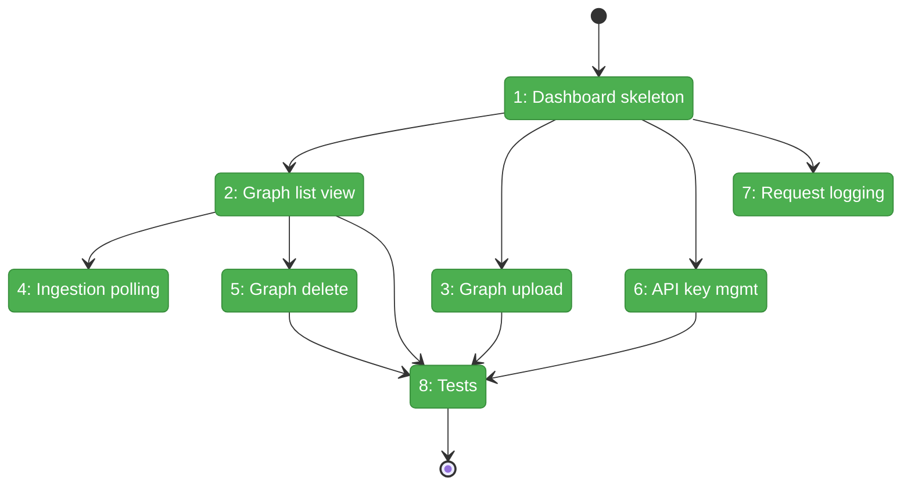

# Flight Plan: Phase 6 — Management Dashboard

**Plan**: [server-mode-plan.md](../../server-mode-plan.md)
**Phase**: Phase 6: Management Dashboard
**Generated**: 2026-03-06
**Status**: Landed

---

## Departure → Destination

**Where we are**: The fs2 server has a complete REST API (`/api/v1/`) for graph upload, ingestion, querying (tree/search/get-node), and multi-graph search. The CLI and MCP can query remote servers. But there's no web interface — all management (upload, delete, status checks) requires `curl` or API calls. No API keys exist (Phase 2 was skipped). No structured request logging.

**Where we're going**: An operator opens `/dashboard/` in their browser and sees a graph management interface. They can upload pickle files with progress feedback, watch ingestion status update in real-time, delete graphs with confirmation, generate API keys for CLI users, and all HTTP requests produce structured JSON logs for monitoring.

---

## Domain Context

### Domains We're Changing

| Domain | What Changes | Key Files |
|--------|-------------|-----------|
| server | New dashboard package (routes, templates), logging middleware, api_keys DDL | `src/fs2/server/dashboard/`, `src/fs2/server/middleware.py`, `src/fs2/server/schema.py`, `src/fs2/server/app.py` |

### Domains We Depend On (no changes)

| Domain | What We Consume | Contract |
|--------|----------------|----------|
| server (self) | `Database.connection()`, `IngestionPipeline.ingest()` | Connection pool + ingestion |
| configuration | `ServerDatabaseConfig` | Already wired in app.py |

---

## Flight Status

<!-- Updated by /plan-6-v2: pending → active → done. Use blocked for problems/input needed. -->



**Legend**: grey = pending | yellow = active | red = blocked/needs input | green = done

---

## Stages

<!-- Updated by /plan-6-v2 during implementation: [ ] → [~] → [x] -->

- [x] **Stage 1: Dashboard skeleton** — Create Jinja2 environment, HTMX + Alpine CDN base layout, dashboard router, mount in app.py (`dashboard/`, `app.py`)
- [x] **Stage 2: Graph list view** — Table of graphs with status badges, metadata columns, sorted by name (`dashboard/routes.py`, `graphs/list.html`)
- [x] **Stage 3: Graph upload form** — File picker with name/description, delegates to IngestionPipeline, shows result (`graphs/upload.html`)
- [x] **Stage 4: Ingestion status polling** — HTMX `every 5s` table body refresh (`graphs/_table.html` partial)
- [x] **Stage 5: Graph delete** — Delete button + Alpine.js confirmation + HTMX row removal (`graphs/list.html`)
- [x] **Stage 6: API key management** — `api_keys` table DDL, key generation, management view (`schema.py`, `settings/keys.html`)
- [x] **Stage 7: Request logging middleware** — Structured JSON request logging, skip /health noise (`middleware.py`, `app.py`)
- [x] **Stage 8: Tests** — Dashboard functional tests, middleware tests (`test_dashboard.py`, `test_middleware.py`)

---

## Architecture: Before & After

```mermaid
flowchart LR
    classDef existing fill:#E8F5E9,stroke:#4CAF50,color:#000
    classDef changed fill:#FFF3E0,stroke:#FF9800,color:#000
    classDef new fill:#E3F2FD,stroke:#2196F3,color:#000

    subgraph Before["Before Phase 6"]
        B_App[app.py]:::existing
        B_Health[/health]:::existing
        B_Graphs[/api/v1/graphs]:::existing
        B_Query[/api/v1/search + tree + nodes]:::existing
        B_DB[(PostgreSQL)]:::existing
        B_Schema[schema.py]:::existing

        B_App --> B_Health
        B_App --> B_Graphs
        B_App --> B_Query
        B_Graphs --> B_DB
        B_Query --> B_DB
    end

    subgraph After["After Phase 6"]
        A_App[app.py]:::changed
        A_Health[/health]:::existing
        A_Graphs[/api/v1/graphs]:::existing
        A_Query[/api/v1/search + tree + nodes]:::existing
        A_Dash[/dashboard/]:::new
        A_Mid[Logging Middleware]:::new
        A_DB[(PostgreSQL)]:::existing
        A_Schema[schema.py + api_keys]:::changed
        A_Tmpl[Jinja2 Templates]:::new

        A_App --> A_Mid
        A_Mid --> A_Health
        A_Mid --> A_Graphs
        A_Mid --> A_Query
        A_Mid --> A_Dash
        A_Dash --> A_Tmpl
        A_Dash --> A_DB
        A_Graphs --> A_DB
        A_Query --> A_DB
    end
```

**Legend**: existing (green, unchanged) | changed (orange, modified) | new (blue, created)

---

## Acceptance Criteria

- [ ] AC5: Dashboard shows ingestion progress (polling status updates)
- [ ] AC18: Operator can create tenants + API keys via dashboard
- [ ] AC19: Tenant can upload graph pickles via dashboard with progress
- [ ] AC20: Tenant can view graphs + real-time ingestion progress
- [ ] AC21: Tenant can delete graphs from dashboard
- [ ] AC24: Structured request logging for all HTTP requests

## Goals & Non-Goals

**Goals**:
- Web dashboard for graph lifecycle management (upload/view/delete)
- API key generation and management for CLI/MCP users
- Real-time ingestion status monitoring
- Structured request logging for observability

**Non-Goals**:
- Dashboard authentication (no login gate for v1)
- Full multi-tenant management (single default tenant)
- Visual design polish (HTMX functional, not beautiful)
- API key auth middleware enforcement (deferred)

---

## Checklist

- [x] T001: Dashboard skeleton — Jinja2 + HTMX + Alpine.js base layout, router, mount
- [x] T002: Graph list view — status badges, metadata table
- [x] T003: Graph upload — file picker + progress + IngestionPipeline
- [x] T004: Ingestion status polling — HTMX auto-refresh for non-ready rows
- [x] T005: Graph delete — confirmation dialog + row removal
- [x] T006: API key management — schema + generation + management view
- [x] T007: Request logging middleware — structured JSON, skip /health
- [x] T008: Tests — dashboard routes, upload, delete, keys, middleware
