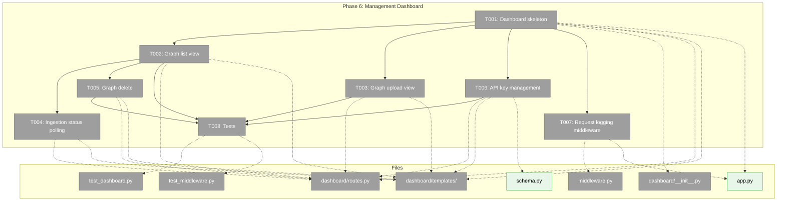
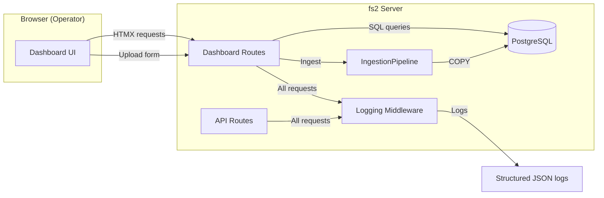
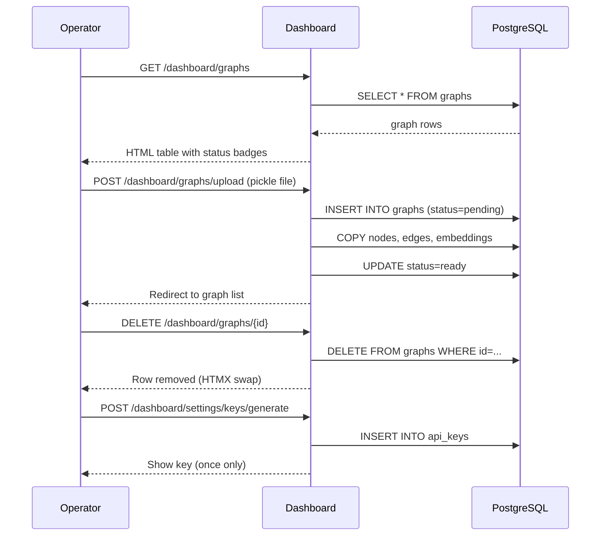

# Phase 6: Management Dashboard — Task Dossier

**Phase**: Phase 6: Management Dashboard
**Plan**: [server-mode-plan.md](../../server-mode-plan.md)
**Created**: 2026-03-06
**Status**: Pending

---

## Executive Briefing

**Purpose**: Build the web-based management dashboard that lets operators and tenants upload graph pickle files, monitor ingestion progress, manage graphs (view/delete), generate API keys, and observe server activity — completing the server-mode feature surface.

**What We're Building**: An HTMX + Jinja2 + Alpine.js server-rendered dashboard mounted at `/dashboard/` on the existing FastAPI server. The dashboard reuses existing API endpoints (upload, list, delete, status) and adds a thin presentation layer with real-time ingestion polling, API key management (minimal — Phase 2 auth was skipped), and structured request logging middleware.

**Goals**:
- ✅ Operators can upload graph pickles via browser with progress feedback
- ✅ Operators can view all graphs with status, metadata, and ingestion progress
- ✅ Operators can delete graphs with confirmation
- ✅ Operators can generate and manage API keys for CLI/MCP users
- ✅ Server logs structured request metrics for monitoring
- ✅ Dashboard is functional-first (no fancy UI — HTMX for interactivity)

**Non-Goals**:
- ❌ Dashboard authentication/login (operator-only, no login gate for v1)
- ❌ Full multi-tenant management (Phase 2 skipped — single default tenant)
- ❌ Per-tenant quotas or billing
- ❌ Visual design polish (function over form)
- ❌ API key validation middleware on API routes (deferred to separate fix when Phase 2 implemented)

---

## Prior Phase Context

### Phase 1: Server Skeleton + Database

**Deliverables**: FastAPI app factory (`app.py`), `Database` class (async psycopg3 pool), `schema.py` (5 tables + indexes), health endpoint, Docker Compose, `ServerDatabaseConfig`/`ServerStorageConfig` config models.

**Dependencies Exported**: `Database.connection()` async context manager, `create_app()` factory, health endpoint at `/health`.

**Gotchas**: No Alembic — schema uses `IF NOT EXISTS` DDL idempotently. pgvector pool registration requires `configure=` callback. No RLS (removed in Phase 1 DYK).

**Patterns**: Lifespan context manager for startup/shutdown. Config models use `BaseModel` + `__config_path__` ClassVar. `Database` is consumed via DI.

### Phase 2: Auth + Multi-Tenancy — SKIPPED

**Status**: All 10 tasks remain pending. `src/fs2/auth/` package does NOT exist. No `APIKey` model, no `AuthService`, no middleware.

**Impact on Phase 6**: Task 6.6 (tenant/API key management) must create a minimal API key model and generation inline within the server domain. Full AuthService migration to auth domain deferred to when Phase 2 is implemented.

### Phase 3: Ingestion Pipeline + Graph Upload

**Deliverables**: `IngestionPipeline` class (COPY bulk insert), upload endpoint `POST /api/v1/graphs`, `RestrictedUnpickler` extraction, `PostgreSQLGraphStore`, graph status lifecycle, `ingestion_jobs` table.

**Dependencies Exported**: Upload endpoint (multipart form), list/status/delete endpoints, `IngestionPipeline.ingest()`, graph status lifecycle (pending → ingesting → ready → error).

**Gotchas**: Synchronous in-process ingestion (no background tasks for v1). Full graph replace on re-upload (DELETE + COPY). Embedding round-trip is fragile with chunk regrouping.

**Patterns**: `IngestionPipeline` is standalone/DI-injectable. COPY bulk insert via `cur.copy()`. Status lifecycle updates at each transition.

### Phase 4: Server Query API

**Deliverables**: Query routes (tree, search, get-node, multi-graph search), `PgvectorSemanticMatcher`, `PostgreSQLGraphStore` async methods, enhanced list-graphs with status filter.

**Dependencies Exported**: All query endpoints (`/api/v1/graphs/{name}/tree|search|nodes/{id}`, `/api/v1/search?graph=...`, `/api/v1/graphs?status=...`). BYO embedding bypass (`query_vector` param).

**Gotchas**: Tree uses virtual folder hierarchy (Python, not SQL CTE). EmbeddingAdapter wiring deferred. Search score heuristics for ILIKE. Node IDs with slashes need `{node_id:path}` param.

**Patterns**: FastAPI DI for Database. `ConnectionProvider` protocol for matchers. Auto-mode routing in route handler. Reuse existing output model shapes.

### Phase 5: Remote CLI + MCP Bridge

**Deliverables**: `RemoteClient` + `MultiRemoteClient` (async httpx), `--remote` CLI flag, `RemotesConfig` models, MCP mixed mode, `list-remotes` command, built-in remotes documentation.

**Dependencies Exported**: `RemoteClient` interface (tree/search/get_node/list_graphs), `resolve_remote_client()`, config merge for `remotes.servers`.

**Gotchas**: RemoteClient ≠ GraphStore (returns raw JSON). Async httpx required for MCP. Tree requests `format=text` from server. Multi-remote score comparability is known v1 limitation.

**Patterns**: Early branching (`if remote_client: ... else: <local>`). Raw JSON passthrough. Actionable error messages. `httpx.MockTransport` for test fakes.

---

## Pre-Implementation Check

| File | Exists? | Domain Check | Notes |
|------|---------|-------------|-------|
| `src/fs2/server/dashboard/__init__.py` | ❌ Create | server ✅ | New package |
| `src/fs2/server/dashboard/routes.py` | ❌ Create | server ✅ | Dashboard route handlers |
| `src/fs2/server/dashboard/templates/base.html` | ❌ Create | server ✅ | Base layout with HTMX + Alpine CDN |
| `src/fs2/server/dashboard/templates/index.html` | ❌ Create | server ✅ | Dashboard home page |
| `src/fs2/server/dashboard/templates/graphs/list.html` | ❌ Create | server ✅ | Graph list table |
| `src/fs2/server/dashboard/templates/graphs/upload.html` | ❌ Create | server ✅ | Upload form |
| `src/fs2/server/dashboard/templates/graphs/detail.html` | ❌ Create | server ✅ | Graph detail + ingestion status |
| `src/fs2/server/dashboard/templates/settings/keys.html` | ❌ Create | server ✅ | API key management |
| `src/fs2/server/middleware.py` | ❌ Create | server ✅ | Request logging middleware |
| `src/fs2/server/app.py` | ✅ Modify | server ✅ | Mount dashboard router + middleware |
| `src/fs2/server/schema.py` | ✅ Modify | server ✅ | Add `api_keys` table DDL |
| `tests/server/test_dashboard.py` | ❌ Create | server ✅ | Dashboard functional tests |
| `tests/server/test_middleware.py` | ❌ Create | server ✅ | Logging middleware tests |

**Concept Search**: No existing dashboard/template patterns in server package. Jinja2 is used in `core/templates/smart_content/` for code documentation rendering (different purpose, different template structure — no reuse opportunity). No API key models exist anywhere.

---

## Architecture Map



---

## Tasks

| Status | ID | Task | Domain | Path(s) | Done When | Notes |
|--------|-----|------|--------|---------|-----------|-------|
| [ ] | T001 | Dashboard skeleton: Jinja2 + HTMX + Alpine.js base layout, dashboard router, mount in app.py | server | `src/fs2/server/dashboard/__init__.py`, `src/fs2/server/dashboard/routes.py`, `src/fs2/server/dashboard/templates/base.html`, `src/fs2/server/dashboard/templates/index.html`, `src/fs2/server/app.py` | `/dashboard/` renders HTML page with HTMX loaded; Jinja2 environment configured with template directory | Base layout includes nav, HTMX CDN, Alpine.js CDN, minimal CSS (Pico CSS or similar classless framework) |
| [ ] | T002 | Graph list view: table of graphs with status badges, metadata columns, auto-refresh for non-ready graphs | server | `src/fs2/server/dashboard/routes.py`, `src/fs2/server/dashboard/templates/graphs/list.html` | `/dashboard/graphs` shows table: name, status (with color badge), node_count, embedding_model, updated_at; non-ready rows auto-refresh via HTMX polling | Reuses DB query from `routes/graphs.py` list_graphs. Status badges: pending=yellow, ingesting=blue-pulse, ready=green, error=red |
| [ ] | T003 | Graph upload view: file picker form with name/description fields, small vanilla JS XHR helper for upload progress bar, delegates to IngestionPipeline | server | `src/fs2/server/dashboard/routes.py`, `src/fs2/server/dashboard/templates/graphs/upload.html` | Can upload a pickle file via `/dashboard/graphs/upload` form with progress bar; on success redirects to graph list; on error shows actionable message | Dashboard route: stream file → temp path → `pipeline.ingest()` (same as API route, no duplication). ~15-line vanilla JS XHR `upload.onprogress` for progress bar (DYK-P6-07). Extract "ensure default tenant" to shared helper (DYK-P6-06) |
| [ ] | T004 | Ingestion status: HTMX polling — single request refreshes entire table body every 5s, stops when all graphs settled | server | `src/fs2/server/dashboard/routes.py`, `src/fs2/server/dashboard/templates/graphs/list.html` | Graph list auto-refreshes entire table body every 5s while any graph status ∈ {pending, ingesting}; stops polling once all graphs are ready/error | Single request for full table body (DYK-P6-09). `hx-trigger="every 5s"` on `<tbody>`. Alpine.js `x-data` tracks `hasPending` to conditionally stop polling. Dashboard route returns HTML fragment for table body |
| [ ] | T005 | Graph delete: delete button per graph row with Alpine.js confirmation dialog, HTMX DELETE removes row | server | `src/fs2/server/dashboard/routes.py`, `src/fs2/server/dashboard/templates/graphs/list.html` | Clicking delete → confirmation dialog → confirmed → row removed from table; graph and all data deleted from DB | Reuses `DELETE /api/v1/graphs/{id}` logic. Alpine.js for confirm/cancel modal. HTMX swap removes row. AC21 |
| [ ] | T006 | API key management: add `api_keys` table to schema, key generation endpoint, management view with warning banner | server | `src/fs2/server/schema.py`, `src/fs2/server/dashboard/routes.py`, `src/fs2/server/dashboard/templates/settings/keys.html` | Can generate API key via dashboard; key shown once then only prefix visible; can list active keys; can revoke a key; warning banner: "API key enforcement not active" | Minimal auth — no full AuthService (Phase 2 skipped). Table: `api_keys(id, tenant_id, key_hash, key_prefix, name, scope, is_active, created_at)`. Key format: `fs2_<32-hex>`. SHA-256 hash via `hashlib.sha256` — no bcrypt, no new deps (DYK-P6-10). Warning banner until Phase 2 middleware (DYK-P6-08). AC18 |
| [ ] | T007 | Structured request logging: FastAPI middleware that logs method, path, status, latency, tenant context as structured JSON | server | `src/fs2/server/middleware.py`, `src/fs2/server/app.py` | Each HTTP request produces a structured log line with method, path, status_code, duration_ms, content_length; parseable by log aggregators | Mount as ASGI middleware in app.py. Use standard Python `logging` with JSON formatter. Skip /health to avoid log noise. AC24 |
| [ ] | T008 | Tests: dashboard functional tests (HTML response, upload flow, delete flow, key generation, middleware logging) | server | `tests/server/test_dashboard.py`, `tests/server/test_middleware.py` | All dashboard routes return 200 HTML; upload via dashboard works; delete works; key generation returns key; middleware logs requests | Lightweight — use httpx.AsyncClient with ASGITransport against test app. Not visual testing. Fake database for unit tests |

---

## Context Brief

### Key Findings from Plan

- **Finding 05 (High)**: 500MB upload → OOM risk. Dashboard upload must stream to temp file, not buffer in RAM. **Action**: Dashboard upload route reuses the existing streaming upload logic from `routes/graphs.py` — do NOT add a second upload path.
- **Finding 06 (High)**: Configuration registry supports new types cleanly via `YAML_CONFIG_TYPES`. **Action**: No new config types needed for Phase 6 — dashboard config (if any) can use app.state settings.
- **Finding 07 (High)**: CLI `resolve_graph_from_context()` is NOT modified by server work. **Action**: Dashboard is server-side only — no CLI impact.

### Domain Dependencies

- **server**: This is the primary domain. Dashboard lives entirely within `src/fs2/server/dashboard/`.
  - `Database` class — async connection pool for DB queries
  - `IngestionPipeline` — pickle → PostgreSQL ingestion (reused for dashboard upload)
  - `create_app()` — mount dashboard router here
  - `schema.py` — add `api_keys` table DDL
- **graph-storage**: `GraphStore` protocol — dashboard reads graph metadata via direct SQL (not GraphStore ABC)
- **configuration**: `ServerDatabaseConfig` — already wired in app.py via `Database`

### Domain Constraints

- All new files go under `src/fs2/server/dashboard/` (server domain)
- Dashboard routes do NOT import from `cli/` or `core/services/` — they query the DB directly via `Database.connection()`
- API key generation stays in server domain for v1 (should migrate to auth domain when Phase 2 is implemented — note as tech debt)
- Templates are Jinja2 HTML, not Python code — no domain boundary concerns for `.html` files
- Middleware is `src/fs2/server/middleware.py` — server domain internal

### Reusable from Prior Phases

- **`Database` class** (Phase 1): async connection pool, already in `app.state.db`
- **Upload streaming** (Phase 3): `routes/graphs.py` upload logic handles chunked streaming + size limits
- **`IngestionPipeline`** (Phase 3): standalone class, inject `Database` via DI
- **Graph list SQL** (Phase 3): `list_graphs` endpoint query can be adapted for dashboard
- **Graph delete SQL** (Phase 3): `delete_graph` endpoint logic can be reused
- **`FakeDatabase` pattern** (Phase 1): used in all server tests — reuse for dashboard tests
- **httpx.AsyncClient + ASGITransport** (Phase 4): test pattern for FastAPI endpoint testing

### Phase 2 Dependency Gap

Phase 2 (Auth + Multi-Tenancy) was **skipped**. This creates a gap for T006 (API key management):

| Planned (Phase 2) | Actual (Phase 6 Minimal) |
|-------------------|--------------------------|
| `src/fs2/auth/` package | API key logic in `server/dashboard/routes.py` |
| `AuthService` class | Direct DB queries for key CRUD |
| `APIKey` Pydantic model | Inline model or raw dict |
| Auth middleware on all routes | No middleware — dashboard open, keys for CLI use |
| FakeAuthService | Tested via dashboard functional tests |

**Tech debt**: When Phase 2 is eventually implemented, migrate API key table and logic from server domain to auth domain. Dashboard routes would then consume AuthService via DI.

### System Flow Diagrams





---

## Discoveries & Learnings

_Populated during implementation by plan-6._

| Date | Task | Type | Discovery | Resolution | References |
|------|------|------|-----------|------------|------------|

**Types**: `gotcha` | `research-needed` | `unexpected-behavior` | `workaround` | `decision` | `debt` | `insight`

---

## DYK Insights (Prior Sessions)

| ID | Insight | Impact | Action |
|----|---------|--------|--------|
| DYK-P6-01 | Phase 2 (auth) skipped — API key management must be self-contained | High | T006 creates minimal api_keys table + generation inline; noted as tech debt for auth domain migration |
| DYK-P6-02 | HTMX + Alpine.js are CDN includes, not Python packages | Low | No pip install needed; include via `<script>` tags in base.html |
| DYK-P6-03 | Existing upload endpoint streams to temp file — DO NOT create second upload path | High | Dashboard upload route delegates to IngestionPipeline directly (same logic, different response format: HTML vs JSON) |
| DYK-P6-04 | Current ingestion is synchronous (blocks until complete) | Medium | For v1, acceptable. Dashboard shows "uploading..." → redirect on completion. HTMX polling handles status for concurrent users |
| DYK-P6-05 | No existing Jinja2 HTML templates in server package | Low | Create from scratch; core/templates/ is for smart_content rendering, different purpose entirely |
| DYK-P6-06 | Upload logic shared boundary is IngestionPipeline.ingest(pickle_path) — each route handles its own file reception to temp path, then calls identical code | High | ✅ DECIDED: Extract "ensure default tenant" into shared path. Both routes: receive file → temp path → `pipeline.ingest()`. No duplication |
| DYK-P6-07 | HTMX `hx-post` can't show file upload progress — no intermediate events for large pickles (500MB) | High | ✅ DECIDED: Small vanilla JS helper (~15 lines XHR `upload.onprogress`) for upload progress bar. HTMX for everything else |
| DYK-P6-08 | API keys without auth middleware are security theater — generates false sense of security | High | ✅ DECIDED: Warning banner in dashboard ("API key enforcement not active"). Keys generated and ready for when Phase 2 middleware lands. No inline middleware |
| DYK-P6-09 | HTMX polling every 2s per non-ready row = N requests/2s — hammers DB with concurrent uploads | Medium | ✅ DECIDED: Single request refreshes entire table body every 5s. Stop polling when no pending/ingesting rows. Collapses N requests → 1 |
| DYK-P6-10 | bcrypt unnecessary for API key hashing — keys have 128 bits entropy (brute-force infeasible) | Medium | ✅ DECIDED: SHA-256 via existing `hashlib.sha256`. No new deps. Follows codebase pattern (`core/utils/hash.py`). bcrypt adds complexity for zero security gain |

---

## Directory Layout

```
docs/plans/028-server-mode/
  ├── server-mode-plan.md
  └── tasks/phase-6-management-dashboard/
      ├── tasks.md                  ← this file
      ├── tasks.fltplan.md          ← flight plan (next)
      └── execution.log.md          # created by plan-6
```
