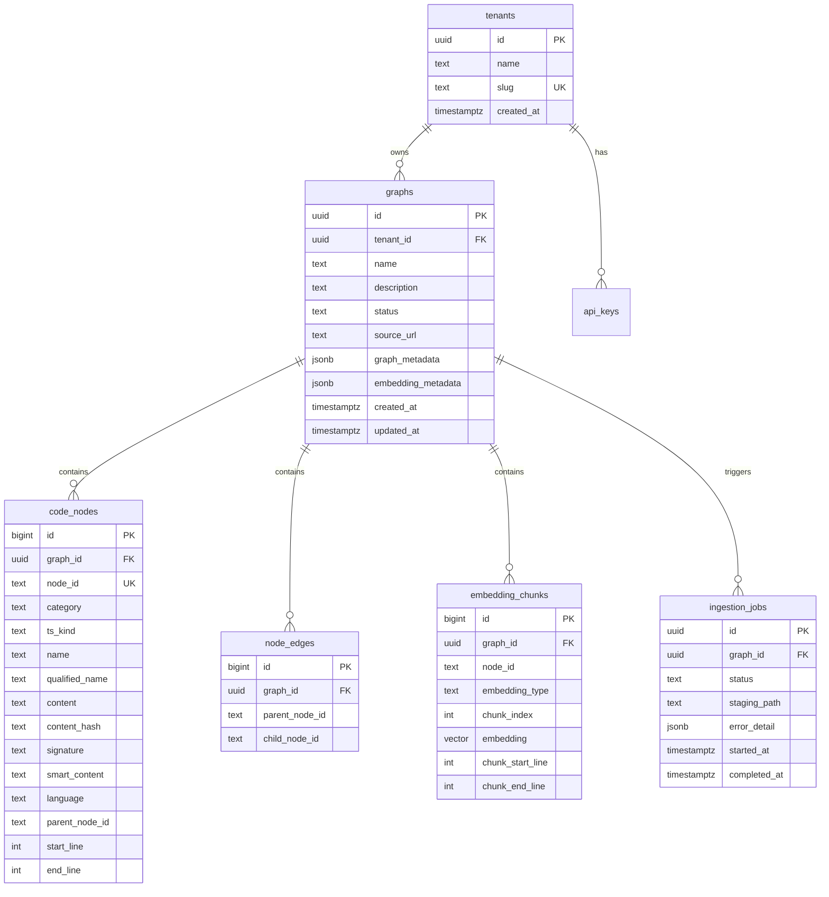

# Workshop: PostgreSQL Database Schema for fs2 Server Mode

**Type**: Data Model / Storage Design
**Plan**: 028-server-mode
**Research**: [research-dossier.md](../research-dossier.md) | [database-selection.md](../external-research/database-selection.md)
**Created**: 2026-03-05
**Status**: Draft

**Related Documents**:
- [Deep Research Synthesis](../external-research/synthesis.md)
- [Database Selection Research](../external-research/database-selection.md)

---

## Purpose

Define the complete PostgreSQL + pgvector database schema for fs2 server mode, including table structures, indexes, ingestion pipeline, multi-tenancy isolation, and vector search. This is the working reference for implementation.

## Key Questions Addressed

- How do we map CodeNode's 20+ fields to relational tables?
- How do we store chunk-level embeddings (text-embedding-3, 1024-dim) for pgvector HNSW search?
- How does graph ingestion work (pickle → filesystem → PostgreSQL)?
- How do we isolate tenants using Row-Level Security?
- How do we preserve embedding model metadata (text-embedding-3-small, dimensions, chunk config)?
- What indexes are needed for tree traversal, vector search, and text/regex search?

---

## Ingestion Flow Overview

```
┌─────────────────────────────────────────────────────────────┐
│ CLIENT (unchanged)                                          │
│                                                             │
│   $ fs2 scan                                                │
│   → Produces .fs2/graph.pickle (NetworkX + CodeNodes)       │
│                                                             │
│   $ fs2 push --server https://fs2.example.com               │
│   → Uploads graph.pickle to server                          │
└──────────────────────────┬──────────────────────────────────┘
                           │  HTTP multipart upload
                           ▼
┌─────────────────────────────────────────────────────────────┐
│ SERVER                                                      │
│                                                             │
│  1. Receive pickle file → save to staging FS                │
│     /data/staging/{tenant_id}/{graph_name}/graph.pickle     │
│                                                             │
│  2. Create ingestion_job (status: pending)                  │
│                                                             │
│  3. Background worker picks up job:                         │
│     a. Load pickle with RestrictedUnpickler                 │
│     b. Extract metadata dict + all CodeNodes + edges        │
│     c. Validate embedding model compatibility               │
│     d. COPY bulk-insert into PostgreSQL                     │
│     e. Update graph record (status: ready)                  │
│     f. Clean up staging file (optional: archive)            │
│                                                             │
│  4. Graph is now queryable via API                          │
└─────────────────────────────────────────────────────────────┘
```

**Why filesystem staging?** The pickle file is a blob (50-500MB). We save it to disk first so the ingestion worker can process it asynchronously without holding an HTTP connection open. If ingestion fails, we can retry from the file.

---

## Conceptual Model



---

## Schema Definitions

### Extension Setup

```sql
-- Required extensions
CREATE EXTENSION IF NOT EXISTS "uuid-ossp";
CREATE EXTENSION IF NOT EXISTS vector;        -- pgvector
CREATE EXTENSION IF NOT EXISTS pg_trgm;       -- trigram text search
```

---

### tenants

Multi-tenant root. All data is scoped to a tenant.

```sql
CREATE TABLE tenants (
    id          UUID PRIMARY KEY DEFAULT uuid_generate_v4(),
    name        TEXT NOT NULL,
    slug        TEXT NOT NULL UNIQUE,  -- url-safe identifier
    is_active   BOOLEAN NOT NULL DEFAULT true,
    max_graphs  INT NOT NULL DEFAULT 50,
    created_at  TIMESTAMPTZ NOT NULL DEFAULT now(),
    updated_at  TIMESTAMPTZ NOT NULL DEFAULT now()
);

-- Example
INSERT INTO tenants (name, slug) VALUES ('Acme Corp', 'acme');
```

---

### api_keys

Authentication for API and CLI access.

```sql
CREATE TABLE api_keys (
    id          UUID PRIMARY KEY DEFAULT uuid_generate_v4(),
    tenant_id   UUID NOT NULL REFERENCES tenants(id) ON DELETE CASCADE,
    key_hash    TEXT NOT NULL,        -- bcrypt hash of the key
    key_prefix  TEXT NOT NULL,        -- first 8 chars for identification: "fs2_abc1..."
    label       TEXT,                 -- human-friendly name
    scopes      TEXT[] DEFAULT '{}',  -- optional: ['read', 'write', 'admin']
    is_active   BOOLEAN NOT NULL DEFAULT true,
    last_used_at TIMESTAMPTZ,
    expires_at  TIMESTAMPTZ,
    created_at  TIMESTAMPTZ NOT NULL DEFAULT now()
);

CREATE INDEX idx_api_keys_prefix ON api_keys(key_prefix) WHERE is_active = true;

-- Keys are generated as: "fs2_" + 32 random hex chars
-- Only the hash is stored. key_prefix enables lookup without full scan.
```

---

### graphs

Each uploaded graph/site/repository. Maps to one `.fs2/graph.pickle` file.

```sql
CREATE TABLE graphs (
    id          UUID PRIMARY KEY DEFAULT uuid_generate_v4(),
    tenant_id   UUID NOT NULL REFERENCES tenants(id) ON DELETE CASCADE,
    name        TEXT NOT NULL,              -- unique per tenant
    description TEXT,
    source_url  TEXT,                       -- informational: repo URL
    status      TEXT NOT NULL DEFAULT 'pending',
                -- pending → ingesting → ready → error → archived

    -- Metadata from pickle (preserved as-is)
    format_version  TEXT,                   -- "1.0"
    node_count      INT,
    edge_count      INT,

    -- Embedding model tracking (CRITICAL: preserve for search compatibility)
    embedding_model      TEXT,              -- "text-embedding-3-small"
    embedding_dimensions INT,              -- 1024
    embedding_metadata   JSONB,            -- full chunk_params, batch_size, etc.
    --   {
    --     "model": "text-embedding-3-small",
    --     "dimensions": 1024,
    --     "chunk_params": {
    --       "code": {"max_tokens": 4000, "overlap_tokens": 50},
    --       "documentation": {"max_tokens": 4000, "overlap_tokens": 120},
    --       "smart_content": {"max_tokens": 8000, "overlap_tokens": 0}
    --     }
    --   }

    -- Extra metadata from set_metadata() — preserved verbatim
    extra_metadata  JSONB,

    -- Timestamps
    created_at  TIMESTAMPTZ NOT NULL DEFAULT now(),
    updated_at  TIMESTAMPTZ NOT NULL DEFAULT now(),
    ingested_at TIMESTAMPTZ,               -- when ingestion completed

    UNIQUE (tenant_id, name)
);

CREATE INDEX idx_graphs_tenant ON graphs(tenant_id);
CREATE INDEX idx_graphs_status ON graphs(status);
```

**Why `embedding_model` as a top-level column?** Search queries need to verify the query embedding model matches the stored embedding model. Having it as a column enables fast validation without JSONB extraction.

---

### code_nodes

All CodeNode fields from the pickle, denormalized into a flat table.

```sql
CREATE TABLE code_nodes (
    -- Surrogate PK for joins (node_id is TEXT, not ideal as PK for performance)
    id              BIGINT GENERATED ALWAYS AS IDENTITY PRIMARY KEY,
    graph_id        UUID NOT NULL REFERENCES graphs(id) ON DELETE CASCADE,
    tenant_id       UUID NOT NULL REFERENCES tenants(id),  -- denormalized for RLS

    -- === Identity (CodeNode.node_id) ===
    node_id         TEXT NOT NULL,         -- "file:src/main.py" or "callable:src/main.py:MyClass.method"

    -- === Classification ===
    category        TEXT NOT NULL,         -- "file", "callable", "type", "section", "block", etc.
    ts_kind         TEXT NOT NULL,         -- tree-sitter grammar-specific type
    content_type    TEXT NOT NULL DEFAULT 'code',  -- "code" or "content" (ContentType enum)

    -- === Naming ===
    name            TEXT,                  -- short name (nullable)
    qualified_name  TEXT NOT NULL,         -- fully qualified name

    -- === Location ===
    start_line      INT NOT NULL,          -- 1-indexed
    end_line        INT NOT NULL,          -- 1-indexed
    start_column    INT NOT NULL,          -- 0-indexed
    end_column      INT NOT NULL,          -- 0-indexed
    start_byte      INT NOT NULL,          -- 0-indexed
    end_byte        INT NOT NULL,          -- 0-indexed

    -- === Content ===
    content         TEXT NOT NULL,         -- full source text (can be large, up to 500KB)
    content_hash    TEXT NOT NULL,         -- SHA-256 hexdigest
    signature       TEXT,                  -- declaration line(s)

    -- === Metadata ===
    language        TEXT NOT NULL,         -- "python", "javascript", etc.
    is_named        BOOLEAN NOT NULL,      -- tree-sitter named vs anonymous
    field_name      TEXT,                  -- relationship to parent in grammar
    is_error        BOOLEAN NOT NULL DEFAULT false,

    -- === Hierarchy ===
    parent_node_id  TEXT,                  -- node_id of parent (NULL for file-level nodes)

    -- === Large File Handling ===
    truncated           BOOLEAN NOT NULL DEFAULT false,
    truncated_at_line   INT,

    -- === AI-Generated Content ===
    smart_content       TEXT,              -- LLM-generated summary
    smart_content_hash  TEXT,              -- content_hash when smart_content was generated

    -- === Embedding Staleness Tracking ===
    embedding_hash  TEXT,                  -- content_hash when embedding was generated

    UNIQUE (graph_id, node_id)
);

-- Primary lookup: find node by ID within a graph
CREATE INDEX idx_nodes_graph_node ON code_nodes(graph_id, node_id);

-- Hierarchy traversal: find children of a parent
CREATE INDEX idx_nodes_parent ON code_nodes(graph_id, parent_node_id)
    WHERE parent_node_id IS NOT NULL;

-- Category filtering
CREATE INDEX idx_nodes_category ON code_nodes(graph_id, category);

-- Text search: trigram index on content for LIKE/regex queries
CREATE INDEX idx_nodes_content_trgm ON code_nodes
    USING gin (content gin_trgm_ops);

-- Text search: trigram on node_id for pattern matching
CREATE INDEX idx_nodes_nodeid_trgm ON code_nodes
    USING gin (node_id gin_trgm_ops);

-- Text search: trigram on smart_content
CREATE INDEX idx_nodes_smart_trgm ON code_nodes
    USING gin (smart_content gin_trgm_ops)
    WHERE smart_content IS NOT NULL;

-- RLS tenant isolation
CREATE INDEX idx_nodes_tenant ON code_nodes(tenant_id);
```

**Why denormalize `tenant_id`?** Row-Level Security policies need `tenant_id` on every table. Joining through `graphs` on every query would defeat the performance benefit of RLS.

**Why not store embeddings here?** Embeddings are chunk-level (one node → N chunks). A separate table with pgvector column enables HNSW indexing on the vector data without bloating the main node table.

---

### node_edges

Explicit parent→child directed edges. Mirrors NetworkX DiGraph edges.

```sql
CREATE TABLE node_edges (
    id              BIGINT GENERATED ALWAYS AS IDENTITY PRIMARY KEY,
    graph_id        UUID NOT NULL REFERENCES graphs(id) ON DELETE CASCADE,
    tenant_id       UUID NOT NULL REFERENCES tenants(id),  -- denormalized for RLS
    parent_node_id  TEXT NOT NULL,
    child_node_id   TEXT NOT NULL,

    UNIQUE (graph_id, parent_node_id, child_node_id)
);

CREATE INDEX idx_edges_parent ON node_edges(graph_id, parent_node_id);
CREATE INDEX idx_edges_child ON node_edges(graph_id, child_node_id);
CREATE INDEX idx_edges_tenant ON node_edges(tenant_id);
```

**Why a separate table when `code_nodes.parent_node_id` exists?** Two reasons:
1. **Recursive CTE performance**: Edges table enables efficient recursive traversal without self-joins on the large `code_nodes` table.
2. **Data integrity**: Explicit edges can be validated independently; `parent_node_id` is informational metadata from the CodeNode.

---

### embedding_chunks

Chunk-level vector embeddings — the core of semantic search.

```sql
CREATE TABLE embedding_chunks (
    id              BIGINT GENERATED ALWAYS AS IDENTITY PRIMARY KEY,
    graph_id        UUID NOT NULL REFERENCES graphs(id) ON DELETE CASCADE,
    tenant_id       UUID NOT NULL REFERENCES tenants(id),  -- denormalized for RLS
    node_id         TEXT NOT NULL,          -- CodeNode.node_id

    -- Embedding identity
    embedding_type  TEXT NOT NULL,          -- 'content' or 'smart_content'
    chunk_index     INT NOT NULL,           -- 0-based index within this node+type

    -- The vector (pgvector)
    embedding       vector(1024) NOT NULL,  -- text-embedding-3-small at 1024 dims

    -- Chunk location (for content embeddings only)
    chunk_start_line INT,                   -- 1-indexed, NULL for smart_content
    chunk_end_line   INT,                   -- 1-indexed, NULL for smart_content

    UNIQUE (graph_id, node_id, embedding_type, chunk_index)
);

-- HNSW index for ANN semantic search (cosine distance)
-- This is the critical index for search performance
CREATE INDEX idx_embeddings_hnsw ON embedding_chunks
    USING hnsw (embedding vector_cosine_ops)
    WITH (m = 16, ef_construction = 128);

-- Filter by graph before vector search
CREATE INDEX idx_embeddings_graph ON embedding_chunks(graph_id);

-- Lookup chunks for a specific node (for result enrichment)
CREATE INDEX idx_embeddings_node ON embedding_chunks(graph_id, node_id);

-- RLS
CREATE INDEX idx_embeddings_tenant ON embedding_chunks(tenant_id);
```

**Embedding dimension: 1024**
- Model: `text-embedding-3-small` (OpenAI)
- text-embedding-3-small supports variable dimensions (256, 512, 1024, 1536)
- fs2 defaults to 1024 (`EmbeddingConfig.dimensions = 1024`)
- Column type: `vector(1024)` — pgvector enforces dimension at insert time

**Why not halfvec (float16)?**
- Start with `vector(1024)` (float32) for simplicity and full precision
- Upgrade to `halfvec(1024)` later if storage/performance requires it (2x savings)
- pgvector supports transparent halfvec↔vector conversion in queries

**HNSW Parameters**:
- `m = 16`: Max connections per node (default, good balance of recall vs build time)
- `ef_construction = 128`: Candidate list during build (higher = better recall, slower build)
- Build time estimate: ~5-6 hours for 10M vectors at 1024-dim
- Query time: p50 ~31ms, p99 <100ms at 99% recall

---

### ingestion_jobs

Track the lifecycle of graph imports.

```sql
CREATE TABLE ingestion_jobs (
    id              UUID PRIMARY KEY DEFAULT uuid_generate_v4(),
    graph_id        UUID NOT NULL REFERENCES graphs(id) ON DELETE CASCADE,
    tenant_id       UUID NOT NULL REFERENCES tenants(id),

    status          TEXT NOT NULL DEFAULT 'pending',
                    -- pending → running → completed → failed
    staging_path    TEXT NOT NULL,          -- /data/staging/{tenant}/{graph}/graph.pickle
    file_size_bytes BIGINT,

    -- Progress tracking
    nodes_total     INT,
    nodes_imported  INT DEFAULT 0,
    edges_imported  INT DEFAULT 0,
    chunks_imported INT DEFAULT 0,

    -- Timing
    started_at      TIMESTAMPTZ,
    completed_at    TIMESTAMPTZ,

    -- Error info
    error_message   TEXT,
    error_detail    JSONB,

    created_at      TIMESTAMPTZ NOT NULL DEFAULT now()
);

CREATE INDEX idx_jobs_status ON ingestion_jobs(status) WHERE status IN ('pending', 'running');
CREATE INDEX idx_jobs_graph ON ingestion_jobs(graph_id);
```

---

## Row-Level Security (Multi-Tenancy)

All data tables enforce tenant isolation at the database level.

```sql
-- Enable RLS on all data tables
ALTER TABLE graphs ENABLE ROW LEVEL SECURITY;
ALTER TABLE code_nodes ENABLE ROW LEVEL SECURITY;
ALTER TABLE node_edges ENABLE ROW LEVEL SECURITY;
ALTER TABLE embedding_chunks ENABLE ROW LEVEL SECURITY;
ALTER TABLE ingestion_jobs ENABLE ROW LEVEL SECURITY;
ALTER TABLE api_keys ENABLE ROW LEVEL SECURITY;

-- Create policies (same pattern for each table)
-- The app sets: SET app.current_tenant_id = '<uuid>' per request

CREATE POLICY tenant_isolation ON graphs
    USING (tenant_id = current_setting('app.current_tenant_id')::uuid);

CREATE POLICY tenant_isolation ON code_nodes
    USING (tenant_id = current_setting('app.current_tenant_id')::uuid);

CREATE POLICY tenant_isolation ON node_edges
    USING (tenant_id = current_setting('app.current_tenant_id')::uuid);

CREATE POLICY tenant_isolation ON embedding_chunks
    USING (tenant_id = current_setting('app.current_tenant_id')::uuid);

CREATE POLICY tenant_isolation ON ingestion_jobs
    USING (tenant_id = current_setting('app.current_tenant_id')::uuid);

CREATE POLICY tenant_isolation ON api_keys
    USING (tenant_id = current_setting('app.current_tenant_id')::uuid);
```

**FastAPI middleware pattern:**
```python
async def set_tenant_context(conn, tenant_id: UUID):
    """Set tenant context for RLS enforcement on every request."""
    await conn.execute(
        f"SET app.current_tenant_id = '{tenant_id}'"
    )
```

---

## Query Patterns

### Tree Traversal (get_children, build_tree)

```sql
-- Get direct children of a node
SELECT cn.*
FROM code_nodes cn
JOIN node_edges ne ON ne.child_node_id = cn.node_id AND ne.graph_id = cn.graph_id
WHERE ne.graph_id = $1
  AND ne.parent_node_id = $2;

-- Recursive tree expansion (full subtree)
WITH RECURSIVE tree AS (
    -- Root node
    SELECT cn.*, 0 AS depth
    FROM code_nodes cn
    WHERE cn.graph_id = $1 AND cn.node_id = $2

    UNION ALL

    -- Children at each level
    SELECT cn.*, tree.depth + 1
    FROM code_nodes cn
    JOIN node_edges ne ON ne.child_node_id = cn.node_id AND ne.graph_id = cn.graph_id
    JOIN tree ON tree.node_id = ne.parent_node_id AND tree.graph_id = ne.graph_id
    WHERE tree.depth < $3  -- max_depth limit
)
SELECT * FROM tree ORDER BY depth, start_line;
```

**Expected performance**: 10-50ms for 4-level traversal, 50-100ms for full tree expansion of 10K nodes.

---

### Semantic Search (vector similarity)

```sql
-- Search for similar code using embedding
-- $1 = graph_id, $2 = query_embedding (1024-dim vector), $3 = limit, $4 = min_similarity
SELECT
    ec.node_id,
    ec.embedding_type,
    ec.chunk_index,
    ec.chunk_start_line,
    ec.chunk_end_line,
    1 - (ec.embedding <=> $2) AS similarity  -- cosine similarity
FROM embedding_chunks ec
WHERE ec.graph_id = $1
  AND 1 - (ec.embedding <=> $2) >= $4        -- min_similarity threshold
ORDER BY ec.embedding <=> $2                  -- ORDER BY distance (ASC)
LIMIT $3;
```

**How it works:**
1. Client embeds the search query using same model (text-embedding-3-small, 1024-dim)
2. Server sends query vector to PostgreSQL
3. pgvector HNSW index finds approximate nearest neighbors
4. Results filtered by `graph_id` and `min_similarity`
5. Server enriches results with CodeNode data from `code_nodes` table

**Multi-graph search** (search across multiple graphs):
```sql
-- Search across specific graphs
WHERE ec.graph_id = ANY($1::uuid[])  -- array of graph_ids
```

---

### Text/Regex Search

```sql
-- Text search (case-insensitive substring via trigram)
SELECT cn.*
FROM code_nodes cn
WHERE cn.graph_id = $1
  AND (
    cn.content ILIKE '%' || $2 || '%'
    OR cn.node_id ILIKE '%' || $2 || '%'
    OR cn.smart_content ILIKE '%' || $2 || '%'
  )
LIMIT $3;

-- Regex search
SELECT cn.*
FROM code_nodes cn
WHERE cn.graph_id = $1
  AND cn.content ~ $2    -- PostgreSQL regex match
LIMIT $3;
```

**Trigram indexes** (`gin_trgm_ops`) accelerate both ILIKE and regex queries.

---

### Get Node by ID

```sql
SELECT * FROM code_nodes
WHERE graph_id = $1 AND node_id = $2;
```

---

### List Available Graphs

```sql
SELECT
    g.name,
    g.description,
    g.source_url,
    g.status,
    g.node_count,
    g.edge_count,
    g.embedding_model,
    g.embedding_dimensions,
    g.created_at,
    g.ingested_at
FROM graphs g
WHERE g.status = 'ready'  -- only show queryable graphs
ORDER BY g.name;
```

---

## Ingestion Pipeline Detail

### Step-by-Step Process

```python
async def ingest_graph(job: IngestionJob):
    """Background worker: load pickle → insert into PostgreSQL."""

    # 1. Update job status
    job.status = "running"
    job.started_at = now()

    # 2. Load pickle with security validation
    with open(job.staging_path, "rb") as f:
        metadata, nx_graph = RestrictedUnpickler(f).load()
        # RestrictedUnpickler whitelists: builtins, collections, datetime,
        # pathlib, networkx, fs2.core.models.code_node, fs2.core.models.content_type

    # 3. Update graph metadata
    graph.format_version = metadata.get("format_version", "1.0")
    graph.node_count = metadata.get("node_count")
    graph.edge_count = metadata.get("edge_count")
    graph.embedding_model = metadata.get("embedding_model")          # "text-embedding-3-small"
    graph.embedding_dimensions = metadata.get("embedding_dimensions") # 1024
    graph.embedding_metadata = {
        "model": metadata.get("embedding_model"),
        "dimensions": metadata.get("embedding_dimensions"),
        "chunk_params": metadata.get("chunk_params"),
    }
    graph.extra_metadata = {k: v for k, v in metadata.items()
                           if k not in KNOWN_METADATA_KEYS}

    # 4. Delete existing data for this graph (re-upload = full replace)
    DELETE FROM embedding_chunks WHERE graph_id = graph.id;
    DELETE FROM node_edges WHERE graph_id = graph.id;
    DELETE FROM code_nodes WHERE graph_id = graph.id;

    # 5. Bulk insert code_nodes via COPY
    #    Extract CodeNode objects from nx_graph node data
    nodes = [nx_graph.nodes[n]["data"] for n in nx_graph.nodes]
    COPY code_nodes FROM STDIN (FORMAT binary)  # ~14s for 10M rows

    # 6. Bulk insert node_edges via COPY
    edges = [(u, v) for u, v in nx_graph.edges]
    COPY node_edges FROM STDIN (FORMAT binary)

    # 7. Bulk insert embedding_chunks via COPY
    for node in nodes:
        if node.embedding:
            for i, chunk_vec in enumerate(node.embedding):
                # Insert content embedding chunk
                chunk_offsets = node.embedding_chunk_offsets
                start_line = chunk_offsets[i][0] if chunk_offsets else None
                end_line = chunk_offsets[i][1] if chunk_offsets else None
                INSERT (graph_id, node_id, 'content', i, chunk_vec, start_line, end_line)

        if node.smart_content_embedding:
            for i, chunk_vec in enumerate(node.smart_content_embedding):
                # Insert smart_content embedding chunk
                INSERT (graph_id, node_id, 'smart_content', i, chunk_vec, NULL, NULL)

    # 8. Update graph status
    graph.status = "ready"
    graph.ingested_at = now()

    # 9. Update job
    job.status = "completed"
    job.completed_at = now()
    job.nodes_imported = len(nodes)
    job.edges_imported = len(edges)
    job.chunks_imported = total_chunks
```

### Re-Upload (Graph Update)

When a client re-uploads a graph (e.g., after `fs2 scan` with new commits):

1. **Full replace strategy**: Delete all existing data for the graph, re-insert
2. **Why not incremental?** Pickle is a monolithic blob — no diffing mechanism. The COPY-based bulk insert is fast enough (10M rows in 14 seconds) that full replacement is simpler and equally fast for our scale.
3. **HNSW index**: pgvector incrementally updates the index on INSERT; no full rebuild needed after initial creation.

---

## Embedding Model Compatibility

### The Problem
If a graph was embedded with `text-embedding-3-small` at 1024 dimensions, search queries MUST use the same model and dimensions. Mixing models produces garbage similarity scores.

### The Solution

```python
async def validate_search_compatibility(graph: Graph, query_model: str, query_dims: int):
    """Verify search query is compatible with graph's embedding model."""
    if graph.embedding_model and graph.embedding_model != query_model:
        raise IncompatibleEmbeddingError(
            f"Graph '{graph.name}' uses {graph.embedding_model} "
            f"but query uses {query_model}"
        )
    if graph.embedding_dimensions and graph.embedding_dimensions != query_dims:
        raise IncompatibleEmbeddingError(
            f"Graph '{graph.name}' uses {graph.embedding_dimensions}-dim "
            f"but query uses {query_dims}-dim"
        )
```

### Stored Metadata Example

```json
{
  "embedding_model": "text-embedding-3-small",
  "embedding_dimensions": 1024,
  "embedding_metadata": {
    "model": "text-embedding-3-small",
    "dimensions": 1024,
    "chunk_params": {
      "code": {"max_tokens": 4000, "overlap_tokens": 50},
      "documentation": {"max_tokens": 4000, "overlap_tokens": 120},
      "smart_content": {"max_tokens": 8000, "overlap_tokens": 0}
    }
  }
}
```

---

## Storage Estimates

### Per-Graph (10K-200K nodes)

| Component | Size per Node | 10K Nodes | 200K Nodes |
|-----------|--------------|-----------|------------|
| code_nodes row (avg) | ~5KB (content ~3KB avg) | 50MB | 1GB |
| node_edges row | ~100B | 1MB | 20MB |
| embedding_chunks (1-3 chunks × 1024 × 4B) | ~8KB avg | 80MB | 1.6GB |
| Trigram indexes | ~2x content | 100MB | 2GB |
| HNSW index (vectors) | ~1.5x vectors | 120MB | 2.4GB |
| **Total per graph** | | **~350MB** | **~7GB** |

### Total System (100s of graphs)

| Scale | Graphs | Avg Nodes | Total Vectors | DB Size | RAM Needed |
|-------|--------|-----------|---------------|---------|------------|
| Small | 50 | 20K | 2M | ~20GB | 16GB |
| Medium | 200 | 50K | 20M | ~150GB | 64GB |
| Large | 500 | 100K | 100M | ~700GB | 256GB |

**Note:** HNSW index performance degrades if the index doesn't fit in RAM (`shared_buffers`). Monitor this metric. At 50M+ vectors, consider partitioning or dedicated vector DB.

---

## Filesystem Layout (Server)

```
/data/
├── staging/                          # Incoming uploads (temporary)
│   └── {tenant_slug}/
│       └── {graph_name}/
│           └── graph.pickle          # Awaiting ingestion
│
├── archive/                          # Successfully ingested (optional backup)
│   └── {tenant_slug}/
│       └── {graph_name}/
│           └── graph-{timestamp}.pickle
│
└── config/
    └── server.yaml                   # Server configuration
```

---

## Configuration Model (Pydantic)

```python
class ServerDatabaseConfig(BaseModel):
    """PostgreSQL connection settings."""
    __config_path__: ClassVar[str] = "server.database"

    host: str = "localhost"
    port: int = 5432
    database: str = "fs2_server"
    user: str = "fs2"
    password: str = ""           # Use FS2_SERVER__DATABASE__PASSWORD env var
    min_pool_size: int = 5
    max_pool_size: int = 20
    ssl_mode: str = "prefer"     # require for production

class ServerStorageConfig(BaseModel):
    """Filesystem paths for staging and archive."""
    __config_path__: ClassVar[str] = "server.storage"

    staging_dir: str = "/data/staging"
    archive_dir: str = "/data/archive"
    archive_on_ingest: bool = True
    cleanup_staging_after_days: int = 7

class ServerEmbeddingConfig(BaseModel):
    """Embedding model for search queries."""
    __config_path__: ClassVar[str] = "server.embedding"

    model: str = "text-embedding-3-small"
    dimensions: int = 1024
    # Server needs its own embedding adapter to embed search queries
    mode: Literal["azure", "openai_compatible"] = "openai_compatible"
    api_key: str = ""            # Use FS2_SERVER__EMBEDDING__API_KEY env var
```

---

## Open Questions

### Q1: Should we support graphs with DIFFERENT embedding models on the same server?

**RESOLVED: Yes.** Each graph stores its own `embedding_model` and `embedding_dimensions`. The server validates compatibility before search. Users embedding with different models (e.g., one team uses text-embedding-3-small, another uses text-embedding-3-large) can coexist — they just can't cross-search.

### Q2: Should embedding_chunks use float32 (vector) or float16 (halfvec)?

**RESOLVED: Start with float32 (`vector(1024)`).** Upgrade to `halfvec(1024)` later if storage/performance requires it. pgvector supports transparent conversion. Float16 gives 2x storage savings and ~50% faster index builds but slightly reduced precision.

### Q3: Table partitioning by graph_id for embedding_chunks?

**OPEN**: At medium scale (20M vectors), a single HNSW index with graph_id filter works well. At large scale (100M+ vectors), partitioning by graph_id would give per-partition HNSW indexes with better filtered search performance.
- **Option A**: Start without partitioning, add later when needed (simpler)
- **Option B**: Partition from day one using PostgreSQL declarative partitioning
- **Recommendation**: Option A — YAGNI. Monitor query latency and partition when p99 exceeds 200ms.

### Q4: How to handle graphs WITHOUT embeddings?

**RESOLVED**: Graphs scanned with `--no-embeddings` simply have no rows in `embedding_chunks`. Text/regex search works normally. Semantic search returns empty results with a helpful message: "This graph has no embeddings. Re-scan with `fs2 scan --embed` to enable semantic search."

### Q5: How to handle dimension changes (e.g., switching from 1024 to 1536)?

**RESOLVED**: The `vector(1024)` column type enforces dimension. If a graph is re-scanned with different dimensions, ingestion would fail with a schema mismatch. Options:
- Reject graphs with non-matching dimensions (safest)
- Support multiple dimension columns: `vector(1024)`, `vector(1536)` (complex)
- **Decision**: Reject on mismatch. If the server needs to support a new dimension, add a new column and update the HNSW index. This is a rare, planned migration.

### Q6: What about the `embedding_chunk_offsets` — do we need them in the DB?

**RESOLVED: Yes.** They're stored as `chunk_start_line` / `chunk_end_line` in `embedding_chunks`. This enables the search UI to highlight the specific matched chunk region within a large file, not just the node's overall line range.

---

## Migration Script (Initial Setup)

```sql
-- Complete setup script for fs2 server database
-- Run as: psql -U postgres -f setup.sql

CREATE DATABASE fs2_server;
\c fs2_server

-- Extensions
CREATE EXTENSION IF NOT EXISTS "uuid-ossp";
CREATE EXTENSION IF NOT EXISTS vector;
CREATE EXTENSION IF NOT EXISTS pg_trgm;

-- Tables (in dependency order)
-- [paste table definitions from above]

-- RLS
-- [paste RLS definitions from above]

-- Create admin role (bypasses RLS)
CREATE ROLE fs2_admin;
ALTER TABLE graphs FORCE ROW LEVEL SECURITY;  -- even owner obeys RLS
-- Admin policy: allow all
CREATE POLICY admin_all ON graphs TO fs2_admin USING (true);
-- ... repeat for all tables

-- Create app role (uses RLS)
CREATE ROLE fs2_app;
GRANT SELECT, INSERT, UPDATE, DELETE ON ALL TABLES IN SCHEMA public TO fs2_app;
GRANT USAGE ON ALL SEQUENCES IN SCHEMA public TO fs2_app;
```

---

## Quick Reference: CodeNode → PostgreSQL Field Mapping

| CodeNode Field | PostgreSQL Column | Type | Notes |
|---------------|-------------------|------|-------|
| `node_id` | `code_nodes.node_id` | TEXT | Unique per graph |
| `category` | `code_nodes.category` | TEXT | "file", "callable", "type", etc. |
| `ts_kind` | `code_nodes.ts_kind` | TEXT | Tree-sitter grammar type |
| `name` | `code_nodes.name` | TEXT | Nullable |
| `qualified_name` | `code_nodes.qualified_name` | TEXT | |
| `start_line` | `code_nodes.start_line` | INT | 1-indexed |
| `end_line` | `code_nodes.end_line` | INT | 1-indexed |
| `start_column` | `code_nodes.start_column` | INT | 0-indexed |
| `end_column` | `code_nodes.end_column` | INT | 0-indexed |
| `start_byte` | `code_nodes.start_byte` | INT | 0-indexed |
| `end_byte` | `code_nodes.end_byte` | INT | 0-indexed |
| `content` | `code_nodes.content` | TEXT | Up to 500KB |
| `content_hash` | `code_nodes.content_hash` | TEXT | SHA-256 hex |
| `signature` | `code_nodes.signature` | TEXT | Nullable |
| `language` | `code_nodes.language` | TEXT | |
| `is_named` | `code_nodes.is_named` | BOOLEAN | |
| `field_name` | `code_nodes.field_name` | TEXT | Nullable |
| `is_error` | `code_nodes.is_error` | BOOLEAN | Default false |
| `content_type` | `code_nodes.content_type` | TEXT | "code" or "content" |
| `parent_node_id` | `code_nodes.parent_node_id` | TEXT | Nullable |
| `truncated` | `code_nodes.truncated` | BOOLEAN | Default false |
| `truncated_at_line` | `code_nodes.truncated_at_line` | INT | Nullable |
| `smart_content` | `code_nodes.smart_content` | TEXT | Nullable |
| `smart_content_hash` | `code_nodes.smart_content_hash` | TEXT | Nullable |
| `embedding_hash` | `code_nodes.embedding_hash` | TEXT | Nullable |
| `embedding` | `embedding_chunks` table | vector(1024) | 1-N chunks per node |
| `smart_content_embedding` | `embedding_chunks` table | vector(1024) | 1-N chunks per node |
| `embedding_chunk_offsets` | `embedding_chunks.chunk_start/end_line` | INT | Per chunk |
