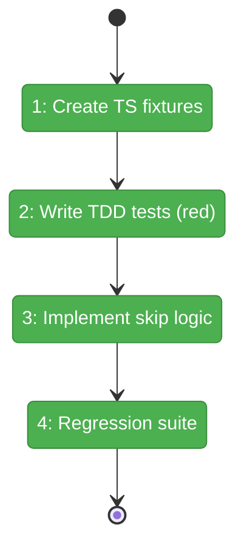
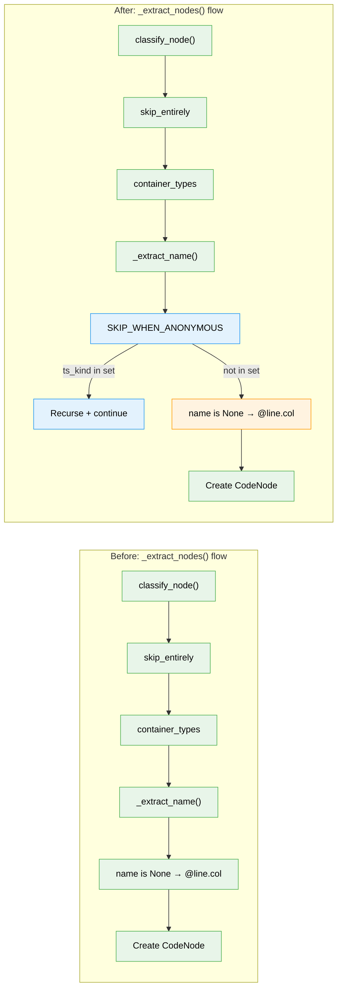

# Flight Plan: Phase 1 — Skip Anonymous TypeScript Nodes

**Plan**: [better-node-parsing-plan.md](../../better-node-parsing-plan.md)
**Phase**: Phase 1: Skip Anonymous Nodes (Simple mode — only phase)
**Generated**: 2026-03-08
**Status**: Landed

---

## Departure → Destination

**Where we are**: fs2's TypeScript/TSX parser extracts every anonymous arrow function, interface body, class body, and type annotation as a standalone `@line.column` node. A real-world TS codebase produces 13,649 such nodes (58.6% of the graph), wasting storage, LLM calls, and embedding API calls.

**Where we're going**: After this phase, scanning TypeScript/TSX produces only meaningful named nodes. Anonymous callbacks, body wrappers, and type annotations are silently skipped while their named children are still extracted. Graph size drops ~50-60%, and tree/search output becomes usable.

---

## Domain Context

### Domains We're Changing

| Domain | What Changes | Key Files |
|--------|-------------|-----------|
| AST Parsing | Add `SKIP_WHEN_ANONYMOUS` constant + conditional skip-and-recurse block in `_extract_nodes()` | `src/fs2/core/adapters/ast_parser_impl.py` |

### Domains We Depend On (no changes)

| Domain | What We Consume | Contract |
|--------|----------------|----------|
| CodeNode Model | `classify_node(ts_kind)` → category | Pure function, deterministic |
| Language Support | `get_handler(language).container_types` | Returns set of ts_kinds to skip |
| Scan Pipeline | Calls `ast_parser.parse()` → list of CodeNodes | Unchanged interface |
| Graph Storage | `add_node(node)` upserts CodeNode | Unchanged interface |

---

## Flight Status

<!-- Updated by /plan-6-v2: pending → active → done. Use blocked for problems/input needed. -->

**Legend**: grey = pending | yellow = active | red = blocked/needs input | green = done

---

## Stages

<!-- Updated by /plan-6-v2 during implementation: [ ] → [~] → [x] -->

- [x] **Stage 1: Create TypeScript fixtures** — `anonymous_callbacks.ts` + `anonymous_bodies.ts` with all 10 node kinds (`tests/fixtures/ast_samples/typescript/` — new files)
- [x] **Stage 2: Write TDD tests (red phase)** — Tests for all skip scenarios, verify they FAIL (`tests/unit/adapters/test_ast_parser_skip_anonymous.py` — new file) — ✅ 11 failed, 5 passed
- [x] **Stage 3: Implement SKIP_WHEN_ANONYMOUS** — Module-level constant + conditional block in `_extract_nodes()` (`src/fs2/core/adapters/ast_parser_impl.py` — modify) — ✅ 16/16 tests GREEN
- [x] **Stage 4: Full regression** — Run existing test suite, verify zero breakage (`tests/`) — ✅ 1561 passed, 0 failed

---

## Architecture: Before & After

**Legend**: existing (green, unchanged) | changed (orange, modified) | new (blue, created)

---

## Acceptance Criteria

- [ ] AC1: Anonymous arrow function callbacks produce zero `@line.column` nodes
- [ ] AC2: Named arrow function (`const handler = () => {}`) produces callable node with name `handler`
- [ ] AC3: Named function nested inside anonymous callback is still extracted
- [ ] AC4: Body/heritage/type wrappers produce no `@line.column` nodes when anonymous
- [ ] AC5: Existing Python parsing tests pass unchanged
- [ ] AC6: Existing Rust, Go, and other language tests pass unchanged
- [ ] AC7: New tests cover all 10 `skip_when_anonymous` node kinds
- [ ] AC8: `SKIP_WHEN_ANONYMOUS` is a clear, documented module-level constant
- [ ] AC9: Re-scanning Chainglass reduces anonymous nodes from ~13,649 to near zero (manual)

## Goals & Non-Goals

**Goals**: Eliminate anonymous TS nodes, preserve named extraction, preserve recursion, add regression tests, maintain backward compatibility
**Non-Goals**: No TypeScript handler, no classify_node changes, no new docs, no new domains, no graph format changes

---

## Checklist

- [x] T001: Create TypeScript test fixtures for anonymous node scenarios
- [x] T002: Write TDD tests for skip_when_anonymous behavior
- [x] T003: Implement `SKIP_WHEN_ANONYMOUS` logic in `_extract_nodes()`
- [x] T004: Run full existing test suite — verify no regressions
