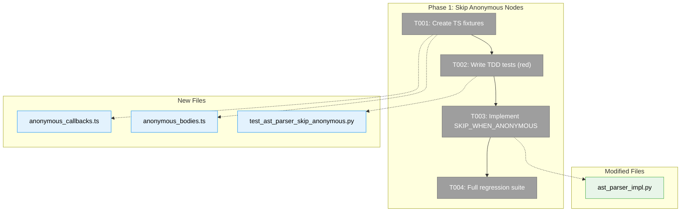
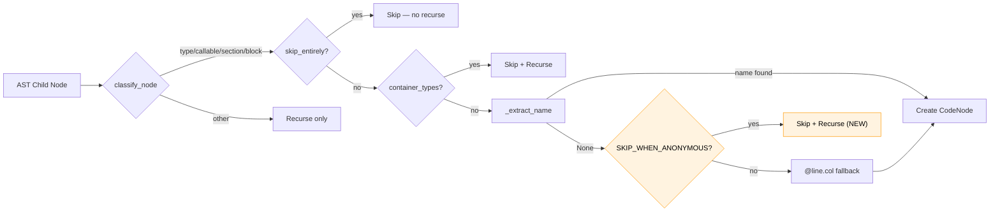
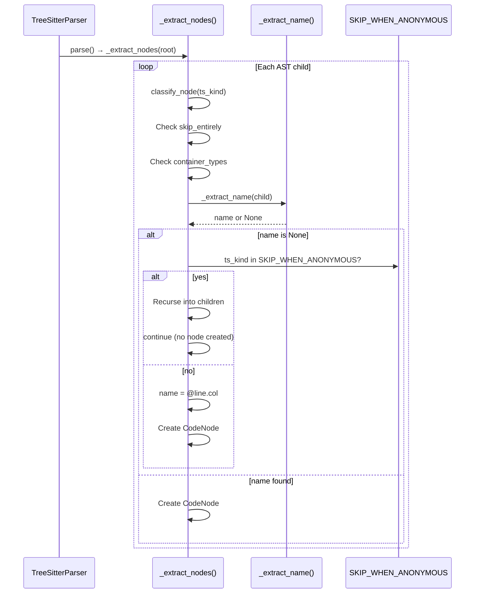

# Phase 1: Skip Anonymous TypeScript Nodes — Tasks & Context Brief

**Plan**: [better-node-parsing-plan.md](../../better-node-parsing-plan.md)
**Phase**: Phase 1 (only phase — Simple mode)
**Generated**: 2026-03-08
**Status**: Ready for implementation

---

## Executive Briefing

**Purpose**: Eliminate the 13,649 useless anonymous `@line.column` nodes that fs2 produces when scanning TypeScript/TSX codebases. These nodes are 58.6% of the graph, waste 67% of storage, ~11K LLM calls, and ~13.5K embedding API calls per scan.

**What We're Building**: A `SKIP_WHEN_ANONYMOUS` constant (set of 10 tree-sitter node kinds) and a conditional skip block in `_extract_nodes()` that prevents node creation for these kinds when unnamed, while still recursing into their children to find named structures inside.

**Goals**:
- ✅ Anonymous `arrow_function`, `interface_body`, `class_body`, `class_heritage`, `enum_body`, `function_type`, `function`, `function_expression`, `generator_function`, `implements_clause` produce no `@line.col` nodes
- ✅ Named instances of these kinds still extract correctly
- ✅ Named functions nested inside anonymous callbacks still get extracted
- ✅ All existing Python/Rust/Go tests pass unchanged
- ✅ New TDD tests prevent regression

**Non-Goals**:
- ❌ No new TypeScript language handler
- ❌ No changes to `classify_node()` or `@line.col` naming convention
- ❌ No new documentation beyond code comments
- ❌ No new domains

---

## Prior Phase Context

_Phase 1 — no prior phases._

---

## Pre-Implementation Check

| File | Exists? | Domain Check | Notes |
|------|---------|-------------|-------|
| `src/fs2/core/adapters/ast_parser_impl.py` | ✅ EXISTS | AST Parsing ✅ | Modify — add `SKIP_WHEN_ANONYMOUS` constant + conditional block after line 659 |
| `tests/fixtures/ast_samples/typescript/anonymous_callbacks.ts` | ❌ NEW | AST Parsing ✅ | Create — TS fixture with anonymous/named arrow fns and nested named fns |
| `tests/fixtures/ast_samples/typescript/anonymous_bodies.ts` | ❌ NEW | AST Parsing ✅ | Create — TS fixture with interface_body, class_body, etc. |
| `tests/unit/adapters/test_ast_parser_skip_anonymous.py` | ❌ NEW | AST Parsing ✅ | Create — TDD tests for all 10 skip_when_anonymous kinds |
| `tests/fixtures/ast_samples/typescript/` | ✅ EXISTS | — | Directory exists with 4 existing fixtures |

**Concept duplication check**: No existing concept for "skip when anonymous" — `skip_entirely` (hard stop, no recurse) and `container_types` (always skip + recurse) are related but distinct mechanisms.

**Harness**: No agent harness configured. Agent will use standard testing approach from plan.

---

## Architecture Map



---

## Tasks

| Status | ID | Task | Domain | Path(s) | Done When | Notes |
|--------|-----|------|--------|---------|-----------|-------|
| [x] | T001 | Create TypeScript test fixtures for anonymous node scenarios | AST Parsing | `tests/fixtures/ast_samples/typescript/anonymous_callbacks.ts`, `tests/fixtures/ast_samples/typescript/anonymous_bodies.ts` | Fixtures contain: (a) anonymous arrow callbacks (`describe(() => {`, `it(() => {`), (b) named arrow function (`const handler = () => {}`), (c) named `function inner()` nested inside anonymous callback, (d) `interface_body`, `class_body`, `class_heritage`, `enum_body`, `function_type`, `implements_clause` examples | TDD — fixtures first. Per Finding 06: use `ast_samples_path` fixture pattern |
| [x] | T002 | Write TDD tests for skip_when_anonymous behavior | AST Parsing | `tests/unit/adapters/test_ast_parser_skip_anonymous.py` | Tests cover all 10 skip kinds. Specifically: (a) `test_anonymous_arrow_function_skipped` — no `@line.col` callable, (b) `test_named_arrow_function_extracted` — callable with correct name, (c) `test_named_function_inside_anonymous_callback_extracted` — recursion works, (d) `test_anonymous_bodies_skipped` — interface_body/class_body/etc produce no nodes, (e) tests FAIL before T003 | TDD red phase confirmed: 11 failed, 5 passed |
| [ ] | T003 | Implement `SKIP_WHEN_ANONYMOUS` logic in `_extract_nodes()` | AST Parsing | `src/fs2/core/adapters/ast_parser_impl.py` | (a) Module-level `SKIP_WHEN_ANONYMOUS` frozenset with 10 ts_kinds, (b) After line 659 (`name = self._extract_name(...)`): if name is None AND ts_kind in set → recurse into children and `continue`, (c) `@line.col` fallback preserved for other anonymous nodes, (d) All T002 tests turn green | Per Findings 01, 02, 04. Model recurse-and-continue on lines 627-639 (`container_types` block) |
| [ ] | T004 | Run full existing test suite — verify no regressions | AST Parsing | `tests/` | `uv run pytest tests/ -x -q` passes with zero failures. Existing Python/Rust/Go parser tests unchanged. | AC5, AC6. If any node count assertions break, update them to reflect correct (fewer) node counts |

---

## Context Brief

### Key Findings from Plan

- **Finding 01** (Critical): Root cause at `ast_parser_impl.py:660-666`. Insert `SKIP_WHEN_ANONYMOUS` check between `_extract_name()` call (line 659) and `@line.col` fallback (line 660-666).
- **Finding 02** (Critical): Recursion MUST continue into skipped nodes. Model on `container_types` pattern at lines 627-639 — same recurse-into-children-and-continue approach.
- **Finding 03** (High): Named arrow fns work correctly — `_extract_name()` finds the identifier on the parent `variable_declarator`. Anonymous arrow fns have no identifier → returns None. The fix intercepts this None.
- **Finding 04** (High): Three-tier skip architecture: `skip_entirely` (hard stop) → `container_types` (always skip + recurse) → `SKIP_WHEN_ANONYMOUS` (skip ONLY when unnamed + recurse).
- **Finding 05** (Medium): Zero existing tests for this scenario. TDD is critical.
- **Finding 06** (Medium): Use `ast_samples_path` fixture from `conftest.py:168`.

### Domain Dependencies

- `AST Parsing`: `classify_node()` (code_node.py) — categorizes ts_kind → universal category. We consume this; don't change it.
- `AST Parsing`: `_extract_name()` (ast_parser_impl.py:738-776) — extracts name or returns None. We consume this; don't change it.
- `AST Parsing`: `get_handler()` (ast_languages/__init__.py) — returns language handler with `container_types`. We consume this; don't change it.

### Domain Constraints

- No imports from services layer into adapters (Clean Architecture)
- CodeNode is frozen — no mutation after creation
- Test doubles use fakes, not mocks (project convention)
- `SKIP_WHEN_ANONYMOUS` is a module-level constant, not a language handler property (per spec NG1)

### Harness Context

No agent harness configured. Agent will use standard testing approach from plan.

### Reusable from Prior Phases

_Phase 1 — nothing to reuse. However, existing infrastructure is available:_
- `ast_samples_path` fixture (conftest.py:168) — path to test fixtures
- `TreeSitterParser` constructor pattern from existing tests
- `FakeConfigurationService` + `FakeLogAdapter` for DI setup in tests
- 4 existing TypeScript fixtures in `tests/fixtures/ast_samples/typescript/`

### System Flow — Skip Decision Point



### Extraction Sequence



---

## Discoveries & Learnings

_Populated during implementation by plan-6._

| Date | Task | Type | Discovery | Resolution | References |
|------|------|------|-----------|------------|------------|

---

## Directory Layout

```
docs/plans/030-better-node-parsing/
  ├── better-node-parsing-spec.md
  ├── better-node-parsing-plan.md
  ├── exploration.md
  ├── workshop.md
  └── tasks/phase-1-skip-anonymous-nodes/
      ├── tasks.md                    ← this file
      ├── tasks.fltplan.md            ← flight plan (below)
      └── execution.log.md            # created by plan-6
```
