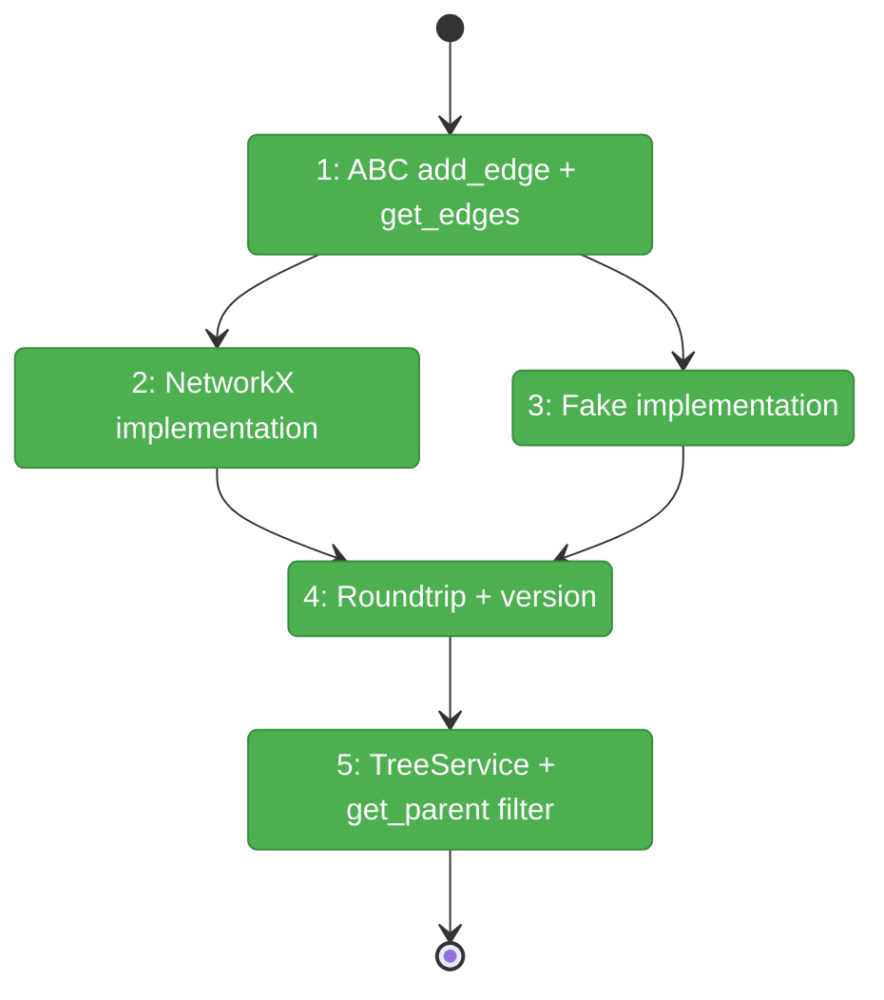
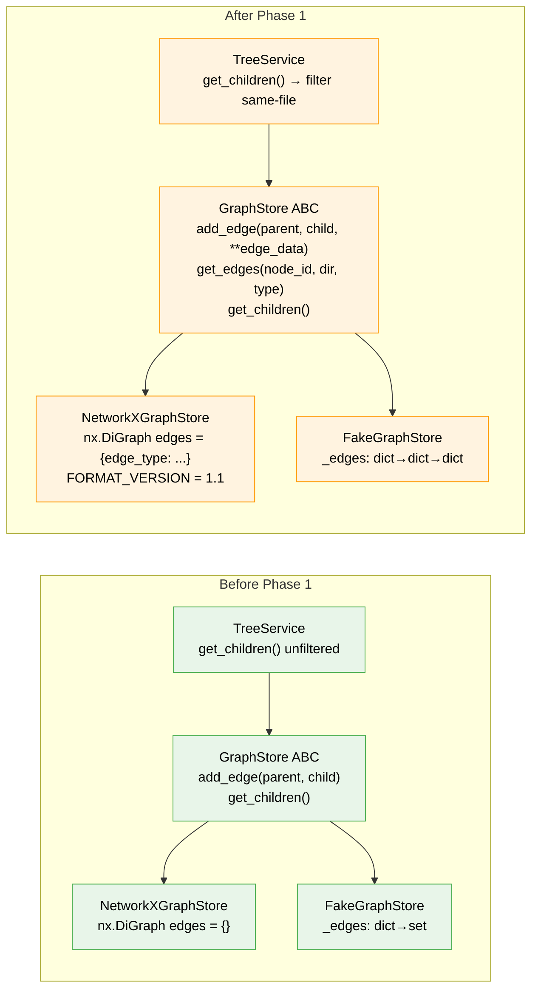

# Flight Plan: Phase 1 — GraphStore Edge Infrastructure

**Plan**: [cross-file-rels-plan.md](../../cross-file-rels-plan.md)
**Phase**: Phase 1: GraphStore Edge Infrastructure
**Generated**: 2026-03-13
**Status**: Landed

---

## Departure → Destination

**Where we are**: The fs2 graph stores nodes (CodeNode) with containment edges only (parent → child). Edges carry no attributes — `add_edge(parent_id, child_id)` is the only signature. There is no way to query edges by type or direction. TreeService trusts that all successors are containment children.

**Where we're going**: `add_edge()` accepts optional metadata (`**edge_data`), edges can carry `edge_type="references"` attributes, a new `get_edges(node_id, direction, edge_type)` method queries them, edge attributes survive save/load, and TreeService correctly ignores cross-file edges in tree output. Graph format is version 1.1.

---

## Domain Context

### Domains We're Changing

| Domain | What Changes | Key Files |
|--------|-------------|-----------|
| core/repos | GraphStore ABC gains `get_edges()`; `add_edge()` gains `**edge_data`; both impls updated | `graph_store.py`, `graph_store_impl.py`, `graph_store_fake.py` |
| core/services | TreeService filters cross-file edges from `get_children()` results | `tree_service.py` |

### Domains We Depend On (no changes)

| Domain | What We Consume | Contract |
|--------|----------------|----------|
| core/models | CodeNode (frozen dataclass, node_id format) | `CodeNode.node_id` = `{category}:{file_path}:{qualified_name}` |

---

## Flight Status

<!-- Updated by /plan-6-v2: pending → active → done. Use blocked for problems/input needed. -->

**Legend**: grey = pending | yellow = active | red = blocked/needs input | green = done

---

## Stages

<!-- Updated by /plan-6-v2 during implementation: [ ] → [~] → [x] -->

- [x] **Stage 1: ABC contract changes** — Add `**edge_data` to `add_edge()` and new `get_edges()` abstract method (`graph_store.py`)
- [x] **Stage 2: NetworkX implementation** — Implement `get_edges()` and pass `**edge_data` to networkx (`graph_store_impl.py`)
- [x] **Stage 3: Fake implementation** — Track edge data dict, implement `get_edges()` (`graph_store_fake.py`)
- [x] **Stage 4: Roundtrip + version** — Save/load test for edge attributes, bump FORMAT_VERSION to 1.1 (`graph_store_impl.py`)
- [ ] **Stage 5: TreeService + get_parent filter** — Filter `get_children()` results to same-file only; fix `get_parent()` to return containment parent only (`tree_service.py`, `graph_store_impl.py`, `graph_store_fake.py`)

---

## Architecture: Before & After

**Legend**: existing (green, unchanged) | changed (orange, modified) | new (blue, created)

---

## Acceptance Criteria

- [ ] [AC5] `get_edges()` returns edges filtered by `edge_type` and `direction`
- [ ] [AC10] Graph format version is 1.1; old 1.0 graphs load without error
- [ ] Existing tests pass unchanged (backward compatibility)
- [ ] Tree output unchanged when no cross-file edges present
- [ ] Edge attributes survive pickle save + RestrictedUnpickler load

## Goals & Non-Goals

**Goals**: Typed edge storage, edge query API, tree safety, format version bump
**Non-Goals**: No Serena integration, no config, no CLI, no MCP changes

---

## Checklist

- [x] T001: Modify `GraphStore.add_edge()` to accept `**edge_data`
- [x] T002: Add `GraphStore.get_edges()` abstract method
- [x] T003: Implement `get_edges()` in NetworkXGraphStore
- [x] T004: Update NetworkXGraphStore `add_edge()` to pass `**edge_data`
- [x] T005: Update FakeGraphStore — track edge data + implement `get_edges()`
- [x] T006: Add save/load roundtrip test for edge attributes
- [x] T007: Bump FORMAT_VERSION to "1.1"
- [x] T008: Fix TreeService to filter cross-file edges from `get_children()`
- [x] T009: Fix `get_parent()` in both implementations to filter cross-file edges
