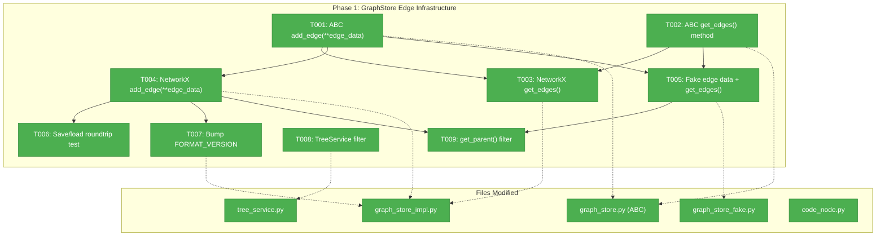
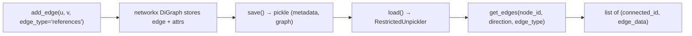
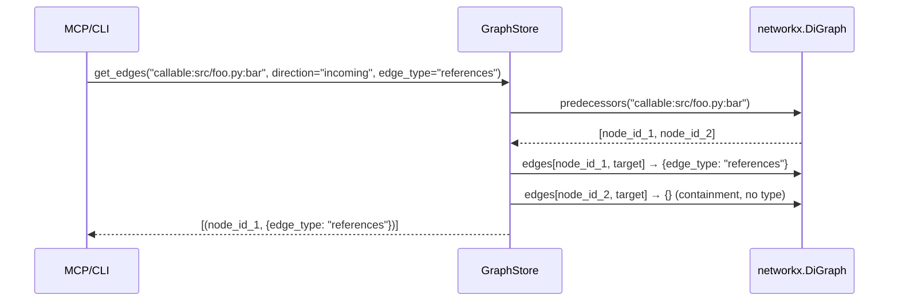

# Phase 1: GraphStore Edge Infrastructure — Tasks

## Executive Briefing

**Purpose**: Enable the graph layer to store typed edge attributes (e.g., `edge_type="references"`) alongside existing containment edges, and provide a query API (`get_edges`) to retrieve them by direction and type. This is the foundation layer — all subsequent phases depend on it.

**What We're Building**: Backward-compatible changes to GraphStore ABC + both implementations (NetworkX, Fake) that allow edges to carry metadata, plus a `get_edges()` query method. Also fixing TreeService so cross-file edges don't pollute containment trees. Bumping graph format to 1.1.

**Goals**:
- ✅ `add_edge()` accepts optional `**edge_data` — existing callers unchanged
- ✅ New `get_edges(node_id, direction, edge_type)` on ABC + both impls
- ✅ Edge attributes survive save/load roundtrip (pickle)
- ✅ TreeService filters cross-file edges from containment children
- ✅ FORMAT_VERSION bumped 1.0 → 1.1

**Non-Goals**:
- ❌ Not creating CrossFileRelsStage (Phase 2)
- ❌ Not wiring config or CLI flags (Phase 3)
- ❌ Not connecting to Serena in any way
- ❌ Not modifying MCP output (Phase 3)

---

## Prior Phase Context

*Phase 1 — no prior phases.*

---

## Pre-Implementation Check

| File | Exists? | Domain | Action | Notes |
|------|---------|--------|--------|-------|
| `src/fs2/core/repos/graph_store.py` | ✅ Yes | core/repos | Modify | ABC — add `get_edges()` method, modify `add_edge()` signature |
| `src/fs2/core/repos/graph_store_impl.py` | ✅ Yes | core/repos | Modify | Implement `get_edges()`, pass `**edge_data` to networkx, bump FORMAT_VERSION |
| `src/fs2/core/repos/graph_store_fake.py` | ✅ Yes | core/repos | Modify | Track edge data, implement `get_edges()` |
| `src/fs2/core/services/tree_service.py` | ✅ Yes | core/services | Modify | Filter `get_children()` results to exclude cross-file edges |
| `tests/unit/repos/test_graph_store.py` | ✅ Yes | tests | Modify | Add ABC contract test for `get_edges` |
| `tests/unit/repos/test_graph_store_impl.py` | ✅ Yes | tests | Modify | Add edge attribute tests, roundtrip test |
| `tests/unit/repos/test_graph_store_fake.py` | ✅ Yes | tests | Modify | Add edge data tracking tests |
| `tests/unit/services/test_tree_service.py` | ✅ Yes | tests | Modify | Add cross-file edge filtering test |

**Concept duplication check**: No existing `get_edges` method, `edge_type`, or typed edge concept in the codebase. Safe to introduce.

**Harness**: No agent harness configured. Agent will use standard testing approach (`uv run pytest`).

---

## Architecture Map



---

## Tasks

| Status | ID | Task | Domain | Path(s) | Done When | Notes |
|--------|-----|------|--------|---------|-----------|-------|
| [x] | T001 | Modify `GraphStore.add_edge()` to accept `**edge_data: Any` | core/repos | `src/fs2/core/repos/graph_store.py` L54-68 | Existing callers work unchanged; new callers can pass `edge_type="references"` and it's preserved | Finding 02. TDD. Contract change — update docstring to document `**edge_data` usage. Keep `parent_id`/`child_id` positional args. |
| [x] | T002 | Add `GraphStore.get_edges()` abstract method | core/repos | `src/fs2/core/repos/graph_store.py` | `get_edges(node_id, direction="outgoing", edge_type=None)` returns `list[tuple[str, dict]]`. Direction: `"incoming"`, `"outgoing"`, `"both"`. `edge_type` filters to specific type or None for all. | Finding 04. TDD. Contract change. |
| [x] | T003 | Implement `get_edges()` in NetworkXGraphStore | core/repos | `src/fs2/core/repos/graph_store_impl.py` | Direction=outgoing returns successors with edge data; incoming returns predecessors; both returns union; edge_type filters correctly; empty list for unknown node_id | TDD. Uses `self._graph.successors()`, `self._graph.predecessors()`, `self._graph.edges[u, v]` for data. |
| [x] | T004 | Update NetworkXGraphStore `add_edge()` to pass `**edge_data` | core/repos | `src/fs2/core/repos/graph_store_impl.py` L149-173 | `self._graph.add_edge(parent_id, child_id, **edge_data)` — edge attributes stored in networkx graph. `self._graph.edges[u, v]` returns the edge_data dict. | Finding 02. TDD. Change line 173: `self._graph.add_edge(parent_id, child_id)` → `self._graph.add_edge(parent_id, child_id, **edge_data)`. |
| [x] | T005 | Update FakeGraphStore — track edge data + implement `get_edges()` | core/repos | `src/fs2/core/repos/graph_store_fake.py` L70-71, L108-132, L152-169 | `_edges` structure stores edge data dict per (parent, child) pair. `get_edges()` returns correct results with filtering. `add_edge()` records edge_data in call_history. | Finding 03. TDD. Change `_edges: dict[str, set[str]]` → `_edges: dict[str, dict[str, dict[str, Any]]]` (parent → child → edge_data). Update `_reverse_edges` to support multiple parents. |
| [x] | T006 | Add save/load roundtrip test for edge attributes | core/repos | `tests/unit/repos/test_graph_store_impl.py` | Test: add_edge with `edge_type="references"` → save → load → `get_edges()` returns same data. Edge attributes survive RestrictedUnpickler (only stdlib types). | Finding 05. Edge attrs are plain dicts — safe for pickle. Document: edge attrs MUST be plain dicts/str/int/None, no custom classes. |
| [x] | T007 | Bump FORMAT_VERSION to "1.1" | core/repos | `src/fs2/core/repos/graph_store_impl.py` L36 | `FORMAT_VERSION = "1.1"`. Old 1.0 graphs load with warning (existing behavior). New graphs save as 1.1. | Finding 06. DYK-02: 3 tests hardcode "1.0" — `test_graph_store_impl.py:370` (assert == "1.0" → change to "1.1"), `test_graph_service.py:36` (fixture → use `FORMAT_VERSION` constant), `test_graph_store_impl.py:525` (security test — leave as "1.0", that's intentional). |
| [x] | T008 | Fix TreeService to filter cross-file edges from `get_children()` | core/services | `src/fs2/core/services/tree_service.py` L388, L535; `src/fs2/core/models/code_node.py` | When `get_children()` returns nodes, filter to same-file only. Cross-file edges (nodes from different files) are excluded from tree display. | Finding 01. Critical. TDD. Filter at TreeService level — `get_children()` contract stays generic (returns all successors). DYK-04: Add `file_path` `@property` to CodeNode that parses `node_id.split(":", 2)[1]` — consistent for all categories (verified: 0 mismatches across 466 edges). Then TreeService filters via `child.file_path == parent.file_path`. Property is reusable by T009, Phase 2, and MCP consumers. |
| [x] | T009 | Fix `get_parent()` in both implementations to filter cross-file edges | core/repos | `src/fs2/core/repos/graph_store_impl.py` L207-225, `src/fs2/core/repos/graph_store_fake.py` L171-190 | `get_parent()` returns the containment parent only — never a cross-file reference node. NetworkXGraphStore filters predecessors by edge_type (containment edges have no `edge_type` key). FakeGraphStore `_reverse_edges` tracks containment parent separately from reference edges. | DYK-01. Critical. TDD. NetworkXGraphStore.get_parent() currently returns `predecessors[0]` assuming single parent — cross-file edges break this. FakeGraphStore._reverse_edges is `dict[str, str]` which overwrites on multiple predecessors. Both must filter to containment edges only. |

---

## Context Brief

**Key findings from plan**:
- Finding 01 (Critical): `get_children()` returns ALL successors — TreeService must filter cross-file edges → **T008**
- DYK-01 (Critical): `get_parent()` returns first predecessor — cross-file edges will return wrong parent. Both impls broken → **T009**
- Finding 02 (High): `add_edge()` has no `**kwargs` → **T001, T004**
- Finding 03 (High): FakeGraphStore can't store edge data → **T005**
- Finding 04 (High): No `get_edges()` method exists → **T002, T003**
- Finding 05 (Medium): Edge attrs must be plain dicts for RestrictedUnpickler → **T006**
- Finding 06 (Medium): FORMAT_VERSION needs bump → **T007**

**Domain dependencies**:
- `core/repos`: `GraphStore` ABC (contract) — we're modifying this ABC
- `core/models`: `CodeNode` (frozen dataclass) — consumed as-is, node_id format `{category}:{file_path}:{qualified_name}`
- `core/services`: `TreeService` — consumes `GraphStore.get_children()`, needs filter fix

**Domain constraints**:
- GraphStore ABC is a **contract** — changes propagate to both implementations (NetworkX + Fake)
- `add_edge(**edge_data)` must be backward compatible — existing callers pass no kwargs
- Edge attributes must be plain Python types only (dict, str, int, None) — RestrictedUnpickler whitelist
- TreeService is in `core/services` — it can import from `core/repos` (allowed by dependency flow)

**Reusable from prior phases**: N/A (Phase 1)

**Testing approach**:
- TDD for T001–T005, T008 (GraphStore ABC changes, impl, fake, tree filtering)
- Lightweight for T006 (roundtrip test), T007 (version bump)
- Run full test suite after all changes: `uv run pytest -x`
- Marker: `pytest.ini` excludes `slow` tests by default (`-m "not slow"`)

**Mermaid flow diagram** (edge lifecycle):


**Mermaid sequence diagram** (get_edges flow):


---

## Discoveries & Learnings

_Populated during implementation by plan-6._

| Date | Task | Type | Discovery | Resolution | References |
|------|------|------|-----------|------------|------------|
| 2026-03-13 | T008 | gotcha | `make_method_node` params are (file, class_name, method_name) not (file, name, qname) | Fixed test parameter order | test_tree_service.py |
| 2026-03-13 | T008 | gotcha | `build_tree(pattern="src/b.py")` uses folder mode (has "/") not pattern mode | Use `file:src/b.py` for exact node match | tree_service.py:239 |
| 2026-03-13 | T009 | insight | get_parent tests pass by accident when containment edge added first — must reverse order to expose bug | Tests insert reference edge FIRST to prove order-independence | test_graph_store_impl.py |
| 2026-03-13 | T007 | gotcha | `test_graph_service.py` fixtures hardcode "1.0" — breaks on version bump | Import FORMAT_VERSION constant instead | DYK-02 |
| 2026-03-13 | T001 | insight | SimpleFakeGraphStore in test_search_service.py is duck-typed, not ABC subclass — no update needed | No action | test_search_service.py:59 |

---

## Directory Layout

```
docs/plans/031-cross-file-rels/
  ├── cross-file-rels-spec.md
  ├── cross-file-rels-plan.md
  ├── exploration.md
  ├── workshops/
  │   ├── 001-edge-storage.md
  │   ├── 002-serena-benchmarks.md
  │   ├── 003-cli-changes.md
  │   ├── 004-multi-project.md
  │   └── 005-stdio-vs-http.md
  └── tasks/phase-1-graphstore-edge-infrastructure/
      ├── tasks.md                ← this file
      ├── tasks.fltplan.md        ← flight plan (below)
      └── execution.log.md       ← created by plan-6
```
