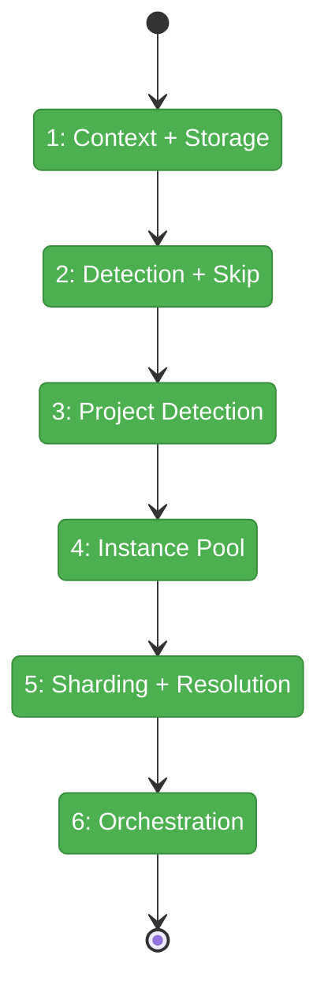
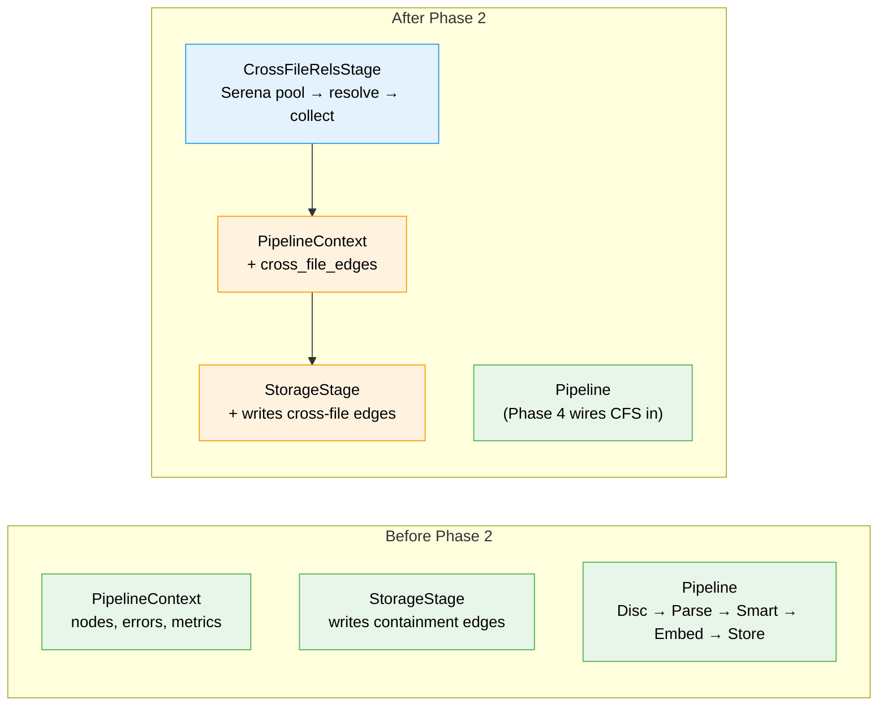

# Flight Plan: Phase 2 — CrossFileRels Pipeline Stage

**Plan**: [cross-file-rels-plan.md](../../cross-file-rels-plan.md)
**Phase**: Phase 2: CrossFileRels Pipeline Stage
**Generated**: 2026-03-13
**Status**: Landed

---

## Departure → Destination

**Where we are**: The graph layer can store typed edge attributes (`edge_type="references"`) and query them via `get_edges()`. TreeService and `get_parent()` correctly filter cross-file edges. But no cross-file edges are created yet — the graph is still containment-only.

**Where we're going**: Running `fs2 scan` on a Python project with Serena installed will resolve cross-file references across all callable/type nodes, collecting `(source_id, target_id, {edge_type: "references"})` tuples into `PipelineContext.cross_file_edges`, which StorageStage writes to the graph. When Serena isn't available, scan completes normally with an info message.

---

## Domain Context

### Domains We're Changing

| Domain | What Changes | Key Files |
|--------|-------------|-----------|
| core/services | PipelineContext gains `cross_file_edges` field | `pipeline_context.py` |
| core/services/stages | New CrossFileRelsStage; StorageStage writes cross-file edges | `cross_file_rels_stage.py` (new), `storage_stage.py` |

### Domains We Depend On (no changes)

| Domain | What We Consume | Contract |
|--------|----------------|----------|
| core/repos | `GraphStore.add_edge(**edge_data)`, `get_node()` | GraphStore ABC |
| core/models | `CodeNode.file_path` property | CodeNode frozen dataclass |
| core/services/stages | `PipelineStage` protocol (`.name`, `.process()`) | pipeline_stage.py |

---

## Flight Status

<!-- Updated by /plan-6-v2: pending → active → done. Use blocked for problems/input needed. -->

**Legend**: grey = pending | yellow = active | red = blocked/needs input | green = done

---

## Stages

<!-- Updated by /plan-6-v2 during implementation: [ ] → [~] → [x] -->

- [x] **Stage 1: Context + Storage** — Add `cross_file_edges` to PipelineContext; update StorageStage to write them (`pipeline_context.py`, `storage_stage.py`)
- [x] **Stage 2: Detection + Skip** — Serena availability detection + graceful skip logic (`cross_file_rels_stage.py` — new file)
- [x] **Stage 3: Project Detection** — Marker file walk + Serena project auto-creation (`cross_file_rels_stage.py`)
- [x] **Stage 4: Instance Pool** — Start/wait-ready/stop N Serena MCP server instances (`cross_file_rels_stage.py`)
- [x] **Stage 5: Sharding + Resolution** — Round-robin node distribution + FastMCP reference resolution (`cross_file_rels_stage.py`)
- [x] **Stage 6: Orchestration** — Full `process()` flow wiring all components (`cross_file_rels_stage.py`)

---

## Architecture: Before & After

**Legend**: existing (green, unchanged) | changed (orange, modified) | new (blue, created)

---

## Acceptance Criteria

- [ ] [AC1] `CrossFileRelsStage.process()` produces `cross_file_edges` with `edge_type="references"`
- [ ] [AC4] When Serena not installed: no errors, info message, `cross_file_rels_skipped=True` metric
- [ ] [AC7] Resolution < 60s for ≤5000 nodes with 20 instances (benchmark, not unit test)
- [ ] StorageStage writes cross-file edges and records write/skip metrics
- [ ] Edges where either node doesn't exist in graph are skipped (DYK-05)
- [ ] Edges where source contains target are skipped (DYK-03)

## Goals & Non-Goals

**Goals**: Serena pool management, project detection, node sharding, reference resolution, edge collection, graceful degradation
**Non-Goals**: No config objects, no CLI flags, no MCP output, no wiring into ScanPipeline defaults

---

## Checklist

- [x] T001: Add `cross_file_edges` field to PipelineContext
- [x] T002: Update StorageStage to write `cross_file_edges`
- [x] T003: Implement Serena availability detection
- [x] T004: Implement project detection (marker file walk)
- [x] T005: Implement Serena project auto-creation
- [x] T006: Implement Serena instance pool (start/wait/stop)
- [x] T007: Implement node sharding (round-robin by project)
- [x] T008: Implement reference resolution (FastMCP)
- [x] T009: Implement CrossFileRelsStage.process() orchestration
- [x] T010: Implement graceful skip logic
