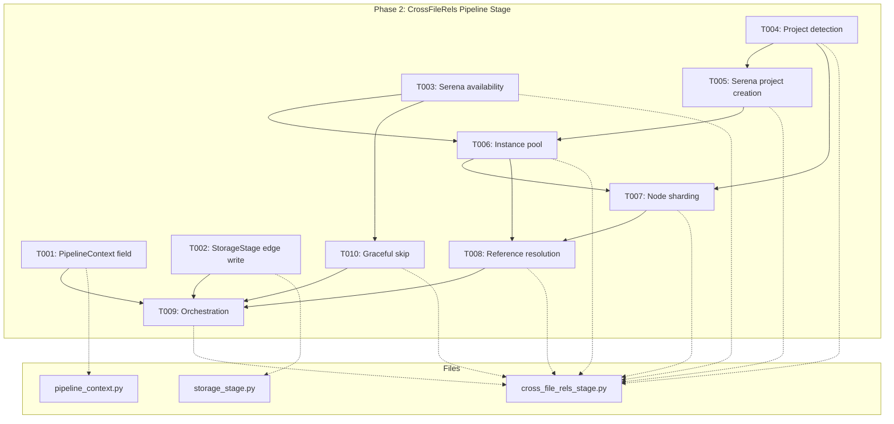
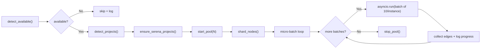
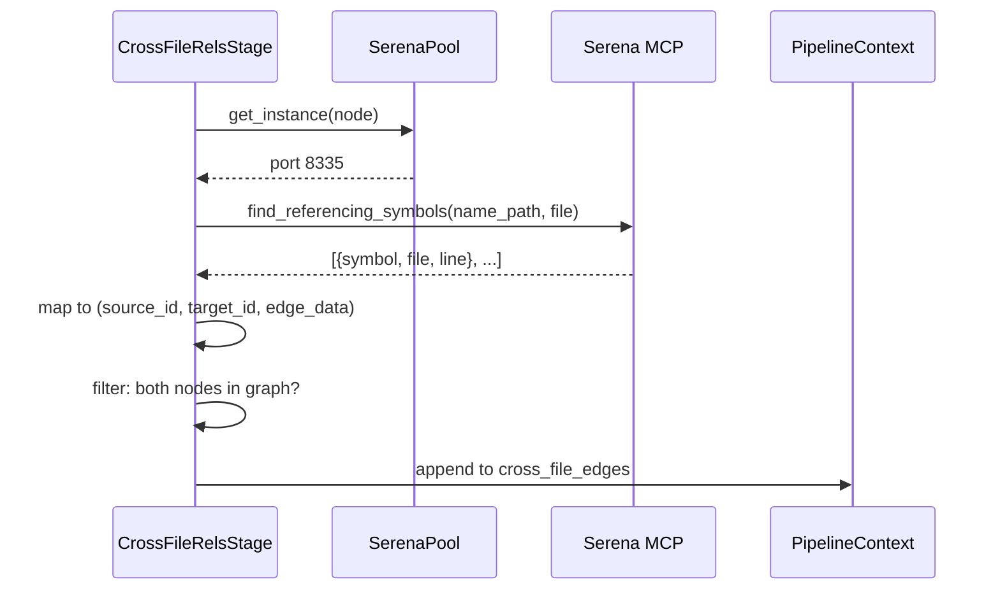

# Phase 2: CrossFileRels Pipeline Stage — Tasks

## Executive Briefing

**Purpose**: Build the pipeline stage that spawns Serena (LSP/Pyright) instances, shards nodes across them, resolves cross-file references, and collects edges into `PipelineContext` for StorageStage to write. This is the core engine — without it, the graph stays containment-only.

**What We're Building**: A `CrossFileRelsStage` class implementing the `PipelineStage` protocol. It detects project roots, starts a pool of Serena MCP server instances, distributes nodes round-robin, queries `find_referencing_symbols` for each, and collects `(source_id, target_id, edge_data)` tuples. Also updating `PipelineContext` with a `cross_file_edges` field and `StorageStage` to write those edges.

**Goals**:
- ✅ `PipelineContext` gains `cross_file_edges` field for stage-to-stage edge passing
- ✅ `StorageStage` writes cross-file edges (with pre-filtering for existing nodes)
- ✅ `CrossFileRelsStage` detects Serena availability and skips gracefully when absent
- ✅ Project roots detected via marker files (pyproject.toml, package.json, go.mod, etc.)
- ✅ Serena project auto-created + indexed if `.serena/project.yml` doesn't exist
- ✅ N parallel Serena instances managed (start, wait-ready, stop)
- ✅ Nodes sharded round-robin across instances, grouped by project
- ✅ References resolved via FastMCP client to Serena's `find_referencing_symbols`

**Non-Goals**:
- ❌ Not wiring stage into ScanPipeline default list (Phase 4)
- ❌ Not creating CrossFileRelsConfig (Phase 3)
- ❌ Not adding CLI flags (Phase 3)
- ❌ Not modifying MCP output (Phase 3)
- ❌ Not cross-project references (v1 limitation)

---

## Prior Phase Context

### Phase 1: GraphStore Edge Infrastructure (✅ Complete)

**A. Deliverables**:
- `src/fs2/core/repos/graph_store.py` — `add_edge(**edge_data)` + `get_edges()` on ABC
- `src/fs2/core/repos/graph_store_impl.py` — NetworkX impl, FORMAT_VERSION=1.1, `get_parent()` filters containment
- `src/fs2/core/repos/graph_store_fake.py` — Restructured edge storage, `get_edges()`, `get_parent()` filters
- `src/fs2/core/services/tree_service.py` — `_get_containment_children()` filter
- `src/fs2/core/models/code_node.py` — `file_path` @property

**B. Dependencies Exported**:
- `GraphStore.add_edge(parent_id, child_id, **edge_data)` — backward compatible, plain dict types only
- `GraphStore.get_edges(node_id, direction, edge_type)` → `list[tuple[str, dict]]`
- `CodeNode.file_path` → `str` (parses from node_id)
- `GraphStore.get_parent()` — filters to containment edges only
- Graph format v1.1 — edge attributes survive pickle roundtrip

**C. Gotchas & Debt**:
- Edge attributes MUST be plain Python types (dict/str/int/None) — RestrictedUnpickler whitelist
- `get_children()` returns ALL successors including reference edges — filter at consumer level
- `make_method_node` test helper takes `(file_path, class_name, method_name)` not `(file, name, qname)`
- `build_tree(pattern="src/b.py")` uses folder mode (has "/") — use `file:src/b.py` for exact match

**D. Incomplete Items**: None — all 9 tasks complete, 1356 tests pass, 0 regressions

**E. Patterns to Follow**:
- Containment edges: no `edge_type` attribute. Reference edges: `edge_type="references"`
- `GraphStore.add_edge()` raises `GraphStoreError` if either node doesn't exist — **pre-filter required**
- Skip reference edge if source already contains target (DYK-03 — containment wins on same u,v pair)
- TDD: write tests first, then implement. Fakes over mocks per doctrine
- Test `get_parent()` with reference edge inserted FIRST to prove order-independence

---

## Pre-Implementation Check

| File | Exists? | Domain | Action | Notes |
|------|---------|--------|--------|-------|
| `src/fs2/core/services/pipeline_context.py` | ✅ Yes | core/services | Modify | Add `cross_file_edges` field |
| `src/fs2/core/services/stages/storage_stage.py` | ✅ Yes | core/services/stages | Modify | Add cross-file edge write loop |
| `src/fs2/core/services/stages/cross_file_rels_stage.py` | ❌ No | core/services/stages | **Create** | New file ~600-800 lines |
| `src/fs2/core/services/stages/pipeline_stage.py` | ✅ Yes | core/services/stages | Consume | Protocol to implement |
| `src/fs2/core/services/stages/discovery_stage.py` | ✅ Yes | core/services/stages | Reference | Pattern for error handling + metrics |
| `fastmcp` in pyproject.toml | ✅ Yes (L8) | deps | Consume | `fastmcp>=2.0.0` already present |
| `scripts/serena-explore/benchmark_multi.py` | ✅ Yes | reference | Consume | Proven Serena pool + FastMCP patterns |

**Concept duplication check**: No existing `CrossFileRelsStage`, `SerenaPool`, or `ProjectDetector` in the codebase. Safe to introduce.

**Harness**: No agent harness configured. Agent will use standard testing approach (`uv run python -m pytest`).

---

## Architecture Map



---

## Tasks

| Status | ID | Task | Domain | Path(s) | Done When | Notes |
|--------|-----|------|--------|---------|-----------|-------|
| [x] | T001 | Add `cross_file_edges` field to PipelineContext | core/services | `src/fs2/core/services/pipeline_context.py` | `cross_file_edges: list[tuple[str, str, dict]]` field with `default_factory=list`. Existing stages unaffected. | Lightweight. Type is `list[tuple[source_id, target_id, edge_data_dict]]`. |
| [x] | T002 | Update StorageStage to write `cross_file_edges` | core/services/stages | `src/fs2/core/services/stages/storage_stage.py` | After containment edges, iterates `context.cross_file_edges` and calls `add_edge(source, target, **edge_data)`. Pre-filters: skip edges where either node not in graph (DYK-05). Skip edges where source already contains target (DYK-03). Records metrics `cross_file_edges_written`, `cross_file_edges_skipped`. | TDD. Wrap `add_edge` in try/except GraphStoreError as safety net. Follow existing edge-writing pattern at L62-70. |
| [x] | T003 | Implement Serena availability detection | core/services/stages | `src/fs2/core/services/stages/cross_file_rels_stage.py` | `is_serena_available()` returns `True` when `serena-mcp-server` on PATH via `shutil.which()`, `False` otherwise. | TDD. Pure function, no side effects. Per workshop 002. |
| [x] | T004 | Implement project detection (marker file walk) | core/services/stages | `src/fs2/core/services/stages/cross_file_rels_stage.py` | `detect_project_roots(scan_root)` returns `list[ProjectRoot]` where each has `path` and `languages`. Finds roots by marker files (pyproject.toml→python, package.json→typescript, go.mod→go, Cargo.toml→rust, etc.). Deepest-first sort so child projects match before parents. | TDD. Per workshop 004. Define `ProjectRoot` as a frozen dataclass. |
| [x] | T005 | Implement Serena project auto-creation | core/services/stages | `src/fs2/core/services/stages/cross_file_rels_stage.py` | `ensure_serena_project(project_root)` creates `.serena/project.yml` via `serena project create` subprocess if not exists. Skips if already exists. Runs `--index` for initial index. | TDD with FakeSubprocessRunner (fake over mock per doctrine). Abstract subprocess behind interface for testability. DYK-P2-06: `serena project create` is one-time (creates YAML config). Every scan starts fresh Pyright instances that re-analyze current files — no stale data. Log `"Creating Serena project for {root} (one-time setup)..."`. Multi-language: Serena detects languages from project markers automatically. |
| [x] | T006 | Implement Serena instance pool (start N, wait-ready, stop) | core/services/stages | `src/fs2/core/services/stages/cross_file_rels_stage.py` | `SerenaPool` class: `start(n, base_port, project)` spawns N `serena-mcp-server` processes on consecutive ports. `wait_ready(timeout)` polls until all respond. `stop()` sends SIGTERM, waits, force-kills if needed. Clean shutdown on context manager exit. | TDD with FakeSerenaPool implementing pool interface. Per workshop 002 — each instance spawns 3 processes. Port range: `base_port` to `base_port + n - 1`. DYK-P2-05: 20 instances × 3 processes = 60 processes. Use `atexit.register(pool.stop)` for crash cleanup. Write instance PIDs to `.fs2/.serena-pool.pid` so subsequent scans can detect + kill orphans from prior crashes. Check for stale PID file on pool start. |
| [x] | T007 | Implement node sharding (group by project, round-robin) | core/services/stages | `src/fs2/core/services/stages/cross_file_rels_stage.py` | `shard_nodes(nodes, project_roots, instances_per_project)` → `dict[int, list[CodeNode]]` mapping instance index to node batch. Level 1: group by project root via `CodeNode.file_path`. Level 2: round-robin within project's instance range. Unmatched files skipped. | TDD. Per workshop 004. Uses `CodeNode.file_path` property from Phase 1. |
| [x] | T008 | Implement reference resolution (FastMCP → `find_referencing_symbols`) | core/services/stages | `src/fs2/core/services/stages/cross_file_rels_stage.py` | `resolve_references(node, port)` queries Serena via FastMCP client. Maps response to `list[tuple[source_id, target_id, edge_data]]`. Only creates edges where target exists as a node_id in the graph (filter external/stdlib refs). Handles timeout + connection errors gracefully. | TDD with FakeSerenaClient implementing resolution interface. Per workshop 002 — use `find_referencing_symbols` tool with `name_path` param. Result in `result.content[0].text`. DYK-P2-01: 10s per-node timeout on `call_tool()` — skip on timeout, log warning. DYK-P2-03: Benchmark script only COUNTS refs, never maps to node_ids. Build a lookup index `{(file_path, qualified_name) → node_id}` from all graph nodes before resolution begins. For each Serena reference, look up by file + symbol name. Skip refs that don't match any node (external/stdlib/lambdas). This index is the key data structure for T008. |
| [x] | T009 | Implement CrossFileRelsStage.process() orchestration | core/services/stages | `src/fs2/core/services/stages/cross_file_rels_stage.py` | Full flow: detect availability → detect projects → ensure serena projects → start pool → shard nodes → resolve in batches → collect edges into `context.cross_file_edges` → stop pool. Records timing metrics. Returns modified context. | Integration test with fakes for all external dependencies. DYK-P2-02: Sync `process()` bridges to async via `asyncio.run(self._async_resolve(...))`. Resolution runs in **micro-batches of 10 nodes per instance** — each micro-batch is a separate `asyncio.gather()` call. Between micro-batches, control returns to sync code for progress logging and future inline-save hook. This creates natural break points for crash recovery. DYK-P2-04: ScanPipeline instantiates stages as `ClassName()` — zero-arg constructors. Phase 2 uses hardcoded defaults (20 instances, port 8330, 10s timeout). Design internal methods to accept these as parameters with defaults so Phase 3/4 can wire config through `context.scan_config` without restructuring. Follow discovery_stage.py error handling + metrics pattern. |
| [x] | T010 | Implement graceful skip (no Serena, disabled, errors) | core/services/stages | `src/fs2/core/services/stages/cross_file_rels_stage.py` | When Serena not available OR config disabled OR `--no-cross-refs`: logs info message, sets `context.metrics["cross_file_rels_skipped"] = True`, returns context unchanged. No errors raised. | TDD. Per AC4 — scan continues normally without cross-file edges. |

---

## Context Brief

**Key findings from plan**:
- Finding 01 (Critical): `get_children()` returns ALL successors — ✅ fixed in Phase 1 (TreeService filter)
- DYK-03: Skip reference edges where source already contains target — **T002 must enforce**
- DYK-05: `add_edge()` crashes on non-existent nodes — **T002 must pre-filter**
- Finding 05: Edge attrs must be plain dicts for RestrictedUnpickler — **T008 must comply**

**Domain dependencies**:
- `core/repos`: `GraphStore.add_edge(**edge_data)` — write reference edges in StorageStage
- `core/repos`: `GraphStore.get_node(node_id)` — verify target exists before edge creation
- `core/models`: `CodeNode.file_path` @property — group nodes by project root
- `core/services`: `PipelineContext` — pass edges between stages via `cross_file_edges` field
- `core/services/stages`: `PipelineStage` protocol — implement `.name` and `.process(context)`

**Domain constraints**:
- `cross_file_rels_stage.py` lives in `core/services/stages/` alongside other stages
- Must implement `PipelineStage` protocol (`.name` property + `.process(context)`)
- Must NOT import from `cli/` or `config/` — reads config from `context` (Phase 4 wires this)
- Edge data must be `{"edge_type": "references"}` — plain dict only

**Reusable from prior phases**:
- `FakeGraphStore` — restructured in Phase 1 to track edge data
- `CodeNode.file_path` property — node-to-file mapping
- `GraphStore.get_edges()` — can verify edges after writing
- `scripts/serena-explore/benchmark_multi.py` — proven Serena pool pattern (copy/adapt)
- `discovery_stage.py`, `parsing_stage.py` — error handling + metrics patterns

**Testing approach**:
- TDD for T002-T010 (all have real logic)
- Lightweight for T001 (trivial field addition)
- Fakes: `FakeSubprocessRunner`, `FakeSerenaPool`, `FakeSerenaClient` — all implement interfaces
- Run: `uv run python -m pytest -x`

**Mermaid flow diagram** (CrossFileRels stage lifecycle):


**Mermaid sequence diagram** (resolution flow per node):


---

## Discoveries & Learnings

_Populated during implementation by plan-6._

| Date | Task | Type | Discovery | Resolution | References |
|------|------|------|-----------|------------|------------|

---

## Directory Layout

```
docs/plans/031-cross-file-rels/
  ├── cross-file-rels-spec.md
  ├── cross-file-rels-plan.md
  ├── exploration.md
  ├── workshops/
  │   ├── 001-edge-storage.md
  │   ├── 002-serena-benchmarks.md
  │   ├── 003-cli-changes.md
  │   ├── 004-multi-project.md
  │   └── 005-stdio-vs-http.md
  └── tasks/
      ├── phase-1-graphstore-edge-infrastructure/
      │   ├── tasks.md            ← Phase 1 (complete)
      │   ├── tasks.fltplan.md
      │   └── execution.log.md
      └── phase-2-crossfilerels-pipeline-stage/
          ├── tasks.md            ← this file
          ├── tasks.fltplan.md    ← flight plan (below)
          └── execution.log.md   ← created by plan-6
```
