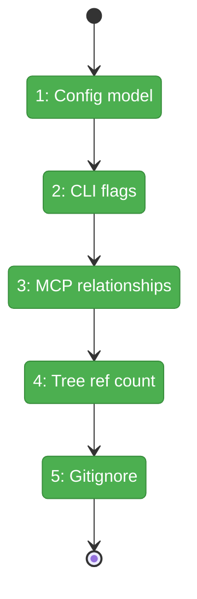
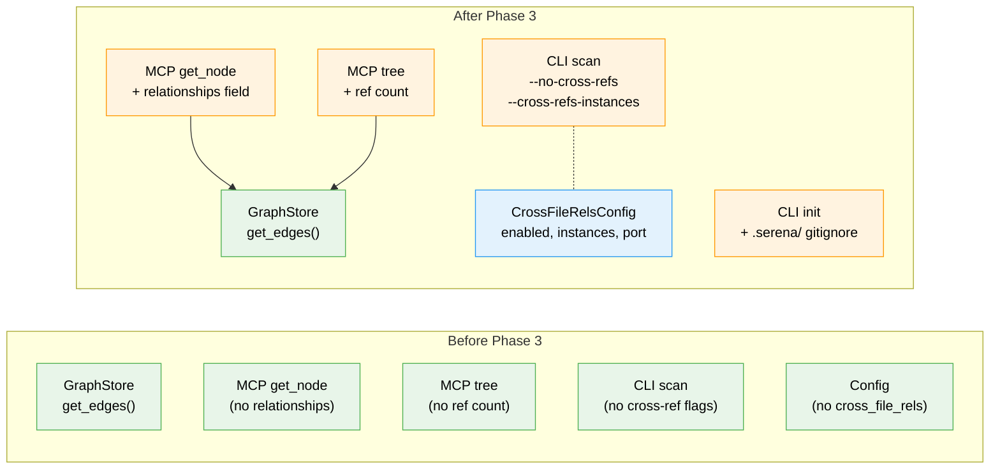

# Flight Plan: Phase 3 — Config + CLI + MCP Surface

**Plan**: [../../cross-file-rels-plan.md](../../cross-file-rels-plan.md)
**Phase**: Phase 3: Config + CLI + MCP Surface
**Generated**: 2026-03-13
**Status**: Landed

---

## Departure → Destination

**Where we are**: Phases 1–2 complete. The GraphStore ABC has `add_edge(**edge_data)` and `get_edges(node_id, direction, edge_type)`. CrossFileRelsStage resolves references via a Serena pool and stores edges in PipelineContext. StorageStage writes them to the graph. But the feature has NO user-facing surface — no config, no CLI flags, no relationship output in MCP tools. The stage hardcodes 20 instances, port 8330, and 10s timeout.

**Where we're going**: A user can configure cross-file rels via `.fs2/config.yaml` (enabled, instances, ports, timeout). `fs2 scan --no-cross-refs` skips resolution. An AI agent calling `get_node` sees `relationships: {referenced_by: [...], references: [...]}` showing who calls/imports/references that node. `tree --detail max` shows `(N refs)` per node for quick hotspot identification.

---

## Domain Context

### Domains We're Changing

| Domain | What Changes | Key Files |
|--------|-------------|-----------|
| config | New `CrossFileRelsConfig` pydantic model registered in `YAML_CONFIG_TYPES` | `src/fs2/config/objects.py` |
| cli | Two new scan flags; `.serena/` in init gitignore | `src/fs2/cli/scan.py`, `src/fs2/cli/init.py` |
| mcp | `get_node` returns relationships; tree shows ref count | `src/fs2/mcp/server.py` |

### Domains We Depend On (no changes)

| Domain | What We Consume | Contract |
|--------|----------------|----------|
| core/repos | `GraphStore.get_edges()` | ABC method from Phase 1 |
| core/models | `CodeNode` dataclass | Unchanged |
| core/services | `TreeService` / `TreeNode` | Unchanged |

---

## Flight Status

<!-- Updated by /plan-6-v2: pending → active → done. Use blocked for problems/input needed. -->

**Legend**: grey = pending | yellow = active | red = blocked/needs input | green = done

---

## Stages

<!-- Updated by /plan-6-v2 during implementation: [ ] → [~] → [x] -->

- [x] **Stage 1: Config model** — Create `CrossFileRelsConfig` with validated fields and register in YAML_CONFIG_TYPES (`objects.py`)
- [x] **Stage 2: CLI flags** — Add `--no-cross-refs` and `--cross-refs-instances` flags to scan.py (`scan.py`)
- [x] **Stage 3: MCP relationships** — Update `_code_node_to_dict` and `get_node` to include relationships from graph edges (`server.py`)
- [x] **Stage 4: Tree ref count** — Add ref count to `_tree_node_to_dict` at max detail + render in text output (`server.py`, `tree.py`)
- [x] **Stage 5: Gitignore** — Add `.serena/` to init gitignore guidance (`init.py`)

---

## Architecture: Before & After

**Legend**: existing (green, unchanged) | changed (orange, modified) | new (blue, created)

---

## Acceptance Criteria

- [ ] [AC2] `get_node` returns `relationships.referenced_by` list when edges exist
- [ ] [AC3] `--no-cross-refs` flag is parsed without error
- [ ] [AC6] MCP `get_node` includes `relationships` in output (both min and max detail)
- [ ] [AC8] Config section `cross_file_rels` parsed from YAML
- [ ] [AC9] `--cross-refs-instances 5` flag is parsed without error
- [ ] [AC11] `tree --detail max` shows ref count per node

---

## Goals & Non-Goals

**Goals**:
- Config object with validation for cross-file rels settings
- CLI flags for opt-out and instance count override
- Relationship data in MCP get_node output
- Ref count in tree max detail output
- Gitignore guidance for .serena/ artifacts

**Non-Goals**:
- Wiring config/flags through ScanPipeline (Phase 4)
- End-to-end integration testing (Phase 4)
- Dedicated `get_edges` MCP tool (future)

---

## Checklist

- [x] T001: Create `CrossFileRelsConfig` pydantic model
- [x] T002: Add `--no-cross-refs` flag to scan.py
- [x] T003: Add `--cross-refs-instances` flag to scan.py
- [x] T004: Update `_code_node_to_dict` with `graph_store` param
- [x] T005: Update `get_node` to pass store to `_code_node_to_dict`
- [x] T006: Add ref count to tree `--detail max`
- [x] T007: Add `.serena/` to gitignore guidance
