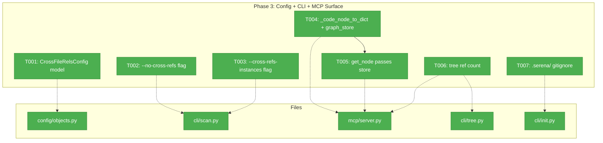
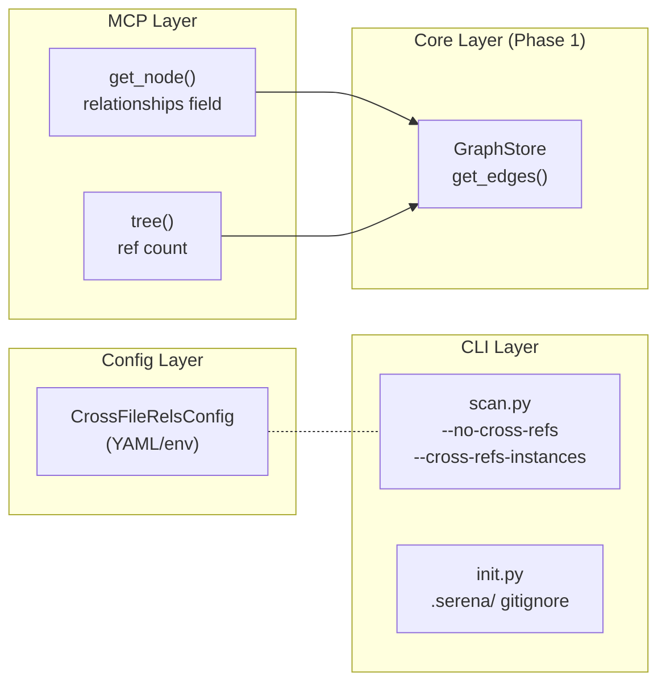
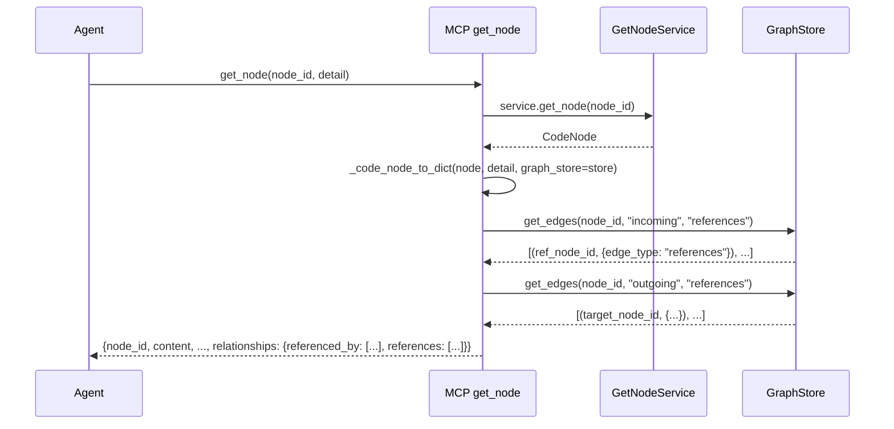

# Phase 3: Config + CLI + MCP Surface — Tasks & Context Brief

**Plan**: [cross-file-rels-plan.md](../../cross-file-rels-plan.md)
**Phase**: Phase 3: Config + CLI + MCP Surface
**Created**: 2026-03-13
**Depends on**: Phase 1 (GraphStore edge infrastructure — `get_edges()`, `add_edge(**edge_data)`)
**CS**: CS-2 (mechanical changes following established patterns)

---

## Executive Briefing

**Purpose**: Wire the cross-file relationship feature into all user-facing surfaces — configuration, CLI flags, and MCP tool output — so users and AI agents can discover, control, and consume relationship data.

**What We're Building**: A `CrossFileRelsConfig` pydantic model for YAML/env configuration, two new CLI flags (`--no-cross-refs`, `--cross-refs-instances`) on `fs2 scan`, relationship data in MCP `get_node` output, and ref counts in `tree --detail max` output.

**Goals**:
- ✅ Config: `cross_file_rels` section parsed from YAML with validation
- ✅ CLI: `--no-cross-refs` and `--cross-refs-instances N` flags on scan
- ✅ MCP: `get_node` returns `relationships.referenced_by` / `relationships.references` lists
- ✅ MCP+CLI: `tree --detail max` shows ref count per node
- ✅ Init: `.serena/` added to gitignore guidance

**Non-Goals**:
- ❌ Wiring flags/config through to ScanPipeline → CrossFileRelsStage (Phase 4)
- ❌ Adding CrossFileRelsStage to default pipeline stages (Phase 4)
- ❌ End-to-end integration testing (Phase 4)
- ❌ Dedicated `get_edges` MCP tool (deferred — future enhancement)

---

## Prior Phase Context

### Phase 1: GraphStore Edge Infrastructure ✅

**A. Deliverables**:
- `src/fs2/core/repos/graph_store.py` — `add_edge(**edge_data)`, `get_edges(node_id, direction, edge_type)`
- `src/fs2/core/repos/graph_store_impl.py` — NetworkX implementation, FORMAT_VERSION="1.1"
- `src/fs2/core/repos/graph_store_fake.py` — FakeGraphStore with edge data tracking
- `src/fs2/core/services/tree_service.py` — `_get_containment_children()` filter
- `src/fs2/core/models/code_node.py` — `file_path` @property

**B. Dependencies Exported**:
- `get_edges(node_id, direction="outgoing", edge_type=None) → list[tuple[str, dict]]` — **this is the key API for T004/T005/T006**
- Edge type convention: containment edges have no `edge_type` key; reference edges have `edge_type="references"`
- `CodeNode.file_path` @property parses node_id

**C. Gotchas**:
- Edge data MUST be plain Python types only (dict/str/int/None) — RestrictedUnpickler constraint
- Use imported FORMAT_VERSION constant in tests, never hardcode
- `get_parent()` filters to containment edges only

**D. Incomplete Items**: None — all 9 tasks complete.

**E. Patterns to Follow**:
- Filter at service layer (TreeService), not GraphStore
- Containment = no `edge_type` key; Reference = `edge_type="references"`
- Fakes over mocks; import constants instead of hardcoding

### Phase 2: CrossFileRels Pipeline Stage ✅

**A. Deliverables**:
- `src/fs2/core/services/stages/cross_file_rels_stage.py` — Full stage (~600 lines)
- `src/fs2/core/services/pipeline_context.py` — `cross_file_edges` field
- `src/fs2/core/services/stages/storage_stage.py` — Cross-file edge writing with pre-filters

**B. Dependencies Exported**:
- `CrossFileRelsStage.process(context) → PipelineContext` — orchestrates Serena pool
- `is_serena_available() → bool` — checks PATH
- Stage currently hardcodes: 20 instances, port 8330, 10s timeout — **Phase 3 creates config to parameterize these**

**C. Gotchas**:
- DYK-P2-04: Zero-arg constructors with hardcoded defaults → Phase 3/4 must wire config
- DYK-P2-02: `asyncio.run()` bridge for sync pipeline → no impact on Phase 3
- Stage reads from `context`, not CLI/config directly → Phase 4 wires config to context

**D. Incomplete Items**: None — all 10 tasks complete.

---

## Pre-Implementation Check

| File | Exists? | Domain | Action | Notes |
|------|---------|--------|--------|-------|
| `src/fs2/config/objects.py` | ✅ Yes | config | Modify | Add `CrossFileRelsConfig` + register in `YAML_CONFIG_TYPES` |
| `src/fs2/cli/scan.py` | ✅ Yes | cli | Modify | Add 2 new flags to `scan()` function |
| `src/fs2/mcp/server.py` | ✅ Yes | mcp | Modify | `_code_node_to_dict` gains `graph_store`; `_tree_node_to_dict` gains ref count |
| `src/fs2/cli/tree.py` | ✅ Yes | cli | Modify | `_tree_node_to_dict` gains ref count (parallel copy) |
| `src/fs2/cli/init.py` | ✅ Yes | cli | Modify | Add `.serena/` to gitignore template |
| `tests/unit/config/test_cross_file_rels_config.py` | ❌ New | config | Create | Config model tests |
| `tests/unit/cli/test_scan_cli.py` | ✅ Yes | cli | Modify | Add flag tests |
| `tests/mcp_tests/test_server.py` | ✅ Yes | mcp | Modify | Add relationship output tests |

**Concept Duplication Check**: No duplication — `CrossFileRelsConfig` is a new concept. The `_code_node_to_dict` and `_tree_node_to_dict` changes extend existing functions.

**Harness**: Not applicable (user override — unit tests sufficient per plan).

---

## Architecture Map



---

## Tasks

| Status | ID | Task | Domain | Path(s) | Done When | Notes |
|--------|-----|------|--------|---------|-----------|-------|
| [x] | T001 | Create `CrossFileRelsConfig` pydantic model with `__config_path__ = "cross_file_rels"` | config | `src/fs2/config/objects.py`, `tests/unit/config/test_cross_file_rels_config.py` | Fields: enabled, parallel_instances, serena_base_port, timeout_per_node, languages; validators pass; registered in `YAML_CONFIG_TYPES` | Per workshop 002/003. Follow `ScanConfig` / `SmartContentConfig` pattern. Fields: `enabled: bool = True`, `parallel_instances: int = 20`, `serena_base_port: int = 8330`, `timeout_per_node: float = 5.0`, `languages: list[str] = ["python"]`. Validator: `parallel_instances` 1–50. TDD. |
| [x] | T002 | Add `--no-cross-refs` flag to `scan()` | cli | `src/fs2/cli/scan.py`, `tests/unit/cli/test_scan_cli.py` | Flag parsed by Typer; scan exits 0 with flag | Follow `--no-smart-content` pattern exactly. Flag is `Annotated[bool, typer.Option("--no-cross-refs", help="Skip cross-file relationship extraction")]`. NOT wired to pipeline yet (Phase 4). TDD. |
| [x] | T003 | Add `--cross-refs-instances` flag to `scan()` | cli | `src/fs2/cli/scan.py`, `tests/unit/cli/test_scan_cli.py` | Flag parsed by Typer; accepts int; scan exits 0 | `Annotated[int \| None, typer.Option("--cross-refs-instances", help="Number of parallel Serena instances (default: 20)")]`. Default None (use config). NOT wired yet (Phase 4). TDD. |
| [x] | T004 | Update MCP `_code_node_to_dict` — accept optional `graph_store` param | mcp | `src/fs2/mcp/server.py`, `tests/mcp_tests/test_server.py` | When `graph_store` provided, calls `get_edges()` for incoming+outgoing, includes `relationships` dict; omits field when no edges | Per finding 07 + workshop 003. Query incoming and outgoing separately (not "both" then re-classify). Omit `relationships` key entirely when no edges (per workshop 003 decision). Present at both min and max detail. TDD. |
| [x] | T005 | Update MCP `get_node` tool — pass `store` to `_code_node_to_dict` | mcp | `src/fs2/mcp/server.py`, `tests/mcp_tests/test_server.py` | `get_node` output includes `relationships.referenced_by` when reference edges exist in graph | `store` already available in `get_node()` from `get_graph_store(graph_name)`. Just pass it: `_code_node_to_dict(code_node, detail, graph_store=store)`. Depends on T004. TDD. |
| [x] | T006 | Add ref count to `tree --detail max` output | mcp, cli | `src/fs2/mcp/server.py`, `src/fs2/cli/tree.py`, `tests/mcp_tests/test_server.py` | Nodes with cross-file edges show `ref_count` in JSON dict and `(N refs)` in text when detail=max | Pass `graph_store` to `_tree_node_to_dict` (MCP + CLI copies). Add `ref_count` to dict when detail=max. `_render_tree_as_text` renders it as `(N refs)`. Per AC11. TDD. |
| [x] | T007 | Add `.serena/` to `.gitignore` guidance in init | cli | `src/fs2/cli/init.py`, `tests/unit/cli/test_init_cli.py` | `fs2 init` includes `.serena/` in gitignore output; users know to exclude Serena artifacts | `.serena/` is created at project root by Serena (not inside `.fs2/`). Add to `DEFAULT_CONFIG` as a comment recommending `.serena/` be added to project `.gitignore`. Also update `FS2_GITIGNORE` to note it. TDD. |

---

## Context Brief

### Key Findings from Plan

- **Finding 07 (Medium)**: MCP `_code_node_to_dict` doesn't receive `graph_store`. `get_node` tool already calls `get_graph_store()`. → T004/T005: Pass store to `_code_node_to_dict` for relationship output.
- **Finding 05 (Medium)**: Edge attributes MUST be plain dicts/strings/ints only — no custom classes. → T001: Config model stores plain Python types.
- **DYK-P2-04**: Stage has zero-arg constructors with hardcoded defaults (20 instances, port 8330, 10s timeout). → T001: Config model provides these as configurable fields; Phase 4 wires to stage.

### Domain Dependencies

- `core/repos`: `GraphStore.get_edges(node_id, direction, edge_type)` — used by T004/T005/T006 to query relationship edges
- `core/repos`: `GraphStore` ABC — consumed as type annotation for `_code_node_to_dict` param
- `core/models`: `CodeNode` — consumed unchanged; `node_id` used for edge queries
- `core/services`: `TreeService` / `TreeNode` — consumed unchanged; tree output enriched at MCP/CLI layer

### Domain Constraints

- Config objects MUST use `__config_path__: ClassVar[str]` and register in `YAML_CONFIG_TYPES`
- CLI flags follow `--no-{feature}` negative pattern per existing convention
- MCP tools access graph via `get_graph_store(graph_name)` from `fs2.mcp.dependencies`
- MCP and CLI have DUPLICATED `_tree_node_to_dict` (both must be updated for T006)
- `_code_node_to_dict` MUST NOT include embeddings (security constraint per DYK Session)

### Reusable from Prior Phases

- `FakeGraphStore` — already supports `add_edge(**edge_data)` and `get_edges()` (from Phase 1); use for MCP tests
- Test pattern: `graph_store.add_edge(node_a, node_b, edge_type="references")` then verify output
- `FORMAT_VERSION` import pattern from `graph_store_impl`

### Config Registration Pattern (from codebase)

```python
# In config/objects.py:
class CrossFileRelsConfig(BaseModel):
    __config_path__: ClassVar[str] = "cross_file_rels"
    enabled: bool = True
    # ...

# At bottom of file:
YAML_CONFIG_TYPES: list[type[BaseModel]] = [
    # ... existing configs ...
    CrossFileRelsConfig,  # Add here
]

# Test pattern (from test_scan_config.py):
def test_cross_file_rels_config_in_yaml_config_types_registry(self):
    from fs2.config.objects import YAML_CONFIG_TYPES, CrossFileRelsConfig
    assert CrossFileRelsConfig in YAML_CONFIG_TYPES
```

### CLI Flag Pattern (from scan.py)

```python
no_cross_refs: Annotated[
    bool,
    typer.Option(
        "--no-cross-refs",
        help="Skip cross-file relationship extraction",
    ),
] = False,
```

### MCP Relationship Output Pattern (refined from workshop 003)

```python
# Efficient: query incoming and outgoing separately (avoid double-query)
if graph_store is not None:
    incoming = graph_store.get_edges(node.node_id, direction="incoming", edge_type="references")
    outgoing = graph_store.get_edges(node.node_id, direction="outgoing", edge_type="references")
    rels: dict[str, list[str]] = {}
    if incoming:
        rels["referenced_by"] = [nid for nid, _ in incoming]
    if outgoing:
        rels["references"] = [nid for nid, _ in outgoing]
    if rels:
        result["relationships"] = rels
```

### Mermaid Flow Diagram



### Mermaid Sequence Diagram — get_node with Relationships



---

## Discoveries & Learnings

_Populated during implementation by plan-6._

| Date | Task | Type | Discovery | Resolution | References |
|------|------|------|-----------|------------|------------|

---

## Directory Layout

```
docs/plans/031-cross-file-rels/
  ├── cross-file-rels-plan.md
  └── tasks/phase-3-config-cli-mcp-surface/
      ├── tasks.md              ← this file
      ├── tasks.fltplan.md      ← flight plan
      └── execution.log.md     # created by plan-6
```
