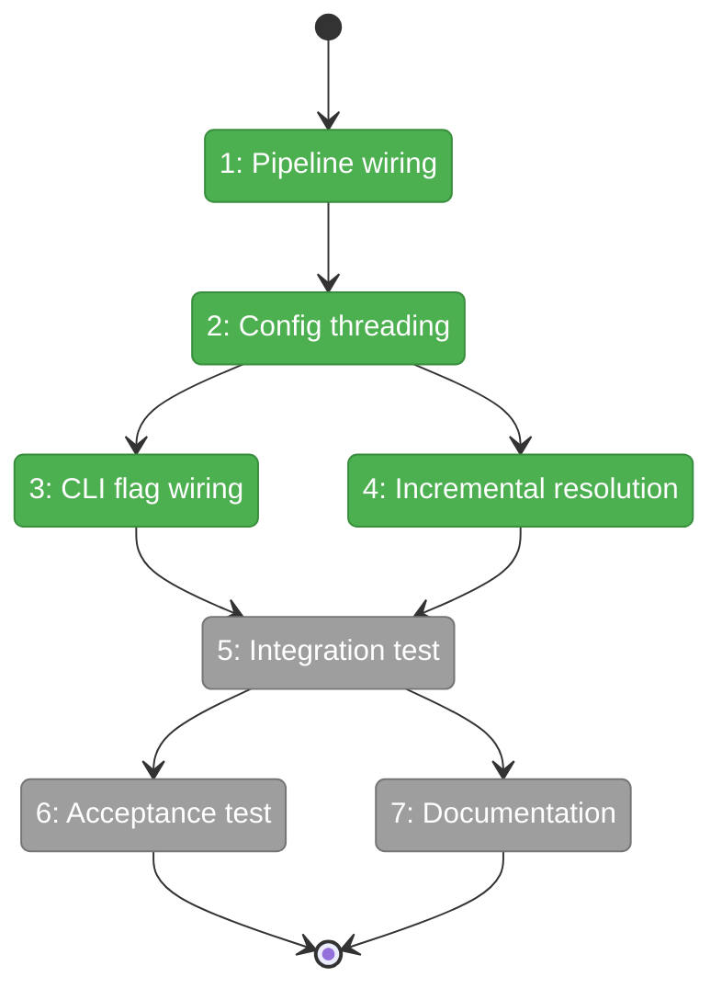
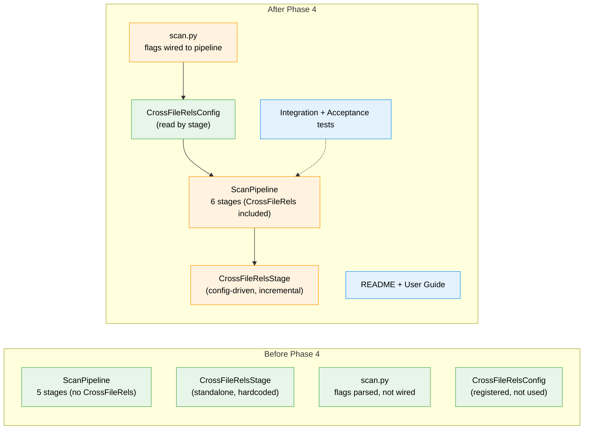

# Flight Plan: Phase 4 — Integration + Documentation

**Plan**: [../../cross-file-rels-plan.md](../../cross-file-rels-plan.md)
**Phase**: Phase 4: Integration + Documentation
**Generated**: 2026-03-15
**Status**: Ready for takeoff

---

## Departure → Destination

**Where we are**: Phases 1–3 complete. GraphStore has edge storage/query API. CrossFileRelsStage resolves references via Serena pools. Config, CLI flags, and MCP relationship output all work. But the stage is NOT in the pipeline — `fs2 scan` doesn't actually run cross-file resolution. CLI flags are parsed but silently ignored. Incremental helpers exist but aren't called. No user docs.

**Where we're going**: A developer runs `fs2 scan` and it automatically resolves cross-file references (if Serena is installed). The CLI flags `--no-cross-refs` and `--cross-refs-instances N` work. Subsequent scans skip unchanged files. Integration tests validate the full flow. A user guide explains installation, configuration, and troubleshooting.

---

## Domain Context

### Domains We're Changing

| Domain | What Changes | Key Files |
|--------|-------------|-----------|
| core/services | ScanPipeline gets CrossFileRelsStage in defaults; prior edge extraction | `scan_pipeline.py` |
| core/services/stages | CrossFileRelsStage reads config + uses incremental helpers | `cross_file_rels_stage.py` |
| cli | scan.py wires flags to ScanPipeline | `scan.py` |
| docs | README + user guide | `README.md`, `docs/how/user/cross-file-relationships.md` |

### Domains We Depend On (no changes)

| Domain | What We Consume | Contract |
|--------|----------------|----------|
| core/repos | `GraphStore.get_edges()` | ABC method from Phase 1 |
| config | `CrossFileRelsConfig` | Pydantic model from Phase 3 |
| core/models | `CodeNode`, `PipelineContext` | Unchanged (prior_cross_file_edges field from Phase 3) |

---

## Flight Status

**Legend**: grey = pending | yellow = active | red = blocked/needs input | green = done

---

## Stages

- [x] **Stage 1: Pipeline wiring** — Insert CrossFileRelsStage into default stage list + extract prior edges (`scan_pipeline.py`)
- [x] **Stage 2: Config threading** — Wire CrossFileRelsConfig through constructor → context (`scan_pipeline.py`, `pipeline_context.py`)
- [x] **Stage 3: CLI flag wiring** — Connect `--no-cross-refs` and `--cross-refs-instances` to config → pipeline (`scan.py`)
- [x] **Stage 4: Incremental resolution** — Integrate incremental helpers into stage process() (`cross_file_rels_stage.py`)
- [~] **Stage 5: Integration test** — End-to-end with FakeSerenaPool (`test_cross_file_integration.py`)
- [ ] **Stage 6: Acceptance test** — Real Serena, real codebase, real verification (`test_cross_file_acceptance.py`)
- [ ] **Stage 7: Documentation** — README section + user guide (`README.md`, `docs/how/user/`)

---

## Architecture: Before & After

---

## Acceptance Criteria

- [ ] [AC1] `fs2 scan` with Serena produces `edge_type="references"` edges (end-to-end)
- [ ] [AC2] `get-node` shows relationships (end-to-end)
- [ ] [AC3] `--no-cross-refs` produces zero cross-file edges
- [ ] [AC9] `--cross-refs-instances 5` uses 5 instances
- [ ] [AC12] Real Serena acceptance test: edges match actual source code references
- [ ] Documentation exists and is accurate

---

## Goals & Non-Goals

**Goals**:
- CrossFileRelsStage in default pipeline
- Config + CLI flags wired end-to-end
- Incremental resolution for unchanged files
- Fast CI-safe integration test
- Real Serena acceptance test (slow, skip if unavailable)
- User documentation

**Non-Goals**:
- Dedicated `get_edges` MCP tool (future)
- Cross-project references
- Incremental file scanning (only incremental reference resolution)

---

## Checklist

- [x] T001: Insert CrossFileRelsStage into ScanPipeline defaults
- [x] T002: Wire CrossFileRelsConfig through constructor → context
- [x] T003: Wire CLI flags through scan.py → ScanPipeline
- [x] T004: Integrate incremental helpers into stage process()
- [x] T005: Extract prior reference edges before graph clear
- [~] T006: End-to-end integration test (FakeSerenaPool)
- [ ] T007: Real acceptance test (actual Serena)
- [ ] T008: README section on cross-file relationships
- [ ] T009: User guide at docs/how/user/cross-file-relationships.md
