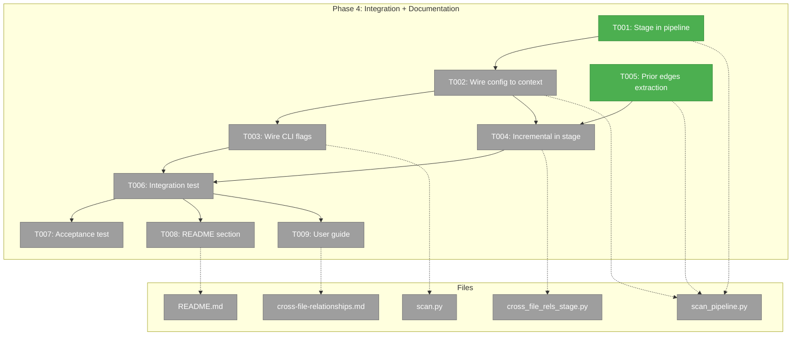
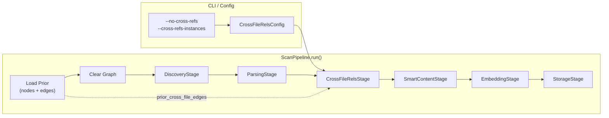
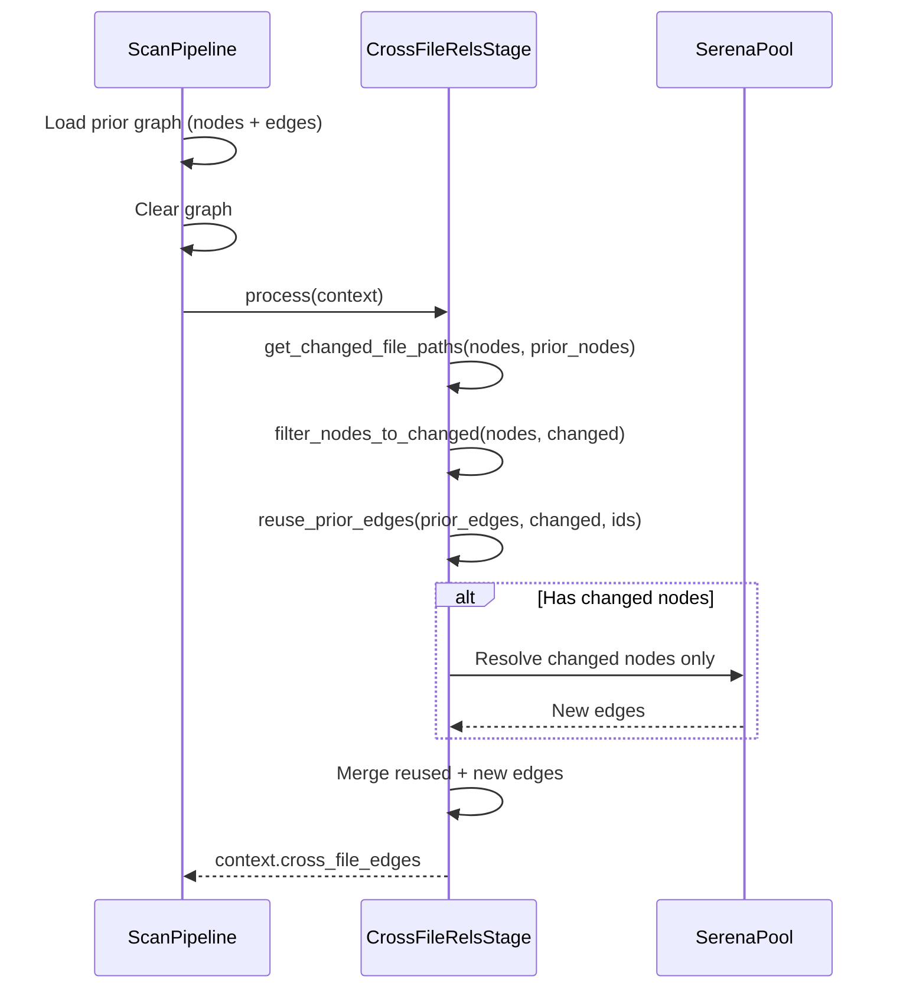

# Phase 4: Integration + Documentation — Tasks & Context Brief

**Plan**: [cross-file-rels-plan.md](../../cross-file-rels-plan.md)
**Phase**: Phase 4: Integration + Documentation
**Created**: 2026-03-15
**Depends on**: Phase 1 (GraphStore edges), Phase 2 (CrossFileRelsStage), Phase 3 (Config/CLI/MCP)
**CS**: CS-2 (mechanical wiring following established patterns + documentation)

---

## Executive Briefing

**Purpose**: Wire CrossFileRelsStage into the ScanPipeline so that `fs2 scan` actually runs cross-file resolution, connect CLI flags and config to the stage, populate prior edges for incremental resolution, validate end-to-end (with and without real Serena), and write user documentation.

**What We're Building**: The final integration layer — inserting the stage into the default pipeline, threading config/flags through constructor→context→stage, extracting prior reference edges before graph clear for incremental resolution, a fast integration test with FakeSerenaPool, a real acceptance test with actual Serena, and user-facing docs (README section + how-to guide).

**Goals**:
- ✅ `fs2 scan` runs CrossFileRelsStage between Parsing and SmartContent
- ✅ `--no-cross-refs` disables the stage; `--cross-refs-instances N` overrides parallelism
- ✅ CrossFileRelsConfig read from YAML/env and wired to the stage
- ✅ Incremental resolution: prior edges extracted, unchanged files skipped
- ✅ Fast integration test (FakeSerenaPool, CI-safe)
- ✅ Real acceptance test (actual Serena, skip if unavailable)
- ✅ README + docs/how/ guide with install, config, usage, troubleshooting

**Non-Goals**:
- ❌ New MCP tools (get_edges tool — deferred)
- ❌ Incremental file scanning (only incremental reference resolution)
- ❌ Cross-project references

---

## Prior Phase Context

### Phase 1: GraphStore Edge Infrastructure ✅

**Deliverables**: `add_edge(**edge_data)`, `get_edges(node_id, direction, edge_type)`, `get_parent()` filter, `_get_containment_children()`, `CodeNode.file_path`, FORMAT_VERSION=1.1.

**Dependencies Exported**: Edge storage/query API. Containment edges have no `edge_type`; reference edges have `edge_type="references"`.

**Gotchas**: Edge data must be plain dicts. Filter by `edge_type` attribute, not file_path, for containment vs reference distinction.

**Incomplete**: None.

### Phase 2: CrossFileRels Pipeline Stage ✅

**Deliverables**: `CrossFileRelsStage` (~600 lines), `PipelineContext.cross_file_edges`, StorageStage edge writing with DYK-05/DYK-03 pre-filters.

**Dependencies Exported**: `CrossFileRelsStage.process(context)`, `is_serena_available()`, `detect_project_roots()`, `SerenaPool`, `shard_nodes()`, `build_node_lookup()`, `resolve_node_batch()`. Stage currently hardcodes: 20 instances, port 8330, 10s timeout.

**Gotchas**: Stage reads from `context`, not constructor. Pre-filter edges before writing (both-nodes-exist + no-containment-collision + no-self-reference). Pool cleanup via atexit + PID file.

**Incomplete**: None — wiring to pipeline is Phase 4.

### Phase 3: Config + CLI + MCP Surface ✅

**Deliverables**: `CrossFileRelsConfig` (enabled, parallel_instances, serena_base_port, timeout_per_node, languages), `--no-cross-refs`/`--cross-refs-instances` flags, MCP `get_node` relationships, tree ref count, CLI get-node fix (embedding leak), incremental helpers, `prior_cross_file_edges` field.

**Dependencies Exported**: Config model registered in YAML_CONFIG_TYPES. CLI flags parsed but NOT wired. `get_changed_file_paths()`, `filter_nodes_to_changed()`, `reuse_prior_edges()` ready for use.

**Gotchas**: CLI flags not wired to pipeline yet — Phase 4's job. `prior_cross_file_edges` field exists on PipelineContext but not populated — Phase 4 must extract prior edges in `_load_prior_nodes()` (or a new method).

**Incomplete**: Docs deferred to Phase 4. Incremental helpers not integrated into stage.

---

## Pre-Implementation Check

| File | Exists? | Domain | Action | Notes |
|------|---------|--------|--------|-------|
| `src/fs2/core/services/scan_pipeline.py` | ✅ Yes | core/services | Modify | Add CrossFileRelsStage to defaults; extract prior edges; wire config |
| `src/fs2/cli/scan.py` | ✅ Yes | cli | Modify | Wire `no_cross_refs` + `cross_refs_instances` to ScanPipeline |
| `src/fs2/core/services/stages/cross_file_rels_stage.py` | ✅ Yes | core/services/stages | Modify | Read config from context; use incremental helpers |
| `src/fs2/core/services/pipeline_context.py` | ✅ Yes | core/services | No change | `prior_cross_file_edges` field already added in Phase 3 |
| `README.md` | ✅ Yes | docs | Modify | Add cross-file relationships section |
| `docs/how/user/cross-file-relationships.md` | ❌ New | docs | Create | Full user guide |
| `tests/integration/test_cross_file_integration.py` | ❌ New | all | Create | End-to-end integration test |
| `tests/integration/test_cross_file_acceptance.py` | ❌ New | all | Create | Real Serena acceptance test |

**Harness**: Not applicable (user override — unit tests + benchmark scripts sufficient).

---

## Architecture Map



---

## Tasks

| Status | ID | Task | Domain | Path(s) | Done When | Notes |
|--------|-----|------|--------|---------|-----------|-------|
| [x] | T001 | Add CrossFileRelsStage to ScanPipeline default stage list | core/services | `src/fs2/core/services/scan_pipeline.py` | Default stages: Discovery → Parsing → **CrossFileRels** → SmartContent → Embedding → Storage | Per workshop 001. Import CrossFileRelsStage, insert at index 2. Update docstring ordering note. TDD. |
| [x] | T002 | Wire CrossFileRelsConfig through ScanPipeline constructor → PipelineContext | core/services | `src/fs2/core/services/scan_pipeline.py`, `src/fs2/core/services/pipeline_context.py` | Stage reads config from context; `parallel_instances` and `timeout_per_node` configurable | Follow `smart_content_service` pattern: add optional param to constructor → store → inject into PipelineContext. Stage reads `context.cross_file_rels_config`. Add `cross_file_rels_config` field to PipelineContext. TDD. |
| [x] | T003 | Wire CLI flags through scan.py → ScanPipeline | cli | `src/fs2/cli/scan.py` | `--no-cross-refs` sets `cross_file_rels_config.enabled=False`; `--cross-refs-instances N` overrides `parallel_instances` | Follow `no_smart_content` → `smart_content_service=None` pattern. Load `CrossFileRelsConfig` from config service, apply CLI overrides, pass to ScanPipeline. TDD. |
| [x] | T004 | Integrate incremental resolution into CrossFileRelsStage.process() | core/services/stages | `src/fs2/core/services/stages/cross_file_rels_stage.py` | Unchanged files skip Serena; prior edges reused; metrics show preserved vs resolved | Call `get_changed_file_paths()`, `filter_nodes_to_changed()`, `reuse_prior_edges()` in process(). Read config from context for instances/timeout. Merge reused edges + freshly resolved edges into `context.cross_file_edges`. Log counts. TDD. |
| [x] | T005 | Extract prior reference edges in ScanPipeline before graph clear | core/services | `src/fs2/core/services/scan_pipeline.py` | `context.prior_cross_file_edges` populated with reference edges from prior graph | After `_load_prior_nodes()` but before `graph_store.clear()`. Iterate prior nodes, call `get_edges(node_id, "outgoing", "references")` to collect all prior reference edges. O(N) scan. TDD. |
| [ ] | T006 | End-to-end integration test (fast, FakeSerenaPool) | all | `tests/integration/test_cross_file_integration.py` | Scan test project → CrossFileRelsStage runs → graph has reference edges → get_node shows relationships | Uses `scanned_project` pattern but with FakeSerenaPool injected. Verify edge_type="references" edges exist, MCP get_node shows relationships. CI-safe. TDD. |
| [ ] | T007 | Real acceptance test (slow, actual Serena) | all | `tests/integration/test_cross_file_acceptance.py` | Scan real project with real Serena → verify known references match source code | `@pytest.mark.slow`. Skip if `serena-mcp-server` not on PATH. Scan `tests/fixtures/ast_samples/python/`. Verify e.g. known imports/calls produce edges. Cross-check edge node_ids against source. No fakes. AC12. |
| [ ] | T008 | Add README section on cross-file relationships | docs | `README.md` | Installation, config, usage, interpreting output documented | Insert after Embeddings section. Cover: Serena install, config YAML, CLI flags, what relationships look like in get_node output. |
| [ ] | T009 | Add `docs/how/user/cross-file-relationships.md` guide | docs | `docs/how/user/cross-file-relationships.md` | Detailed config, performance tuning, troubleshooting, .serena/ gitignore | Per DYK-P3-05. Cover: install Serena, first scan, config options, incremental resolution, parallel instances tuning, port conflicts, memory usage (~300MB/instance), .serena/ gitignore. |

---

## Context Brief

### Key Findings from Plan

- **Finding 01 (Critical)**: `get_children()` returns ALL successors — cross-file edges break tree. → Fixed in Phase 1 (T008/T009) + Phase 3 (edge_type filter fix).
- **Finding 07 (Medium)**: MCP `_code_node_to_dict` needs `graph_store` for relationships. → Done in Phase 3 (T004/T005).
- **DYK-P2-04**: Stage has zero-arg constructor with hardcoded defaults. → T002/T004 parameterize via config.
- **Integration timing risk**: CrossFileRelsStage MUST run after Parsing (needs nodes), before SmartContent (doesn't depend on smart_content). → T001 inserts at correct position.

### Domain Dependencies

- `core/repos`: `GraphStore.get_edges()` — used to extract prior reference edges (T005)
- `core/services/stages`: `CrossFileRelsStage` — the stage being wired in (T001)
- `core/services`: `ScanPipeline` — constructor accepts stages + services (T001/T002)
- `config`: `CrossFileRelsConfig` — config model from Phase 3 (T002/T003)
- `cli`: `scan.py` — already has flags from Phase 3, needs wiring (T003)

### Domain Constraints

- ScanPipeline uses service injection pattern: optional param → stored → injected into context → stage reads from context
- CLI flags override config values: `--no-cross-refs` → `config.enabled=False`, `--cross-refs-instances N` → `config.parallel_instances=N`
- Stage ordering MUST be: Discovery → Parsing → CrossFileRels → SmartContent → Embedding → Storage
- Prior edges must be extracted BEFORE `graph_store.clear()` in `run()`
- No `get_all_edges()` method — must iterate all prior nodes and call `get_edges()` per node

### Reusable from Prior Phases

- **FakeSubprocessRunner, FakeSerenaClient** — in `tests/unit/services/stages/test_cross_file_rels_stage.py`
- **`scanned_project` fixture** — creates real project, runs scan, returns path
- **`tree_test_graph_store` fixture** — FakeGraphStore with pre-loaded nodes
- **SmartContent wiring pattern** — `no_smart_content` → `smart_content_service=None` → stage checks context
- **Prior nodes extraction pattern** — `_load_prior_nodes()` loads graph, builds dict, then clear

### ScanPipeline Wiring Pattern (from smart_content)

```python
# Constructor: accept optional service
def __init__(self, ..., smart_content_service=None):
    self._smart_content_service = smart_content_service

# run(): inject into context
context = PipelineContext(
    ...,
    smart_content_service=self._smart_content_service,
)

# Stage: read from context
if context.smart_content_service is None:
    # skip processing
```

For cross-file rels, the pattern is simpler — pass config, not service:
```python
# Constructor: accept optional config
def __init__(self, ..., cross_file_rels_config=None):
    self._cross_file_rels_config = cross_file_rels_config

# run(): inject config + prior edges into context
context.cross_file_rels_config = self._cross_file_rels_config
context.prior_cross_file_edges = self._extract_prior_edges(context)

# Stage: read config from context
config = context.cross_file_rels_config
if config is not None and not config.enabled:
    return context  # disabled
```

### Prior Edge Extraction Pattern

```python
def _extract_prior_edges(self, context):
    """Extract reference edges from prior graph before clear."""
    if context.prior_nodes is None:
        return None
    edges = []
    for node_id in context.prior_nodes:
        outgoing = context.graph_store.get_edges(
            node_id, direction="outgoing", edge_type="references"
        )
        for target_id, edge_data in outgoing:
            edges.append((node_id, target_id, edge_data))
    return edges if edges else None
```

### Mermaid Flow Diagram — Full Scan Pipeline After Phase 4



### Mermaid Sequence Diagram — Incremental Resolution



---

## Discoveries & Learnings

_Populated during implementation by plan-6._

| Date | Task | Type | Discovery | Resolution | References |
|------|------|------|-----------|------------|------------|

---

## Directory Layout

```
docs/plans/031-cross-file-rels/
  ├── cross-file-rels-plan.md
  └── tasks/phase-4-integration-documentation/
      ├── tasks.md              ← this file
      ├── tasks.fltplan.md      ← flight plan
      └── execution.log.md     # created by plan-6
```
