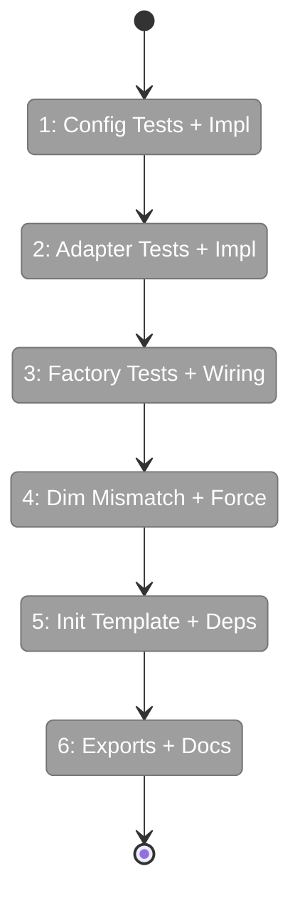
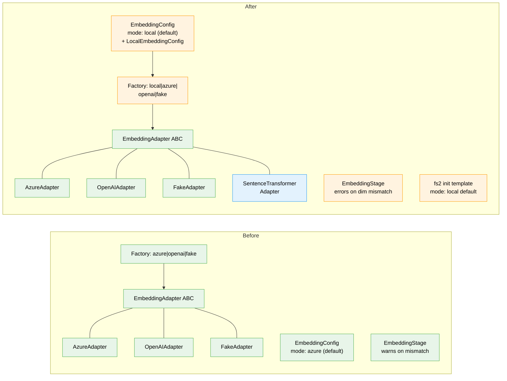

# Flight Plan: Phase 1 — Implementation

**Plan**: [local-embeddings-plan.md](../../local-embeddings-plan.md)
**Phase**: Phase 1: Implementation (Simple mode)
**Generated**: 2026-03-15
**Status**: Landed

---

## Departure → Destination

**Where we are**: fs2 has a working embedding system with Azure and OpenAI-compatible adapters behind an `EmbeddingAdapter` ABC. Semantic search requires API credentials and network access. `fs2 init` creates config with all embedding options commented out. Workshop 001 benchmarked local SentenceTransformer models, finding `BAAI/bge-small-en-v1.5` delivers 947 items/s on MPS with strong retrieval quality.

**Where we're going**: A developer can run `fs2 init` → `pip install fs2[local-embeddings]` → `fs2 scan --embed` → `fs2 search "error handling" --mode semantic` with zero API keys, zero network, zero cost. Local mode is the default for new projects.

---

## Domain Context

### Domains We're Changing

| Domain | What Changes | Key Files |
|--------|-------------|-----------|
| config | Add `LocalEmbeddingConfig` model; extend `EmbeddingConfig` with `mode: "local"` + dimension auto-default | `src/fs2/config/objects.py` |
| adapters | New `SentenceTransformerEmbeddingAdapter`; factory wiring; exports | `embedding_adapter_local.py`, `embedding_adapter.py`, `__init__.py` |
| services | Dimension mismatch → error-and-block (currently warns only) | `stages/embedding_stage.py` |
| cli | `fs2 init` template default; `--force` flag on scan | `init.py`, `scan.py` |

### Domains We Depend On (no changes)

| Domain | What We Consume | Contract |
|--------|----------------|----------|
| config | `ConfigurationService.require()` | DI pattern for adapter construction |
| adapters | `EmbeddingAdapter` ABC | `provider_name`, `embed_text`, `embed_batch` |
| adapters | `EmbeddingAdapterError` hierarchy | Error translation for import/runtime failures |

---

## Flight Status

<!-- Updated by /plan-6-v2: pending → active → done. Use blocked for problems/input needed. -->

**Legend**: grey = pending | yellow = active | red = blocked/needs input | green = done

---

## Stages

<!-- Updated by /plan-6-v2 during implementation: [ ] → [~] → [x] -->

- [x] **Stage 1: Config model TDD** — Write tests for `LocalEmbeddingConfig` + `mode: local`, then implement config models (`test_embedding_config.py`, `objects.py`)
- [x] **Stage 2: Adapter TDD** — Write tests for `SentenceTransformerEmbeddingAdapter`, then implement adapter (`test_embedding_adapter_local.py`, `embedding_adapter_local.py` — new files)
- [x] **Stage 3: Factory TDD** — Write factory tests, then wire `create_embedding_adapter_from_config` (`test_embedding_adapter.py`, `embedding_adapter.py`)
- [x] **Stage 4: Dimension safety** — Error-and-block on dimension mismatch + `--force` flag (`embedding_stage.py`, `scan.py`, `test_embedding_stage.py`)
- [x] **Stage 5: Init + deps** — Update `fs2 init` template + `pyproject.toml` optional deps (`init.py`, `pyproject.toml`)
- [x] **Stage 6: Exports + docs** — Update `__init__.py`, write user guide, update README (`__init__.py`, `local-embeddings.md`, `README.md`)

---

## Architecture: Before & After

**Legend**: existing (green, unchanged) | changed (orange, modified) | new (blue, created)

---

## Acceptance Criteria

- [ ] AC1: `mode: local` + `sentence-transformers` installed → `fs2 scan --embed` generates embeddings locally
- [x] AC2: `fs2 search "error handling" --mode semantic` returns results using local embeddings
- [x] AC3: CUDA auto-detected when available; MPS on Apple Silicon; CPU fallback
- [x] AC4: Device fallback with warning when requested device unavailable
- [x] AC5: Missing `sentence-transformers` → `EmbeddingAdapterError` with install instructions
- [x] AC6: Default config uses `BAAI/bge-small-en-v1.5`, `device: auto`, `max_seq_length: 512`
- [x] AC7: `dimensions` auto-defaults to 384 when `mode: local`
- [x] AC8: Dimension mismatch warning when config dimensions differs from model output
- [x] AC9: Return type is `list[list[float]]` (not numpy)
- [x] AC10: macOS sets `pool=None` in encode kwargs
- [x] AC11: Factory returns `SentenceTransformerEmbeddingAdapter` for `mode: local`
- [x] AC12: Dimension mismatch between stored graph and config → error blocks scan; `--force` overrides
- [x] AC13: `fs2 init` creates config with `mode: local` as default

## Goals & Non-Goals

**Goals**: Local embedding generation, drop-in replacement, device auto-detection, optional torch dep, init default, dimension safety
**Non-Goals**: Fine-tuning, non-ST models, auto-migration, multi-GPU

---

## Checklist

- [x] T001: Write config tests (TDD) — LocalEmbeddingConfig + mode=local + dimension auto-default
- [x] T002: Add LocalEmbeddingConfig model — Pydantic model with model/device/max_seq_length
- [x] T003: Extend EmbeddingConfig — mode Literal + local field + dimension validator
- [x] T004: Write adapter unit tests (TDD) — ABC, device detection, import guard, return types
- [x] T005: Create SentenceTransformerEmbeddingAdapter — lazy load, run_in_executor, Darwin workaround
- [x] T006: Write factory tests (TDD) — create_embedding_adapter_from_config for mode=local
- [x] T007: Wire factory function — add local branch with lazy import
- [x] T008: Dimension mismatch error-and-block + --force flag
- [x] T009: Update fs2 init template — local mode as default
- [x] T010: Add optional dependency group — [local-embeddings] in pyproject.toml
- [x] T011: Update adapter exports — __init__.py imports + __all__
- [x] T012: Write user documentation — docs/how/user/local-embeddings.md + README
