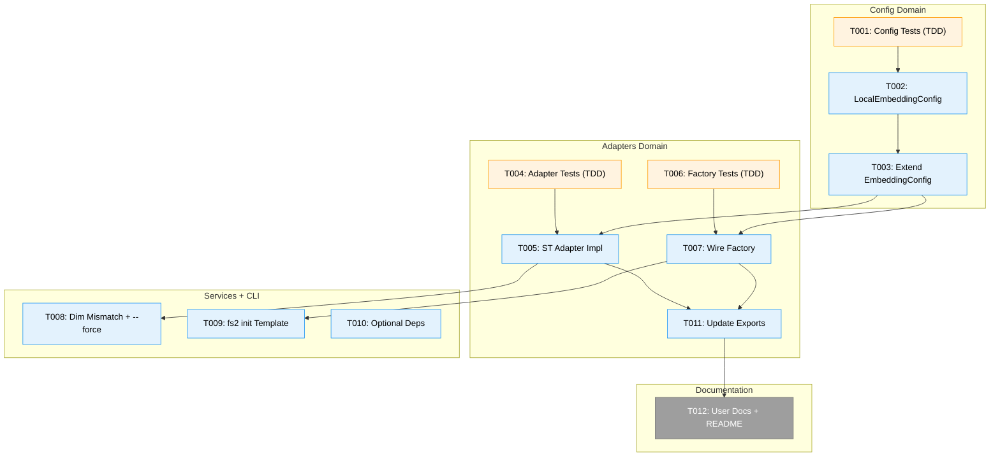
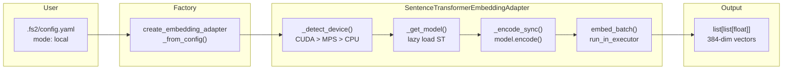
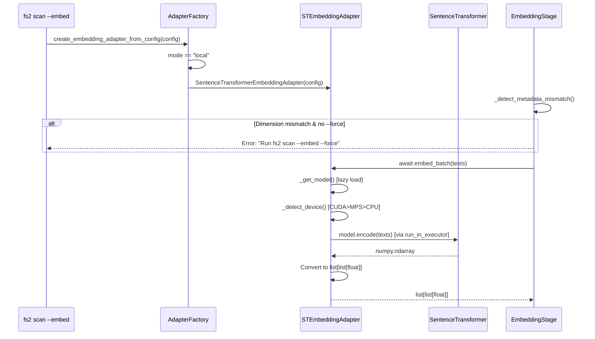

# Tasks: Phase 1 — Implementation

**Plan**: [local-embeddings-plan.md](../../local-embeddings-plan.md)
**Spec**: [local-embeddings-spec.md](../../local-embeddings-spec.md)
**Workshop**: [001-local-sentence-transformer-embeddings.md](../../workshops/001-local-sentence-transformer-embeddings.md)
**Phase**: Phase 1: Implementation (Simple mode — single phase)
**Status**: Pending

---

## Executive Briefing

**Purpose**: Deliver a fully tested local SentenceTransformer embedding adapter that enables zero-API-cost semantic search in fs2, with proper config wiring, device auto-detection, dimension safety, and `fs2 init` default integration.

**What We're Building**: A new `SentenceTransformerEmbeddingAdapter` that wraps HuggingFace's `sentence-transformers` library behind fs2's existing `EmbeddingAdapter` ABC. The adapter auto-detects CUDA/MPS/CPU, converts numpy outputs to `list[float]`, and runs synchronous model inference via `run_in_executor` to preserve async compatibility. Local mode becomes the default for new projects.

**Goals**:
- ✅ Local embedding generation without API keys or network
- ✅ Drop-in replacement — existing `fs2 scan --embed` and `fs2 search` work unchanged
- ✅ Device auto-detection: CUDA > MPS > CPU
- ✅ Optional `torch` dependency via `[local-embeddings]` install group
- ✅ `fs2 init` creates config with `mode: local` as default
- ✅ Dimension mismatch protection with `--force` override

**Non-Goals**:
- ❌ Fine-tuning models for code-specific embeddings
- ❌ Supporting non-SentenceTransformer models (CodeBERT, UniXcoder)
- ❌ Automatic migration between embedding providers
- ❌ GPU memory management or multi-GPU support

---

## Prior Phase Context

_N/A — Simple mode, single phase. No prior phases._

---

## Pre-Implementation Check

| # | File | Exists? | Action | Domain | Notes |
|---|------|---------|--------|--------|-------|
| 1 | `src/fs2/config/objects.py` | ✅ | MODIFY | config | Add `LocalEmbeddingConfig` at ~L520, extend `EmbeddingConfig.mode` at L632 |
| 2 | `src/fs2/core/adapters/embedding_adapter_local.py` | ❌ | **CREATE** | adapters | New file — SentenceTransformer adapter impl |
| 3 | `src/fs2/core/adapters/embedding_adapter.py` | ✅ | MODIFY | adapters | Add `"local"` branch to factory at L136-160 |
| 4 | `src/fs2/core/adapters/__init__.py` | ✅ | MODIFY | adapters | Add export to imports + `__all__` |
| 5 | `src/fs2/core/services/stages/embedding_stage.py` | ✅ | MODIFY | services | `_detect_metadata_mismatch` at L191-211; mismatch handling at L80-84 |
| 6 | `src/fs2/cli/init.py` | ✅ | MODIFY | cli | `DEFAULT_CONFIG` template at L18-106; embedding section L61-91 |
| 7 | `src/fs2/cli/scan.py` | ✅ | MODIFY | cli | No `--force` flag exists yet — must add |
| 8 | `pyproject.toml` | ✅ | MODIFY | config | `[project.optional-dependencies]` exists with `dev` group |
| 9 | `tests/unit/config/test_embedding_config.py` | ✅ | MODIFY | tests | Add test classes for local config |
| 10 | `tests/unit/adapters/test_embedding_adapter_local.py` | ❌ | **CREATE** | tests | New test file |
| 11 | `tests/unit/adapters/test_embedding_adapter.py` | ✅ | MODIFY | tests | Add factory tests for `mode="local"` |
| 12 | `tests/unit/services/stages/test_embedding_stage.py` | ✅ | MODIFY | tests | 4 existing tests; add mismatch error tests |
| 13 | `docs/how/user/local-embeddings.md` | ❌ | **CREATE** | docs | New user guide |
| 14 | `README.md` | ✅ | MODIFY | docs | Add quick-start section |

**Harness**: No agent harness configured. Agent will use standard testing approach (`uv run python -m pytest`).

**Concept collision check**: No existing `LocalEmbeddingConfig`, `SentenceTransformerEmbeddingAdapter`, or `embedding_adapter_local` in codebase — safe to create.

---

## Architecture Map



---

## Tasks

| Status | ID | Task | Domain | Path(s) | Done When | Notes |
|--------|-----|------|--------|---------|-----------|-------|
| [ ] | T001 | **Write config tests (TDD)** — Add `TestLocalEmbeddingConfigDefaults`, `TestLocalEmbeddingConfigValidation`, `TestEmbeddingConfigLocalMode`, `TestEmbeddingConfigLocalDimensionAutoDefault`. Test: default model is `BAAI/bge-small-en-v1.5`, default device is `auto`, `mode="local"` accepted by Literal, `dimensions` auto-defaults to 384 when `mode="local"`. Follow `TestEmbeddingConfigAzureNested` pattern. **DYK-4**: Also update existing `test_given_no_args_when_constructed_then_has_mode_azure` → expect `"local"`, and `test_given_no_args_when_constructed_then_has_dimensions_1024` → expect `384`. | config | `tests/unit/config/test_embedding_config.py` | Tests written and fail (red); 2 existing tests updated; existing test classes otherwise unchanged | Finding 05: follow existing pattern; DYK-4 |
| [ ] | T002 | **Add `LocalEmbeddingConfig`** — Pydantic `BaseModel` with: `model: str = "BAAI/bge-small-en-v1.5"`, `device: Literal["auto", "cpu", "mps", "cuda"] = "auto"`, `max_seq_length: int = 512`. Add `@field_validator("device")` for value check. Place after `OpenAIEmbeddingConfig` (~L520). | config | `src/fs2/config/objects.py` | `LocalEmbeddingConfig()` instantiates with correct defaults; validators reject invalid device | Workshop D4 |
| [ ] | T003 | **Extend `EmbeddingConfig`** — (a) Change mode Literal at L632: add `"local"`, change default to `"local"`. (b) Add field `local: LocalEmbeddingConfig \| None = None`. (c) Add `@model_validator(mode="after")`: when `mode=="local"` and `"dimensions" not in self.model_fields_set`, auto-set to `384`. **DYK-3**: Must use `model_fields_set`, not value check, to distinguish explicit user config from Pydantic default. | config | `src/fs2/config/objects.py` | T001 tests pass (green); `EmbeddingConfig()` has `mode="local"`, `dimensions=384`; `EmbeddingConfig(mode="local", dimensions=1024)` keeps `1024`; `EmbeddingConfig(mode="azure")` still works with `dimensions=1024` | Finding 01; spec Q5; DYK-3 |
| [ ] | T004 | **Write adapter unit tests (TDD)** — Create test file with classes: `TestLocalAdapterInit` (provider_name, lazy load), `TestLocalAdapterDeviceDetection` (CUDA>MPS>CPU, fallback with warning), `TestLocalAdapterImportGuard` (missing sentence-transformers → `EmbeddingAdapterError`), `TestLocalAdapterEmbedText` (delegates to embed_batch), `TestLocalAdapterEmbedBatch` (returns `list[list[float]]`, Darwin `pool=None`), `TestLocalAdapterDimensionWarning` (config/model mismatch). Mock `SentenceTransformer` at module level via `monkeypatch`. | adapters | `tests/unit/adapters/test_embedding_adapter_local.py` | Tests written and fail (red); no real model download; follows `test_embedding_adapter_openai.py` pattern | Finding 05; spec Q3: targeted mocks allowed |
| [ ] | T005 | **Create `SentenceTransformerEmbeddingAdapter`** — New file. Class with: `__init__(config: ConfigurationService)`, `provider_name → "local"`, `_detect_device() → str`, `_get_model()` (lazy load with ImportError guard), `_encode_sync(texts)` (sync encode + numpy→list[float] conversion + Darwin `pool=None`), `embed_text(text)` (delegates to embed_batch), `embed_batch(texts)` (via `run_in_executor`). **DYK-5**: Log `"Downloading embedding model... (first time only, ~130MB)"` before `SentenceTransformer()` constructor. | adapters | `src/fs2/core/adapters/embedding_adapter_local.py` | T004 tests pass (green); ABC compliance; returns `list[list[float]]`; lazy import with actionable error; download message logged | Workshop design; Finding 04; DYK-5 |
| [ ] | T006 | **Write factory tests (TDD)** — Add tests to existing file: `test_given_mode_local_when_creating_adapter_then_returns_local_adapter`, `test_given_mode_local_no_local_section_when_creating_then_uses_defaults`, `test_given_mode_local_with_custom_model_when_creating_then_passes_config`. | adapters | `tests/unit/adapters/test_embedding_adapter.py` | Tests written and fail (red) | Finding 07 |
| [ ] | T007 | **Wire factory function** — Add `elif embedding_config.mode == "local":` branch to `create_embedding_adapter_from_config` after the `openai_compatible` branch. Lazy-import `SentenceTransformerEmbeddingAdapter`. If `embedding_config.local is None`, create default `LocalEmbeddingConfig()`. **DYK-1**: Before returning adapter, probe `sentence-transformers` importability; if import fails, log warning and return `None` (graceful degradation so search falls back to text mode). | adapters | `src/fs2/core/adapters/embedding_adapter.py` | T006 factory tests pass (green); returns `SentenceTransformerEmbeddingAdapter` when deps installed; returns `None` when deps missing | Finding 07; DYK-1 |
| [ ] | T008 | **Dimension mismatch error-and-block** — (a) In `embedding_stage.py` L80-84: when `_detect_metadata_mismatch` returns a mismatch containing `embedding_dimensions`, check `context.force` flag. If not force → raise `EmbeddingConfigurationError` with message: "Dimension mismatch detected... Run `fs2 scan --embed --force` to re-embed". If force → warn and continue (current behavior). (b) In `scan.py`: add `--force` option, pass through to pipeline context. (c) Add tests to `test_embedding_stage.py`. | services, cli | `src/fs2/core/services/stages/embedding_stage.py`, `src/fs2/cli/scan.py`, `tests/unit/services/stages/test_embedding_stage.py` | Dim mismatch blocks scan with clear error; `--force` bypasses; 2+ new tests pass | Finding 03; spec AC #13 |
| [ ] | T009 | **Update `fs2 init` template** — Modify `DEFAULT_CONFIG` in `init.py` L61-91: add uncommented local embedding section as first option: `embedding:\n  mode: local\n  dimensions: 384\n  # local:\n  #   model: BAAI/bge-small-en-v1.5\n  #   device: auto`. Keep azure/openai examples commented below. | cli | `src/fs2/cli/init.py` | `fs2 init` creates config with `mode: local` and `dimensions: 384` uncommented | Finding 02; user requirement |
| [ ] | T010 | **Add optional dependency group** — Add to `[project.optional-dependencies]` in `pyproject.toml`: `local-embeddings = ["sentence-transformers>=3.0", "torch>=2.0"]`. | config | `pyproject.toml` | `pip install fs2[local-embeddings]` resolves correctly | Finding 06 |
| [ ] | T011 | **Update adapter exports** — (a) Add import: `from fs2.core.adapters.embedding_adapter_local import SentenceTransformerEmbeddingAdapter`. (b) Add to `__all__`: `"SentenceTransformerEmbeddingAdapter"`. (c) Update module docstring Public API section. | adapters | `src/fs2/core/adapters/__init__.py` | `from fs2.core.adapters import SentenceTransformerEmbeddingAdapter` works | Mechanical |
| [ ] | T012 | **Write user documentation** — (a) Create `docs/how/user/local-embeddings.md`: install instructions, minimal config, model selection table (from workshop), device config, migration from API embeddings, troubleshooting. (b) Add quick-start to `README.md` under a "Local Embeddings" section. Reference benchmark at `scripts/embeddings/benchmark.py`. | docs | `docs/how/user/local-embeddings.md`, `README.md` | Docs cover install→config→run→troubleshoot path | Spec doc strategy |

---

## Context Brief

### Key Findings from Plan

- **F01** (Critical): `EmbeddingConfig.mode` Literal at `objects.py:632` → add `"local"`, change default from `"azure"` to `"local"` — **T002, T003**
- **F02** (Critical): `fs2 init` has `DEFAULT_CONFIG` template at `init.py:18-106` with embedding section fully commented out → add uncommented local mode — **T009**
- **F03** (High): No `--force` flag on scan; embedding stage warns only on dimension mismatch → add `--force` and error-and-block — **T008**
- **F04** (High): Import boundary tests verify ABC files have no SDK imports → `sentence_transformers` lazy-imported only in impl — **T005**
- **F05** (High): Adapter tests mock `ConfigurationService` + `_get_client()` via `patch.object` → for local adapter, mock `SentenceTransformer` class — **T004, T005**

### Domain Dependencies

| Domain | Concept | Entry Point | What We Use |
|--------|---------|-------------|-------------|
| config | `EmbeddingConfig` | `src/fs2/config/objects.py` | Mode literal, dimensions, batch_size, chunk configs |
| config | `ConfigurationService` | `src/fs2/config/service.py` | DI pattern — `config.require(EmbeddingConfig)` |
| adapters | `EmbeddingAdapter` ABC | `src/fs2/core/adapters/embedding_adapter.py` | Contract: `provider_name`, `embed_text`, `embed_batch` |
| adapters | `create_embedding_adapter_from_config` | `src/fs2/core/adapters/embedding_adapter.py:106` | Factory function — add `"local"` branch |
| adapters | `EmbeddingAdapterError` | `src/fs2/core/adapters/exceptions.py:239` | Error hierarchy for import guard + general failures |
| services | `EmbeddingStage` | `src/fs2/core/services/stages/embedding_stage.py` | Dimension mismatch detection at L80-84, L191-211 |

### Domain Constraints

- **ABC stays clean**: `embedding_adapter.py` must NOT import `sentence_transformers` — only the impl file can
- **Return type**: `list[float]` / `list[list[float]]` — never numpy (per Critical Finding 05, pickle safety)
- **Dependency direction**: `embedding_adapter_local.py` → `sentence_transformers` (allowed); services → ABC only (allowed)
- **Config precedence**: programmatic → env vars → YAML → .env → defaults

### Workshop Reference

- [Workshop 001](../../workshops/001-local-sentence-transformer-embeddings.md) — contains full benchmark data, adapter code sketch, config design, model selection rationale
- **Default model**: `BAAI/bge-small-en-v1.5` (384-dim, 130MB, 947 items/s MPS, MTEB retrieval ~50-54)
- **Darwin workaround**: `pool=None` in encode kwargs on macOS
- **Async wrapping**: `asyncio.get_event_loop().run_in_executor(None, self._encode_sync, texts)`
- **Benchmark script**: `scripts/embeddings/benchmark.py` — for validating adapter performance

### Reusable Patterns

- **Adapter test pattern**: `tests/unit/adapters/test_embedding_adapter_openai.py` — mock config, mock client, test embed_text/embed_batch/errors
- **Config test pattern**: `tests/unit/config/test_embedding_config.py` — `TestEmbeddingConfigAzureNested` for nested provider config
- **Factory pattern**: Existing `create_embedding_adapter_from_config` with lazy imports and None checks
- **Fake adapter**: `FakeEmbeddingAdapter` for integration tests (already exists, unchanged)

### Flow Diagram



### Sequence Diagram



---

## Discoveries & Learnings

_From DYK analysis prior to implementation._

| Date | Task | Type | Discovery | Resolution | References |
|------|------|------|-----------|------------|------------|
| 2026-03-15 | T007 | DYK-1: Design Gap | Factory returns adapter even without `sentence-transformers` installed (lazy import). Search thinks embeddings available → crashes at runtime instead of falling back to text mode. | Factory must probe `sentence-transformers` importability before returning adapter. If import fails, return `None` (graceful degradation). | AC7, T007 |
| 2026-03-15 | T008 | DYK-2: Design Gap | `--force` only bypasses dimension mismatch error but hash-based skip still preserves old-dimension embeddings on unchanged nodes → mixed dimensions in graph. | When `force=True` and dimensions changed, null out all existing embedding fields on prior nodes before merge so everything gets re-embedded. | AC12, T008 |
| 2026-03-15 | T003 | DYK-3: Bug Prevention | Model validator checking `dimensions == 1024` can't distinguish "user set 1024" from "Pydantic default 1024". User's explicit config gets silently overridden. | Use `self.model_fields_set` in validator: `if "dimensions" not in self.model_fields_set and self.mode == "local"` before auto-defaulting to 384. | AC7, T003 |
| 2026-03-15 | T001 | DYK-4: Test Regression | `test_given_no_args_when_constructed_then_has_mode_azure` (L122) and `test_given_no_args_when_constructed_then_has_dimensions_1024` (L138) will break when default changes. | T001 must update these 2 existing test expectations alongside writing new tests. | T001, T003 |
| 2026-03-15 | T005 | DYK-5: UX Gap | First `_get_model()` call downloads ~130MB from HuggingFace with no fs2-level feedback. Air-gapped machines fail silently with generic error. | Log `"Downloading embedding model... (first time only, ~130MB)"` before `SentenceTransformer()` call. Document pre-download in user guide (T012). | T005, T012 |

---

## Directory Layout

```
docs/plans/032-local-embeddings/
  ├── local-embeddings-spec.md
  ├── local-embeddings-plan.md
  ├── workshops/
  │   └── 001-local-sentence-transformer-embeddings.md
  └── tasks/implementation/
      ├── tasks.md              ← this file
      ├── tasks.fltplan.md      ← flight plan (below)
      └── execution.log.md     # created by plan-6
```
