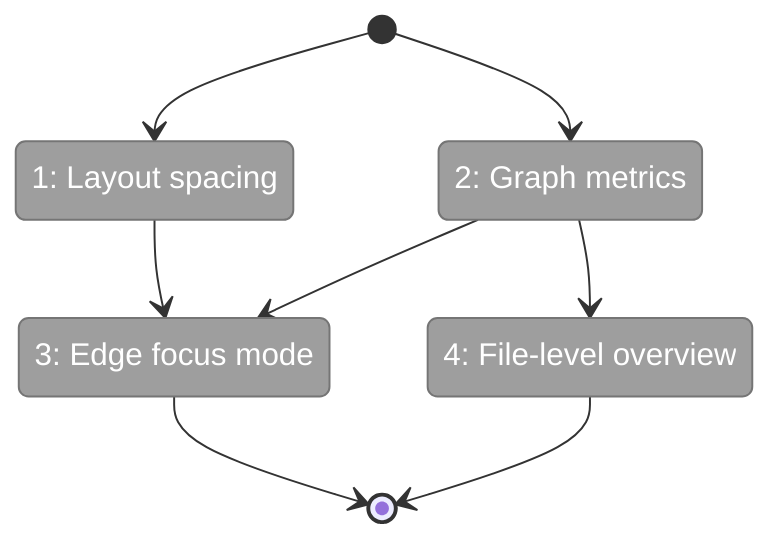

# Flight Plan: Fix FX001 — Unusable visualization

**Fix**: [FX001-unusable-visualization.md](FX001-unusable-visualization.md)
**Status**: Ready

## What → Why

**Problem**: Report dumps 5,710 nodes + 4,515 edges simultaneously with grid overlap — completely unusable for codebase exploration.

**Fix**: Add layout spacing, hide edges by default (show on focus), compute graph metrics, default to file-level overview (~500 nodes).

## Domain Context

| Domain | Relationship | What Changes |
|--------|-------------|-------------|
| services | modify | Layout spacing, degree/depth serialization |
| static-assets | modify | Edge/node reducers, view modes, click handlers |

## Flight Status

**Legend**: grey = pending | yellow = active | red = blocked/needs input | green = done

## Stages

- [ ] **Stage 1: Layout spacing** — padding between directory regions + minimum node spacing (`report_layout.py`)
- [ ] **Stage 2: Graph metrics** — compute in_degree, out_degree, depth, is_entry_point at serialization (`report_service.py`)
- [ ] **Stage 3: Edge focus mode** — edgeReducer hides all edges; clickNode shows only direct connections (`graph-viewer.js`)
- [ ] **Stage 4: File-level overview** — nodeReducer shows only file nodes on open; click file to reveal contents (`graph-viewer.js`)

## Acceptance

- [ ] No node overlap at default zoom
- [ ] Zero edges on initial load
- [ ] Click file → shows contents
- [ ] Click function → shows callers/callees
- [ ] Click canvas → resets to overview
- [ ] Tests pass, lint clean
