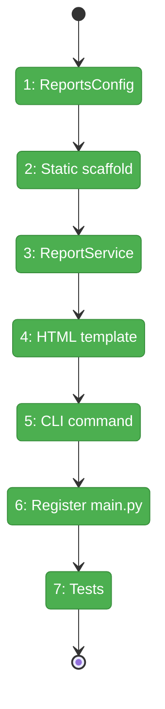
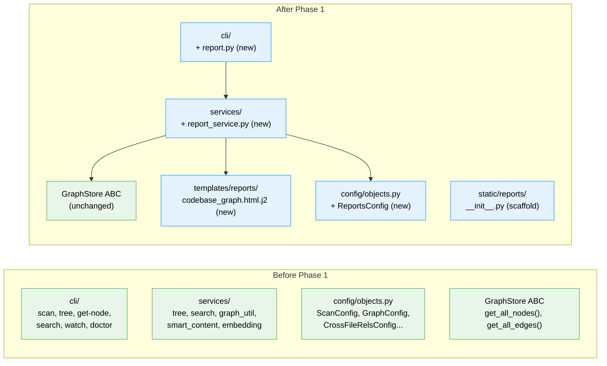

# Flight Plan: Phase 1 — Foundation

**Plan**: [reports-plan.md](../../reports-plan.md)
**Phase**: Phase 1: Foundation — Config, CLI, Service Skeleton
**Generated**: 2026-03-15
**Status**: Landed

---

## Departure → Destination

**Where we are**: fs2 has no report generation capability. The `fs2 report` command does not exist. The graph contains 5,710 nodes and 4,515 reference edges ready for visualization — but there's no way to render them as HTML.

**Where we're going**: A developer can run `fs2 report codebase-graph` and get a self-contained HTML file with all graph data embedded as JSON. The HTML is valid, opens in a browser, and contains the complete node + edge data for Sigma.js to consume in Phase 2.

---

## Domain Context

### Domains We're Changing

| Domain | What Changes | Key Files |
|--------|-------------|-----------|
| config | Add `ReportsConfig` model | `src/fs2/config/objects.py` |
| cli | Add `report` command group | `src/fs2/cli/report.py`, `src/fs2/cli/main.py` |
| services | Add `ReportService` | `src/fs2/core/services/report_service.py` |
| templates | Add report HTML template | `src/fs2/core/templates/reports/codebase_graph.html.j2` |
| static-assets | Scaffold package for Phase 2 | `src/fs2/core/static/reports/__init__.py` |

### Domains We Depend On (no changes)

| Domain | What We Consume | Contract |
|--------|----------------|----------|
| repos | Graph data (nodes, edges, metadata) | `GraphStore` ABC |
| cli/utils | Graph resolution, safe file writing | `resolve_graph_from_context()`, `safe_write_file()` |
| config | Configuration injection | `ConfigurationService.require()` |

---

## Flight Status

<!-- Updated by /plan-6-v2: pending → active → done. Use blocked for problems/input needed. -->

**Legend**: grey = pending | yellow = active | red = blocked/needs input | green = done

---

## Stages

<!-- Updated by /plan-6-v2 during implementation: [ ] → [~] → [x] -->

- [x] **Stage 1: Add ReportsConfig** — config model with output_dir, include_smart_content, max_nodes (`objects.py`)
- [x] **Stage 2: Scaffold static-assets** — create package markers + update pyproject.toml includes (`static/reports/`, `pyproject.toml`)
- [x] **Stage 3: Create ReportService** — graph extraction + JSON serialization (`report_service.py` — new file)
- [x] **Stage 4: Create HTML template** — minimal Jinja2 template with graph JSON embed (`codebase_graph.html.j2` — new file)
- [x] **Stage 5: Create CLI command** — Typer subapp with codebase-graph subcommand (`report.py` — new file)
- [x] **Stage 6: Register in main.py** — import + add_typer (`main.py` — 2 lines)
- [x] **Stage 7: Tests** — config validation, service extraction, CLI smoke tests (3 new test files)

---

## Architecture: Before & After

**Legend**: existing (green, unchanged) | new (blue, created)

---

## Acceptance Criteria

- [x] AC1: `fs2 report codebase-graph` generates HTML at `.fs2/reports/codebase-graph.html`
- [x] AC3: `--output custom/path.html` writes to specified path
- [x] AC4: `--open` opens browser with graceful headless fallback
- [x] AC5: `--graph-file` works via global options
- [x] AC6: Missing graph produces clear error with exit code 1
- [x] AC27: `fs2 report --help` lists report types
- [x] AC28: `fs2 report codebase-graph --help` shows all options
- [x] AC29: ReportsConfig available in config.yaml under `reports:` key
- [x] AC30: `--no-smart-content` excludes smart_content from output

## Goals & Non-Goals

**Goals**: Working CLI → service → template → HTML file pipeline. All flags operational. Safe serialization (no embedding leaks). Error handling for missing graph and headless browser.

**Non-Goals**: No visualization rendering (Phase 2). No dark theme (Phase 2). No sidebar/search/keyboard (Phase 3). No vendored JS/CSS/fonts (Phase 2).

---

## Checklist

- [x] T001: Add `ReportsConfig` to `config/objects.py`
- [x] T002: Create static-assets + templates scaffolds, update `pyproject.toml`
- [x] T003: Create `ReportService` with `generate_codebase_graph()`
- [x] T004: Create minimal `codebase_graph.html.j2` template
- [x] T005: Create `cli/report.py` with Typer subapp
- [x] T006: Register `report_app` in `cli/main.py`
- [x] T007: Tests — config, service, CLI
