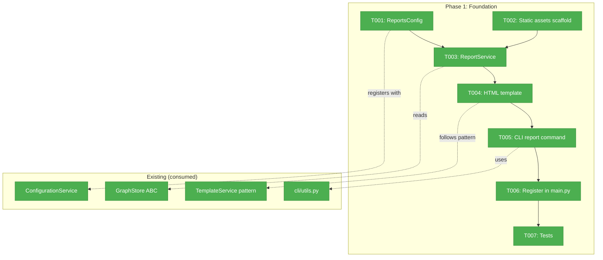
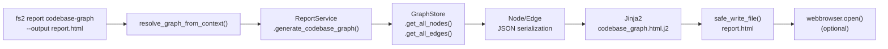
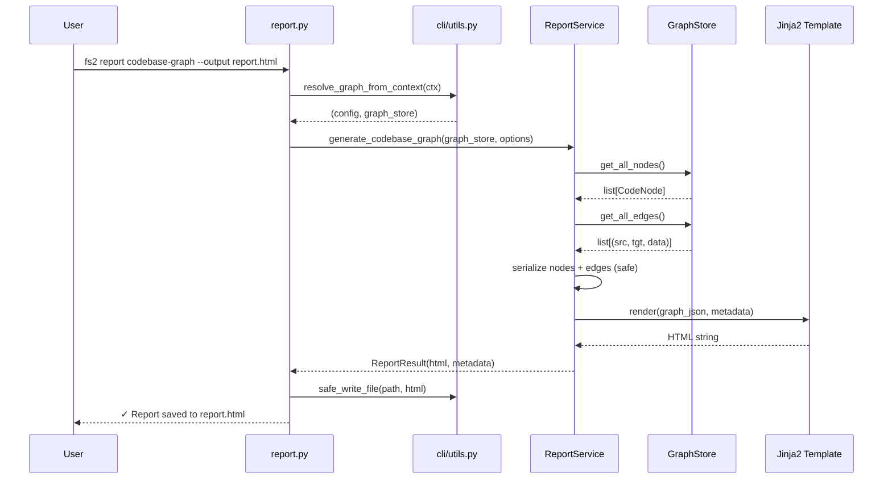

# Phase 1: Foundation — Config, CLI, Service Skeleton

**Plan**: [reports-plan.md](../../reports-plan.md)
**Phase**: Phase 1: Foundation
**Generated**: 2026-03-15
**Status**: Complete

---

## Executive Briefing

**Purpose**: Wire up `fs2 report codebase-graph` end-to-end so the command exists, loads a graph, extracts node/edge data, and writes a valid HTML file with the graph data embedded as JSON. Phase 2 will replace the minimal HTML with the real Sigma.js visualization.

**What We're Building**: A working CLI command that reads any fs2 graph and generates a self-contained HTML report file. The HTML will contain all node and edge data as JSON — ready for Sigma.js to consume in Phase 2.

**Goals**:
- ✅ `fs2 report codebase-graph` command exists and generates HTML
- ✅ `--output`, `--open`, `--no-smart-content` flags work
- ✅ `--graph-file` / `--graph-name` global options work
- ✅ `ReportsConfig` loads from YAML
- ✅ `ReportService` extracts nodes + edges with safe serialization
- ✅ Static assets package scaffolded for Phase 2
- ✅ Error handling: missing graph, bad path, headless `--open`

**Non-Goals**:
- ❌ No Sigma.js rendering (Phase 2)
- ❌ No treemap layout (Phase 2)
- ❌ No dark theme / Cosmos styling (Phase 2)
- ❌ No sidebar, search, keyboard shortcuts (Phase 3)
- ❌ No vendored JS/CSS/fonts (Phase 2)

---

## Pre-Implementation Check

| File | Exists? | Domain | Notes |
|------|---------|--------|-------|
| `src/fs2/config/objects.py` | ✅ Yes | config | Add `ReportsConfig` near `CrossFileRelsConfig` (line ~995) |
| `src/fs2/core/services/report_service.py` | ❌ Create | services | New file. Follow `TreeService` DI pattern |
| `src/fs2/core/templates/reports/codebase_graph.html.j2` | ❌ Create | templates | New dir + file. Follow `smart_content/` pattern |
| `src/fs2/core/templates/reports/__init__.py` | ❌ Create | templates | Package marker for importlib.resources |
| `src/fs2/core/static/reports/__init__.py` | ❌ Create | static-assets | Package marker — scaffolded now, populated in Phase 2 |
| `src/fs2/cli/report.py` | ❌ Create | cli | New file. Follow `doctor.py` Typer subapp pattern |
| `src/fs2/cli/main.py` | ✅ Yes | cli | Add 1 import + 1 registration line (line ~120) |
| `pyproject.toml` | ✅ Yes | config | Add template + static asset globs to wheel/sdist includes |
| `tests/unit/cli/test_report_cli.py` | ❌ Create | — | CLI smoke tests |
| `tests/unit/services/test_report_service.py` | ❌ Create | — | Service unit tests |
| `tests/unit/config/test_reports_config.py` | ❌ Create | — | Config validation tests |

No duplicate concepts found — "report" is entirely new to the codebase.

---

## Architecture Map



---

## Tasks

| Status | ID | Task | Domain | Path(s) | Done When | Notes |
|--------|-----|------|--------|---------|-----------|-------|
| [x] | T001 | Add `ReportsConfig` model with `output_dir`, `include_smart_content`, `max_nodes` fields + validators | config | `src/fs2/config/objects.py` | Config loads from YAML `reports:` section. `max_nodes` validated 100–500,000. Default output_dir=`.fs2/reports`. | Follow `CrossFileRelsConfig` pattern (line ~995). Register `__config_path__ = "reports"`. |
| [x] | T002 | Create static-assets and templates package scaffolds + update `pyproject.toml` | static-assets, templates | `src/fs2/core/static/__init__.py`, `src/fs2/core/static/reports/__init__.py`, `src/fs2/core/templates/reports/__init__.py`, `pyproject.toml` | `importlib.resources.files('fs2.core.static.reports')` resolves. `pyproject.toml` includes `*.j2`, `*.js`, `*.css`, `*.woff2` patterns in both wheel and sdist. | **Finding 01** — critical. Must add patterns to `[tool.hatch.build.targets.wheel]` (line ~81) AND `[tool.hatch.build.targets.sdist]` (line ~89). |
| [x] | T003 | Create `ReportService` with `generate_codebase_graph()` that extracts nodes + edges as JSON | services | `src/fs2/core/services/report_service.py` | Service accepts `ConfigurationService` + `GraphStore`. Returns `ReportResult(html=str, metadata=dict)`. **DYK-01**: Whitelist ~10 fields per node (node_id, name, category, file_path, start_line, end_line, signature, smart_content, language, parent_node_id) — content/embedding/hashes excluded (saves ~30MB). **DYK-03**: Simple inline Jinja2 rendering via importlib.resources, not full TemplateService. **DYK-04**: Compute rich metadata (project name, fs2 version, ref edge count). **DYK-05**: Emit null for absent smart_content. | DI pattern per TreeService. |
| [x] | T004 | Create minimal Jinja2 HTML template `codebase_graph.html.j2` | templates | `src/fs2/core/templates/reports/codebase_graph.html.j2` | Template renders valid HTML5 with `<script>const GRAPH_DATA = {{ graph_json }};</script>`. Includes metadata header. Placeholder for Phase 2 rendering. | Phase 1 template shows metadata summary + node/edge stats. No full JSON visible in page. |
| [x] | T005 | Create `src/fs2/cli/report.py` with `report_app` Typer group and `codebase-graph` subcommand | cli | `src/fs2/cli/report.py` | `fs2 report codebase-graph` generates HTML at default path. `--output PATH` writes to custom path. `--open` opens browser (try/except fallback). `--no-smart-content` excludes smart_content. Error on missing graph (exit 1). | **Finding 03, 05, 06**. Follow `doctor.py` pattern (line ~36): `report_app = typer.Typer(...)`. Use `resolve_graph_from_context()` + `safe_write_file()` from `cli/utils.py`. Wrap `webbrowser.open()` in try/except. |
| [x] | T006 | Register `report_app` in `src/fs2/cli/main.py` | cli | `src/fs2/cli/main.py` | `fs2 report --help` lists available report types. Command requires init. | **DYK-02**: Use `app.add_typer(require_init(report_app), name="report")` — NOT bare like doctor. Reports need init + graph. |
| [x] | T007 | Tests: ReportsConfig validation, ReportService unit tests, CLI smoke tests | — | `tests/unit/config/test_reports_config.py`, `tests/unit/services/test_report_service.py`, `tests/unit/cli/test_report_cli.py` | Config: valid YAML loads, invalid max_nodes rejected. Service: returns HTML with metadata, handles empty graph, **excludes content/embedding fields** (DYK-01). CLI: exit 0 on success, exit 1 on missing graph, `--help` works. | TDD for config + service. Lightweight for CLI. Use `FakeGraphStore` + `FakeConfigurationService`. |

---

## Context Brief

### Key Findings from Plan

- **Finding 01 (Critical)**: `pyproject.toml` only includes `.j2`, `.yaml`, `.md` — must add `.js`, `.css`, `.woff2` patterns. **Action**: T002 adds patterns to both wheel and sdist includes.
- **Finding 03 (High)**: `webbrowser.open()` fails silently on headless/SSH. **Action**: T005 wraps in try/except, prints file path as fallback.
- **Finding 04 (High)**: TemplateService `importlib.resources` + `DictLoader` pattern is reusable. **Action**: T003/T004 follow the same loading pattern.
- **Finding 05 (High)**: Doctor command group shows exact Typer subapp registration. **Action**: T005/T006 follow `doctor.py` pattern.
- **Finding 06 (High)**: `safe_write_file()` + `validate_save_path()` handle file output safely. **Action**: T005 reuses these directly.

### Domain Dependencies (consumed, no changes)

- **repos**: `GraphStore.get_all_nodes()`, `GraphStore.get_all_edges(edge_type)`, `GraphStore.get_metadata()`, `GraphStore.load(path)` — primary data source
- **config**: `ConfigurationService.require(ReportsConfig)` — configuration injection pattern
- **cli/utils**: `resolve_graph_from_context(ctx)` → `(ConfigurationService, GraphStore)` — graph resolution
- **cli/utils**: `safe_write_file(path, content, console)` — safe file output with cleanup
- **cli/utils**: `validate_save_path(file, console)` — directory traversal prevention
- **templates/smart_content**: `_load_template_sources_from_package()` — importlib.resources loading pattern (reference only, not imported)

### Domain Constraints

- Services receive `ConfigurationService` (registry), not extracted configs
- Never use `asdict()` on `CodeNode` — explicit field selection to avoid embedding/hash leaks
- CLI commands: errors to stderr (`Console(stderr=True)`), data to stdout
- Exit codes: 0 = success, 1 = user error, 2 = system error
- All exceptions must include fix instructions

### Reusable from Prior Work

- `FakeGraphStore` — test fake for GraphStore ABC (in `src/fs2/core/repos/graph_store_fake.py`)
- `FakeConfigurationService` — test fake for config (in `src/fs2/config/service.py`)
- `scanned_project` fixture — pre-scanned project for CLI integration tests (in `tests/conftest.py`)
- `CliRunner` from `typer.testing` — CLI invocation in tests

### Flow Diagram



### Sequence Diagram



---

## Discoveries & Learnings

| Date | Task | Type | Discovery | Resolution | References |
|------|------|------|-----------|------------|------------|
| 2026-03-15 | T005 | gotcha | `report.py` initially wrote files directly, bypassing `validate_save_path()` + `safe_write_file()` from `cli/utils.py` | Code review caught it (FT-001). Replaced with CLI safety helpers. | `src/fs2/cli/report.py:66-80,103` |
| 2026-03-15 | T007 | gotcha | Typer's Rich panel help output includes ANSI escape codes even with `color=False` on `CliRunner` | Strip ANSI with `re.sub(r"\x1b\[[0-9;]*m", "", text)` before asserting on help output | `tests/unit/cli/test_report_cli.py:23` |

---

## Directory Layout

```
docs/plans/033-reports/
  ├── reports-spec.md
  ├── reports-plan.md
  ├── exploration.md
  ├── workshops/
  │   └── 001-visual-design-ux.md
  └── tasks/phase-1-foundation/
      ├── tasks.md              ← this file
      ├── tasks.fltplan.md      ← flight plan (below)
      └── execution.log.md     ← created by plan-6
```
