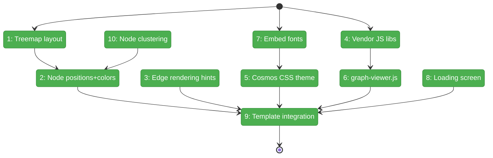

# Flight Plan: Phase 2 — Layout + Rendering

**Plan**: [reports-plan.md](../../reports-plan.md)
**Phase**: Phase 2: Layout + Rendering — Treemap, Sigma.js, Cosmos Theme
**Generated**: 2026-03-15
**Status**: Landed

---

## Departure → Destination

**Where we are**: `fs2 report codebase-graph` generates a valid HTML file with all graph data embedded as JSON, but the report shows only a metadata summary and a "Phase 2 placeholder" — no visualization. The static assets directory is scaffolded but empty. 25 tests pass. The Cosmos design language is fully specified in Workshop 001.

**Where we're going**: A developer opens the report and sees a stunning dark-canvas visualization — thousands of category-colored nodes positioned by treemap layout, with amber reference edges connecting them. Zoom in to see labels, zoom out to see structure. The graph renders at 60fps via WebGL. Everything is self-contained in a single offline HTML file with embedded fonts.

---

## Domain Context

### Domains We're Changing

| Domain | What Changes | Key Files |
|--------|-------------|-----------|
| services | Add treemap layout algorithm; extend ReportService with layout integration, asset loading, clustering | `report_layout.py` (new), `report_service.py` (modify) |
| static-assets | Vendor JS libs, create CSS theme, create graph-viewer JS, embed fonts | `sigma.min.js`, `graphology.min.js`, `graph-viewer.js`, `graph-viewer.css`, fonts (all new) |
| templates | Replace Phase 1 skeleton with full template embedding all assets | `codebase_graph.html.j2` (modify) |

### Domains We Depend On (no changes)

| Domain | What We Consume | Contract |
|--------|----------------|----------|
| repos | Graph data (nodes, edges, metadata) | `GraphStore` ABC |
| config | max_nodes threshold | `ReportsConfig.max_nodes` |
| models | Node structure + categories | `CodeNode` fields |

---

## Flight Status

<!-- Updated by /plan-6-v2: pending → active → done. Use blocked for problems/input needed. -->



**Legend**: grey = pending | yellow = active | red = blocked/needs input | green = done

---

## Stages

<!-- Updated by /plan-6-v2 during implementation: [ ] → [~] → [x] -->

- [x] **Stage 1: Treemap layout algorithm** — squarified treemap in Python, TDD with 5+ test cases (`report_layout.py` — new file)
- [x] **Stage 2: Node position + color serialization** — extend `_serialize_node()` with x, y, size, color fields (`report_service.py`)
- [x] **Stage 3: Edge rendering hints** — add color, hidden, id fields to edge serialization (`report_service.py`)
- [x] **Stage 4: Vendor JS libraries** — download Sigma.js 2, Graphology, ForceAtlas2 UMD builds (~280KB total) (`static/reports/`)
- [x] **Stage 5: Cosmos CSS theme** — full dark theme CSS with all Workshop 001 specs (`graph-viewer.css` — new file)
- [x] **Stage 6: Sigma.js graph-viewer** — WebGL init, node/edge rendering, zoom/pan, labels (`graph-viewer.js` — new file)
- [x] **Stage 7: Embed fonts** — Inter + JetBrains Mono woff2 as base64 in CSS (`inter-latin.woff2`, `jetbrains-mono-latin.woff2`)
- [x] **Stage 8: Loading screen** — dark overlay with project stats, fade-reveal on Sigma init (`graph-viewer.js`, `graph-viewer.css`)
- [x] **Stage 9: Template integration** — replace Phase 1 skeleton, inline all assets via Jinja2 variables (`codebase_graph.html.j2`)
- [x] **Stage 10: Node clustering** — group leaf callables by file above max_nodes threshold (`report_service.py`)

---

## Architecture: Before & After

```mermaid
flowchart LR
    classDef existing fill:#E8F5E9,stroke:#4CAF50,color:#000
    classDef changed fill:#FFF3E0,stroke:#FF9800,color:#000
    classDef new fill:#E3F2FD,stroke:#2196F3,color:#000

    subgraph Before["Before Phase 2"]
        B_RS["ReportService\nserialize + render skeleton"]:::existing
        B_TMPL["codebase_graph.html.j2\nmetadata + placeholder"]:::existing
        B_STATIC["static/reports/\n__init__.py only"]:::existing
    end

    subgraph After["After Phase 2"]
        A_RS["ReportService\n+ layout + assets + clustering"]:::changed
        A_LAYOUT["report_layout.py\ntreemap algorithm"]:::new
        A_TMPL["codebase_graph.html.j2\nfull Sigma.js + Cosmos"]:::changed
        A_SIGMA["sigma.min.js\ngraphology.min.js"]:::new
        A_CSS["graph-viewer.css\nCosmos dark theme"]:::new
        A_JS["graph-viewer.js\nSigma.js renderer"]:::new
        A_FONTS["Inter + JetBrains\nwoff2 fonts"]:::new

        A_RS --> A_LAYOUT
        A_RS --> A_TMPL
        A_TMPL -.->|embeds| A_SIGMA
        A_TMPL -.->|embeds| A_CSS
        A_TMPL -.->|embeds| A_JS
        A_CSS -.->|@font-face| A_FONTS
    end
```

**Legend**: existing (green, unchanged) | changed (orange, modified) | new (blue, created)

---

## Acceptance Criteria

- [ ] AC2: HTML renders in Chrome/Firefox/Safari without external dependencies
- [ ] AC7: All nodes positioned by treemap layout
- [ ] AC8: Nodes colored by category (cyan callables, violet types, slate files, indigo sections)
- [ ] AC9: Node size scales with line count (log scale, 4–14px)
- [ ] AC10: Deferred — Phase 2 ships straight amber arrows; curves/glow move to Phase 3
- [ ] AC19: 5K nodes renders in <2s, 60fps
- [ ] AC20: 50K nodes renders in <5s, 30fps
- [ ] AC21: Clustering above `--max-nodes`
- [ ] AC22: Cosmos dark theme with correct colors
- [ ] AC23: Embedded Inter + JetBrains Mono fonts

## Goals & Non-Goals

**Goals**: Treemap layout algorithm. Sigma.js WebGL rendering. Cosmos dark theme. Self-contained HTML with embedded JS/CSS/fonts. Node clustering for scale. Loading screen.

**Non-Goals**: Sidebar inspector. Search bar. Keyboard shortcuts. Edge stagger animations. Hover tooltips. Settings dropdown. ForceAtlas2 toggle UI.

---

## Checklist

- [x] T001: Treemap layout algorithm (TDD)
- [x] T002: Node position + color serialization
- [x] T003: Edge rendering hints
- [x] T004: Vendor Sigma.js 2, Graphology, ForceAtlas2
- [x] T005: Cosmos CSS dark theme
- [x] T006: graph-viewer.js — Sigma.js init + rendering
- [x] T007: Embed Inter + JetBrains Mono fonts
- [x] T008: Loading screen with fade-reveal
- [x] T009: Template integration (embed all assets)
- [x] T010: Node clustering for `--max-nodes`
