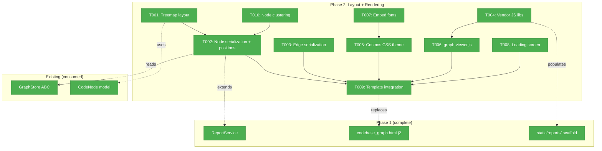
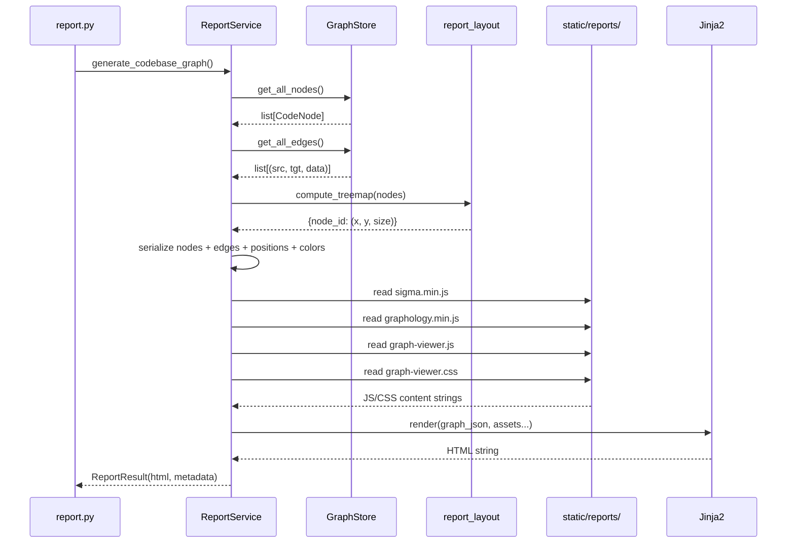

# Phase 2: Layout + Rendering — Treemap, Sigma.js, Cosmos Theme

**Plan**: [reports-plan.md](../../reports-plan.md)
**Phase**: Phase 2: Layout + Rendering
**Generated**: 2026-03-15
**Status**: Ready

---

## Executive Briefing

**Purpose**: Replace the Phase 1 skeleton HTML with a real interactive graph visualization. This phase delivers the core visual experience — the treemap layout algorithm, Sigma.js 2 WebGL rendering, and the Cosmos dark theme. After this phase, opening a report shows a gorgeous, interactive graph with category-colored nodes, amber reference edges, and smooth zoom/pan.

**What We're Building**: A Python treemap layout algorithm that positions nodes spatially by directory structure, a Sigma.js 2 renderer that draws them on a WebGL canvas with the Cosmos dark theme, and a loading screen that creates a polished first-impression. All vendored assets (JS, CSS, fonts) are embedded inline for a self-contained HTML file.

**Goals**:
- ✅ Squarified treemap layout algorithm in Python (TDD, deterministic)
- ✅ Sigma.js 2 + Graphology rendering on WebGL canvas
- ✅ Category-colored nodes sized by line count (log scale 4–14px)
- ✅ Reference edges as curved amber lines
- ✅ Cosmos dark theme from Workshop 001
- ✅ Embedded Inter + JetBrains Mono fonts
- ✅ Loading screen with project stats + fade-reveal
- ✅ Single self-contained HTML file (no CDN, works offline)
- ✅ Node clustering above `--max-nodes` threshold

**Non-Goals**:
- ❌ No sidebar inspector (Phase 3)
- ❌ No search bar (Phase 3)
- ❌ No keyboard shortcuts (Phase 3)
- ❌ No edge animations / stagger (Phase 3)
- ❌ No hover tooltips (Phase 3)
- ❌ No settings dropdown (Phase 3)
- ❌ No ForceAtlas2 layout toggle (Phase 3 — JS is vendored but toggle UI deferred)

---

## Prior Phase Context

### Phase 1: Foundation — Config, CLI, Service Skeleton ✅

**A. Deliverables**:
- `src/fs2/config/objects.py` — `ReportsConfig` model (output_dir, include_smart_content, max_nodes)
- `src/fs2/core/services/report_service.py` — `ReportService` with `generate_codebase_graph()` → `ReportResult(html, metadata)`
- `src/fs2/cli/report.py` — `report_app` Typer group, `codebase-graph` subcommand with `--output`, `--open`, `--no-smart-content`
- `src/fs2/cli/main.py` — Registered with `require_init(report_app)`
- `src/fs2/core/templates/reports/codebase_graph.html.j2` — Skeleton HTML with GRAPH_DATA + METADATA JSON
- `src/fs2/core/static/reports/__init__.py` — Package marker (empty, scaffolded for Phase 2)
- `pyproject.toml` — Added `.js`, `.css`, `.woff2`, `.html.j2` patterns
- 25 tests (7 config + 10 service + 8 CLI), all passing

**B. Dependencies Exported**:
- `ReportService.generate_codebase_graph(include_smart_content, graph_path) → ReportResult`
- `ReportResult(html: str, metadata: dict)` — frozen dataclass
- `_serialize_node()` — whitelist of 10 fields, returns dict
- `_serialize_edge()` — returns `{source, target, type}` dict
- `_render_template(graph_json, metadata_json)` — Jinja2 via importlib.resources
- `importlib_resources.files("fs2.core.static.reports")` — asset loading pattern
- GRAPH_DATA JSON: `{metadata, nodes: [{node_id, name, category, file_path, start_line, end_line, signature, smart_content, language, parent_node_id}], edges: [{source, target, type}]}`
- METADATA JSON: `{project_name, generated_at, fs2_version, node_count, containment_edge_count, reference_edge_count, categories}`

**C. Gotchas & Debt**:
- `_serialize_node` uses whitelist pattern — **never** use `asdict()` (DYK-01, saves ~30MB)
- Typer Rich ANSI in tests — strip with `re.sub(r"\x1b\[[0-9;]*m", "", text)`
- `webbrowser.open()` wrapped in try/except for headless environments
- Template uses simple inline Jinja2, not full TemplateService (acceptable for now)

**D. Incomplete Items**: None — all 7 tasks complete

**E. Patterns to Follow**:
- Node serialization: explicit field whitelist via `_NODE_FIELDS` tuple
- Asset loading: `importlib_resources.files(package).joinpath(name).read_text(encoding="utf-8")`
- CLI file output: `validate_save_path()` + `safe_write_file()` from `cli/utils.py`
- Config access: `config.require(ReportsConfig)` with try/except fallback
- Error handling: exit 0 success, exit 1 user error, exit 2 system error

---

## Pre-Implementation Check

| File | Exists? | Domain | Notes |
|------|---------|--------|-------|
| `src/fs2/core/services/report_layout.py` | ❌ Create | services | New file — treemap algorithm |
| `src/fs2/core/services/report_service.py` | ✅ Yes | services | Modify — add layout integration, asset loading, position serialization |
| `src/fs2/core/static/reports/sigma.min.js` | ❌ Create | static-assets | Vendor from CDN (~150KB) |
| `src/fs2/core/static/reports/graphology.min.js` | ❌ Create | static-assets | Vendor from CDN (~80KB) |
| `src/fs2/core/static/reports/graphology-layout-forceatlas2.min.js` | ❌ Create | static-assets | Vendor from CDN (~50KB) |
| `src/fs2/core/static/reports/graph-viewer.css` | ❌ Create | static-assets | Cosmos dark theme |
| `src/fs2/core/static/reports/graph-viewer.js` | ❌ Create | static-assets | Sigma.js init + rendering |
| `src/fs2/core/static/reports/inter-latin.woff2` | ❌ Create | static-assets | Inter font subset |
| `src/fs2/core/static/reports/jetbrains-mono-latin.woff2` | ❌ Create | static-assets | JetBrains Mono subset |
| `src/fs2/core/templates/reports/codebase_graph.html.j2` | ✅ Yes | templates | Replace Phase 1 skeleton with full template |
| `tests/unit/services/test_report_layout.py` | ❌ Create | — | TDD for treemap (5+ test cases) |
| `tests/unit/services/test_report_service.py` | ✅ Yes | — | Extend — add layout integration tests |

No harness configured — standard testing approach.

No duplicate concepts found — "treemap layout" and "graph-viewer" are new to the codebase.

---

## Architecture Map



---

## Tasks

| Status | ID | Task | Domain | Path(s) | Done When | Notes |
|--------|-----|------|--------|---------|-----------|-------|
| [x] | T001 | Implement squarified treemap layout in `report_layout.py` | services | `src/fs2/core/services/report_layout.py`, `tests/unit/services/test_report_layout.py` | Given nodes grouped by directory hierarchy, produces `{node_id: (x, y, size)}` positions. No overlaps. Deterministic. 5+ TDD test cases: empty graph, single node, single dir, multi-dir, deep nesting, mixed categories. | **TDD — pure math.** **DYK-06**: Hierarchy is DIRECTORY-based (from `file_path`), NOT `parent_node_id` (which is AST containment). Two-level: (1) extract directory tree from `file_path` — reuse logic from `TreeService._compute_folder_hierarchy()` in `src/fs2/core/services/tree_service.py:436`, (2) within each file's cell, use `parent_node_id` for sub-layout. Output: dict mapping node_id → (x, y, size). Canvas coords: 0-1000 range. |
| [x] | T002 | Extend node serialization with layout positions for Sigma.js JSON | services | `src/fs2/core/services/report_service.py` | Each node dict gains `x`, `y`, `size`, `color` fields. Color mapped from category using Workshop 001 palette. Size uses `nodeSize(start_line, end_line)` log formula from Workshop 001. No embedding leak. | Extend `_serialize_node()` or add post-processing step. **DYK-08**: Python is the single source of truth for category→color map (callable=#67e8f9, type=#c4b5fd, file=#94a3b8, section=#a5b4fc, folder=#64748b). Define `_CATEGORY_COLORS` dict at module level. Size formula: `max(4, min(14, 3 + log2(lines+1)*1.5))`. |
| [x] | T003 | Extend edge serialization with Sigma.js rendering hints | services | `src/fs2/core/services/report_service.py` | Reference edges include `color: "#f59e0b"` (amber), `type: "arrow"`. Containment edges emitted separately with `color: "#1e293b"`, `hidden: true`. Each edge gets unique `id` field for Graphology. | **DYK-07**: Use straight arrow edges (`type: "arrow"`) in Phase 2 — curved edges require `@sigma/edge-curve` package (deferred to Phase 3 alongside glow effects). Add `id` field (e.g., `"e-{idx}"`). |
| [x] | T004 | Vendor Sigma.js 2, Graphology, ForceAtlas2 into static/reports/ | static-assets | `src/fs2/core/static/reports/sigma.min.js`, `src/fs2/core/static/reports/graphology.min.js`, `src/fs2/core/static/reports/graphology-layout-forceatlas2.min.js` | Files exist, loadable via `importlib.resources.files('fs2.core.static.reports')`. Total ~280KB minified. | Download from jsDelivr/unpkg CDN. Pin versions. Sigma.js 2.x, Graphology 0.25.x, ForceAtlas2 compatible. Verify UMD/IIFE builds work as inline `<script>` tags (not ES modules). |
| [x] | T005 | Create `graph-viewer.css` — full Cosmos dark theme | static-assets | `src/fs2/core/static/reports/graph-viewer.css` | CSS implements complete color system from Workshop 001. Includes: canvas vars, chrome vars, node category colors, edge colors, accent colors, status bar, category badges, loading screen styles. @font-face declarations for embedded fonts. | Transcribe exact CSS from Workshop 001 §Color System, §Typography, §Status Bar, §Category Badges. Use CSS custom properties throughout. |
| [x] | T006 | Create `graph-viewer.js` — Sigma.js initialization + basic rendering | static-assets | `src/fs2/core/static/reports/graph-viewer.js` | JS loads GRAPH_DATA, creates Graphology graph, initializes Sigma renderer on `#sigma-container`, renders nodes + edges on WebGL canvas. Zoom/pan works. Node labels show at appropriate zoom. Basic node hover highlight. | Core rendering only — no sidebar, search, keyboard. Use Graphology's `Graph()` constructor. Add nodes with `{x, y, size, color, label}`. Add edges with `{color, size, type: "arrow"}` (**DYK-07**: straight arrows, not curves). Sigma settings: `renderLabels: true`, `labelRenderedSizeThreshold: 6`. Node colors come pre-set from Python (**DYK-08**) — JS reads `color` attribute directly, no JS-side color map needed. |
| [x] | T007 | Embed Inter + JetBrains Mono fonts as base64 woff2 | static-assets | `src/fs2/core/static/reports/inter-latin.woff2`, `src/fs2/core/static/reports/jetbrains-mono-latin.woff2` | Fonts render correctly in the report HTML. No system font fallback visible. Latin subset only. @font-face declarations in graph-viewer.css. | **DYK-10**: Use **static Latin-subset** woff2 files (NOT variable fonts). Static subsets are ~75KB total vs ~180KB variable — nearly half the size. Download per-weight Latin subsets from Google Fonts CDN. Weights: Inter 400,500,600 (~45KB total); JetBrains Mono 400,500 (~30KB total). Embed as base64 in @font-face `src: url(data:font/woff2;base64,...)`. |
| [x] | T008 | Create loading screen with fade-reveal animation | static-assets | `src/fs2/core/static/reports/graph-viewer.js`, `src/fs2/core/static/reports/graph-viewer.css` | On open: dark screen shows project name + node/edge counts. After Sigma init completes, graph fades in over 400ms. Loading screen fades out. Always shown (consistent UX). | Per clarification Q8. CSS: `#loading-screen` absolute-positioned overlay. JS: after `new Sigma()`, add class to trigger CSS transition. Show metadata from METADATA object. |
| [x] | T009 | Update HTML template to embed all JS/CSS/fonts + graph JSON | templates | `src/fs2/core/templates/reports/codebase_graph.html.j2`, `src/fs2/core/services/report_service.py` | Template inlines all vendored assets via Jinja2 variables. Output is single self-contained HTML. Works offline. Replace Phase 1 skeleton entirely. | **DYK-09**: Refactor `_render_template()` — add `_load_static_asset(name: str) -> str` helper; change signature to accept `**template_vars` dict instead of positional args. Service loads each asset via `importlib.resources`, passes to template: `{{ sigma_js }}`, `{{ graphology_js }}`, `{{ force_atlas_js }}`, `{{ graph_viewer_js }}`, `{{ graph_viewer_css }}`. **DYK-08**: Remove Phase 1 `catColors` JS map from template — colors now come from Python via node `color` field. Template structure per Workshop 006. |
| [x] | T010 | Node clustering for `--max-nodes` threshold | services | `src/fs2/core/services/report_service.py`, `tests/unit/services/test_report_service.py` | When `node_count > max_nodes` (default 10,000), leaf callable nodes grouped by file into summary nodes. CLI prints warning. Report metadata includes `clustered: true`. | **Finding 02** — prevents 31MB JSON. Cluster strategy: group callables by parent file, create summary node with count label. Preserve files/types. Test with FakeGraphStore loaded with >max_nodes. |

---

## Context Brief

### Key Findings from Plan

- **Finding 01 (Critical)**: pyproject.toml static asset globs — ✅ **resolved in Phase 1**. Patterns for `.js`, `.css`, `.woff2` already in both wheel and sdist.
- **Finding 02 (Critical)**: 31MB JSON for 100K nodes → browser OOM. **Action**: T010 implements clustering above `--max-nodes` threshold (default 10,000).
- **Finding 03 (High)**: `webbrowser.open()` headless fallback — ✅ **resolved in Phase 1**.
- **Finding 04 (High)**: TemplateService importlib.resources pattern — ✅ **resolved in Phase 1** (inline Jinja2).

### Workshop References

- **Workshop 001 (Visual Design & UX)**: `docs/plans/033-reports/workshops/001-visual-design-ux.md` — **primary reference** for all CSS values, colors, fonts, animations, node/edge rendering specs. Must be followed exactly for visual quality.
- **Workshop 006 (Technical Architecture)**: `docs/plans/031-cross-file-rels/workshops/006-codebase-graph-visualization.md` — Library selection rationale, HTML template structure, bundling strategy.

### Domain Dependencies (consumed, no changes)

- `repos`: `GraphStore.get_all_nodes()` → `list[CodeNode]`, `GraphStore.get_all_edges()` → `list[(str, str, dict)]` — primary data source
- `config`: `ConfigurationService.require(ReportsConfig)` → `ReportsConfig` with `max_nodes` field
- `models`: `CodeNode` — fields: `node_id`, `name`, `category`, `file_path`, `start_line`, `end_line`, `signature`, `smart_content`, `language`, `parent_node_id`
- Categories: `file`, `callable`, `type`, `section`, `folder`, `block`, `statement`, `expression`, `definition`, `other`
- Edge types: containment (empty `edge_data`), reference (`{"edge_type": "references"}`)
- Hierarchy: `parent_node_id` field on CodeNode — None for root files, parent's node_id for children

### Domain Constraints

- Services receive `ConfigurationService` (registry), not extracted configs
- Never use `asdict()` on CodeNode — explicit field selection via `_NODE_FIELDS`
- Reference edges distinguished by `data.get("edge_type") == "references"`
- Containment implicit in `parent_node_id` hierarchy
- Exit codes: 0 success, 1 user error, 2 system error
- All assets embedded inline — no external CDN references

### Vendoring Strategy (T004)

Sigma.js 2 and Graphology must be vendored as **UMD/IIFE builds** (not ES modules) so they work as inline `<script>` tags. Download from jsDelivr CDN:
- `https://cdn.jsdelivr.net/npm/graphology@VERSION/dist/graphology.umd.min.js`
- `https://cdn.jsdelivr.net/npm/sigma@VERSION/build/sigma.min.js`
- `https://cdn.jsdelivr.net/npm/graphology-layout-forceatlas2@VERSION/build/graphology-layout-forceatlas2.min.js`

Pin exact versions. Store in `src/fs2/core/static/reports/`. No npm install needed.

### Reusable from Phase 1

- `FakeGraphStore` + `FakeConfigurationService` — test fakes for all service tests
- `scanned_project` fixture — pre-scanned project for CLI integration tests
- `_serialize_node()` / `_serialize_edge()` — extend, don't replace
- `_render_template()` — refactor to `**template_vars` pattern (DYK-09)
- `CliRunner` + ANSI stripping pattern for CLI tests
- Category color map already in template JS (line 165-169 of Phase 1 template) — **remove in T009** (DYK-08)
- `TreeService._compute_folder_hierarchy()` — directory tree dict builder, reuse logic in treemap (DYK-06)

### Flow Diagram

```mermaid
flowchart LR
    CLI["fs2 report codebase-graph"]
    CLI --> Resolve["resolve_graph\n_from_context()"]
    Resolve --> Service["ReportService\n.generate_codebase_graph()"]
    Service --> GS["GraphStore\n.get_all_nodes()\n.get_all_edges()"]
    GS --> Layout["report_layout\n.compute_treemap()"]
    Layout --> Serialize["Node/Edge\nserialization\n+ positions + colors"]
    Serialize --> LoadAssets["Load vendored\nJS/CSS/fonts"]
    LoadAssets --> Template["Jinja2 render\nwith all assets"]
    Template --> Write["safe_write_file()\nreport.html"]
```



### Sequence Diagram



---

## Discoveries & Learnings

| Date | Task | Type | Discovery | Resolution | References |
|------|------|------|-----------|------------|------------|
| 2026-03-15 | T001 | insight (DYK-06) | Treemap hierarchy must be directory-based (from `file_path`), not `parent_node_id` (AST containment). Using parent_node_id would scatter same-directory files across the layout. | Two-level: directory tree from file_path at top, then parent_node_id within files. Reuse `TreeService._compute_folder_hierarchy()` dict-building logic. | `src/fs2/core/services/tree_service.py:436-489` |
| 2026-03-15 | T003/T006 | decision (DYK-07) | Curved reference edges require `@sigma/edge-curve` (separate package not in vendor list). | Use straight arrow edges in Phase 2. Defer curves + glow to Phase 3. Plan already notes this as acceptable fallback. | `reports-plan.md` Phase 2 risks table |
| 2026-03-15 | T002/T009 | insight (DYK-08) | Category→color map would be triple-defined (Python, CSS, JS template) if not careful. | Python is single source of truth — sets `color` on each node. Remove Phase 1 `catColors` JS map in T009. CSS badges use same hex values (static, acceptable). | Workshop 001 §Node Category Colors |
| 2026-03-15 | T009 | insight (DYK-09) | `_render_template(graph_json, metadata_json)` only takes 2 args but Phase 2 needs 5+ asset strings. | Add `_load_static_asset()` helper. Refactor to `**template_vars` dict. | `src/fs2/core/services/report_service.py:185-201` |
| 2026-03-15 | T007 | insight (DYK-10) | Static Latin-subset fonts are ~75KB total vs ~180KB for variable fonts — nearly half. | Use per-weight Latin subsets from Google Fonts. 5 files (~75KB) instead of 2 variable (~180KB). | Workshop 001 §Font Loading |

---

## Directory Layout

```
docs/plans/033-reports/
  ├── reports-spec.md
  ├── reports-plan.md
  ├── exploration.md
  ├── workshops/
  │   └── 001-visual-design-ux.md
  └── tasks/
      ├── phase-1-foundation/        # ✅ Complete
      │   ├── tasks.md
      │   ├── tasks.fltplan.md
      │   ├── execution.log.md
      │   └── reviews/
      └── phase-2-layout-rendering/  # ← This phase
          ├── tasks.md               # ← This file
          ├── tasks.fltplan.md       # ← Flight plan
          └── execution.log.md       # Created by plan-6
```
