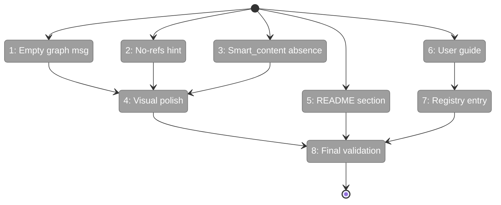
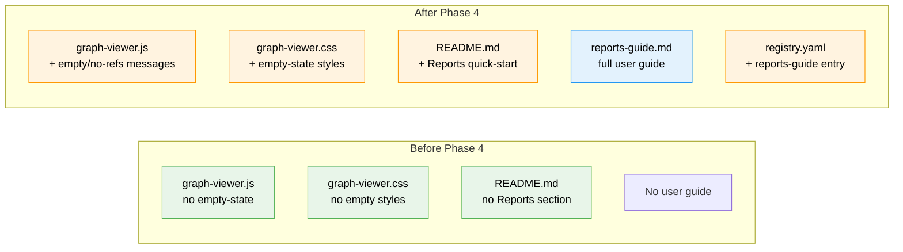

# Flight Plan: Phase 4 — Polish + Documentation

**Plan**: [reports-plan.md](../../reports-plan.md)
**Phase**: Phase 4: Polish + Documentation
**Generated**: 2026-03-15
**Status**: Ready for takeoff

---

## Departure → Destination

**Where we are**: `fs2 report codebase-graph` generates a 5.8MB self-contained HTML with Sigma.js rendering, treemap layout, Cosmos dark theme, and embedded fonts. 33 tests pass across 4 test files. But the report shows a blank canvas for empty graphs, has no user documentation, and hasn't had a visual polish pass.

**Where we're going**: Edge cases produce helpful messages (empty graph, no references, missing smart_content). README has a quick-start section pointing users to reports. A comprehensive user guide covers all CLI options, config, scale tips, and troubleshooting. Full test suite green.

---

## Domain Context

### Domains We're Changing

| Domain | What Changes | Key Files |
|--------|-------------|-----------|
| static-assets | Empty-state messages, no-refs hint, polish | `graph-viewer.js`, `graph-viewer.css` |
| templates | Empty-state HTML element | `codebase_graph.html.j2` |
| docs | README section, user guide, registry | `README.md`, `reports-guide.md`, `registry.yaml` |

### Domains We Depend On (no changes)

| Domain | What We Consume | Contract |
|--------|----------------|----------|
| services | `ReportService.generate_codebase_graph()` | `ReportResult(html, metadata)` |
| repos | `GraphStore` read-only | `get_all_nodes()`, `get_all_edges()` |
| config | `ReportsConfig` | `max_nodes`, `output_dir` |

---

## Flight Status

<!-- Updated by /plan-6-v2: pending → active → done. Use blocked for problems/input needed. -->

**Legend**: grey = pending | yellow = active | red = blocked/needs input | green = done

---

## Stages

<!-- Updated by /plan-6-v2 during implementation: [ ] → [~] → [x] -->

- [ ] **Stage 1: Empty graph message** — show "No nodes found" when graph has 0 nodes (`graph-viewer.js`, `codebase_graph.html.j2`)
- [ ] **Stage 2: No-refs hint** — status bar hint when reference_edge_count=0 (`graph-viewer.js`)
- [ ] **Stage 3: Smart_content absence** — ensure no "null" text leaks (`graph-viewer.js`)
- [ ] **Stage 4: Visual polish** — verify colors/fonts/transitions against Workshop 001 (`graph-viewer.css`)
- [ ] **Stage 5: README section** — add Reports quick-start after existing feature sections (`README.md`)
- [ ] **Stage 6: User guide** — comprehensive CLI/config/troubleshooting guide (`reports-guide.md` — new file)
- [ ] **Stage 7: Registry entry** — register guide for `fs2 docs` discovery (`registry.yaml`)
- [ ] **Stage 8: Final validation** — full test suite + lint + real report generation

---

## Architecture: Before & After

**Legend**: existing (green, unchanged) | changed (orange, modified) | new (blue, created)

---

## Acceptance Criteria

- [ ] AC2: HTML renders in Chrome/Firefox/Safari without external dependencies
- [ ] AC22: Cosmos dark theme with correct colors verified
- [ ] AC23: Embedded Inter + JetBrains Mono fonts render (not system fallback)
- [ ] Empty graph: report shows helpful message instead of blank canvas
- [ ] No references: status bar shows informational hint
- [ ] README has Reports quick-start section
- [ ] User guide at `docs/how/user/reports-guide.md`
- [ ] Guide registered in `docs/how/user/registry.yaml`
- [ ] Full test suite passes, lint clean

## Goals & Non-Goals

**Goals**: Edge case resilience. User documentation. Visual verification. Test suite green.

**Non-Goals**: Phase 3 interactions (sidebar, search, keyboard). New rendering features. Performance benchmarks.

---

## Checklist

- [ ] T001: Empty graph message
- [ ] T002: No-refs info message
- [ ] T003: Smart_content absence handling
- [ ] T004: Visual polish pass
- [ ] T005: README Reports section
- [ ] T006: User guide (`reports-guide.md`)
- [ ] T007: Registry entry
- [ ] T008: Full test suite validation
