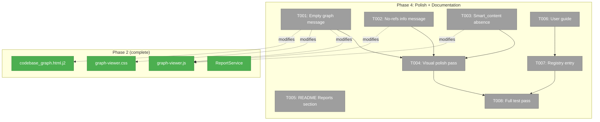
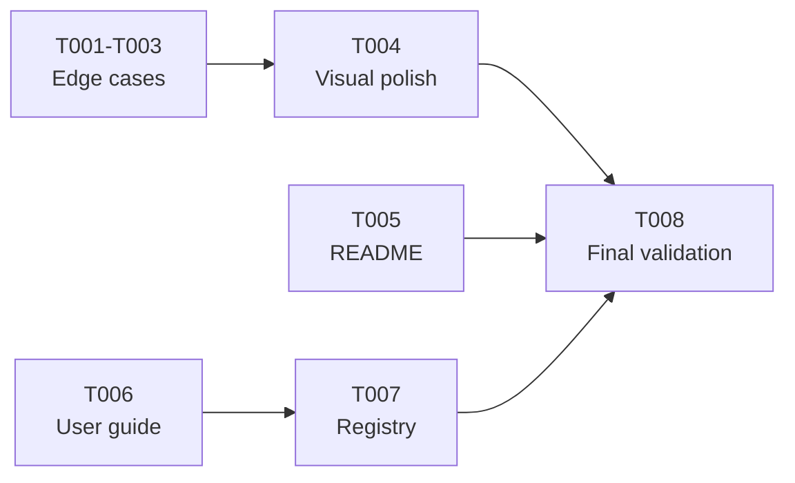

# Phase 4: Polish + Documentation

**Plan**: [reports-plan.md](../../reports-plan.md)
**Phase**: Phase 4: Polish + Documentation
**Generated**: 2026-03-15
**Status**: Ready

---

## Executive Briefing

**Purpose**: Harden the reports feature for production use. Add edge case handling for empty/unusual graphs, write user-facing documentation (README section + detailed guide), register the guide in the docs registry, and ensure the full test suite passes clean.

**What We're Building**: Edge case resilience (empty graph message, no-references info, graceful smart_content absence), a README quick-start section, a comprehensive user guide at `docs/how/user/reports-guide.md`, registry entry for docs discovery, and a final validation pass.

**Goals**:
- ✅ Empty graph shows "No nodes found — run `fs2 scan` first" in the HTML report
- ✅ Graph with no reference edges shows informational message
- ✅ Missing smart_content gracefully hidden (no empty panels)
- ✅ Visual polish: verify colors, fonts, spacing against Workshop 001
- ✅ README.md gains a Reports quick-start section
- ✅ `docs/how/user/reports-guide.md` — complete user guide
- ✅ Guide registered in `docs/how/user/registry.yaml`
- ✅ Full test suite passes, lint clean

**Non-Goals**:
- ❌ Phase 3 interactions (sidebar, search, keyboard — separate phase)
- ❌ New rendering features or layout changes
- ❌ Performance benchmarks (separate concern)

---

## Prior Phase Context

### Phase 1: Foundation ✅

**A. Deliverables**:
- `src/fs2/config/objects.py` — `ReportsConfig` (output_dir, include_smart_content, max_nodes)
- `src/fs2/core/services/report_service.py` — `ReportService.generate_codebase_graph()` → `ReportResult`
- `src/fs2/cli/report.py` — `report_app` with `codebase-graph` subcommand
- `src/fs2/core/templates/reports/codebase_graph.html.j2` — HTML template
- `src/fs2/core/static/reports/__init__.py` — Package marker
- 25 tests (7 config + 10 service + 8 CLI)

**B. Dependencies Exported**:
- `ReportService(config, graph_store)` — constructor DI
- `ReportResult(html: str, metadata: dict)` — frozen dataclass
- `_NODE_FIELDS` whitelist tuple — never use `asdict()`
- `validate_save_path()` + `safe_write_file()` from `cli/utils.py`
- `importlib_resources.files("fs2.core.static.reports")` asset loading

**C. Gotchas & Debt**:
- ANSI in Typer tests — strip with `re.sub(r"\x1b\[[0-9;]*m", "", text)`
- `webbrowser.open()` needs try/except for headless
- Empty graph returns valid HTML with 0 nodes (no error message shown)

**D. Incomplete Items**: None

**E. Patterns to Follow**:
- Node serialization: explicit whitelist via `_NODE_FIELDS`
- CLI file output: `validate_save_path()` + `safe_write_file()`
- Config access: `config.require(ReportsConfig)` with try/except fallback
- Exit codes: 0 success, 1 user error, 2 system error

### Phase 2: Layout + Rendering ✅

**A. Deliverables**:
- `src/fs2/core/services/report_layout.py` — squarified treemap (11 TDD tests)
- Extended `report_service.py` — layout integration, `_CATEGORY_COLORS`, clustering, `_load_static_asset()`, `_load_font_base64()`
- Vendored JS: `sigma.min.js` (95KB), `graphology.min.js` (72KB), `graphology-layout-forceatlas2.min.js` (1.8KB)
- `graph-viewer.css` — Cosmos dark theme (5.3KB)
- `graph-viewer.js` — Sigma.js init, hover, loading screen (6.3KB)
- Fonts: `inter-latin.woff2` (47KB), `jetbrains-mono-latin.woff2` (31KB)
- Full template replacement with embedded assets

**B. Dependencies Exported**:
- `compute_treemap(nodes) → {node_id: NodePosition}`
- `build_directory_tree(nodes) → nested dict` (shared utility)
- `_CATEGORY_COLORS` dict (Python is single source of truth)
- `_render_template(**template_vars)` — extensible dict pattern
- Edge serialization: `{id, source, target, type, color, hidden}`
- Node serialization gains: `x, y, size, color, label`

**C. Gotchas & Debt**:
- DYK-07: Straight arrows only (curved needs `@sigma/edge-curve`, Phase 3)
- DYK-08: JS `catColors` removed; colors derived from node data
- FA2 vendored but toggle UI deferred to Phase 3
- AC10 (curved/glow edges) deferred to Phase 3

**D. Incomplete Items**: AC10 deferred

**E. Patterns to Follow**:
- Category→color: Python sets, JS reads
- Assets embedded via Jinja2 template vars
- `build_directory_tree()` is the shared folder-hierarchy builder

---

## Pre-Implementation Check

| File | Exists? | Domain | Notes |
|------|---------|--------|-------|
| `src/fs2/core/static/reports/graph-viewer.js` | ✅ Yes | static-assets | Modify — add empty-graph + no-refs messages |
| `src/fs2/core/static/reports/graph-viewer.css` | ✅ Yes | static-assets | Modify — add empty-state styles |
| `src/fs2/core/templates/reports/codebase_graph.html.j2` | ✅ Yes | templates | Modify — add empty-state HTML elements |
| `README.md` | ✅ Yes | — | Modify — add Reports section |
| `docs/how/user/reports-guide.md` | ❌ Create | — | New file — detailed user guide |
| `docs/how/user/registry.yaml` | ✅ Yes | — | Modify — register reports-guide |
| `tests/unit/services/test_report_service.py` | ✅ Yes | — | Modify — add edge case tests |

No harness configured — standard testing approach.

---

## Architecture Map



---

## Tasks

| Status | ID | Task | Domain | Path(s) | Done When | Notes |
|--------|-----|------|--------|---------|-----------|-------|
| [ ] | T001 | Add empty-graph message to HTML report | static-assets, templates | `graph-viewer.js`, `graph-viewer.css`, `codebase_graph.html.j2` | When node_count=0, report shows centered "No nodes found — run `fs2 scan` first" message instead of blank canvas. Test with FakeGraphStore(empty). | Add `#empty-state` div to template, show/hide in JS based on GRAPH_DATA.nodes.length. Style per Cosmos theme. |
| [ ] | T002 | Add no-references info message | static-assets | `graph-viewer.js`, `graph-viewer.css` | When reference_edge_count=0, status bar shows "No cross-file references — run `fs2 scan --cross-file-rels`" hint. Graph still renders nodes. | Informational only — don't block rendering. Add to status bar or small banner. |
| [ ] | T003 | Handle missing smart_content gracefully | static-assets | `graph-viewer.js` | When node has no smart_content (null/undefined), hover and any future sidebar skip the field cleanly — no "null" or empty panel shown. | Already partially handled (label falls back to name). Verify no "null" text leaks. |
| [ ] | T004 | Visual polish pass | static-assets | `graph-viewer.css`, `graph-viewer.js` | Colors match Workshop 001 spec. Fonts render correctly (no fallback visible). Loading screen → graph transition is smooth. Status bar readable. Legend doesn't overlap graph on small screens. | Open report in Chrome + Firefox. Compare against Workshop 001 §Color System hex values. Check font rendering. Screenshot evidence. |
| [ ] | T005 | Add Reports section to README.md | — | `README.md` | README has a "Reports" section with: what it does, quick-start (3 commands: scan → report → open), link to full guide. Positioned after existing feature sections. | Per plan task 4.3 and clarification Q4. Keep concise — point to guide for details. |
| [ ] | T006 | Create `docs/how/user/reports-guide.md` | — | `docs/how/user/reports-guide.md` | Guide covers: all CLI options, config YAML, scale tips (--max-nodes), troubleshooting (no graph, WebGL), example workflows. | Per plan task 4.4. Follow existing guide style (see `scanning.md`, `cross-file-relationships.md` for format). |
| [ ] | T007 | Register guide in docs registry | — | `docs/how/user/registry.yaml` | `reports-guide` entry added to registry. `fs2 docs list` shows it. `fs2 docs get reports-guide` returns content. | Follow existing registry entry format. Rebuild with `just doc-build` if needed. |
| [ ] | T008 | Full test suite validation | — | — | `uv run python -m pytest -q` passes all tests (including new edge case tests). `uv run ruff check` clean. Report generates successfully on real graph. | Final gate — run after all other tasks. |

---

## Context Brief

### Key Findings from Plan

- **Finding 02 (Critical)**: 31MB JSON for 100K nodes → browser OOM. **Resolved** in Phase 2 via T010 clustering above `--max-nodes`.
- **No Phase 4-specific risks**: Plan says "None — all technical work done." Focus is polish and documentation.

### Domain Dependencies (consumed, no changes)

- `repos`: `GraphStore.get_all_nodes()` / `.get_all_edges()` — data source (no changes)
- `config`: `ReportsConfig.max_nodes` — clustering threshold (no changes)
- `services`: `ReportService.generate_codebase_graph()` — may add metadata fields for edge case states

### Domain Constraints

- Static assets (JS/CSS) are self-contained — no external imports
- Template embeds everything via Jinja2 variables
- Python `_CATEGORY_COLORS` is single source of truth for colors
- CLI uses `validate_save_path()` + `safe_write_file()` — no bypassing

### Reusable from Prior Phases

- `FakeGraphStore` + `FakeConfigurationService` — test fakes
- `_strip_ansi()` helper in CLI tests
- `scanned_project` fixture for CLI integration tests
- `CliRunner` pattern with ANSI stripping
- Workshop 001 (`docs/plans/033-reports/workshops/001-visual-design-ux.md`) — color/font reference

### Existing User Guide Format

Reference `docs/how/user/scanning.md` and `docs/how/user/cross-file-relationships.md` for structure:
- Title, summary, prerequisites
- Quick start section
- All CLI options with examples
- Configuration section
- Troubleshooting section

### Flow Diagram



---

## Discoveries & Learnings

_Populated during implementation by plan-6._

| Date | Task | Type | Discovery | Resolution | References |
|------|------|------|-----------|------------|------------|

---

## Directory Layout

```
docs/plans/033-reports/
  ├── reports-spec.md
  ├── reports-plan.md
  ├── exploration.md
  ├── workshops/
  │   └── 001-visual-design-ux.md
  └── tasks/
      ├── phase-1-foundation/        # ✅ Complete
      ├── phase-2-layout-rendering/  # ✅ Complete
      └── phase-4-polish-docs/       # ← This phase
          ├── tasks.md               # ← This file
          ├── tasks.fltplan.md       # ← Flight plan
          └── execution.log.md       # Created by plan-6
```
