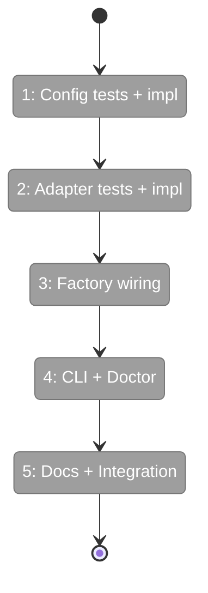
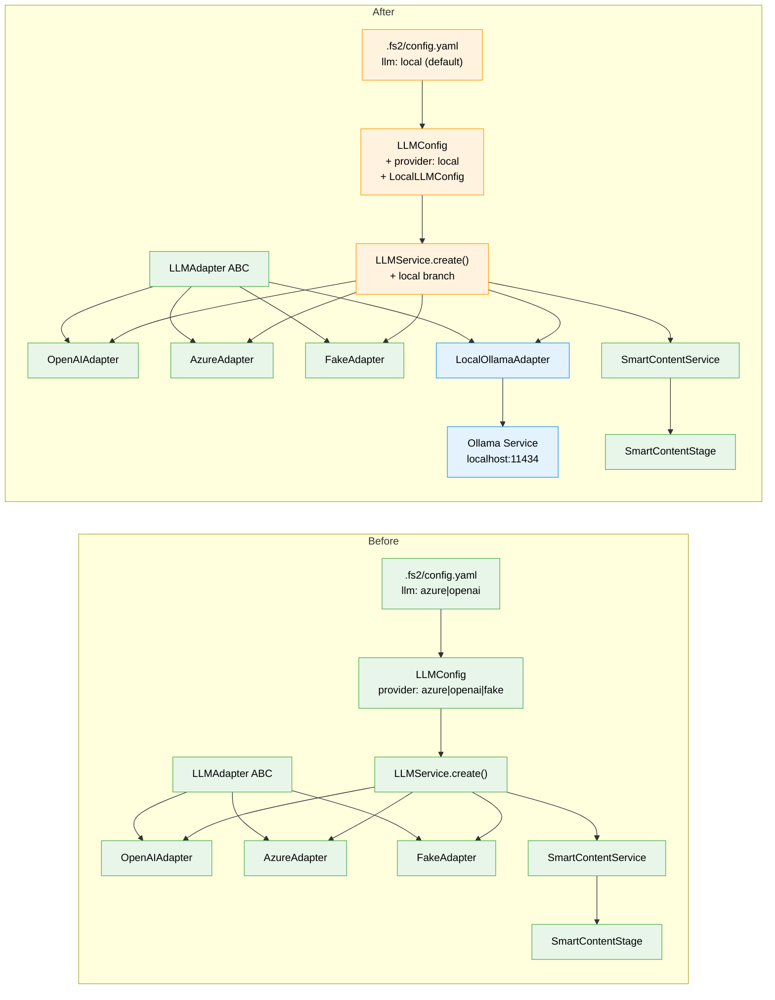

# Flight Plan: Implementation — Local LLM Smart Content

**Plan**: [local-llm-smart-content-plan.md](../../local-llm-smart-content-plan.md)
**Phase**: Single phase (Simple mode)
**Generated**: 2026-03-15
**Status**: Landed ✅

---

## Departure → Destination

**Where we are**: fs2 has a fully wired LLM infrastructure — adapter ABC, OpenAI/Azure adapters, FakeLLMAdapter, LLMService factory, SmartContentService, and SmartContentStage in the scan pipeline. Smart content generation works with cloud API keys (Azure/OpenAI) but requires network access and costs money. Most users have no smart_content because they don't configure API keys.

**Where we're going**: A user installs Ollama, runs `ollama pull qwen2.5-coder:7b`, and fs2 generates AI-powered code summaries for every class, function, and file — completely offline, no API keys, no cost. After running `fs2 scan`, summaries power semantic search, MCP tool responses, and tree output. Re-scans skip unchanged nodes automatically.

---

## Flight Status

<!-- Updated by /plan-6: pending → active → done. Use blocked for problems/input needed. -->

**Legend**: grey = pending | yellow = active | red = blocked/needs input | green = done

---

## Stages

<!-- Updated by /plan-6 during implementation: [ ] → [~] → [x] -->

- [x] **Stage 1: Add "local" provider to LLM config** — extend LLMConfig with LocalLLMConfig nested model, add provider="local" option, increase timeout max to 300s for local (`src/fs2/config/objects.py`, `tests/unit/config/test_llm_config.py`)
- [x] **Stage 2: Build the Ollama adapter** — implement LocalOllamaAdapter with openai SDK (DYK-2), error translation for connection refused/timeout/model-not-found, async generate() returning LLMResponse (`src/fs2/core/adapters/llm_adapter_local.py` — new file, `tests/unit/adapters/test_llm_adapter_local.py` — new file)
- [x] **Stage 3: Wire adapter into factories** — add "local" branch to LLMService.create() AND the duplicate factory in scan.py's _create_smart_content_service(), update adapter exports (`src/fs2/core/services/llm_service.py`, `src/fs2/cli/scan.py`, `src/fs2/core/adapters/__init__.py`)
- [~] **Stage 4: Update CLI defaults and doctor** — make local LLM the default in `fs2 init` config template ✅, verify `fs2 doctor llm` performs end-to-end test generation against Ollama (pending)
- [x] **Stage 5: Documentation and integration test** — create user guide for local LLM setup ✅, update configuration guide with LLM section ✅, integration test pending

---

## Acceptance Criteria

- [ ] AC01: `fs2 scan` with `llm.provider: local` generates smart_content for all code nodes
- [ ] AC02: LocalOllamaAdapter.generate() returns valid LLMResponse with correct fields
- [ ] AC03: LLMService.create() returns service with LocalOllamaAdapter when provider="local"
- [ ] AC04: Ollama not running → LLMAdapterError with "Install/start Ollama" instructions
- [ ] AC05: Model not available → error suggests `ollama pull <model>`
- [ ] AC06: Unchanged nodes skip LLM call on re-scan (hash-based)
- [ ] AC07: `fs2 init` generates config with local LLM as default
- [ ] AC08: HTTP errors from Ollama translate to LLMAdapterError subclasses
- [ ] AC09: Adapter uses ConfigurationService DI, extracts config via require()
- [ ] AC10: `fs2 doctor llm` checks connectivity + performs test generation
- [ ] AC11: Setup instructions discoverable in MCP help and CLI docs
- [ ] AC12: Timeout exceeded → clear timeout error (not generic connection error)

---

## Goals & Non-Goals

**Goals**:
- Generate smart_content for all code nodes without API keys or network access
- Integrate with existing SmartContentStage — zero stage changes
- Follow existing LLM config pattern (YAML `llm:` section)
- Cross-platform via Ollama (Metal, CUDA, CPU auto-detected by Ollama)
- Make local LLM the default for new projects via `fs2 init`
- Discoverable setup via doctor, CLI help, MCP docs, user guides

**Non-Goals**:
- Embedding Ollama or llama-cpp-python as a Python dependency (Ollama is external)
- Fine-tuning models or prompt engineering optimization
- Replacing Azure/OpenAI providers — local is an additional option
- Parallel/batched LLM inference (Ollama serializes; future optimization)
- Supporting llama-cpp-python as embedded alternative (future scope)

---

## Architecture: Before & After

**Legend**: existing (green, unchanged) | changed (orange, modified) | new (blue, created)

---

## Checklist

- [ ] T01: Config TDD — tests for local provider + LocalLLMConfig + timeout 300s (CS-1)
- [ ] T02: Config — extend LLMConfig with "local" provider and LocalLLMConfig (CS-1)
- [ ] T03: Adapter TDD — tests for LocalOllamaAdapter (CS-2)
- [ ] T04: Adapter — implement LocalOllamaAdapter with httpx (CS-2)
- [ ] T05: Factory TDD — tests for LLMService.create() local branch (CS-1)
- [ ] T06: Factory — wire local into LLMService.create() AND scan.py (CS-1)
- [ ] T07: CLI — update init.py DEFAULT_CONFIG with local LLM default (CS-1)
- [ ] T08: Doctor — verify fs2 doctor works with local provider (CS-1)
- [ ] T09: Exports — update adapters/__init__.py (CS-1)
- [ ] T10: Docs — local-llm.md user guide + configuration-guide update (CS-2)
- [ ] T11: Integration test — end-to-end scan with Ollama (CS-2)

---

## PlanPak

Not active for this plan.
