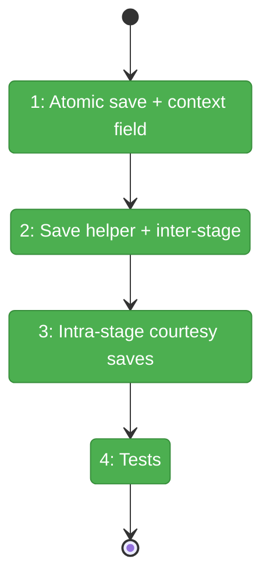
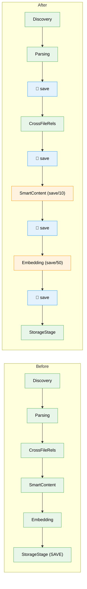

# Flight Plan: Implementation — Courtesy Saves

**Plan**: [courtesy-saves-plan.md](../../courtesy-saves-plan.md)
**Phase**: Single phase (Simple mode)
**Generated**: 2026-03-15
**Status**: Landed

---

## Departure → Destination

**Where we are**: The scan pipeline saves the graph **once** at the very end in StorageStage. A crash, kill, or laptop sleep during a 30-60 minute local LLM scan loses all progress. GraphStore.save() writes directly to graph.pickle — kill during write corrupts the file. First-time scans have zero recovery.

**Where we're going**: Graph is saved atomically (temp+rename) after every pipeline stage and every 10 nodes during SmartContent batch processing. A crash at node 500/900 loses at most ~10 nodes of work. Restart automatically resumes from the last courtesy save via hash-based skip. No user intervention needed.

---

## Flight Status

**Legend**: grey = pending | yellow = active | red = blocked/needs input | green = done

---

## Stages

- [x] **Stage 1: Foundation** — atomic save in GraphStore + courtesy_save field in PipelineContext (T01, T06)
- [x] **Stage 2: Pipeline saves** — extract save helper, add inter-stage saves after each stage (T02, T03)
- [x] **Stage 3: Intra-stage saves** — SmartContent saves every 10 nodes, Embedding saves every 50 nodes (T04, T05)
- [x] **Stage 4: Tests** — atomic save test + inter-stage save verification (T07)

---

## Architecture: Before & After

---

## Acceptance Criteria

- [ ] AC01: Crash at node 50/900 → restart recovers ~40-50 nodes
- [ ] AC02: GraphStore.save() is atomic (temp+rename)
- [ ] AC03: Graph saved after Parsing, CrossFileRels, SmartContent, Embedding
- [ ] AC04: SmartContent saves every ~10 nodes (local)
- [ ] AC05: Embedding saves every ~50 nodes
- [ ] AC06: Overhead <10% of scan time
- [ ] AC07: Partial graph works with tree/search/MCP

## Goals & Non-Goals

**Goals**: Crash-resilient scans, atomic saves, automatic resume, <10% overhead
**Non-Goals**: WAL/journal, multi-process locking, backup versioning, resume UI

---

## Checklist

- [x] T01: Atomic save — temp file + rename
- [x] T02: Extract save helper from StorageStage logic
- [x] T03: Inter-stage saves in pipeline loop
- [x] T04: SmartContent intra-stage save every 10 nodes
- [x] T05: Embedding intra-stage save every 50 nodes
- [x] T06: PipelineContext courtesy_save callback field
- [x] T07: Tests — atomic save + inter-stage verification

---

## PlanPak

Not active for this plan.
