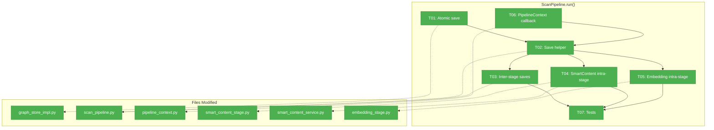
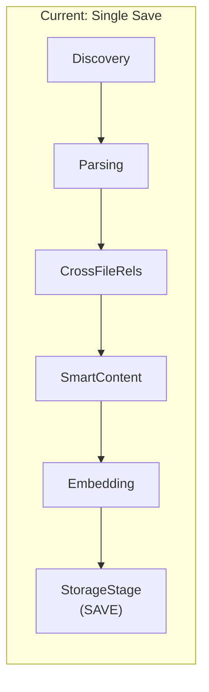
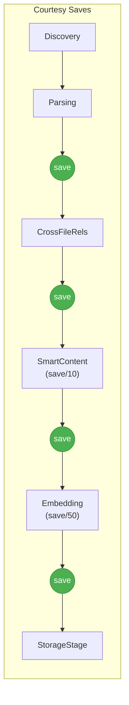

# Tasks Dossier: Courtesy Saves — Implementation

## Executive Briefing

**Purpose**: Make long-running scans crash-resilient by saving the graph periodically, not just at the end. A crash during a 30-minute local LLM scan currently loses all progress.

**What We're Building**: Atomic graph saves (temp+rename), inter-stage saves (after each pipeline stage), and intra-stage courtesy saves (every N nodes during SmartContent/Embedding batch processing).

**Goals**:
- ✅ Graph saved after each pipeline stage completes
- ✅ Graph saved every 10 nodes during SmartContent (local) / every 50 during Embedding
- ✅ Atomic saves — can't corrupt graph.pickle
- ✅ Automatic resume on restart via hash-based skip
- ✅ <10% overhead

**Non-Goals**:
- ❌ WAL/journal streaming (periodic batch saves are enough)
- ❌ Multi-process locking
- ❌ Backup/versioning of prior graph states
- ❌ "Resume from checkpoint" UI (it's automatic)

## Pre-Implementation Check

| File | Exists? | Domain | Notes |
|------|---------|--------|-------|
| `src/fs2/core/repos/graph_store_impl.py` | ✅ | repos | Modify save() for atomic writes |
| `src/fs2/core/services/scan_pipeline.py` | ✅ | services | Add inter-stage saves + save helper |
| `src/fs2/core/services/pipeline_context.py` | ✅ | config | Add courtesy_save callback field |
| `src/fs2/core/services/stages/smart_content_stage.py` | ✅ | stages | Pass courtesy_save to batch |
| `src/fs2/core/services/smart_content/smart_content_service.py` | ✅ | stages | Fire callback every N nodes |
| `src/fs2/core/services/stages/embedding_stage.py` | ✅ | stages | Same pattern as smart content |
| `tests/unit/repos/test_graph_store_impl.py` | ✅ | tests | Add atomic save test |

No harness configured. No domain registry exists.

## Architecture Map

## Tasks

| Status | ID | Task | Domain | Path(s) | Done When | Notes |
|--------|-----|------|--------|---------|-----------|-------|
| [x] | T01 | Atomic save: write to .pickle.tmp then os.rename | repos | `/Users/jordanknight/substrate/fs2/031-cross-file-rels-take-2/src/fs2/core/repos/graph_store_impl.py` | Kill during save leaves prior graph intact; .tmp cleaned up on success | Finding 02: direct pickle.dump risks corruption |
| [x] | T02 | Extract save helper: populate graph_store from context then save | services | `/Users/jordanknight/substrate/fs2/031-cross-file-rels-take-2/src/fs2/core/services/scan_pipeline.py` | Reusable function: clear graph_store → add nodes → add containment edges → add cross-file edges → atomic save | Finding 01: graph cleared at start, must rebuild for saves |
| [x] | T03 | Inter-stage saves: save after each stage (except StorageStage) | services | `/Users/jordanknight/substrate/fs2/031-cross-file-rels-take-2/src/fs2/core/services/scan_pipeline.py` | Graph persisted after Parsing, CrossFileRels, SmartContent, Embedding | AC03 |
| [x] | T04 | SmartContent intra-stage: fire courtesy_save every 10 nodes during batch | stages | `/Users/jordanknight/substrate/fs2/031-cross-file-rels-take-2/src/fs2/core/services/stages/smart_content_stage.py`, `/Users/jordanknight/substrate/fs2/031-cross-file-rels-take-2/src/fs2/core/services/smart_content/smart_content_service.py` | Batch worker calls courtesy_save after merging every 10th result into context.nodes | AC04; Finding 03: must save during batch, not just after |
| [x] | T05 | Embedding intra-stage: fire courtesy_save every 50 nodes during batch | stages | `/Users/jordanknight/substrate/fs2/031-cross-file-rels-take-2/src/fs2/core/services/stages/embedding_stage.py` | Same pattern as T04 but interval=50 for embeddings | AC05 |
| [x] | T06 | PipelineContext: add courtesy_save callback field | config | `/Users/jordanknight/substrate/fs2/031-cross-file-rels-take-2/src/fs2/core/services/pipeline_context.py` | PipelineContext has `courtesy_save: Callable[[], None] | None` field; ScanPipeline wires it to save helper | AC01 |
| [x] | T07 | Tests: atomic save + inter-stage save verification | repos, services | `/Users/jordanknight/substrate/fs2/031-cross-file-rels-take-2/tests/unit/repos/test_graph_store_impl.py` | Atomic: .tmp exists during save, renamed on completion. Inter-stage: save called after each non-storage stage | AC02, AC03 |

## Context Brief

**Key findings from plan**:
- Finding 01 (Critical): Graph is cleared before stages run — courtesy saves must rebuild from context.nodes
- Finding 02 (High): GraphStore.save() is not atomic — temp+rename needed
- Finding 03 (Medium): SmartContent/Embedding overlay after batch — intra-stage saves must happen during batch via callback

**Domain dependencies**:
- `repos`: GraphStore.save() / .clear() / .add_node() / .add_edge() — persistence adapter
- `services`: ScanPipeline.run() stage loop — orchestration
- `stages`: SmartContentStage / EmbeddingStage — long-running batch stages
- `config`: PipelineContext — mutable data carrier between stages

**Domain constraints**:
- GraphStore.save() must remain idempotent — multiple saves produce same result
- PipelineContext is a dataclass — adding fields is backward compatible (defaults)
- StorageStage continues to be the "final" save — courtesy saves are incremental checkpoints

**Reusable patterns**:
- StorageStage.process() lines 63-98: "add all nodes + edges to graph" logic → extract as helper
- SmartContentService progress callback pattern → extend for courtesy_save

## Discoveries & Learnings

| Date | Task | Type | Discovery | Resolution | References |
|------|------|------|-----------|------------|------------|
| 2026-03-16 | T04 | gotcha | SmartContent courtesy_save callback must merge partial `stats["results"]` into `context.nodes` before saving — results don't reach context until overlay step | Created wrapper closure in SmartContentStage that snapshots `pre_batch_nodes`, merges partial results, then calls `context.courtesy_save()` | smart_content_stage.py L148-158 |
| 2026-03-16 | T05 | insight | Embedding service processes chunks in batches, not individual nodes — courtesy save during chunk processing wouldn't reflect node-level progress | Placed courtesy save in the node reassembly loop (after chunks→nodes), not during batch processing | embedding_service.py L766-770 |
| 2026-03-16 | T07 | gotcha | FakeFileScanner, FakeASTParser, FakeGraphStore all require `config` constructor arg — test helpers can't use bare `()` | Always pass `config_service` to all fakes | test_scan_pipeline.py |
| 2026-03-16 | T04 | gotcha | Adding `courtesy_save` param to `process_batch()` broke 3 test fakes (FakeEmbeddingService × 2, mock capture_batch × 1) — fakes had hardcoded signatures | Updated all fakes to accept `courtesy_save=None` | test_embedding_stage.py, test_embedding_graph_config.py, test_smart_content_stage.py |
| 2026-03-16 | T02 | insight | `contextlib.suppress(GraphStoreError)` required by ruff SIM105 — try/except/pass is a lint violation | Replaced 2 try/except/pass blocks with `with contextlib.suppress(...)` | scan_pipeline.py L81, L95 |
| 2026-03-16 | ALL | insight | Integration test confirmed: killed scan at 49/903 nodes → restart only needed 853 nodes (49 recovered via hash-based skip). Graph timestamp advanced every ~30s during SmartContent processing. | N/A — working as designed | Integration test log |
