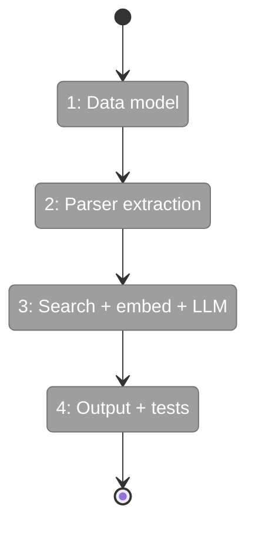
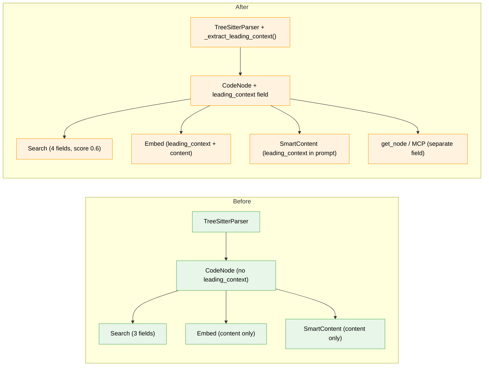

# Flight Plan: Implementation — Leading Context Capture

**Plan**: [leading-context-capture-plan.md](../../leading-context-capture-plan.md)
**Phase**: Single phase (Simple mode)
**Generated**: 2026-03-16
**Status**: Ready for takeoff

---

## Departure → Destination

**Where we are**: Comments and decorators above functions/classes are invisible to fs2. Tree-sitter excludes them from node byte ranges. Searching for "cross-border transactions" when that text is in a `# comment` above a function returns nothing. Embeddings miss the semantic meaning of developer documentation. Smart content summaries don't see what the developer wrote about their code.

**Where we're going**: A developer searching "cross-border" finds the function with that phrase in its comment above. Semantic search for "tax calculation algorithm" gets a strong match when the comment says exactly that. Smart content summaries reference the developer's own documentation. All 13 languages supported. Zero configuration needed — it just works during `fs2 scan`.

---

## Domain Context

### Domains We're Changing

| Domain | What Changes | Key Files |
|--------|-------------|-----------|
| models | New `leading_context: str \| None` field on CodeNode + 5 factory methods | `code_node.py` |
| adapters | `_extract_leading_context()` + wire into parsing loop | `ast_parser_impl.py` |
| search | 4th text/regex field (score 0.6) | `regex_matcher.py` |
| embedding | Prepend leading_context to content before chunking; update embedding_hash | `embedding_service.py` |
| smart_content | Include in `_build_context()` + 6 Jinja2 templates | `smart_content_service.py`, `*.j2` |
| cli | Add to get_node JSON output | `get_node.py` |
| mcp | Add to max detail output | `server.py` |

### Domains We Depend On (no changes)

| Domain | What We Consume | Contract |
|--------|----------------|----------|
| repos | GraphStore.save/load — leading_context persists via CodeNode pickle | GraphStore ABC |
| config | ScanConfig — no config changes needed | ScanConfig dataclass |

---

## Flight Status

**Legend**: grey = pending | yellow = active | red = blocked/needs input | green = done

---

## Stages

- [ ] **Stage 1: Data model** — Add `leading_context` field to CodeNode + 5 factory methods (`code_node.py`)
- [ ] **Stage 2: Parser extraction** — Implement `_extract_leading_context()`, wire into parsing, TDD tests (`ast_parser_impl.py`, `test_leading_context.py` — new)
- [ ] **Stage 3: Search + embed + LLM** — Add 4th search field, prepend to embedding, update templates (`regex_matcher.py`, `embedding_service.py`, `smart_content_service.py`, 6 `.j2` files)
- [ ] **Stage 4: Output + tests** — Add to get_node/MCP, integration tests (`get_node.py`, `server.py`, `test_leading_context_search.py` — new)

---

## Architecture: Before & After

**Legend**: existing (green, unchanged) | changed (orange, modified) | new (blue, created)

---

## Acceptance Criteria

- [ ] AC01: CodeNode has `leading_context: str | None`, default None, backward compatible
- [ ] AC02: Python `# comments` above function → leading_context populated
- [ ] AC03: Python `@decorator` above function → leading_context includes decorator
- [ ] AC04: Blank line gap → comments NOT captured
- [ ] AC05: TS `export function` → captures from export_statement sibling
- [ ] AC06: Rust `#[derive(Debug)]` → captured
- [ ] AC07: Text search matches in leading_context (score 0.6)
- [ ] AC08: Semantic search includes leading_context in embedding
- [ ] AC09: Smart content references developer comments
- [ ] AC10: Capped at 2000 characters
- [ ] AC11: content_hash unchanged by leading_context
- [ ] AC12: embedding_hash changes when leading_context changes
- [ ] AC13: All fixture languages produce leading_context

## Goals & Non-Goals

**Goals**: Capture comments/decorators, make searchable (text 0.6 + semantic), enrich embeddings, enrich smart content, all 13 languages, handle wrapper edge cases, blank-line gap rule

**Non-Goals**: Extend byte range, trailing comments, separate embedding field, smart content regen on comment change, parse comment structure

---

## Checklist

- [ ] T001: CodeNode `leading_context` field + 5 factory methods
- [ ] T002: Extraction constants (COMMENT_NODE_TYPES, WRAPPER_PARENT_TYPES, etc.)
- [ ] T003: `_extract_leading_context()` implementation
- [ ] T004: Wire into parsing loop
- [ ] T005: Smart content templates (6 .j2 files + _build_context)
- [ ] T006: Embedding prepend + embedding_hash update
- [ ] T007: Regex search 4th field (score 0.6)
- [ ] T008: get_node CLI output
- [ ] T009: MCP max detail output
- [ ] T010: TDD parser tests (13 languages)
- [ ] T011: Integration tests (search + hash stability)
