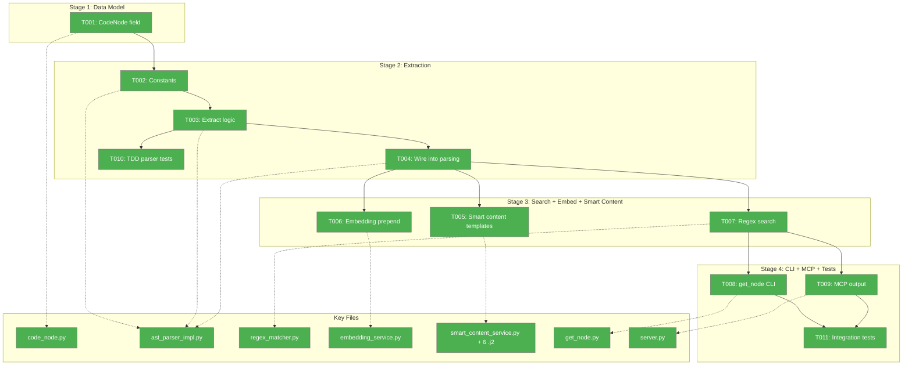
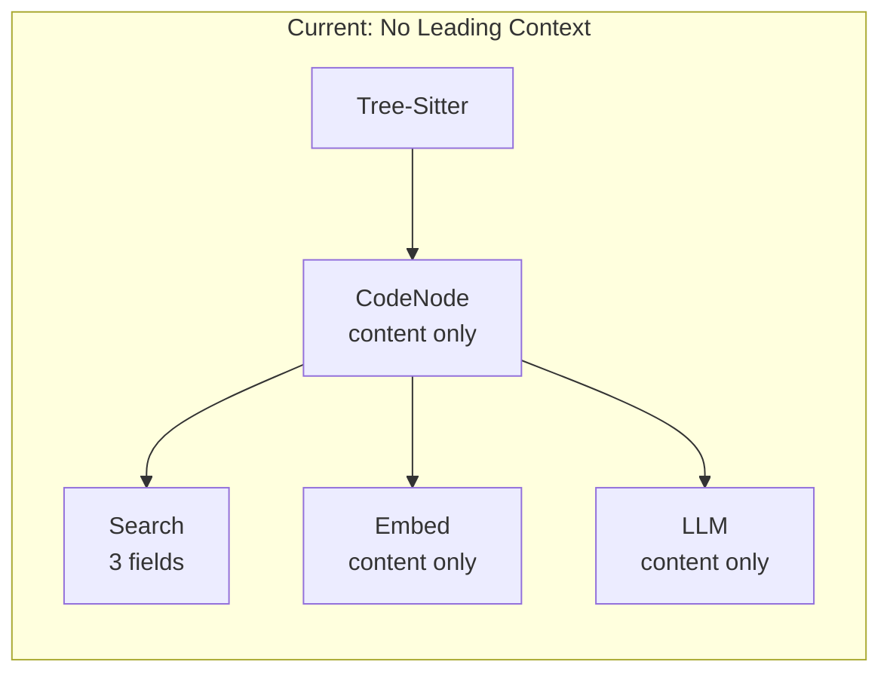
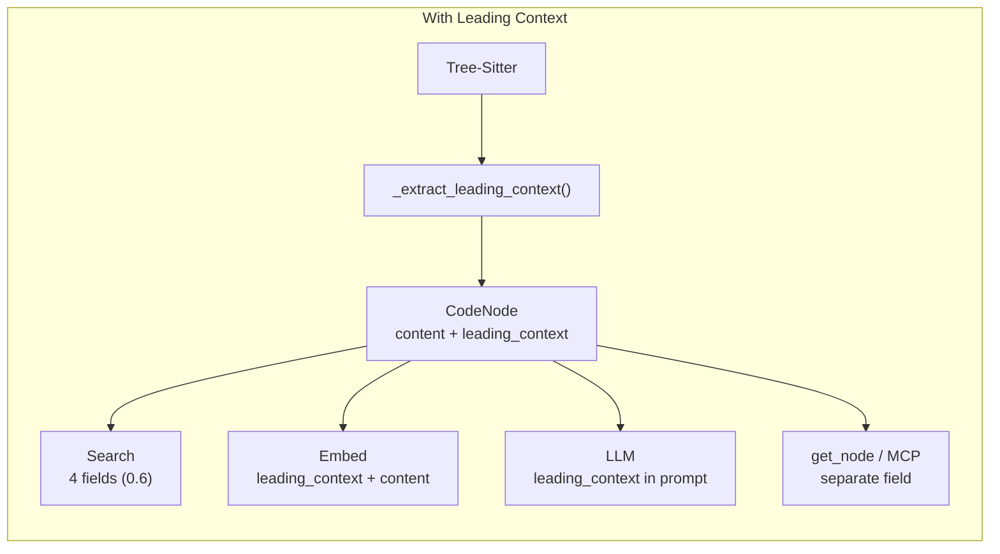
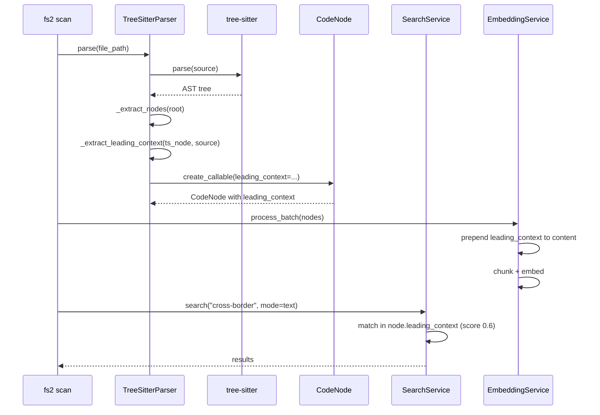

# Tasks Dossier: Leading Context Capture — Implementation

## Executive Briefing

**Purpose**: Capture comments and decorators above functions/classes into a new `leading_context` field on CodeNode, making them searchable by text, regex, and semantic search, and visible to the LLM for smarter summaries.

**What We're Building**: A `leading_context: str | None` field populated during tree-sitter parsing by walking `prev_named_sibling` chains. The field is searched (score 0.6), prepended to content for embedding, and passed to smart content templates. Output via CLI get_node and MCP.

**Goals**:
- ✅ New `leading_context` field on CodeNode (backward compatible)
- ✅ Populated during parsing for all 13 supported languages
- ✅ Searchable via text/regex (score 0.6) and semantic search (prepended to embedding)
- ✅ Passed to LLM for richer smart content summaries
- ✅ Visible in get_node and MCP output

**Non-Goals**:
- ❌ Extending node byte ranges (breaks content_hash, start_line, signature)
- ❌ Trailing comments (ambiguous ownership)
- ❌ Separate embedding field for leading_context
- ❌ Smart content regeneration on comment-only changes

## Pre-Implementation Check

| File | Exists? | Action | Domain | Notes |
|------|---------|--------|--------|-------|
| `src/fs2/core/models/code_node.py` | ✅ | modify | models | Add field after L186 (smart_content_hash), before embedding fields. **CONTRACT CHANGE** |
| `src/fs2/core/adapters/ast_parser_impl.py` | ✅ | modify | adapters | `_create_node()` at L820 is central dispatcher; `_extract_nodes()` at L587; `parse()` at L426 |
| `src/fs2/core/services/search/regex_matcher.py` | ✅ | modify | search | Field search block at L142-184. Add after smart_content (L182) |
| `src/fs2/core/services/embedding/embedding_service.py` | ✅ | modify | embedding | `_chunk_content()` at L194; content selection at L216 |
| `src/fs2/core/services/smart_content/smart_content_service.py` | ✅ | modify | smart_content | `_build_context()` at L234-244 |
| `src/fs2/core/templates/smart_content/*.j2` | ✅ (6 files) | modify | smart_content | base, callable, file, block, type, section |
| `src/fs2/cli/get_node.py` | ✅ | modify | cli | `_code_node_to_cli_dict()` dict at L48-61 |
| `src/fs2/mcp/server.py` | ✅ | modify | mcp | `_code_node_to_dict()` max detail at L546-552 |
| `tests/unit/adapters/test_leading_context.py` | ❌ | **create** | tests | TDD tests for parser extraction |
| `tests/unit/services/search/test_leading_context_search.py` | ❌ | **create** | tests | Integration tests for search + output |

No harness configured. Standard testing approach.

## Architecture Map



## Tasks

| Status | ID | Task | Domain | Path(s) | Done When | Notes |
|--------|-----|------|--------|---------|-----------|-------|
| [ ] | T001 | Add `leading_context: str \| None = None` field to CodeNode after `smart_content_hash` (L186). Add as optional param to all 5 factory methods (`create_file`, `create_type`, `create_callable`, `create_section`, `create_block`) | models | `/Users/jordanknight/substrate/fs2/031-cross-file-rels-take-2/src/fs2/core/models/code_node.py` | Field exists at L187, all 5 factories accept `leading_context` param, `content_hash` unchanged | RF-02: hash stability. CONTRACT CHANGE |
| [ ] | T002 | Define extraction constants at module level: `COMMENT_NODE_TYPES = frozenset({"comment", "line_comment", "block_comment", "doc_comment"})`, `SIBLING_DECORATOR_TYPES = frozenset({"attribute_item"})`, `CHILD_DECORATOR_TYPES = frozenset({"decorator"})`, `WRAPPER_PARENT_TYPES = frozenset({"decorated_definition", "export_statement"})`, `MAX_LEADING_CONTEXT_CHARS = 2000` | adapters | `/Users/jordanknight/substrate/fs2/031-cross-file-rels-take-2/src/fs2/core/adapters/ast_parser_impl.py` | Constants defined near top of file, types match Workshop 002 table | AC10, Workshop 002 |
| [ ] | T003 | Implement `_extract_leading_context(self, ts_node, source_bytes: bytes) -> str \| None` method. Walk `prev_named_sibling` collecting COMMENT + SIBLING_DECORATOR types. Handle WRAPPER_PARENT_TYPES (walk from parent). Implement blank-line gap rule (`\n\n` in gap stops walk). Reverse to top-to-bottom order. Cap at MAX_LEADING_CONTEXT_CHARS. For Python `decorated_definition`: collect decorators from parent's children PLUS comments from parent's siblings | adapters | `/Users/jordanknight/substrate/fs2/031-cross-file-rels-take-2/src/fs2/core/adapters/ast_parser_impl.py` | Returns `str \| None`. Handles Python decorated_definition, TS/TSX export_statement. Stops at blank line gap. Caps at 2000 chars | RF-04, RF-06, AC02-06, AC10 |
| [ ] | T004 | Wire extraction into parsing: In `_extract_nodes()` (L587), call `_extract_leading_context()` before `_create_node()` (L820) and pass result. In `parse()` (L426), extract leading context for file-level nodes from first children. Pass `leading_context` through `_create_node()` to factory methods | adapters | `/Users/jordanknight/substrate/fs2/031-cross-file-rels-take-2/src/fs2/core/adapters/ast_parser_impl.py` | All CodeNodes created during parsing have leading_context populated from tree-sitter siblings | RF-06 |
| [ ] | T005 | Smart content integration: Add `"leading_context": node.leading_context or ""` to `_build_context()` dict (L234-244). Add conditional block to all 6 `.j2` templates: `Developer comments:\n{{ leading_context }}\n` before the code content section | smart_content | `/Users/jordanknight/substrate/fs2/031-cross-file-rels-take-2/src/fs2/core/services/smart_content/smart_content_service.py`, `src/fs2/core/templates/smart_content/smart_content_{base,callable,file,block,type,section}.j2` | LLM prompt includes developer comments when leading_context is present | RF-08, AC09 |
| [ ] | T006 | Embedding integration: In `_chunk_content()` (L194), when `is_smart_content=False`, prepend `node.leading_context + "\n"` to content before chunking. Update embedding_hash computation (L759): use `compute_content_hash(node.content + (node.leading_context or ""))` instead of `node.content_hash` | embedding | `/Users/jordanknight/substrate/fs2/031-cross-file-rels-take-2/src/fs2/core/services/embedding/embedding_service.py` | Embedding vector includes comment meaning. `embedding_hash` changes when leading_context changes. `_should_skip()` detects leading_context changes | RF-03, AC08, AC12 |
| [ ] | T007 | Search integration: In `regex_matcher.py` `_find_best_field_match()`, add after smart_content block (L182): search `node.leading_context` with score 0.6. No change to text_matcher.py (delegates to regex_matcher per RF-05) | search | `/Users/jordanknight/substrate/fs2/031-cross-file-rels-take-2/src/fs2/core/services/search/regex_matcher.py` | Text/regex search matches in leading_context with score 0.6, higher than content (0.5) | RF-05, AC07 |
| [ ] | T008 | CLI output: In `_code_node_to_cli_dict()` (L48-61), add `"leading_context": node.leading_context` after `"smart_content"` (L56) | cli | `/Users/jordanknight/substrate/fs2/031-cross-file-rels-take-2/src/fs2/cli/get_node.py` | `fs2 get-node` JSON output includes `leading_context` as separate field | RF-01 |
| [ ] | T009 | MCP output: In `_code_node_to_dict()` max detail block (L546-552), add `result["leading_context"] = node.leading_context` after smart_content (L548). Update docstring to list 6 max-detail fields | mcp | `/Users/jordanknight/substrate/fs2/031-cross-file-rels-take-2/src/fs2/mcp/server.py` | MCP get_node with detail=max includes leading_context | RF-01 |
| [ ] | T010 | TDD parser tests: Parse real fixture files with tree-sitter, verify leading_context. Cases: Python `#` comments (auth_handler.py), Python `@decorator` (auth_handler.py), TS `export function` (app.ts), Rust `#[derive()]` (lib.rs), blank-line gap, Go comments (server.go), Java Javadoc (UserService.java), C Doxygen (algorithm.c), GDScript `##` (player.gd), CUDA comments (vector_add.cu), 2000-char truncation | tests | `/Users/jordanknight/substrate/fs2/031-cross-file-rels-take-2/tests/unit/adapters/test_leading_context.py` | Tests parse real fixture files, verify leading_context populated correctly per language. All tests use real tree-sitter, no mocks | AC02-06, AC10, AC13 |
| [ ] | T011 | Integration tests: (1) Text search matches in leading_context (score 0.6), (2) content_hash unchanged when leading_context differs, (3) embedding_hash changes when leading_context differs, (4) get_node output includes leading_context field. Use project fakes, not mocks | tests | `/Users/jordanknight/substrate/fs2/031-cross-file-rels-take-2/tests/unit/services/search/test_leading_context_search.py` | All 4 integration assertions pass. Fakes used per project convention | AC07, AC11, AC12 |

## Context Brief

**Key findings from plan**:
- RF-01 (Critical): get_node.py and mcp/server.py use explicit field selection — must manually add `leading_context`
- RF-02 (Critical): `content_hash = compute_content_hash(content)` in 5 factories — must NOT change
- RF-03 (High): `embedding_hash` must include leading_context to detect comment changes
- RF-04 (High): Python `decorated_definition` wraps decorators as children, TS `export_statement` wraps exports — walk from parent
- RF-06 (Medium): `_create_node()` at L820 is the single dispatcher — one integration point
- RF-07 (Low): Old graphs backward compatible — `leading_context` defaults to None

**Domain dependencies**:
- `models`: CodeNode dataclass — frozen, `content_hash` computed in factory methods, must remain code-only
- `adapters`: ASTParser ABC → TreeSitterParser impl — `_extract_nodes()` loop creates nodes via `_create_node()`
- `search`: RegexMatcher — searches node_id (1.0/0.8), content (0.5), smart_content (0.5)
- `embedding`: EmbeddingService — chunks content via `_chunk_content()`, sets `embedding_hash = content_hash`
- `smart_content`: SmartContentService — `_build_context()` builds dict, templates render prompts

**Domain constraints**:
- Clean Architecture: adapters must not leak tree-sitter types to services
- CodeNode is frozen dataclass — all modifications via `dataclasses.replace()`
- Fakes over mocks — test doubles inherit from ABC

**Reusable**:
- Test fixtures in `tests/fixtures/samples/` — all 13 languages with comments/decorators (GDScript, CUDA, Python, Ruby updated this session)
- `compute_content_hash()` in `src/fs2/core/utils/hash.py`







**No agent harness configured. Agent will use standard testing approach from plan.**

## Discoveries & Learnings

_Populated during implementation by plan-6._

| Date | Task | Type | Discovery | Resolution | References |
|------|------|------|-----------|------------|------------|

---

```
docs/plans/037-leading-context-capture/
  ├── leading-context-capture-spec.md
  ├── leading-context-capture-plan.md
  ├── workshops/
  │   ├── 001-leading-context-design.md
  │   └── 002-tree-sitter-comment-extraction.md
  └── tasks/implementation/
      ├── tasks.md
      ├── tasks.fltplan.md
      └── execution.log.md   # created by plan-6
```
