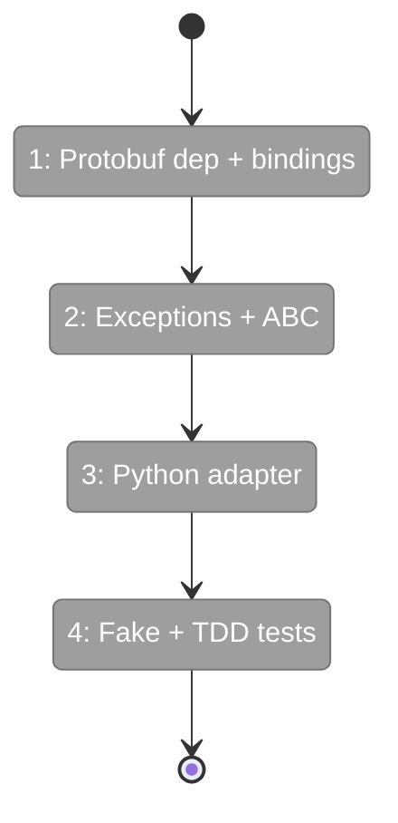
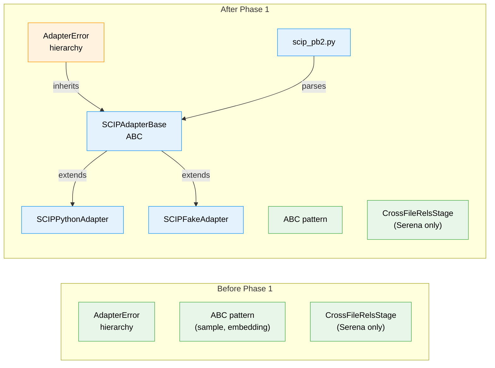

# Flight Plan: Phase 1 — SCIP Adapter Foundation

**Plan**: [scip-cross-file-rels-plan.md](../../scip-cross-file-rels-plan.md)
**Phase**: Phase 1: SCIP Adapter Foundation
**Generated**: 2026-03-16
**Status**: Ready for takeoff

---

## Departure → Destination

**Where we are**: fs2 has a working cross-file relationship system powered by Serena (LSP/Pyright) with parallel MCP server instances. There is no SCIP code anywhere in the codebase. Protobuf is not a dependency. The SCIP proto schema has been downloaded and tested externally (`scripts/scip/`), confirming that cross-file edges can be extracted from any SCIP index.

**Where we're going**: A developer can instantiate `SCIPPythonAdapter`, point it at an `index.scip` file and a set of known fs2 node_ids, and get back a deduplicated, filtered list of cross-file edge tuples `(source_id, target_id, {"edge_type": "references"})` — ready for graph storage, identical in format to current Serena edges. The adapter handles protobuf parsing, symbol mapping, and noise filtering. A `SCIPFakeAdapter` enables testing without real SCIP indexers.

---

## Domain Context

### Domains We're Changing

| Domain | What Changes | Key Files |
|--------|-------------|-----------|
| core/adapters | Add SCIPAdapterBase ABC, SCIPPythonAdapter, SCIPFakeAdapter, scip_pb2.py, exception hierarchy | `src/fs2/core/adapters/scip_adapter.py`, `scip_adapter_python.py`, `scip_adapter_fake.py`, `scip_pb2.py`, `exceptions.py` |
| config | Add protobuf dependency | `pyproject.toml` |

### Domains We Depend On (no changes)

| Domain | What We Consume | Contract |
|--------|----------------|----------|
| core/adapters | `AdapterError` base exception | `exceptions.py` |
| core/adapters | ABC adapter pattern (naming, structure) | `sample_adapter.py` |

---

## Flight Status

<!-- Updated by /plan-6-v2: pending → active → done. Use blocked for problems/input needed. -->

**Legend**: grey = pending | yellow = active | red = blocked/needs input | green = done

---

## Stages

<!-- Updated by /plan-6-v2 during implementation: [ ] → [~] → [x] -->

- [ ] **Stage 1: Add protobuf dep + generate bindings** — Add `protobuf>=4.25` to pyproject.toml, generate and commit `scip_pb2.py` (`pyproject.toml`, `scip_pb2.py`)
- [ ] **Stage 2: Exception hierarchy + SCIPAdapterBase ABC** — Add SCIP errors to exceptions.py, create base adapter with protobuf parsing + edge extraction + dedup + filtering (`exceptions.py`, `scip_adapter.py` — new file)
- [ ] **Stage 3: Python adapter** — Implement symbol-to-node-id mapping for Python (`scip_adapter_python.py` — new file)
- [ ] **Stage 4: Fake adapter + full TDD suite** — Create SCIPFakeAdapter, write comprehensive tests for base + Python adapters (`scip_adapter_fake.py` — new file, `test_scip_adapter.py`, `test_scip_adapter_python.py` — new files)

---

## Architecture: Before & After

**Legend**: existing (green, unchanged) | changed (orange, modified) | new (blue, created)

---

## Acceptance Criteria

- [ ] `from fs2.core.adapters.scip_pb2 import Index` imports cleanly
- [ ] `SCIPAdapterError` inherits from `AdapterError`
- [ ] `SCIPAdapterBase` is abstract — cannot be instantiated directly
- [ ] `SCIPPythonAdapter.extract_cross_file_edges()` returns correct edges for `tests/fixtures/cross_file_sample/`
- [ ] Edges use `{"edge_type": "references"}` format (no ref_kind — matches Serena)
- [ ] Local symbols (`local N`) filtered out
- [ ] Stdlib symbols filtered out (not in known_node_ids)
- [ ] Self-references (same source and target) filtered out
- [ ] Duplicate edges deduplicated
- [ ] `SCIPFakeAdapter.set_edges()` returns injected edges
- [ ] All tests pass: `uv run python -m pytest tests/unit/adapters/test_scip_adapter*.py`

## Goals & Non-Goals

**Goals**: Protobuf parsing, edge extraction, Python symbol mapping, fake adapter, full tests
**Non-Goals**: ref_kind classification (dropped), other languages (Phase 2), config/CLI (Phase 3), stage wiring (Phase 4)

---

## Checklist

- [ ] T001: Add `protobuf>=4.25` to pyproject.toml
- [ ] T002: Generate and commit `scip_pb2.py`
- [ ] T003: Add SCIPAdapterError hierarchy to exceptions.py
- [ ] T004: Create SCIPAdapterBase ABC
- [ ] T005: ~~DROPPED~~ ref_kind inference
- [ ] T006: Create SCIPPythonAdapter
- [ ] T007: Create SCIPFakeAdapter
- [ ] T008: TDD tests for base + Python adapters
