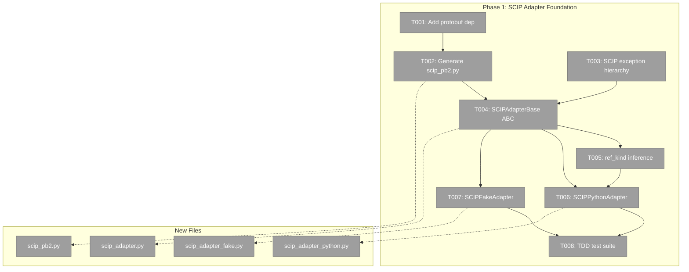
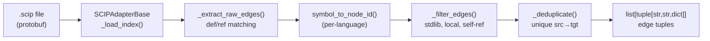
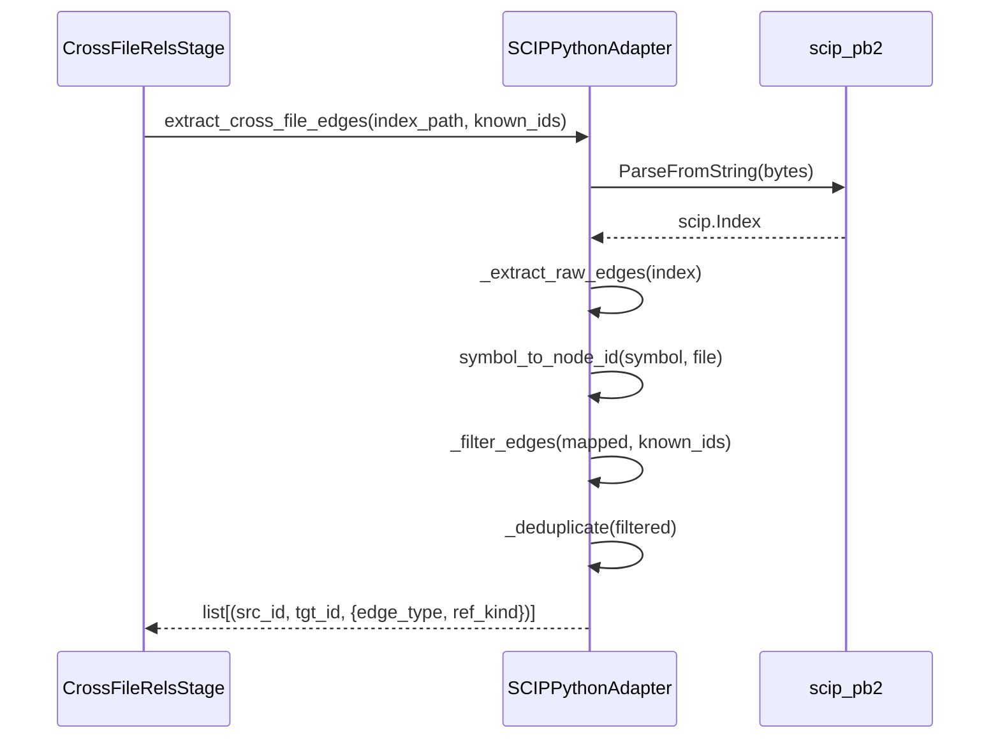

# Phase 1: SCIP Adapter Foundation — Tasks Dossier

**Plan**: [scip-cross-file-rels-plan.md](../../scip-cross-file-rels-plan.md)
**Phase**: Phase 1: SCIP Adapter Foundation
**Generated**: 2026-03-16
**Status**: Ready

---

## Executive Briefing

**Purpose**: Build the core SCIP adapter infrastructure — protobuf parsing, edge extraction, and a working Python adapter — so that Phase 2 (multi-language) and Phase 4 (stage integration) have a solid foundation to build on.

**What We're Building**: An `SCIPAdapterBase` ABC that can read any `.scip` protobuf file, extract cross-file relationship edges (definition in file A, reference in file B), deduplicate them, filter noise (stdlib, local symbols, self-refs), and infer `ref_kind` (call/import/type) from SCIP descriptor suffixes. Plus a concrete `SCIPPythonAdapter` that translates Python SCIP symbols to fs2 `node_id` format, a `SCIPFakeAdapter` for testing, and the exception hierarchy.

**Goals**:
- ✅ Generated `scip_pb2.py` protobuf bindings committed to repo
- ✅ `protobuf>=4.25` added to pyproject.toml
- ✅ `SCIPAdapterBase` ABC with universal protobuf parsing, edge extraction, dedup, filtering
- ✅ `SCIPPythonAdapter` mapping Python SCIP symbols to fs2 node_ids
- ✅ `SCIPFakeAdapter` with `set_edges()` for test injection
- ✅ `SCIPAdapterError` hierarchy in exceptions.py
- ✅ `ref_kind` inference from descriptor suffixes (`#`→type, `().`→call, import→import)
- ✅ Full TDD test suite against fixture `.scip` files

**Non-Goals**:
- ❌ TypeScript/Go/C# adapters (Phase 2)
- ❌ Config models or CLI commands (Phase 3)
- ❌ CrossFileRelsStage wiring (Phase 4)
- ❌ Subprocess indexer invocation (Phase 4)
- ❌ Graph format version bump (Phase 4)

---

## Prior Phase Context

_Phase 1 — no prior phases._

---

## Pre-Implementation Check

| File | Exists? | Domain Check | Notes |
|------|---------|-------------|-------|
| `pyproject.toml` | ✅ exists | config | MODIFY — add `protobuf>=4.25` to dependencies |
| `src/fs2/core/adapters/scip_pb2.py` | ❌ create | core/adapters | Generated from `/tmp/scip.proto` — committed, not hand-written |
| `src/fs2/core/adapters/scip_adapter.py` | ❌ create | core/adapters | NEW — SCIPAdapterBase ABC (contract) |
| `src/fs2/core/adapters/scip_adapter_python.py` | ❌ create | core/adapters | NEW — Python implementation |
| `src/fs2/core/adapters/scip_adapter_fake.py` | ❌ create | core/adapters | NEW — Test double |
| `src/fs2/core/adapters/exceptions.py` | ✅ exists | core/adapters | MODIFY — add SCIPAdapterError hierarchy |
| `tests/unit/adapters/test_scip_adapter.py` | ❌ create | tests | NEW — Base adapter tests |
| `tests/unit/adapters/test_scip_adapter_python.py` | ❌ create | tests | NEW — Python adapter tests |

**Concept duplication check**: No existing SCIP, protobuf, or language registry code in codebase. Safe to create all new.

**Harness**: No agent harness configured. Agent will use standard testing approach (`uv run python -m pytest`).

---

## Architecture Map



---

## Tasks

| Status | ID | Task | Domain | Path(s) | Done When | Notes |
|--------|-----|------|--------|---------|-----------|-------|
| [ ] | T001 | Add `protobuf>=4.25` to pyproject.toml dependencies | config | `pyproject.toml` | `uv run python -c "import google.protobuf"` succeeds; `uv run python -m pytest` still passes | Per finding 02: protobuf NOT in deps |
| [ ] | T002 | Generate `scip_pb2.py` from SCIP proto schema and commit | core/adapters | `src/fs2/core/adapters/scip_pb2.py` | `from fs2.core.adapters.scip_pb2 import Index, Document, Occurrence` imports cleanly | Proto at `/tmp/scip.proto`; use `grpc_tools.protoc` |
| [ ] | T003 | Add `SCIPAdapterError` hierarchy to exceptions.py | core/adapters | `src/fs2/core/adapters/exceptions.py` | `SCIPAdapterError(AdapterError)`, `SCIPIndexError`, `SCIPMappingError` defined with actionable docstrings | Per finding 06: follow existing pattern |
| [ ] | T004 | Create `SCIPAdapterBase` ABC in scip_adapter.py | core/adapters | `src/fs2/core/adapters/scip_adapter.py` | ABC with: `extract_cross_file_edges(index_path, known_node_ids) → edges`, `_load_index()`, `_extract_raw_edges()`, `_deduplicate()`, `_filter_edges()`, abstract `symbol_to_node_id()`, abstract `language_name()` | Per workshop 002: base handles 90% |
| [ ] | T005 | Add `ref_kind` inference from SCIP descriptor suffixes | core/adapters | `src/fs2/core/adapters/scip_adapter.py` | `_infer_ref_kind(symbol)` returns `"call"` for `().` suffix, `"type"` for `#` suffix, `"import"` for `/` package refs, `"unknown"` as fallback | Per spec Q7: ref_kind in edge metadata |
| [ ] | T006 | Create `SCIPPythonAdapter` in scip_adapter_python.py | core/adapters | `src/fs2/core/adapters/scip_adapter_python.py` | `symbol_to_node_id()` maps Python SCIP symbols (`scip-python python pkg ver \`module\`/Class#method().`) to fs2 node_ids (`callable:path:Class.method`); tested against `tests/fixtures/cross_file_sample/` | Per workshop 001: Python boot spec |
| [ ] | T007 | Create `SCIPFakeAdapter` in scip_adapter_fake.py | core/adapters | `src/fs2/core/adapters/scip_adapter_fake.py` | `set_edges(edges)` for test injection; `set_index(index)` for protobuf injection; passes ABC compliance; tracks `call_history` | Per finding 06: fakes over mocks |
| [ ] | T008 | TDD tests for SCIPAdapterBase + SCIPPythonAdapter | tests | `tests/unit/adapters/test_scip_adapter.py`, `tests/unit/adapters/test_scip_adapter_python.py` | Tests cover: protobuf loading, edge extraction, dedup, local symbol filtering, stdlib filtering, self-ref filtering, ref_kind inference, Python symbol mapping; all pass | Use `scripts/scip/fixtures/python/` and `tests/fixtures/cross_file_sample/` |

---

## Context Brief

**Key findings from plan**:
- **Finding 01**: `detect_project_roots()` already exists — not needed in Phase 1, but informs adapter design
- **Finding 02**: Protobuf NOT in pyproject.toml — must add before any SCIP code (T001)
- **Finding 03**: Config types need `YAML_CONFIG_TYPES` registration — not Phase 1 concern but noted
- **Finding 04**: `ref_kind` goes in edge_data dict, NOT as tuple element — `{"edge_type": "references", "ref_kind": "call"}`
- **Finding 06**: Follow existing adapter pattern: ABC → Fake → Impl; exceptions follow `AdapterError` hierarchy

**Domain dependencies**:
- `core/adapters`: `AdapterError` base class (exceptions.py) — our SCIP exceptions inherit from it
- `core/adapters`: Existing ABC pattern (sample_adapter.py, embedding_adapter.py) — follow for consistency
- No domain registry exists — no formal contracts to consume

**Domain constraints**:
- Adapters must NOT import from services or repos (dependency flow: services → adapters, not reverse)
- ABC in `scip_adapter.py`, implementations in `scip_adapter_{impl}.py`
- Exceptions in shared `exceptions.py`, not per-adapter files

**No agent harness** — implementation will use standard testing: `uv run python -m pytest`

**Reusable from prior work**:
- `/tmp/scip.proto` — already downloaded SCIP protobuf schema
- `scripts/scip/fixtures/python/` — 3-file Python project with cross-file imports
- `tests/fixtures/cross_file_sample/` — existing 3-file Python fixture (handler→service→model)
- `scripts/scip/compare_scip_output.py` — reference implementation for protobuf parsing and edge extraction

**Mermaid flow diagram**:


**Mermaid sequence diagram**:


---

## Discoveries & Learnings

_Populated during implementation by plan-6._

| Date | Task | Type | Discovery | Resolution | References |
|------|------|------|-----------|------------|------------|

**Types**: `gotcha` | `research-needed` | `unexpected-behavior` | `workaround` | `decision` | `debt` | `insight`

---

## Directory Layout

```
docs/plans/038-scip-cross-file-rels/
  ├── scip-cross-file-rels-spec.md
  ├── scip-cross-file-rels-plan.md
  ├── exploration.md
  ├── workshops/
  │   ├── 001-scip-language-boot.md
  │   ├── 002-scip-cross-language-standardisation.md
  │   └── 003-scip-project-config.md
  └── tasks/phase-1-scip-adapter-foundation/
      ├── tasks.md                  ← this file
      ├── tasks.fltplan.md          ← generated below
      └── execution.log.md          # created by plan-6
```
