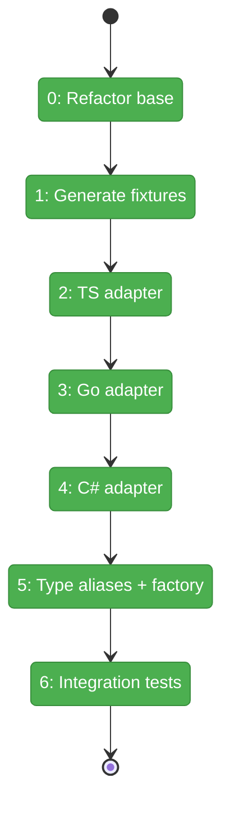
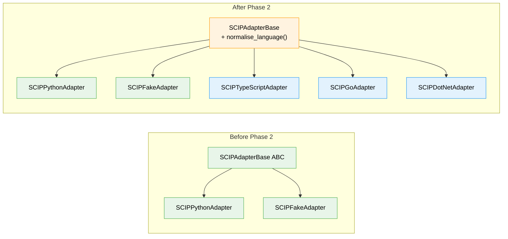

# Flight Plan: Phase 2 — Multi-Language Adapters

**Plan**: [scip-cross-file-rels-plan.md](../../scip-cross-file-rels-plan.md)
**Phase**: Phase 2: Multi-Language Adapters
**Generated**: 2026-03-17
**Status**: Landed

---

## Departure → Destination

**Where we are**: Phase 1 delivered `SCIPAdapterBase` ABC with universal protobuf parsing, edge extraction, and deduplication, plus a working `SCIPPythonAdapter` and `SCIPFakeAdapter`. 39 tests pass. The adapter infrastructure handles everything universal — per-language subclasses only need to override `symbol_to_node_id()`.

**Where we're going**: A developer can use `SCIPTypeScriptAdapter`, `SCIPGoAdapter`, or `SCIPDotNetAdapter` to extract cross-file reference edges from any of those languages' `.scip` index files. Type aliases like `ts`, `cs`, `js` are normalised to canonical names. Each adapter is tested against real fixture `.scip` files.

---

## Domain Context

### Domains We're Changing

| Domain | What Changes | Key Files |
|--------|-------------|-----------|
| core/adapters | Add 3 new adapter subclasses + type alias normalisation | `scip_adapter_typescript.py`, `scip_adapter_go.py`, `scip_adapter_dotnet.py`, `scip_adapter.py` |
| tests | Add 3 new test files with unit + integration tests | `test_scip_adapter_typescript.py`, `test_scip_adapter_go.py`, `test_scip_adapter_dotnet.py` |
| fixtures | Generate 3 `.scip` index files | `scripts/scip/fixtures/{typescript,go,dotnet}/index.scip` |

### Domains We Depend On (no changes)

| Domain | What We Consume | Contract |
|--------|----------------|----------|
| core/adapters | `SCIPAdapterBase` ABC | `extract_cross_file_edges()`, `parse_symbol()`, `extract_name_from_descriptor()` |
| core/adapters | `scip_pb2` protobuf bindings | `Index`, `Document`, `Occurrence` types |
| core/adapters | `SCIPFakeAdapter` | Test infrastructure |

---

## Flight Status

<!-- Updated by /plan-6-v2: pending → active → done. Use blocked for problems/input needed. -->

**Legend**: grey = pending | yellow = active | red = blocked/needs input | green = done

---

## Stages

<!-- Updated by /plan-6-v2 during implementation: [ ] → [~] → [x] -->

- [x] **Stage 0: Refactor base class** — Template method for `symbol_to_node_id()`, fix `_split_descriptor_segments()` for backtick-quoted `/`, extract `_fuzzy_match_node_id()`, simplify Python adapter; all 39 existing tests must pass (`scip_adapter.py` + `scip_adapter_python.py` — modify)
- [x] **Stage 1: Generate fixture .scip files + deep inspection** — Run indexers, `scip print` each, capture exact symbol formats, identify C# generated document paths (`scripts/scip/fixtures/*/index.scip`)
- [x] **Stage 2: TypeScript adapter** — Create `SCIPTypeScriptAdapter` (~8 lines, inherits template method) + TDD tests (`scip_adapter_typescript.py` — new file)
- [x] **Stage 3: Go adapter** — Create `SCIPGoAdapter` (~8 lines, inherits template method) + TDD tests (`scip_adapter_go.py` — new file)
- [x] **Stage 4: C# adapter** — Create `SCIPDotNetAdapter` (~25 lines, + `should_skip_document()` with patterns from T001) + TDD tests (`scip_adapter_dotnet.py` — new file)
- [x] **Stage 5: Type alias normalisation + factory** — Add `LANGUAGE_ALIASES`, `normalise_language()`, `create_scip_adapter()` to `scip_adapter.py` + tests (`scip_adapter.py` — modify)
- [x] **Stage 6: Integration tests** — Validate all adapters against fixture .scip files; verify handler→service→model edges (`test_scip_adapter_*.py` — add integration classes)

---

## Architecture: Before & After

**Legend**: existing (green, unchanged) | changed (orange, modified) | new (blue, created)

---

## Acceptance Criteria

- [ ] AC2: TypeScript SCIP symbols map to fs2 node_ids; handler→service→model edges extracted
- [ ] AC3: Go SCIP symbols map to fs2 node_ids; handler→service→model edges extracted
- [ ] AC4: C# SCIP symbols map to fs2 node_ids; handler→service→model edges extracted
- [ ] AC11: Cross-file edges from all adapters are deduplicated
- [ ] AC12: Local symbols, stdlib refs, and self-refs filtered out across all languages
- [ ] AC13: Type aliases (`ts`, `cs`, `js`, `csharp`) normalised to canonical names

## Goals & Non-Goals

**Goals**:
- ✅ Three new language adapters following the Phase 1 pattern
- ✅ Type alias normalisation for user-friendly language names
- ✅ Real fixture `.scip` files committed for CI/CD test reproducibility
- ✅ Each adapter tested independently (unit) and against real indexes (integration)

**Non-Goals**:
- ❌ Config models or CLI commands (Phase 3)
- ❌ CrossFileRelsStage wiring (Phase 4)
- ❌ Adapters for Java, Rust, C++ (future extensibility)

---

## Checklist

- [x] T000: Refactor `SCIPAdapterBase` — template method + fix descriptor parsing
- [x] T001: Generate fixture `.scip` index files + deep inspection
- [x] T002: Create `SCIPTypeScriptAdapter` with TDD unit tests
- [x] T003: Create `SCIPGoAdapter` with TDD unit tests
- [x] T004: Create `SCIPDotNetAdapter` with TDD unit tests + `should_skip_document()`
- [x] T005: Add type alias normalisation + adapter factory
- [x] T006: Integration tests — all adapters against fixture `.scip` files
