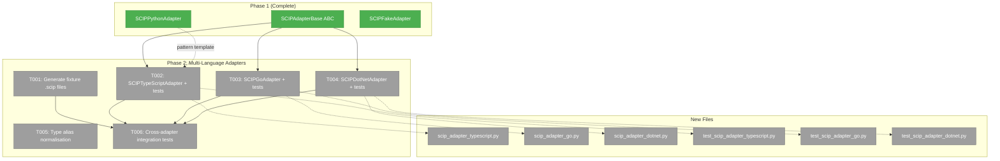
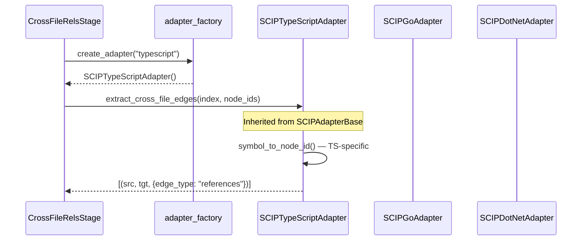

# Phase 2: Multi-Language Adapters — Tasks Dossier

**Plan**: [scip-cross-file-rels-plan.md](../../scip-cross-file-rels-plan.md)
**Phase**: Phase 2: Multi-Language Adapters
**Generated**: 2026-03-17
**Status**: Ready

---

## Executive Briefing

**Purpose**: Extend the SCIP adapter infrastructure from Python-only to TypeScript, Go, and C# — the four languages validated during exploration. Each adapter translates language-specific SCIP symbol naming into fs2's `node_id` format using the same `SCIPAdapterBase` foundation built in Phase 1. Also adds type alias normalisation so users can specify `ts`, `cs`, `js`, etc.

**What We're Building**: Three new `SCIPAdapterBase` subclasses — one per language — each implementing `symbol_to_node_id()` for that language's SCIP symbol conventions. Plus a type alias normalisation utility for language name canonicalization. Each adapter will be tested with both synthetic protobuf data (unit) and real `.scip` fixture files (integration).

**Goals**:
- ✅ `SCIPTypeScriptAdapter` mapping TS SCIP symbols (backtick-quoted file paths) to fs2 node_ids
- ✅ `SCIPGoAdapter` mapping Go SCIP symbols (import-path descriptors) to fs2 node_ids
- ✅ `SCIPDotNetAdapter` mapping C# SCIP symbols (namespace descriptors) to fs2 node_ids
- ✅ C# `should_skip_document()` override to filter generated files (GlobalUsings.g.cs etc.)
- ✅ Type alias normalisation (`ts`→`typescript`, `cs`/`csharp`→`dotnet`, `js`→`javascript`)
- ✅ Fixture `.scip` files generated and committed for all 3 languages
- ✅ TDD unit tests + integration tests for all adapters

**Non-Goals**:
- ❌ Config models or CLI commands (Phase 3)
- ❌ CrossFileRelsStage wiring or subprocess indexer invocation (Phase 4)
- ❌ Java, Rust, C++ adapters (future — extensible pattern established here)
- ❌ Indexer installation or auto-detection (Phase 3-4)

---

## Prior Phase Context

### Phase 1: SCIP Adapter Foundation (Complete ✅)

**A. Deliverables**:
- `pyproject.toml` — Added `protobuf>=6.0` dependency (resolved to 7.34.0)
- `src/fs2/core/adapters/scip_pb2.py` — Generated protobuf bindings (DO NOT EDIT)
- `src/fs2/core/adapters/scip_adapter.py` — `SCIPAdapterBase` ABC (~267 lines)
- `src/fs2/core/adapters/scip_adapter_python.py` — Python adapter (~68 lines)
- `src/fs2/core/adapters/scip_adapter_fake.py` — Test double (~82 lines)
- `src/fs2/core/adapters/exceptions.py` — Added `SCIPAdapterError`, `SCIPIndexError`, `SCIPMappingError`
- `tests/unit/adapters/test_scip_adapter.py` — 26 tests
- `tests/unit/adapters/test_scip_adapter_python.py` — 13 tests
- `tests/fixtures/cross_file_sample/index.scip` — Python fixture

**B. Dependencies Exported**:
- `SCIPAdapterBase` ABC: `extract_cross_file_edges(index_path, known_node_ids) → edges`
- Abstract methods to override: `language_name() → str`, `symbol_to_node_id(symbol, file_path, known_node_ids) → str | None`
- Optional override: `should_skip_document(doc) → bool` (default: skip nothing)
- Static utilities: `parse_symbol(symbol) → dict | None`, `extract_name_from_descriptor(descriptor) → list[str]`
- Edge format: `tuple[str, str, dict]` → `(source_node_id, target_node_id, {"edge_type": "references"})`
- `SCIPFakeAdapter`: `set_edges()` and `set_index()` for test injection

**C. Gotchas & Debt**:
- Protobuf v7 raises on garbage bytes (unlike v4 which silently returns empty) — tests adapted for this
- `uv sync` upgraded pytest-asyncio causing pre-existing async test failures — unrelated
- `_extract_raw_edges()` uses `set[str]` for references (code review fix) to avoid O(n²) dedup
- Symbol-to-node-id is fuzzy: tries callable/class/type, falls back to file-level (DYK-038-04)

**D. Incomplete Items**: None — all 8 tasks complete (T005 dropped: ref_kind)

**E. Patterns to Follow**:
- Each adapter: single file, single class, inherits `SCIPAdapterBase`
- Override `language_name()` and `symbol_to_node_id()` only
- File naming: `scip_adapter_{language}.py`
- Test naming: `test_scip_adapter_{language}.py`
- Unit tests: synthetic `scip_pb2.Index` objects for edge extraction; known_node_ids fixture
- Integration tests: real `.scip` fixture files with `pytest.skip` guard if not generated
- `parse_symbol()` and `extract_name_from_descriptor()` are base class statics — reuse in all adapters

---

## Pre-Implementation Check

| File | Exists? | Domain Check | Notes |
|------|---------|-------------|-------|
| `src/fs2/core/adapters/scip_adapter_typescript.py` | ❌ create | core/adapters | NEW — TypeScript adapter |
| `src/fs2/core/adapters/scip_adapter_go.py` | ❌ create | core/adapters | NEW — Go adapter |
| `src/fs2/core/adapters/scip_adapter_dotnet.py` | ❌ create | core/adapters | NEW — C# adapter |
| `src/fs2/core/adapters/scip_adapter.py` | ✅ exists | core/adapters | MODIFY — add `LANGUAGE_ALIASES` dict + `normalise_language()` |
| `tests/unit/adapters/test_scip_adapter_typescript.py` | ❌ create | tests | NEW |
| `tests/unit/adapters/test_scip_adapter_go.py` | ❌ create | tests | NEW |
| `tests/unit/adapters/test_scip_adapter_dotnet.py` | ❌ create | tests | NEW |
| `scripts/scip/fixtures/typescript/index.scip` | ❌ generate | fixtures | Generate with `scip-typescript` |
| `scripts/scip/fixtures/go/index.scip` | ❌ generate | fixtures | Generate with `scip-go` |
| `scripts/scip/fixtures/dotnet/index.scip` | ❌ generate | fixtures | Generate with `scip-dotnet` |

**Concept duplication check**: No existing TypeScript/Go/C# SCIP adapters or language normalisation in codebase. Safe to create.

**Harness**: No agent harness configured. Agent will use standard testing: `uv run python -m pytest`.

---

## Architecture Map



---

## Tasks

| Status | ID | Task | Domain | Path(s) | Done When | Notes |
|--------|-----|------|--------|---------|-----------|-------|
| [x] | T000 | Refactor `SCIPAdapterBase`: template method + fix descriptor parsing | core/adapters, tests | `src/fs2/core/adapters/scip_adapter.py`, `src/fs2/core/adapters/scip_adapter_python.py`, `tests/unit/adapters/test_scip_adapter.py` | `symbol_to_node_id()` is concrete template method; `_split_descriptor_segments()` handles backtick-quoted `/`; `_fuzzy_match_node_id()` extracted as shared method; `SCIPPythonAdapter` simplified to ~8 lines; all 39 existing tests still pass | Per workshop 004: template method pattern. Fix Go-breaking `/` split bug. Move fuzzy lookup logic to base. Python adapter becomes just `language_name()`. |
| [x] | T001 | Generate fixture `.scip` index files for TypeScript, Go, C# + deep inspection | fixtures | `scripts/scip/fixtures/typescript/index.scip`, `scripts/scip/fixtures/go/index.scip`, `scripts/scip/fixtures/dotnet/index.scip` | All 3 `.scip` files exist; `scip print` output inspected; symbol formats and document paths captured; C# generated file patterns identified | Run indexers, then `scip print` each. Capture EXACT symbol format per language to validate adapter assumptions. Identify ALL C# generated document paths for `should_skip_document()`. DYK-P2-02: integration tests are the REAL validation. |
| [x] | T002 | Create `SCIPTypeScriptAdapter` with TDD unit tests | core/adapters, tests | `src/fs2/core/adapters/scip_adapter_typescript.py`, `tests/unit/adapters/test_scip_adapter_typescript.py` | Adapter inherits `symbol_to_node_id()` from base; just overrides `language_name()` → "typescript"; unit tests verify symbol mapping via inherited template | Per workshop 004: ~8 lines. Universal descriptor parser handles TS format. |
| [x] | T003 | Create `SCIPGoAdapter` with TDD unit tests | core/adapters, tests | `src/fs2/core/adapters/scip_adapter_go.py`, `tests/unit/adapters/test_scip_adapter_go.py` | Adapter inherits `symbol_to_node_id()` from base; just overrides `language_name()` → "go"; unit tests verify Go symbols (import paths in backticks) parse correctly via fixed `_split_descriptor_segments()` | Per workshop 004: ~8 lines. T000's backtick fix makes Go work universally. |
| [x] | T004 | Create `SCIPDotNetAdapter` with TDD unit tests + `should_skip_document()` | core/adapters, tests | `src/fs2/core/adapters/scip_adapter_dotnet.py`, `tests/unit/adapters/test_scip_adapter_dotnet.py` | Adapter overrides `language_name()` → "dotnet" and `should_skip_document()` filtering patterns confirmed by T001 inspection; unit tests verify skip patterns and symbol mapping | Per workshop 004: ~25 lines. Skip patterns from T001 deep inspection (not guesses). |
| [x] | T005 | Add type alias normalisation + adapter factory to `scip_adapter.py` | core/adapters | `src/fs2/core/adapters/scip_adapter.py` | `LANGUAGE_ALIASES` dict, `normalise_language()` function, `create_scip_adapter()` factory; tests pass | Per workshop 004: normalise at consumption (stage layer), not in config. Factory follows `create_embedding_adapter_from_config()` pattern. |
| [x] | T006 | Integration tests — all adapters against fixture `.scip` files | tests | `tests/unit/adapters/test_scip_adapter_typescript.py`, `tests/unit/adapters/test_scip_adapter_go.py`, `tests/unit/adapters/test_scip_adapter_dotnet.py` | Each adapter produces cross-file edges from its fixture; handler→service and service→model edges found; no self-refs; edges deduplicated | Add integration test class to each test file (like `TestSCIPPythonAdapterWithFixture`). Guard with `pytest.skip` if fixture not generated. |

---

## Context Brief

**Key findings from plan**:
- **Finding 01**: `detect_project_roots()` exists — not Phase 2 concern but Go adapter will need module path awareness
- **Finding 04**: Edges use `{"edge_type": "references"}` only — all adapters produce identical edge format
- **Finding 06**: Follow existing adapter pattern: ABC → language impl in `scip_adapter_{lang}.py`

**Domain dependencies**:
- `core/adapters`: `SCIPAdapterBase` ABC (scip_adapter.py) — all 3 adapters inherit from it
- `core/adapters`: `scip_pb2` (scip_pb2.py) — protobuf types used by `should_skip_document()` in C# adapter
- `core/adapters`: `SCIPPythonAdapter` (scip_adapter_python.py) — pattern template for all new adapters

**Domain constraints**:
- Adapters must NOT import from services, repos, or cli
- Each adapter: single file, single class, inherits `SCIPAdapterBase`
- Override only: `language_name()`, `symbol_to_node_id()`, optionally `should_skip_document()`
- File naming: `scip_adapter_{language}.py`

**Reusable from Phase 1**:
- `SCIPAdapterBase.parse_symbol()` — parses 5-part SCIP symbol string
- `SCIPAdapterBase.extract_name_from_descriptor()` — extracts name parts from descriptor
- `SCIPFakeAdapter` — reuse for testing base class features
- Test patterns from `test_scip_adapter_python.py` — known_node_ids fixture, integration class pattern
- `_build_simple_index()` helper in `test_scip_adapter.py` — template for building synthetic protobuf

**Language-specific SCIP symbol patterns** (from exploration + workshop 002):

| Language | Symbol Example | Key Difference |
|----------|---------------|----------------|
| TypeScript | `scip-typescript npm . . \`service.ts\`/TaskService#addTask().` | Backtick segment = file path |
| Go | `scip-go gomod example.com/taskapp hash \`example.com/taskapp/service\`/TaskService#AddTask().` | Backtick segment = import path (ignore; `file_path` arg has actual file) |
| C# | `scip-dotnet nuget . . TaskApp/TaskService#AddTask().` | No backtick quoting; namespace path uses `/` directly |

**SCIP descriptor suffixes** (universal — from workshop 002):
- `/` = package/module/namespace
- `#` = type/class/enum
- `.` = field/property/constant
- `().` = method/function

**Mermaid flow diagram** (adapter data flow — same as Phase 1):


**Mermaid sequence diagram** (adapter instantiation pattern):


---

## Discoveries & Learnings

_Populated during implementation by plan-6._

| Date | Task | Type | Discovery | Resolution | References |
|------|------|------|-----------|------------|------------|
| 2026-03-17 | T000 | insight | Template method eliminated ~75% of per-adapter code. Python adapter went from 68→23 lines; new adapters are 28-38 lines vs estimated 60-65 | Workshop 004 design validated — universal parser + fuzzy match handles all 4 languages | workshop 004, scip_adapter.py |
| 2026-03-17 | T001 | gotcha | Go SCIP symbols contain commit hash as version (e.g. `c9daf1dc5d7c`), not a semver — changes every commit. Not relevant for us (we use the descriptor, not the version) but worth noting | No action needed — version field not used in symbol mapping | go/index.scip inspection |
| 2026-03-17 | T001 | insight | C# generated docs ALL have `obj/` prefix — a single prefix check is sufficient (no need for `.g.cs`, `.AssemblyInfo.` pattern matching) | Used simple `_SKIP_PREFIXES = ("obj/",)` instead of complex pattern list | dotnet/index.scip inspection |
| 2026-03-17 | T001 | insight | Go `Low.`, `Medium.`, `High.` constants use `.` suffix (field/property) not `#` (type). Our parser's `#` handling extracts them as sub-parts of Priority type via `Priority#High.` → `["Priority", "High"]` | Works correctly — the `rest.rstrip("().")` logic handles the trailing `.` | go/index.scip inspection |

**Types**: `gotcha` | `research-needed` | `unexpected-behavior` | `workaround` | `decision` | `debt` | `insight`

---

## Directory Layout

```
docs/plans/038-scip-cross-file-rels/
  ├── scip-cross-file-rels-spec.md
  ├── scip-cross-file-rels-plan.md
  ├── exploration.md
  ├── workshops/
  │   ├── 001-scip-language-boot.md
  │   ├── 002-scip-cross-language-standardisation.md
  │   └── 003-scip-project-config.md
  └── tasks/
      ├── phase-1-scip-adapter-foundation/  (complete)
      │   ├── tasks.md
      │   ├── tasks.fltplan.md
      │   └── execution.log.md
      └── phase-2-multi-language-adapters/
          ├── tasks.md                  ← this file
          ├── tasks.fltplan.md          ← generated below
          └── execution.log.md          # created by plan-6
```
