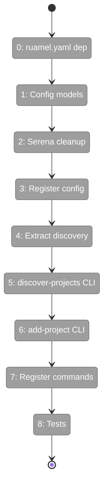
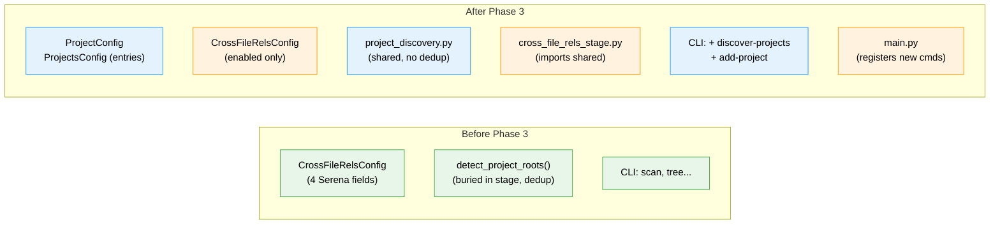

# Flight Plan: Phase 3 — Config & Discovery CLI

**Plan**: [scip-cross-file-rels-plan.md](../../scip-cross-file-rels-plan.md)
**Phase**: Phase 3: Config & Discovery CLI
**Generated**: 2026-03-18
**Updated**: 2026-03-19 (DYK: Serena removal, entries rename, ruamel.yaml)
**Status**: Ready for takeoff

---

## Departure → Destination

**Where we are**: Phases 1-2 delivered SCIP adapter infrastructure with 4 language adapters, a factory, and type alias normalisation. But there's no way for users to declare which projects to index, and `detect_project_roots()` is buried inside `cross_file_rels_stage.py` with Serena-era dedup logic.

**Where we're going**: A user can run `fs2 discover-projects` to see all language projects (numbered list), then `fs2 add-project 1 2 3` to write them to config with comment-preserving YAML. Serena-specific fields removed from `CrossFileRelsConfig`. SCIP is the only provider.

---

## Domain Context

### Domains We're Changing

| Domain | What Changes | Key Files |
|--------|-------------|-----------|
| config | Add `ProjectConfig`, `ProjectsConfig` models; strip Serena fields from `CrossFileRelsConfig`; register in `YAML_CONFIG_TYPES` | `config/objects.py`, `pyproject.toml` |
| core/services | Extract `detect_project_roots()` to shared module; remove child dedup; extend markers | `services/project_discovery.py` (new), `stages/cross_file_rels_stage.py` (modify) |
| cli | Add `discover-projects` and `add-project` commands; register in main.py | `cli/projects.py` (new), `cli/main.py` (modify) |

### Domains We Depend On (no changes)

| Domain | What We Consume | Contract |
|--------|----------------|----------|
| core/adapters | `LANGUAGE_ALIASES` canonical names (for type set) | Module-level dict |

---

## Flight Status

**Legend**: grey = pending | yellow = active | red = blocked/needs input | green = done

---

## Stages

- [ ] **Stage 0: Add ruamel.yaml dependency** — `pyproject.toml` modification, `uv sync`
- [ ] **Stage 1: Config models** — `ProjectConfig` + `ProjectsConfig` with `entries` field (not `projects`) and type alias validation (`config/objects.py` — modify)
- [ ] **Stage 2: Serena cleanup** — Remove `parallel_instances`, `serena_base_port`, `timeout_per_node`, `languages` from `CrossFileRelsConfig`; clean ALL Serena references across 14 source files + tests (`config/objects.py`, `paths.py`, `cli/init.py`, `cli/scan.py`, `cli/watch.py`, `pipeline_context.py`, `cross_file_rels_stage.py`, docs, tests — full codebase)
- [ ] **Stage 3: Register config** — Add `ProjectsConfig` to `YAML_CONFIG_TYPES` (`config/objects.py` — modify)
- [ ] **Stage 4: Extract discovery** — Move `detect_project_roots()`, `PROJECT_MARKERS`, `_SKIP_DIRS`, `ProjectRoot` to `project_discovery.py`; remove child dedup; extend markers; update stage import (`services/project_discovery.py` — new, `stages/cross_file_rels_stage.py` — modify)
- [ ] **Stage 5: discover-projects CLI** — Rich table showing type, path, project file, indexer status (`cli/projects.py` — new)
- [ ] **Stage 6: add-project CLI** — Comment-preserving YAML write via `ruamel.yaml` (`cli/projects.py` — modify)
- [ ] **Stage 7: Register commands** — Add to `main.py` without `require_init` guard (`cli/main.py` — modify)
- [ ] **Stage 8: Tests** — Config validation, discovery, CLI output (`tests/unit/` — new files)

---

## Architecture: Before & After

---

## Acceptance Criteria

- [ ] AC6: `fs2 discover-projects` lists detected projects with type, path, project file, indexer status
- [ ] AC7: `fs2 add-project 1 2 3` writes selected projects to `.fs2/config.yaml`
- [ ] AC8: `projects` config accepts entries with type, path, project_file, enabled, options
- [ ] AC13: Type aliases (ts, cs, js, csharp) normalised in project type validator

_AC9 (auto_discover wiring into scan) moved to Phase 4 — Phase 3 builds config model, Phase 4 wires it._
_AC10 (provider: serena) dropped — Serena removed entirely._

---

## Checklist

- [ ] T000: Add `ruamel.yaml` to pyproject.toml
- [ ] T001: Add `ProjectConfig` and `ProjectsConfig` to config/objects.py
- [ ] T002: Remove Serena-specific fields from `CrossFileRelsConfig`
- [ ] T003: Register `ProjectsConfig` in `YAML_CONFIG_TYPES`
- [ ] T004: Extract `detect_project_roots()` to shared module
- [ ] T005: Create `fs2 discover-projects` CLI command
- [ ] T006: Create `fs2 add-project` CLI command (ruamel.yaml)
- [ ] T007: Register commands in main.py
- [ ] T008: Tests
