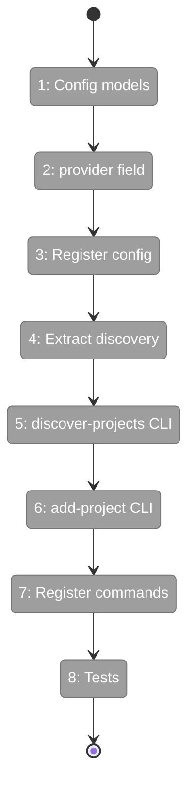
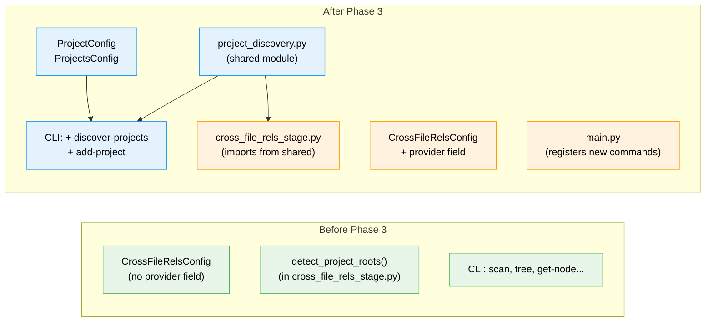

# Flight Plan: Phase 3 — Config & Discovery CLI

**Plan**: [scip-cross-file-rels-plan.md](../../scip-cross-file-rels-plan.md)
**Phase**: Phase 3: Config & Discovery CLI
**Generated**: 2026-03-18
**Status**: Ready for takeoff

---

## Departure → Destination

**Where we are**: Phases 1-2 delivered SCIP adapter infrastructure with 4 language adapters (Python, TypeScript, Go, C#), a factory, and type alias normalisation. But there's no way for users to declare which projects to index, and `detect_project_roots()` is buried inside `cross_file_rels_stage.py` with only 6 language markers.

**Where we're going**: A user can run `fs2 discover-projects` to see what language projects exist in their repo, then `fs2 add-project 1 2 3` to write them to config. The `projects:` YAML section stores project type, path, project file, and options. `CrossFileRelsConfig` has a `provider` field to switch between SCIP and Serena.

---

## Domain Context

### Domains We're Changing

| Domain | What Changes | Key Files |
|--------|-------------|-----------|
| config | Add `ProjectConfig`, `ProjectsConfig` models; add `provider` field to `CrossFileRelsConfig`; register in `YAML_CONFIG_TYPES` | `config/objects.py` |
| core/services | Extract `detect_project_roots()` to shared module; extend markers for C#, Ruby | `services/project_discovery.py` (new), `stages/cross_file_rels_stage.py` (modify) |
| cli | Add `discover-projects` and `add-project` commands; register in main.py | `cli/projects.py` (new), `cli/main.py` (modify) |

### Domains We Depend On (no changes)

| Domain | What We Consume | Contract |
|--------|----------------|----------|
| core/adapters | `LANGUAGE_ALIASES` canonical names (for consistent type validation) | Module-level dict |

---

## Flight Status

<!-- Updated by /plan-6-v2: pending → active → done. Use blocked for problems/input needed. -->

**Legend**: grey = pending | yellow = active | red = blocked/needs input | green = done

---

## Stages

<!-- Updated by /plan-6-v2 during implementation: [ ] → [~] → [x] -->

- [ ] **Stage 1: Config models** — Add `ProjectConfig` and `ProjectsConfig` pydantic models with type alias validation (`config/objects.py` — modify)
- [ ] **Stage 2: Provider field** — Add `provider: str = "scip"` to `CrossFileRelsConfig` (`config/objects.py` — modify)
- [ ] **Stage 3: Register config** — Add `ProjectsConfig` to `YAML_CONFIG_TYPES` list (`config/objects.py` — modify)
- [ ] **Stage 4: Extract discovery** — Move `detect_project_roots()`, `PROJECT_MARKERS`, `_SKIP_DIRS`, `ProjectRoot` to `project_discovery.py`; extend markers; update stage import (`services/project_discovery.py` — new, `stages/cross_file_rels_stage.py` — modify)
- [ ] **Stage 5: discover-projects CLI** — Create command with Rich table showing type, path, project file, indexer status (`cli/projects.py` — new)
- [ ] **Stage 6: add-project CLI** — Create command writing selected projects to `.fs2/config.yaml` (`cli/projects.py` — modify)
- [ ] **Stage 7: Register commands** — Add to `main.py` without `require_init` guard (`cli/main.py` — modify)
- [ ] **Stage 8: Tests** — Config validation, discovery, CLI output (`tests/unit/` — new files)

---

## Architecture: Before & After

**Legend**: existing (green, unchanged) | changed (orange, modified) | new (blue, created)

---

## Acceptance Criteria

- [ ] AC6: `fs2 discover-projects` lists detected projects with type, path, project file, indexer status
- [ ] AC7: `fs2 add-project 1 2 3` writes selected projects to `.fs2/config.yaml`
- [ ] AC8: `projects` config accepts entries with type, path, project_file, enabled, options
- [ ] AC9: Empty projects + auto_discover=true → auto-discovers from markers
- [ ] AC10: `provider: serena` → existing Serena path (backward compat)
- [ ] AC13: Type aliases (ts, cs, js, csharp) normalised in project type validator

## Goals & Non-Goals

**Goals**:
- ✅ User-friendly project discovery and configuration workflow
- ✅ Non-breaking addition — existing configs keep working
- ✅ `detect_project_roots()` reusable from both CLI and stage
- ✅ Backward-compatible `provider` field

**Non-Goals**:
- ❌ Wiring SCIP into the scan pipeline (Phase 4)
- ❌ Running SCIP indexers (Phase 4)
- ❌ Modifying `fs2 init` to include project discovery (future)

---

## Checklist

- [ ] T001: Add `ProjectConfig` and `ProjectsConfig` to config/objects.py
- [ ] T002: Add `provider` field to `CrossFileRelsConfig`
- [ ] T003: Register `ProjectsConfig` in `YAML_CONFIG_TYPES`
- [ ] T004: Extract `detect_project_roots()` to shared module
- [ ] T005: Create `fs2 discover-projects` CLI command
- [ ] T006: Create `fs2 add-project` CLI command
- [ ] T007: Register commands in main.py
- [ ] T008: Tests for config models + CLI commands + project discovery
