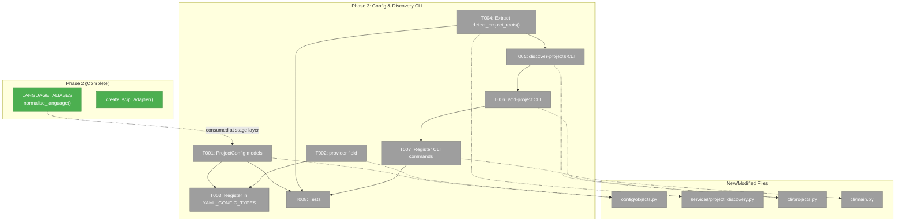
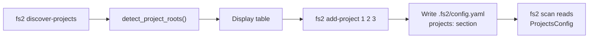
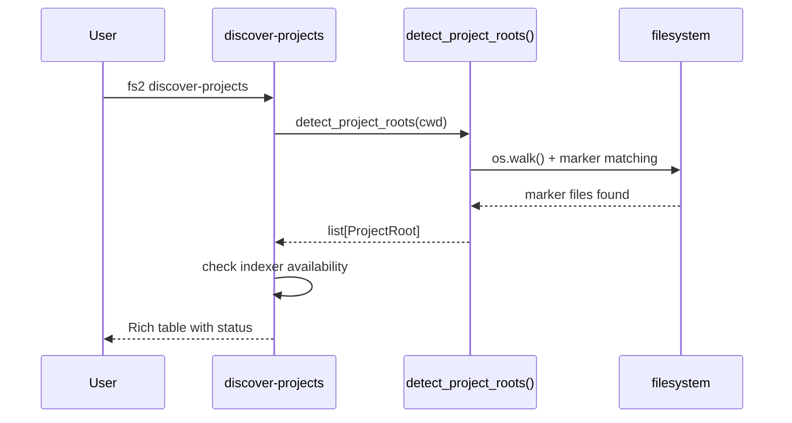

# Phase 3: Config & Discovery CLI — Tasks Dossier

**Plan**: [scip-cross-file-rels-plan.md](../../scip-cross-file-rels-plan.md)
**Phase**: Phase 3: Config & Discovery CLI
**Generated**: 2026-03-18
**Status**: Ready

---

## Executive Briefing

**Purpose**: Add configuration models and CLI commands so users can declare, discover, and manage language projects for SCIP indexing. This bridges the gap between "where to scan files" (`scan_paths`) and "what compilable projects to index" (`projects`). Also adds the `provider` field to `CrossFileRelsConfig` so users can switch between SCIP and Serena.

**What We're Building**: A new `ProjectConfig` / `ProjectsConfig` pydantic config model, a `provider` field on the existing `CrossFileRelsConfig`, extraction of `detect_project_roots()` to a shared module (currently buried in `cross_file_rels_stage.py`), and two CLI commands: `fs2 discover-projects` (lists detected projects) and `fs2 add-project` (writes to config).

**Goals**:
- ✅ `ProjectConfig` and `ProjectsConfig` pydantic models with type alias validation
- ✅ `provider` field on `CrossFileRelsConfig` (`"scip"` default, `"serena"` backward compat)
- ✅ `ProjectsConfig` registered in `YAML_CONFIG_TYPES`
- ✅ `detect_project_roots()` extracted to shared module, extended with C# markers
- ✅ `fs2 discover-projects` CLI command with indexer status display
- ✅ `fs2 add-project` CLI command writing to `.fs2/config.yaml`
- ✅ Tests for config validation, CLI output, and project discovery

**Non-Goals**:
- ❌ Wiring SCIP into CrossFileRelsStage (Phase 4)
- ❌ Subprocess indexer invocation (Phase 4)
- ❌ `fs2 init` integration with project discovery (future)
- ❌ Modifying Serena code paths (Phase 4)

---

## Prior Phase Context

### Phase 1: SCIP Adapter Foundation (Complete ✅)

**A. Deliverables**: SCIPAdapterBase ABC, SCIPPythonAdapter, SCIPFakeAdapter, protobuf bindings, exception hierarchy

**B. Dependencies Exported**: `normalise_language()` and `LANGUAGE_ALIASES` in `scip_adapter.py` — Phase 3 config validation should NOT import these directly (config shouldn't depend on adapters); normalisation happens at consumption in the stage layer.

**C. Gotchas**: Protobuf v7 strictness; `uv sync` pytest-asyncio regression (unrelated)

**D. Incomplete Items**: None

**E. Patterns to Follow**: Adapter file naming; exception hierarchy under `AdapterError`

### Phase 2: Multi-Language Adapters (Complete ✅)

**A. Deliverables**: SCIPTypeScriptAdapter, SCIPGoAdapter, SCIPDotNetAdapter, `create_scip_adapter()` factory, `normalise_language()` function, LANGUAGE_ALIASES dict, fixture `.scip` files

**B. Dependencies Exported**:
- `create_scip_adapter(language: str) → SCIPAdapterBase` — factory supporting python/typescript/javascript/go/dotnet
- `normalise_language(language: str) → str` — alias resolution (ts→typescript, cs→dotnet, etc.)
- `LANGUAGE_ALIASES: dict[str, str]` — all known aliases and canonicals

**C. Gotchas**:
- `js` normalises to `javascript` which resolves to `SCIPTypeScriptAdapter` (shared indexer)
- Go SCIP version field is commit hash, not semver (irrelevant but notable)
- C# `obj/` prefix is the only skip pattern needed for generated files

**D. Incomplete Items**: None

**E. Patterns to Follow**:
- Template method in base class — new adapters just override `language_name()`
- Factory uses lazy imports to avoid circular deps
- Type aliases normalise at consumption, not in config

---

## Pre-Implementation Check

| File | Exists? | Domain Check | Notes |
|------|---------|-------------|-------|
| `src/fs2/config/objects.py` | ✅ exists | config | MODIFY — add `ProjectConfig`, `ProjectsConfig`; add `provider` to `CrossFileRelsConfig` |
| `src/fs2/core/services/project_discovery.py` | ❌ create | core/services | NEW — extracted `detect_project_roots()` + extended markers |
| `src/fs2/core/services/stages/cross_file_rels_stage.py` | ✅ exists | core/services/stages | MODIFY — import from project_discovery instead of local definition |
| `src/fs2/cli/projects.py` | ❌ create | cli | NEW — discover-projects + add-project commands |
| `src/fs2/cli/main.py` | ✅ exists | cli | MODIFY — register new commands |
| `tests/unit/config/test_projects_config.py` | ❌ create | tests | NEW — pydantic validation tests |
| `tests/unit/services/test_project_discovery.py` | ❌ create | tests | NEW — discovery + marker tests |
| `tests/unit/cli/test_projects_cli.py` | ❌ create | tests | NEW — CLI output tests |

**Concept duplication check**: `detect_project_roots()` and `PROJECT_MARKERS` already exist in `cross_file_rels_stage.py` — must extract, not duplicate. No existing `ProjectConfig` concept in codebase. Config pattern well-established with ~15 existing models.

**Harness**: No agent harness configured. Standard testing: `uv run python -m pytest`.

---

## Architecture Map



---

## Tasks

| Status | ID | Task | Domain | Path(s) | Done When | Notes |
|--------|-----|------|--------|---------|-----------|-------|
| [ ] | T001 | Add `ProjectConfig` and `ProjectsConfig` to config/objects.py | config | `src/fs2/config/objects.py` | `ProjectConfig(type, path, project_file, enabled, options)` validates; `ProjectsConfig(projects, auto_discover, scip_cache_dir)` loads from YAML; type field accepts aliases (`ts`, `cs`, etc.) via validator | Per workshop 003. Type validation should accept aliases and normalise them — config CAN do alias resolution since the alias list is just a dict of strings, not an adapter import. Use same canonical names as LANGUAGE_ALIASES. |
| [ ] | T002 | Add `provider` field to `CrossFileRelsConfig` | config | `src/fs2/config/objects.py` | `provider: str = "scip"` field added; `"serena"` accepted for backward compat; existing fields unchanged | Non-breaking default. Serena fields remain but are only relevant when provider="serena". |
| [ ] | T003 | Register `ProjectsConfig` in `YAML_CONFIG_TYPES` | config | `src/fs2/config/objects.py` | `ProjectsConfig` in `YAML_CONFIG_TYPES` list; config loads from YAML `projects:` section | Per finding 03. Silent load failure if not registered. |
| [ ] | T004 | Extract `detect_project_roots()` to shared module | core/services | `src/fs2/core/services/project_discovery.py`, `src/fs2/core/services/stages/cross_file_rels_stage.py` | Function importable from `fs2.core.services.project_discovery`; `cross_file_rels_stage.py` imports from new location; `PROJECT_MARKERS` extended with C# (`.csproj`, `.sln`) and Ruby (`Gemfile`); existing stage tests still pass | Per finding 01. Move `detect_project_roots()`, `PROJECT_MARKERS`, `_SKIP_DIRS`, and `ProjectRoot` dataclass. Stage imports from new module. |
| [ ] | T005 | Create `fs2 discover-projects` CLI command | cli | `src/fs2/cli/projects.py` | Runs `detect_project_roots()` on current dir; displays table with #, type, path, project file, indexer status (✅/⚠️/❌); suggests `fs2 add-project` | Per workshop 003. Check indexer availability with `shutil.which()`. Use Rich table output. Follow `list_graphs.py` pattern. |
| [ ] | T006 | Create `fs2 add-project` CLI command | cli | `src/fs2/cli/projects.py` | Accepts project numbers from discover output or `--all`; writes `projects:` section to `.fs2/config.yaml`; displays written YAML | Per workshop 003. Read existing config, merge projects section, write back. Handle "no projects discovered" and "config doesn't exist" edge cases. |
| [ ] | T007 | Register commands in main.py | cli | `src/fs2/cli/main.py` | `fs2 discover-projects` and `fs2 add-project` appear in `fs2 --help`; both work without `fs2 init` | These commands should NOT require init (they help with setup). Register like `list-graphs` not like `scan`. |
| [ ] | T008 | Tests for config models + CLI commands + project discovery | tests | `tests/unit/config/test_projects_config.py`, `tests/unit/services/test_project_discovery.py`, `tests/unit/cli/test_projects_cli.py` | Pydantic validation (type aliases, defaults, required fields); discovery (marker detection, skip dirs, priority rules); CLI output assertions | Lightweight tests per testing strategy. Use `tmp_path` fixtures for discovery tests. CLI tests via typer test runner. |

---

## Context Brief

**Key findings from plan**:
- **Finding 01**: `detect_project_roots()` exists in `cross_file_rels_stage.py` (lines 136-194) with `PROJECT_MARKERS` for 6 languages — extract and extend for C#, Ruby
- **Finding 03**: Config types MUST be registered in `YAML_CONFIG_TYPES` (objects.py line 1132) or they silently don't load

**Domain dependencies**:
- `config`: `BaseModel` pattern with `__config_path__`, `field_validator`, `YAML_CONFIG_TYPES` registry — follow exactly
- `cli`: `app.command()` registration in `main.py`, `require_init()` guard for commands needing config, Rich + typer pattern from `list_graphs.py`
- `core/services/stages`: `cross_file_rels_stage.py` owns `detect_project_roots()`, `PROJECT_MARKERS`, `_SKIP_DIRS`, `ProjectRoot` — extract to shared module

**Domain constraints**:
- Config models must NOT import from `core/adapters` (dependency flow violation)
- CLI commands delegate to services — no business logic in CLI
- Type alias normalisation for config: use a simple dict in the config validator (NOT importing from `scip_adapter.py`)
- `detect_project_roots()` must remain importable from both stage and CLI

**Reusable from prior phases**:
- `LANGUAGE_ALIASES` pattern from Phase 2 — replicate alias dict in config validator (same canonical names)
- `list_graphs.py` CLI pattern — Rich table, JSON output, error handling
- Workshop 003 — complete design spec for config models, CLI workflow, YAML format

**Mermaid flow diagram** (config + discovery flow):


**Mermaid sequence diagram** (discover-projects CLI):


---

## Discoveries & Learnings

_Populated during implementation by plan-6._

| Date | Task | Type | Discovery | Resolution | References |
|------|------|------|-----------|------------|------------|

**Types**: `gotcha` | `research-needed` | `unexpected-behavior` | `workaround` | `decision` | `debt` | `insight`

---

## Directory Layout

```
docs/plans/038-scip-cross-file-rels/
  ├── scip-cross-file-rels-spec.md
  ├── scip-cross-file-rels-plan.md
  ├── exploration.md
  ├── workshops/
  │   ├── 001-scip-language-boot.md
  │   ├── 002-scip-cross-language-standardisation.md
  │   ├── 003-scip-project-config.md
  │   └── 004-scip-adapter-base-design.md
  └── tasks/
      ├── phase-1-scip-adapter-foundation/  (complete)
      ├── phase-2-multi-language-adapters/   (complete)
      └── phase-3-config-discovery-cli/
          ├── tasks.md                  ← this file
          ├── tasks.fltplan.md          ← generated below
          └── execution.log.md          # created by plan-6
```
