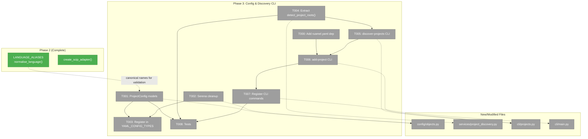

# Phase 3: Config & Discovery CLI — Tasks Dossier

**Plan**: [scip-cross-file-rels-plan.md](../../scip-cross-file-rels-plan.md)
**Phase**: Phase 3: Config & Discovery CLI
**Generated**: 2026-03-18
**Updated**: 2026-03-19 (DYK analysis: Serena removal, field rename, ruamel.yaml)
**Status**: Ready

---

## Executive Briefing

**Purpose**: Add configuration models and CLI commands so users can declare, discover, and manage language projects for SCIP indexing. Also clean up Serena-specific code — SCIP is now the only cross-file relationship provider.

**What We're Building**:
- `ProjectConfig` / `ProjectsConfig` pydantic config models (YAML field: `entries`, not `projects` — avoids `projects.projects` stutter)
- Serena removal from `CrossFileRelsConfig` (strip 4 Serena-specific fields, remove provider concept)
- Extraction of `detect_project_roots()` to shared module (remove Serena-era child dedup)
- `fs2 discover-projects` CLI (numbered table with indexer status)
- `fs2 add-project 1 2 3` CLI (comment-preserving YAML write via `ruamel.yaml`)
- `ruamel.yaml` dependency for safe config modification

**Goals**:
- ✅ `ProjectConfig` and `ProjectsConfig` pydantic models with type alias validation
- ✅ Serena-specific fields removed from `CrossFileRelsConfig`
- ✅ `ProjectsConfig` registered in `YAML_CONFIG_TYPES`
- ✅ `detect_project_roots()` extracted to shared module, child dedup removed, C#/Ruby markers added
- ✅ `fs2 discover-projects` CLI command with indexer status display
- ✅ `fs2 add-project` CLI command with comment-preserving YAML write
- ✅ Tests for config validation, CLI output, and project discovery

**Non-Goals**:
- ❌ Wiring SCIP into CrossFileRelsStage (Phase 4)
- ❌ Subprocess indexer invocation (Phase 4)
- ❌ `fs2 init` integration with project discovery (future)

---

## DYK Analysis Changes (2026-03-19)

| DYK | Issue | Resolution |
|-----|-------|------------|
| #1 | `projects.projects` YAML stutter | Renamed inner field to `entries` |
| #2 | `detect_project_roots()` drops child projects (Serena-era dedup) | Remove dedup — SCIP needs per-project indexes |
| #3 | 4 Serena-specific fields in `CrossFileRelsConfig` | Remove entirely — SCIP is the only provider |
| #4 | `add-project` YAML write destroys comments | Use `ruamel.yaml` for comment-preserving read-modify-write |

**Net task changes**: T002 (provider field) dropped → replaced with T002 (Serena cleanup). T006 now uses `ruamel.yaml`. New dep: `ruamel.yaml` in pyproject.toml.

---

## Prior Phase Context

### Phase 1: SCIP Adapter Foundation (Complete ✅)

**Deliverables**: SCIPAdapterBase ABC, SCIPPythonAdapter, SCIPFakeAdapter, protobuf bindings, exception hierarchy. 39 → 61 tests after Phase 2 refactor.

### Phase 2: Multi-Language Adapters (Complete ✅)

**Deliverables**: SCIPTypeScriptAdapter, SCIPGoAdapter, SCIPDotNetAdapter, `create_scip_adapter()` factory, `normalise_language()`, `LANGUAGE_ALIASES`. 111 tests.

**Dependencies Exported**:
- `LANGUAGE_ALIASES: dict[str, str]` — canonical names for type validation
- `normalise_language(language: str) → str` — alias resolution
- `create_scip_adapter(language: str) → SCIPAdapterBase` — factory

**Key Decision**: Type aliases normalise at consumption (stage layer), not in config. But config CAN validate type is a known alias/canonical using a simple set — no adapter import needed.

---

## Pre-Implementation Check

| File | Exists? | Domain Check | Notes |
|------|---------|-------------|-------|
| `pyproject.toml` | ✅ exists | config | MODIFY — add `ruamel.yaml` dependency |
| `src/fs2/config/objects.py` | ✅ exists | config | MODIFY — add ProjectConfig, ProjectsConfig; clean Serena fields from CrossFileRelsConfig |
| `src/fs2/core/services/project_discovery.py` | ❌ create | core/services | NEW — extracted detect_project_roots() + extended markers |
| `src/fs2/core/services/stages/cross_file_rels_stage.py` | ✅ exists | core/services/stages | MODIFY — import from project_discovery; remove local detect_project_roots/PROJECT_MARKERS/_SKIP_DIRS/ProjectRoot |
| `src/fs2/cli/projects.py` | ❌ create | cli | NEW — discover-projects + add-project commands |
| `src/fs2/cli/main.py` | ✅ exists | cli | MODIFY — register new commands |
| `tests/unit/config/test_projects_config.py` | ❌ create | tests | NEW — pydantic validation tests |
| `tests/unit/services/test_project_discovery.py` | ❌ create | tests | NEW — discovery + marker tests |
| `tests/unit/cli/test_projects_cli.py` | ❌ create | tests | NEW — CLI output tests |

**Concept duplication check**: `detect_project_roots()` and `PROJECT_MARKERS` exist in `cross_file_rels_stage.py` — extract, don't duplicate. `ProjectRoot` dataclass also moves. No existing `ProjectConfig` concept.

**Harness**: No agent harness. Standard testing: `uv run python -m pytest`.

---

## Architecture Map



---

## Tasks

| Status | ID | Task | Domain | Path(s) | Done When | Notes |
|--------|-----|------|--------|---------|-----------|-------|
| [ ] | T000 | Add `ruamel.yaml` to pyproject.toml dependencies | config | `pyproject.toml` | `uv run python -c "import ruamel.yaml"` succeeds | DYK #4: needed for comment-preserving YAML writes in T006. |
| [ ] | T001 | Add `ProjectConfig` and `ProjectsConfig` to config/objects.py | config | `src/fs2/config/objects.py` | `ProjectConfig(type, path, project_file, enabled, options)` validates; `ProjectsConfig(entries, auto_discover, scip_cache_dir)` loads from YAML `projects:` section; type field accepts aliases via validator | DYK #1: inner field is `entries` not `projects` (avoids YAML stutter). Type validation: accept same aliases as LANGUAGE_ALIASES (ts, cs, etc.) using a local set — do NOT import from scip_adapter. |
| [ ] | T002 | Remove Serena-specific fields and references from entire codebase | config, core/services, cli, tests | `src/fs2/config/objects.py`, `src/fs2/config/paths.py`, `src/fs2/cli/init.py`, `src/fs2/cli/scan.py`, `src/fs2/cli/watch.py`, `src/fs2/core/services/pipeline_context.py`, `src/fs2/core/services/stages/cross_file_rels_stage.py`, `src/fs2/docs/cross-file-relationships.md`, `tests/unit/config/test_cross_file_rels_config.py`, `tests/unit/services/stages/test_cross_file_rels_stage.py`, `tests/unit/cli/test_init_cli.py`, `tests/unit/cli/test_scan_cli.py`, `tests/integration/test_cross_file_acceptance.py`, `tests/integration/test_cross_file_integration.py` | `CrossFileRelsConfig` has only `enabled: bool = True`; `parallel_instances`, `serena_base_port`, `timeout_per_node`, `languages` removed; ALL references across src/ and tests/ cleaned up; `.serena/` fixture dirs may remain (harmless marker files) | DYK #3: Full codebase grep found Serena refs in 14 source files + 8 fixture `.serena/project.yml` files. Config fields, CLI options, stage Serena code paths, pipeline context Serena fields, tests asserting Serena config — all must be cleaned. |
| [ ] | T003 | Register `ProjectsConfig` in `YAML_CONFIG_TYPES` | config | `src/fs2/config/objects.py` | `ProjectsConfig` in `YAML_CONFIG_TYPES` list; config loads from YAML `projects:` section | Per finding 03. Silent load failure if not registered. |
| [ ] | T004 | Extract `detect_project_roots()` to shared module | core/services | `src/fs2/core/services/project_discovery.py`, `src/fs2/core/services/stages/cross_file_rels_stage.py` | Function importable from `fs2.core.services.project_discovery`; stage imports from new location; `PROJECT_MARKERS` extended with C# (`.csproj`, `.sln`) and Ruby (`Gemfile`); child project dedup REMOVED; discovery returns one entry per (path, language) pair; existing stage tests updated to import from new module and expect no child dedup | DYK #2: Serena-era dedup drops child projects — wrong for SCIP. GPT-5.4 review #4: stage tests assert dedup behavior — must update those tests. GPT-5.4 review #5: split multi-language roots into separate entries (one per type). |
| [ ] | T005 | Create `fs2 discover-projects` CLI command | cli | `src/fs2/cli/projects.py` | Runs `detect_project_roots()` on cwd; displays Rich table with #, type, path, project file, indexer status (✅/⚠️/❌); shows install instructions for missing indexers; suggests `fs2 add-project` | Per workshop 003. Check indexer with `shutil.which()`. Follow `list_graphs.py` pattern (Rich table, JSON output, stderr errors). |
| [ ] | T006 | Create `fs2 add-project` CLI command | cli | `src/fs2/cli/projects.py` | Accepts project numbers from discover output or `--all`; uses `ruamel.yaml` to read-modify-write `.fs2/config.yaml` preserving comments; displays written entries; idempotent (re-runnable) | DYK #4: must preserve comments. Read existing config, merge entries into `projects.entries` section, write back. Handle "no projects discovered", "config doesn't exist", "project already in config" edge cases. |
| [ ] | T007 | Register commands in main.py | cli | `src/fs2/cli/main.py` | `fs2 discover-projects` and `fs2 add-project` appear in `fs2 --help`; both work WITHOUT `fs2 init` (setup commands) | Register like `list-graphs` (no `require_init` guard). |
| [ ] | T008 | Tests for config models + CLI commands + project discovery | tests | `tests/unit/config/test_projects_config.py`, `tests/unit/services/test_project_discovery.py`, `tests/unit/cli/test_projects_cli.py` | Pydantic validation (type aliases, defaults, required fields, entries field name); discovery (marker detection, skip dirs, NO child dedup, C#/Ruby markers); CLI output assertions; Serena field removal verified | Lightweight tests per testing strategy. Use `tmp_path` fixtures for discovery. CLI tests via typer test runner. |

---

## Context Brief

**Key findings from plan**:
- **Finding 01**: `detect_project_roots()` in `cross_file_rels_stage.py` (lines 136-194) with 6 language markers — extract and extend
- **Finding 03**: Config types MUST be in `YAML_CONFIG_TYPES` or silently don't load

**Domain dependencies**:
- `config`: `BaseModel` + `__config_path__` + `field_validator` + `YAML_CONFIG_TYPES` registry
- `cli`: `app.command()` in `main.py`; `require_init()` guard (NOT used for these commands); Rich + typer from `list_graphs.py`
- `core/services/stages`: `cross_file_rels_stage.py` owns `detect_project_roots()` — extract to shared module

**Domain constraints**:
- Config models must NOT import from `core/adapters`
- CLI delegates to services — no business logic in CLI
- Type alias validation in config uses a local set matching LANGUAGE_ALIASES canonical names

**YAML format after DYK changes**:
```yaml
# .fs2/config.yaml
projects:
  entries:                    # ← DYK #1: 'entries' not 'projects'
    - type: python
      path: .
    - type: typescript
      path: frontend
      project_file: tsconfig.json
  auto_discover: true         # ← default
  scip_cache_dir: .fs2/scip   # ← default

cross_file_rels:
  enabled: true               # ← only field remaining (DYK #3)
```

**Indexer install commands** (for discover-projects display):
```
python:     npm install -g @sourcegraph/scip-python
typescript: npm install -g @sourcegraph/scip-typescript
go:         go install github.com/sourcegraph/scip-go/cmd/scip-go@latest
dotnet:     dotnet tool install --global scip-dotnet
```

**Indexer binary names** (for `shutil.which()` detection):
```
python:     scip-python
typescript: scip-typescript
javascript: scip-typescript  (shared)
go:         scip-go
dotnet:     scip-dotnet
```

---

## Discoveries & Learnings

_Populated during implementation by plan-6._

| Date | Task | Type | Discovery | Resolution | References |
|------|------|------|-----------|------------|------------|

**Types**: `gotcha` | `research-needed` | `unexpected-behavior` | `workaround` | `decision` | `debt` | `insight`

---

## Directory Layout

```
docs/plans/038-scip-cross-file-rels/
  └── tasks/
      ├── phase-1-scip-adapter-foundation/  (complete)
      ├── phase-2-multi-language-adapters/   (complete)
      └── phase-3-config-discovery-cli/
          ├── tasks.md                  ← this file
          ├── tasks.fltplan.md
          └── execution.log.md          # created by plan-6
```
