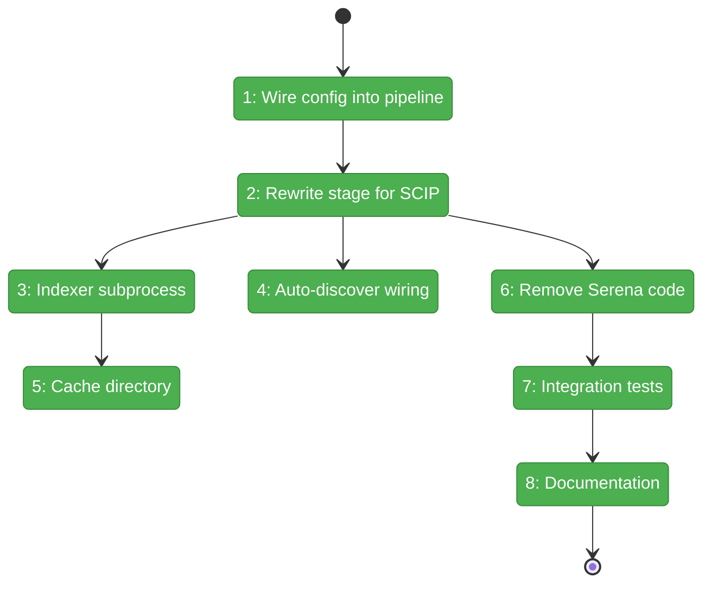
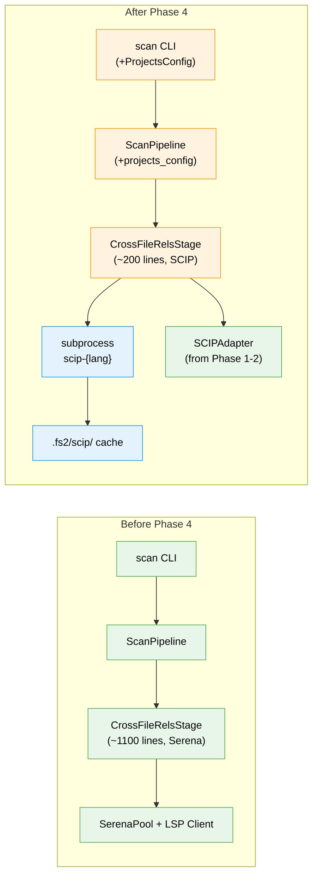

# Flight Plan: Phase 4 — Stage Integration

**Plan**: [scip-cross-file-rels-plan.md](../../scip-cross-file-rels-plan.md)
**Phase**: Phase 4: Stage Integration
**Generated**: 2026-03-21
**Status**: Landed

---

## Departure → Destination

**Where we are**: Phases 1-3 delivered SCIP adapters for 4 languages, a factory + normalisation layer, config models (`ProjectsConfig`/`ProjectConfig`), project discovery CLI, and Serena cleanup. But `CrossFileRelsStage` still contains ~800 lines of Serena code (MCP pool, LSP clients, port management) that doesn't actually run (no serena on PATH). The stage is dead weight.

**Where we're going**: A developer runs `fs2 scan` and cross-file reference edges appear in the graph — powered by SCIP indexers running offline as subprocesses. No servers, no ports, no process pools. Missing indexers get a helpful install message. Index files are cached for fast re-scans.

---

## Domain Context

### Domains We're Changing

| Domain | What Changes | Key Files |
|--------|-------------|-----------|
| core/services/stages | Rewrite `CrossFileRelsStage.process()` for SCIP; remove all Serena code | `cross_file_rels_stage.py` |
| core/services | Wire `ProjectsConfig` into pipeline context | `scan_pipeline.py`, `pipeline_context.py` |
| cli | Load and pass `ProjectsConfig` to pipeline | `cli/scan.py` |
| tests | Replace Serena tests with SCIP tests; real acceptance test | `test_cross_file_rels_stage.py`, `test_cross_file_acceptance.py` |
| docs | SCIP section in README; update user guide | `README.md`, `docs/cross-file-relationships.md` |

### Domains We Depend On (no changes)

| Domain | What We Consume | Contract |
|--------|----------------|----------|
| core/adapters | `create_scip_adapter()`, `extract_cross_file_edges()` | Factory + ABC |
| config | `ProjectsConfig`, `CrossFileRelsConfig` | Pydantic models |
| core/services | `detect_project_roots()`, `INDEXER_BINARIES` | Module-level |

---

## Flight Status

**Legend**: grey = pending | yellow = active | red = blocked/needs input | green = done

---

## Stages

- [x] **Stage 1: Wire config** — Load `ProjectsConfig` in CLI, pass through pipeline to context
- [x] **Stage 2: Rewrite stage** — New `process()` method: load entries → invoke indexer → parse edges → collect
- [x] **Stage 3: Indexer invocation** — `run_scip_indexer()` subprocess wrapper with per-language CLI commands
- [x] **Stage 4: Auto-discover** — Fallback to `detect_project_roots()` when entries empty + auto_discover=true
- [x] **Stage 5: Cache directory** — `.fs2/scip/{slug}/index.scip` caching + `.gitignore`
- [x] **Stage 6: Remove Serena** — Delete all Serena code (~800 lines)
- [x] **Stage 7: Tests** — Stage unit tests with SCIP + real scip-python acceptance test
- [x] **Stage 8: Documentation** — README SCIP section + update cross-file guide

---

## Architecture: Before & After

**Legend**: existing (green, unchanged) | changed (orange, modified) | new (blue, created)

---

## Acceptance Criteria

- [x] AC1: `fs2 scan` on Python project with scip-python produces cross-file reference edges
- [x] AC2: `fs2 scan` on TypeScript project with scip-typescript produces edges
- [x] AC3: `fs2 scan` on Go project with scip-go produces edges
- [x] AC4: `fs2 scan` on C# project with scip-dotnet produces edges
- [x] AC5: Missing SCIP indexer → info message with install instructions, scan continues
- [x] AC9: Empty entries + auto_discover=true → auto-discovers from markers
- [x] AC11: Edges deduplicated — no duplicate source→target pairs
- [x] AC12: Local symbols, stdlib refs, self-refs filtered out
- [x] AC15: index.scip cached in `.fs2/scip/` for re-use

---

## Checklist

- [x] T001: Rewrite `CrossFileRelsStage.process()` for SCIP
- [x] T002: Implement SCIP indexer subprocess invocation
- [x] T003: Wire auto_discover fallback
- [x] T004: Add `.fs2/scip/` cache directory management
- [x] T005: Wire `ProjectsConfig` into pipeline and CLI
- [x] T006: Remove Serena code from stage
- [x] T007: Integration tests (unit + acceptance)
- [x] T008: Update documentation (README + docs/how/)
