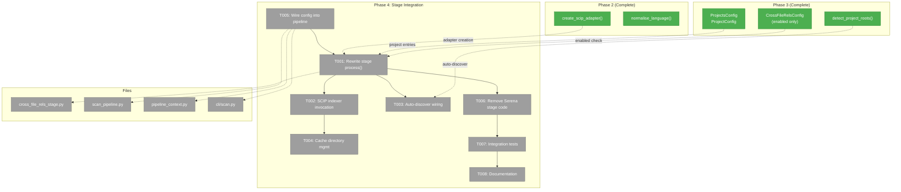
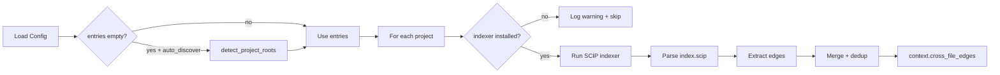
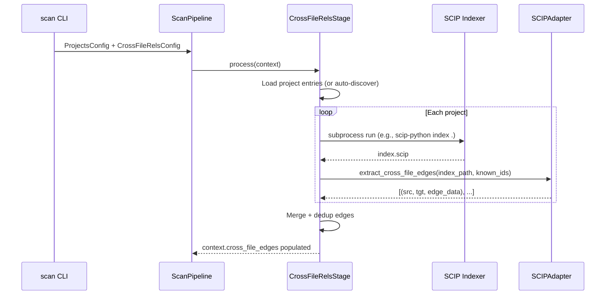

# Phase 4: Stage Integration — Tasks Dossier

**Plan**: [scip-cross-file-rels-plan.md](../../scip-cross-file-rels-plan.md)
**Phase**: Phase 4: Stage Integration
**Generated**: 2026-03-21
**Status**: Ready

---

## Executive Briefing

**Purpose**: Replace the Serena-based resolution path in `CrossFileRelsStage` with SCIP indexer invocation. After this phase, `fs2 scan` on a project with configured SCIP projects (or auto-discover enabled) runs the appropriate SCIP indexer, parses the resulting `index.scip`, and stores cross-file reference edges in the graph — all offline, no servers.

**What We're Building**:
- Rewrite `CrossFileRelsStage.process()` to iterate `ProjectsConfig.entries`, invoke per-language SCIP indexers via subprocess, parse edges with `create_scip_adapter()`, and collect into `context.cross_file_edges`
- Auto-discovery fallback: when entries is empty and `auto_discover=true`, discover projects from markers
- `.fs2/scip/` cache directory for `index.scip` files with `.gitignore`
- Graceful skip when indexer is missing (info message + install instructions, scan continues)
- End-to-end integration tests with real SCIP indexers
- User documentation (README section + docs/how/ guide)

**Goals**:
- ✅ `fs2 scan` produces cross-file reference edges via SCIP (AC1-AC4)
- ✅ Missing indexer → info message with install, scan continues (AC5)
- ✅ Auto-discover from markers when entries empty (AC9)
- ✅ Edges deduplicated, local/stdlib/self-refs filtered (AC11, AC12)
- ✅ `index.scip` cached in `.fs2/scip/` for re-use (AC15)
- ✅ Documentation updated (README + user guide)

**Non-Goals**:
- ❌ Cross-project references (within-project only)
- ❌ Auto-installing SCIP indexers
- ❌ Real-time/live indexing
- ❌ Docker-based indexer support

---

## Prior Phase Context

### Phase 1: SCIP Adapter Foundation (Complete ✅)

**Deliverables**: `SCIPAdapterBase` ABC, `SCIPPythonAdapter`, `SCIPFakeAdapter`, protobuf bindings (`scip_pb2.py`), exception hierarchy (`SCIPAdapterError`, `SCIPIndexError`, `SCIPMappingError`).

**Dependencies Exported**:
- `extract_cross_file_edges(index_path, known_node_ids) → list[tuple[str, str, dict]]`
- `SCIPFakeAdapter.set_edges()` / `set_index()` for testing
- Edge format: `(source_id, target_id, {"edge_type": "references"})`

**Gotchas**: Symbol mapping is fuzzy (tries callable/class/type fallbacks); protobuf pinned `>=6.0`.

### Phase 2: Multi-Language Adapters (Complete ✅)

**Deliverables**: `SCIPTypeScriptAdapter`, `SCIPGoAdapter`, `SCIPDotNetAdapter`, template method refactor, factory + normalisation.

**Dependencies Exported**:
- `create_scip_adapter(language) → SCIPAdapterBase` — factory
- `normalise_language(language) → str` — alias resolution (ts→typescript, cs→dotnet)
- `LANGUAGE_ALIASES` dict — canonical name mappings

**Gotchas**: Go symbols have backtick-quoted import paths with `/`; C# `obj/` directories filtered via `should_skip_document()`.

### Phase 3: Config & Discovery CLI (Complete ✅)

**Deliverables**: `ProjectConfig`/`ProjectsConfig` models, `detect_project_roots()` in shared module, `discover-projects`/`add-project` CLI, Serena field removal, `ruamel.yaml` dependency.

**Dependencies Exported**:
- `ProjectsConfig(entries, auto_discover, scip_cache_dir)` — config model
- `ProjectConfig(type, path, project_file, enabled, options)` — per-project config
- `CrossFileRelsConfig(enabled)` — stripped to boolean only
- `detect_project_roots(scan_root) → list[DiscoveredProject]` — one entry per (path, language)
- `INDEXER_BINARIES` / `INDEXER_INSTALL` dicts — binary names and install commands

**Gotchas**: Stage still has legacy Serena `detect_project_roots()` + `ProjectRoot` — Phase 4 replaces. `getattr` shims for removed config fields.

**Patterns**: Config validation uses local type set (no adapter imports). CLI commands have no `require_init` guard.

---

## Pre-Implementation Check

| File | Exists? | Domain Check | Notes |
|------|---------|-------------|-------|
| `src/fs2/core/services/stages/cross_file_rels_stage.py` | ✅ exists | core/services/stages | MODIFY — rewrite `process()`, remove Serena code |
| `src/fs2/core/services/scan_pipeline.py` | ✅ exists | core/services | MODIFY — wire `ProjectsConfig` into context |
| `src/fs2/core/services/pipeline_context.py` | ✅ exists | core/services | MODIFY — add `projects_config` field |
| `src/fs2/cli/scan.py` | ✅ exists | cli | MODIFY — load `ProjectsConfig` and pass to pipeline |
| `src/fs2/core/services/project_discovery.py` | ✅ exists | core/services | CONSUME — `detect_project_roots()`, `INDEXER_BINARIES` |
| `src/fs2/core/adapters/scip_adapter.py` | ✅ exists | core/adapters | CONSUME — `create_scip_adapter()`, `normalise_language()` |
| `src/fs2/config/objects.py` | ✅ exists | config | CONSUME — `ProjectsConfig`, `CrossFileRelsConfig` |
| `tests/unit/services/stages/test_cross_file_rels_stage.py` | ✅ exists | tests | MODIFY — replace Serena tests with SCIP tests |
| `tests/integration/test_cross_file_acceptance.py` | ✅ exists | tests | MODIFY — wire real SCIP acceptance test |

**Concept duplication check**: No existing SCIP invocation logic. `CrossFileRelsStage` has the Serena path — replacing, not duplicating.

**Harness**: No agent harness. Standard testing: `uv run python -m pytest`.

---

## Architecture Map



---

## Tasks

| Status | ID | Task | Domain | Path(s) | Done When | Notes |
|--------|-----|------|--------|---------|-----------|-------|
| [ ] | T001 | Rewrite `CrossFileRelsStage.process()` for SCIP | core/services/stages | `src/fs2/core/services/stages/cross_file_rels_stage.py` | Stage iterates project entries, invokes indexer per project, parses edges via adapter, collects into `context.cross_file_edges`; keeps incremental resolution (reuse_prior_edges, get_changed_file_paths) | Core task. Uses `create_scip_adapter()` factory + `extract_cross_file_edges()`. Progress callbacks preserved. |
| [ ] | T002 | Implement SCIP indexer subprocess invocation | core/services/stages | `src/fs2/core/services/stages/cross_file_rels_stage.py` | `run_scip_indexer(language, project_path, output_path)` runs correct CLI command per language; captures stderr; returns success/failure; handles missing indexer gracefully (AC5) | Per workshop 001: scip-python index ., scip-typescript index --output, scip-go --output=, scip-dotnet index. Each has different flags. |
| [ ] | T003 | Wire auto_discover fallback | core/services/stages | `src/fs2/core/services/stages/cross_file_rels_stage.py` | When `ProjectsConfig.entries` is empty and `auto_discover=True`, call `detect_project_roots()` from `project_discovery` module, convert `DiscoveredProject` to working entries (AC9) | Import from `fs2.core.services.project_discovery`. |
| [ ] | T004 | Add `.fs2/scip/` cache directory management | core/services/stages | `src/fs2/core/services/stages/cross_file_rels_stage.py` | `index.scip` cached per project slug in `{scip_cache_dir}/{slug}/index.scip`; `.gitignore` added to cache dir; cache used on re-scan if source unchanged (AC15) | Slug from project path. DYK-038-03: add .gitignore. |
| [ ] | T005 | Wire `ProjectsConfig` into pipeline and CLI | core/services, cli | `src/fs2/core/services/scan_pipeline.py`, `src/fs2/core/services/pipeline_context.py`, `src/fs2/cli/scan.py` | `ProjectsConfig` loaded from config, passed through ScanPipeline constructor → PipelineContext → CrossFileRelsStage. Stage reads `context.projects_config`. | Follow existing `cross_file_rels_config` wiring pattern exactly. |
| [ ] | T006 | Remove Serena code from stage | core/services/stages | `src/fs2/core/services/stages/cross_file_rels_stage.py` | All Serena code removed: `is_serena_available()`, `ensure_serena_project()`, `SerenaPool`, `DefaultSerenaClient`, `shard_nodes()`, `resolve_node_batch()`, `build_node_lookup()`, legacy `detect_project_roots()`, `ProjectRoot`, `PROJECT_MARKERS`, `_SKIP_DIRS`, Serena protocols. File size drops significantly. | Big cleanup. Keep `get_changed_file_paths()`, `filter_nodes_to_changed()`, `reuse_prior_edges()` (generic incremental logic). |
| [ ] | T007 | Integration tests: end-to-end SCIP → edges → graph | tests | `tests/unit/services/stages/test_cross_file_rels_stage.py`, `tests/integration/test_cross_file_acceptance.py` | Stage unit tests with `SCIPFakeAdapter`; real acceptance test with `scip-python` on fixture project; verify edges in graph, metrics populated; `@pytest.mark.slow` on real indexer tests | Use `tests/fixtures/cross_file_sample/` Python fixture. |
| [ ] | T008 | Update documentation (README + docs/how/) | docs | `README.md`, `src/fs2/docs/cross-file-relationships.md` | SCIP section in README covering setup + usage; cross-file-relationships.md updated with SCIP commands; outdated Serena references removed | Per spec clarification Q2. |

---

## Context Brief

**Key findings from plan**:
- **Finding 01**: `detect_project_roots()` extracted to shared module in Phase 3 — use `fs2.core.services.project_discovery.detect_project_roots()` for auto-discover
- **Finding 03**: Config types must be in `YAML_CONFIG_TYPES` — `ProjectsConfig` already registered
- **Finding 04**: Edge format is `{"edge_type": "references"}` only — no ref_kind
- **Finding 06**: Follow adapter naming convention — already established in Phases 1-2

**Domain dependencies**:
- `core/adapters`: `create_scip_adapter(language)`, `normalise_language()`, `extract_cross_file_edges()` — SCIP index parsing
- `core/services`: `detect_project_roots()`, `DiscoveredProject`, `INDEXER_BINARIES` — project discovery
- `config`: `ProjectsConfig`, `ProjectConfig`, `CrossFileRelsConfig` — config models

**Domain constraints**:
- Stage must NOT import adapter implementations directly — use `create_scip_adapter()` factory
- Stage must NOT import from CLI layer
- Subprocess invocation is infrastructure — keep in stage (not adapter)

**SCIP indexer invocation commands** (from Workshop 001):
```
python:     scip-python index . --project-name={slug}
typescript: scip-typescript index --output {output_path}
javascript: scip-typescript index --infer-tsconfig --output {output_path}
go:         scip-go --output={output_path} ./...
dotnet:     scip-dotnet index --working-directory {project_path}
```

**Reusable from prior phases**:
- `SCIPFakeAdapter.set_edges()` / `set_index()` for stage unit tests
- `get_changed_file_paths()`, `filter_nodes_to_changed()`, `reuse_prior_edges()` — keep for incremental
- `tests/fixtures/cross_file_sample/` — Python fixture with known cross-file refs
- `scripts/scip/fixtures/{typescript,go,dotnet}/index.scip` — pre-generated fixture indexes
- Progress callback protocol: `(status: str, detail: str)` — "starting", "progress", "complete", "skipped"

**Mermaid flow diagram** (SCIP stage flow):


**Mermaid sequence diagram** (pipeline flow):


---

## Discoveries & Learnings

_Populated during implementation by plan-6._

| Date | Task | Type | Discovery | Resolution | References |
|------|------|------|-----------|------------|------------|

**Types**: `gotcha` | `research-needed` | `unexpected-behavior` | `workaround` | `decision` | `debt` | `insight`

---

## Directory Layout

```
docs/plans/038-scip-cross-file-rels/
  ├── scip-cross-file-rels-plan.md
  └── tasks/
      ├── phase-1-scip-adapter-foundation/  (complete)
      ├── phase-2-multi-language-adapters/   (complete)
      ├── phase-3-config-discovery-cli/      (complete)
      └── phase-4-stage-integration/
          ├── tasks.md                  ← this file
          ├── tasks.fltplan.md
          └── execution.log.md          # created by plan-6
```
