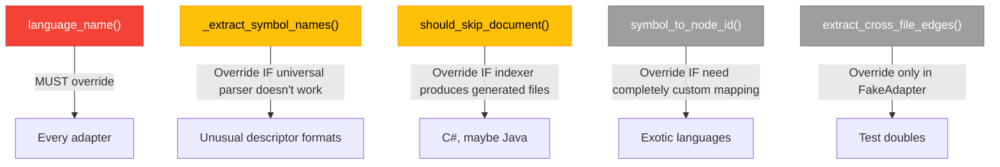

# Workshop: SCIP Adapter Base Class & Override Design

**Type**: Integration Pattern
**Plan**: 038-scip-cross-file-rels
**Spec**: [scip-cross-file-rels-spec.md](../scip-cross-file-rels-spec.md)
**Created**: 2026-03-17
**Status**: Draft

**Related Documents**:
- [002-scip-cross-language-standardisation.md](002-scip-cross-language-standardisation.md) — Symbol format per language
- [001-scip-language-boot.md](001-scip-language-boot.md) — Indexer requirements
- Phase 1 implementation: `src/fs2/core/adapters/scip_adapter.py` (current base)
- Phase 1 implementation: `src/fs2/core/adapters/scip_adapter_python.py` (current Python adapter)

---

## Purpose

Design the `SCIPAdapterBase` class and its per-language overrides so that:
1. **New language adapters are minimal** (~10-15 lines, not ~65)
2. **Shared fuzzy-match logic lives in ONE place** (not copy-pasted 4+ times)
3. **`extract_name_from_descriptor()` handles ALL languages** (currently broken for Go)
4. **Future implementors have a clear, documented extension surface**
5. **Type alias normalisation and factory patterns are defined**

## Key Questions Addressed

- Where does the shared `symbol_to_node_id()` logic live?
- How does each language adapter differ, and how minimal can they be?
- How do we fix `extract_name_from_descriptor()` for Go's backtick import paths?
- What's the right level of abstraction — template method, hooks, or pure abstract?
- Where does type alias normalisation live without violating dependency flow?
- How does adapter selection work (factory pattern)?

---

## Current State (Phase 1)

### What Works

```
SCIPAdapterBase (ABC, ~267 lines)
│   Concrete: extract_cross_file_edges(), _load_index(), _extract_raw_edges(),
│             _map_to_node_ids(), _file_to_nearest_node(), should_skip_document(),
│             _deduplicate(), parse_symbol(), extract_name_from_descriptor()
│   Abstract: language_name(), symbol_to_node_id()
│
├── SCIPPythonAdapter (~68 lines)
│   Overrides: language_name(), symbol_to_node_id()
│
└── SCIPFakeAdapter (~82 lines)
    Overrides: language_name(), symbol_to_node_id(), extract_cross_file_edges()
```

### What's Wrong

**1. `extract_name_from_descriptor()` breaks on Go symbols**

```python
# Current code splits on "/"
for segment in descriptor.split("/"):
    ...

# Python: `test.model`/Item#  → ["`test.model`", "Item#"]  ✅ (no / in backticks)
# TypeScript: `service.ts`/TaskService#addTask(). → OK  ✅ (no / in backticks)
# Go: `example.com/taskapp/service`/TaskService#AddTask().
#   → ["`example.com", "taskapp", "service`", "TaskService#AddTask()."]  ❌ BROKEN
# C#: TaskApp/TaskService#AddTask(). → ["TaskApp", "TaskService#AddTask()."]  ✅ (no backticks)
```

The backtick-quoted segment for Go contains `/` (import paths), so `split("/")` corrupts it.

**2. Python adapter is 90% boilerplate**

```python
# SCIPPythonAdapter.symbol_to_node_id() — 40 lines
# Of those, only 0 lines are Python-specific!
# The entire method is:
#   1. parse_symbol()         → base utility
#   2. extract_name_from_descriptor()  → base utility
#   3. try categories         → universal fuzzy match
#   4. try short name         → universal fuzzy match
#   5. fall back to file      → universal fallback
```

Every new adapter would copy-paste this exact same logic. Four copies = four places to fix bugs.

**3. No factory or language alias normalisation**

Phase 4 needs `"typescript"` → `SCIPTypeScriptAdapter()`. Currently no mapping exists.

---

## Design Decisions

### Decision 1: Template Method vs Pure Abstract

**Context**: The project's other adapters (`EmbeddingAdapter`, `SampleAdapter`, `ConsoleAdapter`) use **pure abstract** methods because each implementation is fundamentally different. SCIP adapters are different — they share 95% of the `symbol_to_node_id()` logic.

**Options**:

| Option | Adapter LOC | DRY | Full Override? | Follows Project Pattern |
|--------|-------------|-----|---------------|------------------------|
| A. Keep abstract, copy-paste | ~65 | ❌ 4 copies | ✅ | ✅ |
| B. Template method + hook | ~10-15 | ✅ | ✅ (override whole method) | ⚠️ New pattern for this project |
| C. Config-driven (strip mode enum) | ~5 | ✅ | ❌ Rigid | ❌ |

**Decision: Option B — Template Method**

The SCIP adapter hierarchy is unique in this codebase: all subclasses share the same algorithm, only the descriptor format varies. Template Method is the textbook pattern for exactly this situation. Other adapters (Embedding, Console) don't share algorithms, so they correctly use pure abstract.

`symbol_to_node_id()` becomes **concrete** in the base class. Subclasses override `_extract_symbol_names()` ONLY if the universal logic doesn't work for their language. In practice, the universal logic works for all 4 current languages (after fixing `extract_name_from_descriptor()`).

### Decision 2: Fix Descriptor Parsing vs Per-Language Preprocessing

**Context**: `extract_name_from_descriptor()` breaks on Go because it splits on `/` inside backtick-quoted segments.

**Options**:

| Option | Changes | Future-Proof |
|--------|---------|-------------|
| A. Fix `extract_name_from_descriptor()` to handle backtick `/` | 1 place | ✅ Any language |
| B. Add `_preprocess_descriptor()` hook per adapter | N adapters | ⚠️ Each adapter must know to strip |
| C. Go adapter handles it alone (doesn't use base utility) | 1 place | ❌ Go-specific workaround |

**Decision: Option A — Fix the base utility**

The backtick-quoting issue is a parsing bug, not a language-specific concern. Fix it once in the utility, and all languages work correctly including future ones.

### Decision 3: Type Alias Normalisation Placement

**Context**: Both adapter selection (Phase 4) and config validation (Phase 3) need language alias mapping.

**Options**:

| Option | Import Path | Dependency Direction |
|--------|------------|---------------------|
| A. In `scip_adapter.py` | adapters → OK; config → ❌ violates | ❌ |
| B. In `config/objects.py` | adapters import config → unusual | ⚠️ |
| C. Config stores raw, normalise at stage layer | stage → adapters → OK | ✅ |

**Decision: Option C — Normalise at consumption**

Config stores what the user typed (`ts`, `csharp`, whatever). The stage normalises when selecting an adapter. The alias dict and `normalise_language()` live in `scip_adapter.py` (consumed by the stage, not by config). Config just validates that the value is a non-empty string.

---

## Proposed Design

### Fixed `extract_name_from_descriptor()`

```python
@staticmethod
def _split_descriptor_segments(descriptor: str) -> list[str]:
    """Split SCIP descriptor by / while respecting backtick quoting.

    Backtick-quoted segments can contain / (Go import paths, etc.)
    and must be kept as single segments.

    Examples:
        `test.model`/Item#           → [`test.model`, Item#]
        `service.ts`/TaskService#    → [`service.ts`, TaskService#]
        `example.com/taskapp/svc`/T# → [`example.com/taskapp/svc`, T#]
        TaskApp/TaskService#         → [TaskApp, TaskService#]
    """
    segments = []
    current: list[str] = []
    in_backtick = False

    for char in descriptor:
        if char == '`':
            in_backtick = not in_backtick
            current.append(char)
        elif char == '/' and not in_backtick:
            if current:
                segments.append(''.join(current))
            current = []
        else:
            current.append(char)

    if current:
        segments.append(''.join(current))

    return segments

@staticmethod
def extract_name_from_descriptor(descriptor: str) -> list[str]:
    """Extract symbol name parts from a SCIP descriptor.

    Handles backtick-quoted segments (skipped — they're module/import paths)
    and standard descriptor suffixes:
    - # = type/class
    - (). = method/function
    - . = field/property/constant

    Examples:
        `pkg.module`/MyClass#method().  → ["MyClass", "method"]
        `example.com/x/y`/Type#Field.  → ["Type", "Field"]
        TaskApp/TaskService#AddTask().  → ["TaskService", "AddTask"]
        `mod`/func_name().             → ["func_name"]
    """
    segments = SCIPAdapterBase._split_descriptor_segments(descriptor)
    name_parts = []

    for segment in segments:
        # Skip backtick-quoted segments (module paths, file paths, import paths)
        if segment.startswith("`") and segment.endswith("`"):
            continue

        # Also skip bare backtick segments (partial parse artifacts)
        stripped = segment.strip("`")
        if stripped != segment:
            continue

        if "#" in segment:
            class_part, rest = segment.split("#", 1)
            if class_part and not class_part.startswith("__"):
                name_parts.append(class_part)
            if rest:
                method = rest.rstrip("().")
                if method and not method.startswith("("):
                    name_parts.append(method)
        elif segment.endswith("()."):
            func = segment.rstrip("().")
            if func:
                name_parts.append(func)
        elif segment.endswith("."):
            # Field/property/constant: Priority#High. handled above via #
            # Top-level field: field_name. (rare but possible)
            field = segment.rstrip(".")
            if field and not field.startswith("("):
                name_parts.append(field)

    return name_parts
```

### Language Verification

Let's trace through every language to prove this works:

**Python**: `\`test.model\`/Item#__init__().`
```
segments: [`test.model`, Item#__init__().]
`test.model` → starts+ends with backtick → SKIP
Item#__init__(). → class_part=Item, rest=__init__(). → method=__init__
Result: ["Item", "__init__"]  ✅
```

**TypeScript**: `\`service.ts\`/TaskService#addTask().`
```
segments: [`service.ts`, TaskService#addTask().]
`service.ts` → backtick → SKIP
TaskService#addTask(). → class=TaskService, method=addTask
Result: ["TaskService", "addTask"]  ✅
```

**Go**: `\`example.com/taskapp/service\`/TaskService#AddTask().`
```
segments: [`example.com/taskapp/service`, TaskService#AddTask().]
`example.com/taskapp/service` → backtick → SKIP
TaskService#AddTask(). → class=TaskService, method=AddTask
Result: ["TaskService", "AddTask"]  ✅
```

**Go (top-level function)**: `\`example.com/taskapp/model\`/NewTask().`
```
segments: [`example.com/taskapp/model`, NewTask().]
backtick → SKIP
NewTask(). → ends with (). → func=NewTask
Result: ["NewTask"]  ✅
```

**Go (constant)**: `\`example.com/taskapp/model\`/Priority#High.`
```
segments: [`example.com/taskapp/model`, Priority#High.]
backtick → SKIP
Priority#High. → class=Priority, rest=High. → method=High
Result: ["Priority", "High"]  ✅
```

**C#**: `TaskApp/TaskService#AddTask().`
```
segments: [TaskApp, TaskService#AddTask().]
TaskApp → no #, no ()., no . → SKIP (falls through all conditions)
TaskService#AddTask(). → class=TaskService, method=AddTask
Result: ["TaskService", "AddTask"]  ✅
```

**C# (enum)**: `TaskApp/Priority#Medium.`
```
segments: [TaskApp, Priority#Medium.]
TaskApp → SKIP
Priority#Medium. → class=Priority, rest=Medium. → method=Medium
Result: ["Priority", "Medium"]  ✅
```

**C# (property)**: `TaskApp/TaskItem#Title.`
```
segments: [TaskApp, TaskItem#Title.]
TaskApp → SKIP
TaskItem#Title. → class=TaskItem, rest=Title. → method=Title
Result: ["TaskItem", "Title"]  ✅
```

**All languages pass.** The universal parser handles every case correctly.

---

### Refactored `SCIPAdapterBase`

```python
class SCIPAdapterBase(ABC):
    """Abstract base for SCIP language adapters.

    Subclasses MUST override:
    1. language_name() — return language identifier

    Subclasses MAY override:
    2. _extract_symbol_names() — custom descriptor-to-name-parts logic
    3. should_skip_document() — filter generated/unwanted files
    4. symbol_to_node_id() — entirely custom mapping (rarely needed)
    """

    # ── Public API (unchanged) ────────────────────────────

    def extract_cross_file_edges(
        self,
        index_path: str | Path,
        known_node_ids: set[str],
    ) -> list[tuple[str, str, dict[str, Any]]]:
        """Parse index.scip and return fs2 edge tuples."""
        index = self._load_index(index_path)
        raw_edges = self._extract_raw_edges(index)
        mapped_edges = self._map_to_node_ids(raw_edges, known_node_ids)
        deduped = self._deduplicate(mapped_edges)
        return deduped

    # ── Abstract (MUST override) ──────────────────────────

    @abstractmethod
    def language_name(self) -> str:
        """Return the language identifier (e.g., 'python', 'typescript')."""
        ...

    # ── Template Method: symbol_to_node_id ────────────────

    def symbol_to_node_id(
        self, symbol: str, file_path: str, known_node_ids: set[str]
    ) -> str | None:
        """Map a SCIP symbol + file to an fs2 node_id.

        Template method: parses symbol, extracts names, fuzzy-matches.
        Override _extract_symbol_names() for custom descriptor parsing.
        Override this entirely for fundamentally different mapping.
        """
        parsed = self.parse_symbol(symbol)
        if not parsed:
            return None

        name_parts = self._extract_symbol_names(parsed["descriptor"])
        if not name_parts:
            return None

        return self._fuzzy_match_node_id(name_parts, file_path, known_node_ids)

    # ── Virtual hooks (MAY override) ──────────────────────

    def _extract_symbol_names(self, descriptor: str) -> list[str]:
        """Extract symbol name parts from a SCIP descriptor.

        Default: uses extract_name_from_descriptor() which handles
        all known languages (Python, TypeScript, Go, C#).

        Override for languages with fundamentally different descriptor
        formats that the universal parser can't handle.
        """
        return self.extract_name_from_descriptor(descriptor)

    def should_skip_document(self, doc: scip_pb2.Document) -> bool:
        """Override to skip generated/unwanted documents.

        Default: skip nothing.
        C# overrides to skip GlobalUsings.g.cs, AssemblyInfo, obj/ paths.
        """
        return False

    # ── Shared lookup logic (NOT meant to be overridden) ──

    def _fuzzy_match_node_id(
        self,
        name_parts: list[str],
        file_path: str,
        known_node_ids: set[str],
    ) -> str | None:
        """Try multiple category prefixes, then shorter names, then file-level.

        Lookup order:
        1. callable:path:Full.Name, class:path:Full.Name, type:path:Full.Name
        2. callable:path:ShortName (drop first part), etc.
        3. file:path (file-level fallback)
        """
        symbol_name = ".".join(name_parts)

        # Try full name with each category
        for category in ("callable", "class", "type"):
            candidate = f"{category}:{file_path}:{symbol_name}"
            if candidate in known_node_ids:
                return candidate

        # Try without first name part (module-qualified names)
        if len(name_parts) > 1:
            short_name = ".".join(name_parts[1:])
            for category in ("callable", "class", "type"):
                candidate = f"{category}:{file_path}:{short_name}"
                if candidate in known_node_ids:
                    return candidate

        # Fall back to file-level node
        file_node = f"file:{file_path}"
        if file_node in known_node_ids:
            return file_node

        return None
```

---

### Resulting Adapter Shapes

Each adapter is now minimal — just identity + optional document filter:

#### SCIPPythonAdapter (~8 lines)

```python
"""SCIP Python adapter."""
from fs2.core.adapters.scip_adapter import SCIPAdapterBase


class SCIPPythonAdapter(SCIPAdapterBase):
    """SCIP adapter for Python projects.

    Python SCIP symbols: scip-python python <pkg> <ver> `dotted.path`/Class#method().
    Universal descriptor parsing handles this format correctly.
    """

    def language_name(self) -> str:
        return "python"
```

That's it. `symbol_to_node_id()` is inherited and works correctly.

#### SCIPTypeScriptAdapter (~8 lines)

```python
"""SCIP TypeScript adapter."""
from fs2.core.adapters.scip_adapter import SCIPAdapterBase


class SCIPTypeScriptAdapter(SCIPAdapterBase):
    """SCIP adapter for TypeScript/JavaScript projects.

    TS SCIP symbols: scip-typescript npm . . `file.ts`/Class#method().
    Backtick segment is the file path (no / inside) — universal parser handles it.
    """

    def language_name(self) -> str:
        return "typescript"
```

#### SCIPGoAdapter (~8 lines)

```python
"""SCIP Go adapter."""
from fs2.core.adapters.scip_adapter import SCIPAdapterBase


class SCIPGoAdapter(SCIPAdapterBase):
    """SCIP adapter for Go projects.

    Go SCIP symbols: scip-go gomod <module> <hash> `import/path`/Type#Method().
    Backtick segment contains / (import paths) — fixed _split_descriptor_segments()
    handles this correctly.
    """

    def language_name(self) -> str:
        return "go"
```

#### SCIPDotNetAdapter (~25 lines)

```python
"""SCIP C#/.NET adapter."""
from fs2.core.adapters.scip_adapter import SCIPAdapterBase
from fs2.core.adapters import scip_pb2


class SCIPDotNetAdapter(SCIPAdapterBase):
    """SCIP adapter for C#/.NET projects.

    C# SCIP symbols: scip-dotnet nuget . . Namespace/Class#Method().
    No backtick quoting — namespace segments are plain text.
    Filters generated documents (GlobalUsings.g.cs, AssemblyInfo, obj/).
    """

    # Patterns confirmed by inspecting scip-dotnet output (T001)
    _SKIP_PATTERNS = (
        '.g.cs',           # GlobalUsings.g.cs and other generated
        '.AssemblyInfo.',  # AssemblyInfo.cs
    )
    _SKIP_PREFIXES = (
        'obj/',            # Build artifacts
    )

    def language_name(self) -> str:
        return "dotnet"

    def should_skip_document(self, doc: scip_pb2.Document) -> bool:
        """Skip C# generated files."""
        path = doc.relative_path
        if any(path.endswith(p) for p in self._SKIP_PATTERNS):
            return True
        if any(path.startswith(p) for p in self._SKIP_PREFIXES):
            return True
        return False
```

**Note**: `_SKIP_PATTERNS` must be confirmed by inspecting real `scip-dotnet` output in T001. The patterns above are educated guesses from workshop 001.

#### SCIPFakeAdapter (unchanged)

The fake adapter can stay as-is since it overrides `extract_cross_file_edges()` entirely. Its `symbol_to_node_id()` override will continue to work (Python allows overriding concrete methods).

---

### Type Alias Normalisation

Located in `scip_adapter.py` as module-level constants, consumed by the stage layer (Phase 4):

```python
# ── Language aliases ──────────────────────────────────────

LANGUAGE_ALIASES: dict[str, str] = {
    # Aliases → canonical
    "ts": "typescript",
    "js": "javascript",
    "cs": "dotnet",
    "csharp": "dotnet",
    "py": "python",
    # Canonical → self (for passthrough)
    "python": "python",
    "typescript": "typescript",
    "javascript": "javascript",
    "go": "go",
    "dotnet": "dotnet",
    "java": "java",
    "rust": "rust",
    "cpp": "cpp",
    "ruby": "ruby",
}


def normalise_language(language: str) -> str:
    """Normalise a language name/alias to its canonical form.

    Args:
        language: Language name or alias (e.g., "ts", "csharp", "python").

    Returns:
        Canonical language name (e.g., "typescript", "dotnet", "python").

    Raises:
        ValueError: If the language is not recognised.
    """
    canonical = LANGUAGE_ALIASES.get(language.lower())
    if canonical is None:
        known = sorted(set(LANGUAGE_ALIASES.values()))
        raise ValueError(
            f"Unknown language: {language!r}. "
            f"Known languages: {', '.join(known)}"
        )
    return canonical
```

**Consumption pattern** (Phase 4, in CrossFileRelsStage):

```python
from fs2.core.adapters.scip_adapter import normalise_language

# User config: type: "ts"
canonical = normalise_language(project.type)  # → "typescript"
adapter = create_scip_adapter(canonical)
```

---

### Adapter Factory

Located in `scip_adapter.py` (avoids separate file; follows `create_embedding_adapter_from_config()` pattern in `embedding_adapter.py`):

```python
def create_scip_adapter(language: str) -> SCIPAdapterBase:
    """Create the appropriate SCIP adapter for a language.

    Args:
        language: Canonical language name (use normalise_language() first).

    Returns:
        Language-specific SCIPAdapterBase subclass.

    Raises:
        SCIPAdapterError: If no adapter exists for the language.
    """
    # Lazy imports to avoid circular dependencies
    from fs2.core.adapters.scip_adapter_python import SCIPPythonAdapter
    from fs2.core.adapters.scip_adapter_typescript import SCIPTypeScriptAdapter
    from fs2.core.adapters.scip_adapter_go import SCIPGoAdapter
    from fs2.core.adapters.scip_adapter_dotnet import SCIPDotNetAdapter

    adapters: dict[str, type[SCIPAdapterBase]] = {
        "python": SCIPPythonAdapter,
        "typescript": SCIPTypeScriptAdapter,
        "go": SCIPGoAdapter,
        "dotnet": SCIPDotNetAdapter,
    }

    adapter_cls = adapters.get(language)
    if adapter_cls is None:
        supported = ", ".join(sorted(adapters.keys()))
        raise SCIPAdapterError(
            f"No SCIP adapter for language: {language!r}. "
            f"Supported: {supported}. "
            f"Install the SCIP indexer and add adapter support."
        )
    return adapter_cls()
```

---

## Extension Guide: Adding a New Language

Future implementors (Java, Rust, C++, Ruby) follow this checklist:

### Minimal Adapter (Most Languages)

```python
"""SCIP adapter for <Language>."""
from fs2.core.adapters.scip_adapter import SCIPAdapterBase


class SCIP<Language>Adapter(SCIPAdapterBase):
    """SCIP adapter for <Language> projects."""

    def language_name(self) -> str:
        return "<language>"
```

That's the entire file if the universal descriptor parser handles the language.

### When You Need More

| Override | When | Example |
|----------|------|---------|
| `should_skip_document()` | Language tooling generates extra files | C# obj/ artifacts |
| `_extract_symbol_names()` | Descriptor format is fundamentally different | A language using `;` instead of `/` as separator |
| `symbol_to_node_id()` | Complete custom mapping needed | A language where SCIP symbols are unrelated to fs2 conventions |

### Extension Checklist

1. [ ] Create `scip_adapter_<language>.py` — subclass `SCIPAdapterBase`
2. [ ] Override `language_name()` (required)
3. [ ] Test: Does `extract_name_from_descriptor()` parse your language's descriptors correctly? If yes → done. If no → override `_extract_symbol_names()`.
4. [ ] Override `should_skip_document()` if the indexer produces generated files
5. [ ] Add language to `LANGUAGE_ALIASES` dict
6. [ ] Add to `create_scip_adapter()` factory
7. [ ] Create `test_scip_adapter_<language>.py` with unit + integration tests
8. [ ] Generate fixture `.scip` file: `scripts/scip/fixtures/<language>/index.scip`

---

## Override Hierarchy Diagram



**Legend**: 🔴 Required | 🟡 Override if needed | ⬜ Rarely needed | 🟢 Don't override

---

## Testing Strategy

### Base Class Tests (existing, extend)

Add to `test_scip_adapter.py`:

```python
class TestSplitDescriptorSegments:
    def test_python_descriptor(self):
        result = SCIPAdapterBase._split_descriptor_segments(
            "`test.model`/Item#__init__()."
        )
        assert result == ["`test.model`", "Item#__init__()."]

    def test_go_descriptor_with_slashes_in_backticks(self):
        result = SCIPAdapterBase._split_descriptor_segments(
            "`example.com/taskapp/service`/TaskService#AddTask()."
        )
        assert result == ["`example.com/taskapp/service`", "TaskService#AddTask()."]

    def test_csharp_descriptor_no_backticks(self):
        result = SCIPAdapterBase._split_descriptor_segments(
            "TaskApp/TaskService#AddTask()."
        )
        assert result == ["TaskApp", "TaskService#AddTask()."]

class TestExtractNameFromDescriptorAllLanguages:
    """Verify universal parser works for all languages."""

    def test_python_class_method(self):
        assert SCIPAdapterBase.extract_name_from_descriptor(
            "`test.model`/Item#__init__()."
        ) == ["Item", "__init__"]

    def test_typescript_class_method(self):
        assert SCIPAdapterBase.extract_name_from_descriptor(
            "`service.ts`/TaskService#addTask()."
        ) == ["TaskService", "addTask"]

    def test_go_struct_method(self):
        assert SCIPAdapterBase.extract_name_from_descriptor(
            "`example.com/taskapp/service`/TaskService#AddTask()."
        ) == ["TaskService", "AddTask"]

    def test_go_top_level_function(self):
        assert SCIPAdapterBase.extract_name_from_descriptor(
            "`example.com/taskapp/model`/NewTask()."
        ) == ["NewTask"]

    def test_csharp_class_method(self):
        assert SCIPAdapterBase.extract_name_from_descriptor(
            "TaskApp/TaskService#AddTask()."
        ) == ["TaskService", "AddTask"]

    def test_csharp_nested_namespace(self):
        assert SCIPAdapterBase.extract_name_from_descriptor(
            "TaskApp/Services/TaskService#AddTask()."
        ) == ["TaskService", "AddTask"]

class TestFuzzyMatchNodeId:
    """Verify the shared fuzzy match logic."""

    def test_matches_callable(self):
        adapter = SCIPFakeAdapter()
        result = adapter._fuzzy_match_node_id(
            ["TaskService", "AddTask"],
            "service.py",
            {"callable:service.py:TaskService.AddTask"},
        )
        assert result == "callable:service.py:TaskService.AddTask"

    def test_matches_class(self):
        adapter = SCIPFakeAdapter()
        result = adapter._fuzzy_match_node_id(
            ["TaskService"],
            "service.py",
            {"class:service.py:TaskService"},
        )
        assert result == "class:service.py:TaskService"

    def test_tries_short_name(self):
        adapter = SCIPFakeAdapter()
        result = adapter._fuzzy_match_node_id(
            ["TaskApp", "TaskService"],
            "service.py",
            {"class:service.py:TaskService"},
        )
        assert result == "class:service.py:TaskService"

    def test_falls_back_to_file(self):
        adapter = SCIPFakeAdapter()
        result = adapter._fuzzy_match_node_id(
            ["Unknown"],
            "service.py",
            {"file:service.py"},
        )
        assert result == "file:service.py"

    def test_returns_none_when_nothing_matches(self):
        adapter = SCIPFakeAdapter()
        result = adapter._fuzzy_match_node_id(
            ["Unknown"],
            "unknown.py",
            {"file:other.py"},
        )
        assert result is None
```

### Per-Language Adapter Tests

Each adapter test file follows the same pattern as `test_scip_adapter_python.py`:
1. **Unit tests**: Verify `language_name()` and `symbol_to_node_id()` with synthetic data
2. **Integration tests**: Verify `extract_cross_file_edges()` against real fixture `.scip` files
3. **Guard**: `pytest.skip` if fixture `.scip` file not generated

---

## Backward Compatibility

### Python Adapter Refactoring

The current `SCIPPythonAdapter` overrides `symbol_to_node_id()` with ~40 lines of logic. After refactoring to use the template method, it becomes ~3 lines (just `language_name()`).

**Migration**:
1. Refactor `SCIPAdapterBase` — add template method + fixed descriptor parsing
2. Simplify `SCIPPythonAdapter` — remove `symbol_to_node_id()` override
3. Run existing 39 tests — they must ALL still pass
4. The existing tests validate that the refactored logic produces identical results

**Risk**: Low. The refactoring moves logic UP (into base class), not sideways. If any test breaks, it means the universal logic doesn't match the Python-specific logic — which we've verified by tracing through all symbol formats above.

---

## Open Questions

### Q1: Should `_SKIP_PATTERNS` for C# be class attributes or instance attributes?

**RESOLVED**: Class attributes. The patterns are language-fixed, not project-specific. If a future language needs project-specific skip patterns, they can use instance attributes or constructor parameters.

### Q2: Should the factory function be in `scip_adapter.py` or a separate file?

**RESOLVED**: In `scip_adapter.py`. Follows the `create_embedding_adapter_from_config()` pattern in `embedding_adapter.py`. Uses lazy imports to avoid circular dependencies. No need for a separate factory file for 4 adapters.

### Q3: Should `symbol_to_node_id()` remain abstract alongside the concrete template?

**RESOLVED**: No. Make it concrete. Subclasses that need full custom logic can still override it (Python allows overriding non-abstract methods). Making it abstract would force every subclass to either call `super()` or re-implement — defeating the purpose of the template.

---

## Summary: What Changes vs Phase 1

| Component | Phase 1 (Current) | After Workshop |
|-----------|-------------------|----------------|
| `symbol_to_node_id()` | Abstract | Concrete template method |
| `_extract_symbol_names()` | N/A | Virtual hook (default: universal parser) |
| `_fuzzy_match_node_id()` | N/A (logic in Python adapter) | Shared method in base |
| `_split_descriptor_segments()` | N/A | New static method (backtick-safe split) |
| `extract_name_from_descriptor()` | Broken for Go | Fixed (uses `_split_descriptor_segments`) |
| `normalise_language()` | N/A | Module-level function + `LANGUAGE_ALIASES` |
| `create_scip_adapter()` | N/A | Module-level factory function |
| `SCIPPythonAdapter` | ~68 lines | ~8 lines |
| New adapters | N/A | ~8-25 lines each |
