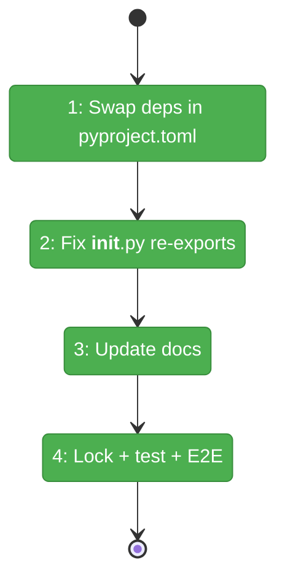

# Flight Plan: Fix FX001 — Remove torch/sentence-transformers from core deps

**Fix**: [FX001-remove-torch-st-from-core-deps.md](FX001-remove-torch-st-from-core-deps.md)
**Status**: Landed

## What → Why

**Problem**: Default `pip install fs2` installs torch (150MB+, 93s import on Windows) even though the ONNX adapter was built to replace it.

**Fix**: Make `onnxruntime` a core dep, move `sentence-transformers`/`torch` to optional extra, fix the `__init__.py` crash, update docs.

## Domain Context

| Domain | Relationship | What Changes |
|--------|-------------|-------------|
| project | modify | `pyproject.toml` — dependency swap |
| embedding-adapters | modify | `__init__.py` — re-export swap |
| docs | modify | 2 doc files — install instructions |

## Flight Status

**Legend**: grey = pending | yellow = active | red = blocked/needs input | green = done

## Stages

- [x] **Stage 1: Swap deps** — Remove ST/torch from core, add onnxruntime/tokenizers/huggingface-hub (`pyproject.toml`)
- [x] **Stage 2: Fix re-exports** — Remove ST, add ONNX in barrel (`__init__.py`)
- [x] **Stage 3: Update docs** — ONNX is default, ST is optional extra (`local-embeddings.md` × 2)
- [x] **Stage 4: Verify** — `uv lock`, tests, global reinstall, E2E scan+search

## Acceptance

- [x] `import fs2` succeeds without torch
- [x] `mode: "local"` → `OnnxEmbeddingAdapter`
- [x] All unit tests pass
- [x] `fs2 search` returns embedding results
