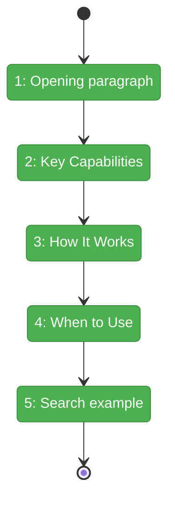
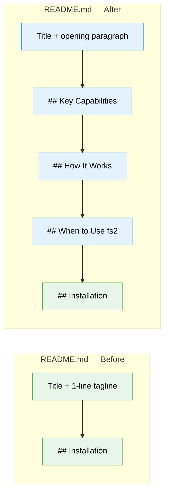

# Flight Plan: Phase 1 — Write New Sections

**Plan**: [better-documentation-plan.md](../../better-documentation-plan.md)
**Phase**: Phase 1: Write New Sections
**Tasks**: [tasks.md](tasks.md)
**Generated**: 2026-04-13
**Status**: Landed

---

## Departure → Destination

**Where we are**: `README.md` opens with a single vague line — *"Code intelligence for your codebase"* — then immediately jumps to installation. No one reading the README can tell what fs2 actually does, how it works, or why they might want it.

**Where we're going**: A developer or AI agent reading the first 80 lines of the README can explain what fs2 does (parses code into nodes, enriches with AI summaries, searches semantically), how the pipeline works (6 stages), and when to use it vs grep/ripgrep.

---

## Domain Context

### Domains We're Changing

| Domain | What Changes | Key Files |
|--------|-------------|-----------|
| documentation | Insert 4 new sections + 1 example between title and Installation | `/Users/jordanknight/substrate/fs2/048-better-documentation/README.md` |

### Domains We Depend On (no changes)

| Domain | What We Consume | Contract |
|--------|----------------|----------|
| (none) | Workshop 001 content decisions | Draft prose, tone rules, structure decisions |

---

## Flight Status

<!-- Updated by /plan-6-v2: pending → active → done. Use blocked for problems/input needed. -->

**Legend**: grey = pending | yellow = active | red = blocked/needs input | green = done

---

## Stages

<!-- Updated by /plan-6-v2 during implementation: [ ] → [~] → [x] -->

- [x] **Stage 1: Write opening paragraph** — Replace lines 2-3 with 3-sentence pipeline description (`README.md`)
- [x] **Stage 2: Write Key Capabilities** — Insert 5 feature blocks: parsing, summaries, search, cross-file, multi-repo (`README.md`)
- [x] **Stage 3: Write How It Works** — Insert 6-step numbered pipeline list: Scan→Parse→Relate→Summarize→Embed→Store (`README.md`)
- [x] **Stage 4: Write When to Use** — Insert comparison table with 7 rows + MCP explanation (`README.md`)
- [x] **Stage 5: Write search example** — Insert semantic search "aha" example with JWT/auth scenario (`README.md`)

---

## Architecture: Before & After

**Legend**: existing (green, unchanged) | new (blue, created)

---

## Acceptance Criteria

- [x] AC-01: Opening paragraph explains parse → enrich → search pipeline
- [x] AC-02: 5 feature blocks, 2-3 sentences each, prose only
- [x] AC-03: 6-step numbered pipeline list
- [x] AC-04: Comparison table with ≥ 7 rows, respectful of grep/ripgrep
- [x] AC-05: Semantic search example with terms absent from source code
- [x] AC-07: Word "powerful" does not appear
- [x] AC-11: Brief MCP explanation included

## Goals & Non-Goals

**Goals**:
- ✅ Reader understands what fs2 does after opening paragraph
- ✅ 5 key capabilities highlighted with prose
- ✅ Pipeline explained as numbered list
- ✅ Clear positioning vs grep/ripgrep
- ✅ "Aha moment" semantic search example

**Non-Goals**:
- ❌ Restructuring existing sections (Phase 2)
- ❌ Trimming MCP/Scanning/Embeddings (Phase 2)
- ❌ Modifying guide documents

---

## Checklist

- [x] T001: Write opening paragraph (3 sentences, pipeline description)
- [x] T002: Write Key Capabilities (5 prose blocks, no code, no superlatives)
- [x] T003: Write How It Works (6-step numbered list, correct stage order)
- [x] T004: Write When to Use fs2 (comparison table, MCP explanation)
- [x] T005: Write semantic search example (terms absent from source, labeled illustrative)
